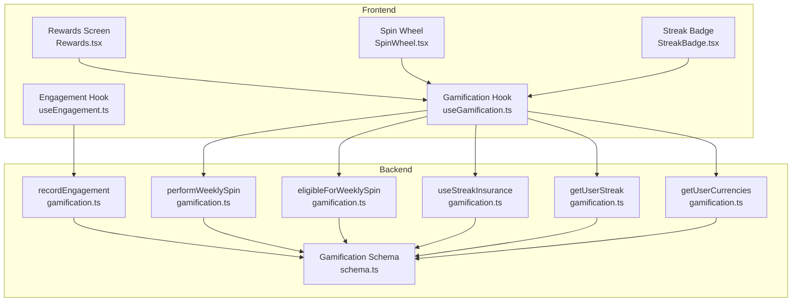
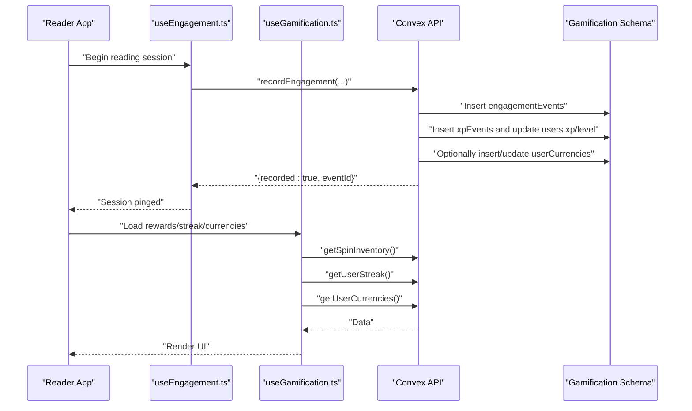
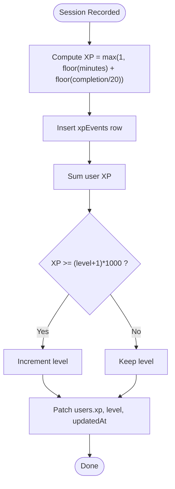
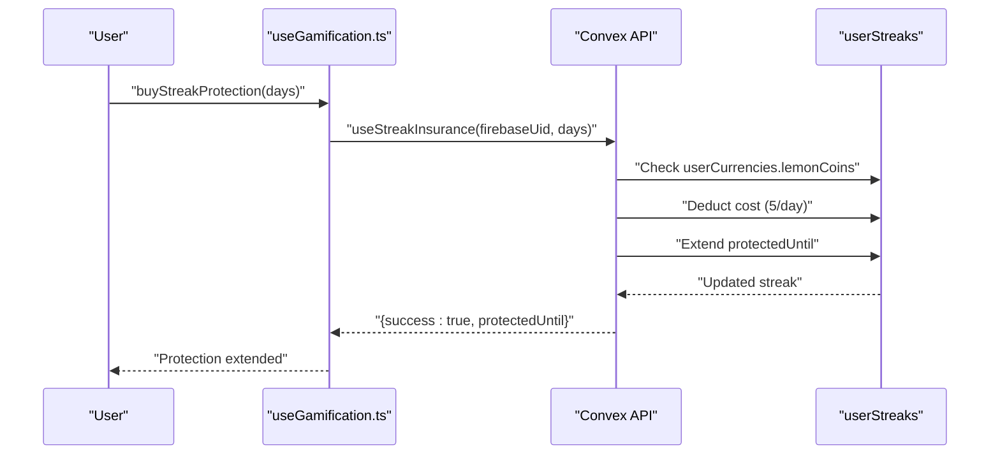
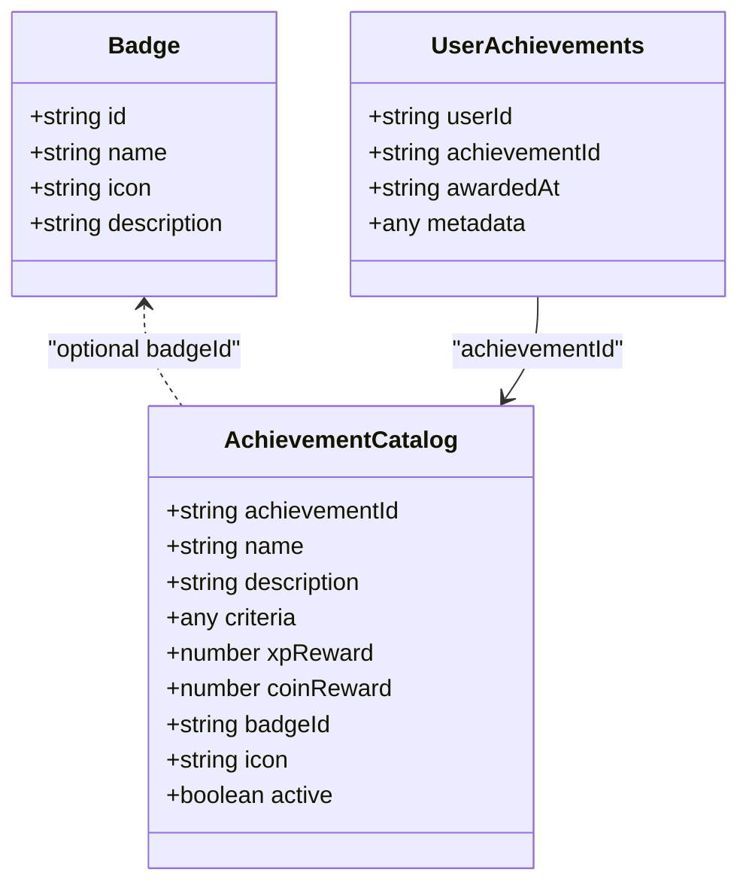
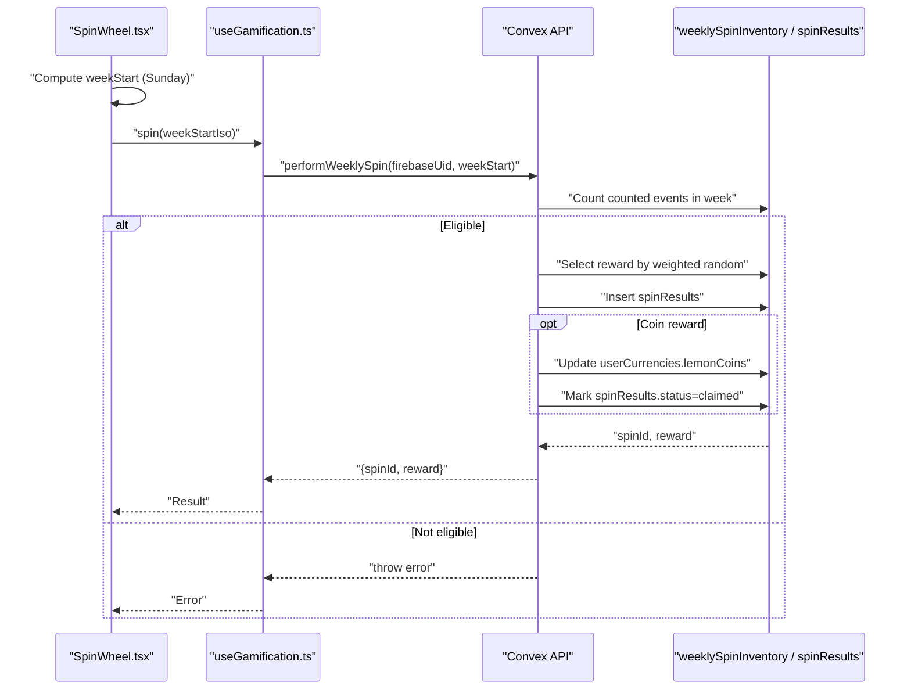
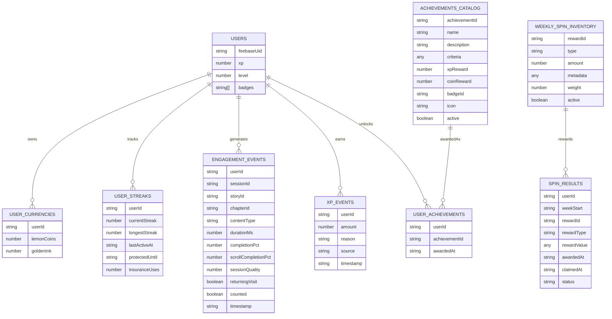

# Gamification and Engagement System

<cite>
**Referenced Files in This Document**
- [gamification.ts](file://convex/gamification.ts)
- [schema.ts](file://convex/schema.ts)
- [useGamification.ts](file://src/hooks/useGamification.ts)
- [useEngagement.ts](file://src/hooks/useEngagement.ts)
- [SpinWheel.tsx](file://src/components/ui/SpinWheel.tsx)
- [StreakBadge.tsx](file://src/components/ui/StreakBadge.tsx)
- [Rewards.tsx](file://src/screens/Rewards.tsx)
- [badges.ts](file://src/data/badges.ts)
- [types.ts](file://src/data/types.ts)
- [AdminRewards.tsx](file://src/screens/admin/AdminRewards.tsx)
- [users.ts](file://convex/users.ts)
- [interactions.ts](file://convex/interactions.ts)
- [creatorQuests.ts](file://convex/creatorQuests.ts)
</cite>

## Table of Contents
1. [Introduction](#introduction)
2. [Project Structure](#project-structure)
3. [Core Components](#core-components)
4. [Architecture Overview](#architecture-overview)
5. [Detailed Component Analysis](#detailed-component-analysis)
6. [Dependency Analysis](#dependency-analysis)
7. [Performance Considerations](#performance-considerations)
8. [Troubleshooting Guide](#troubleshooting-guide)
9. [Conclusion](#conclusion)
10. [Appendices](#appendices)

## Introduction
This document describes the gamification and engagement system for the platform. It covers the XP system, daily streak management, achievement tracking, weekly spin wheel game, reward mechanisms, and the integration between frontend components and backend scoring functions. It also outlines data models, performance considerations for real-time scoring updates, and gamification psychology strategies to encourage continued engagement.

## Project Structure
The gamification system spans backend Convex functions and frontend React components:
- Backend: Convex schema defines gamification tables and functions implement XP, streaks, spins, and currencies.
- Frontend: React hooks and UI components render streaks, spin wheel, and rewards screen; they call backend functions via Convex APIs.

**Diagram sources**
- [gamification.ts:14-331](file://convex/gamification.ts#L14-L331)
- [schema.ts:352-428](file://convex/schema.ts#L352-L428)
- [useGamification.ts:1-48](file://src/hooks/useGamification.ts#L1-L48)
- [useEngagement.ts:1-63](file://src/hooks/useEngagement.ts#L1-L63)
- [SpinWheel.tsx:1-94](file://src/components/ui/SpinWheel.tsx#L1-L94)
- [StreakBadge.tsx:1-21](file://src/components/ui/StreakBadge.tsx#L1-L21)
- [Rewards.tsx:1-121](file://src/screens/Rewards.tsx#L1-L121)

**Section sources**
- [gamification.ts:14-331](file://convex/gamification.ts#L14-L331)
- [schema.ts:352-428](file://convex/schema.ts#L352-L428)
- [useGamification.ts:1-48](file://src/hooks/useGamification.ts#L1-L48)
- [useEngagement.ts:1-63](file://src/hooks/useEngagement.ts#L1-L63)
- [SpinWheel.tsx:1-94](file://src/components/ui/SpinWheel.tsx#L1-L94)
- [StreakBadge.tsx:1-21](file://src/components/ui/StreakBadge.tsx#L1-L21)
- [Rewards.tsx:1-121](file://src/screens/Rewards.tsx#L1-L121)

## Core Components
- XP and Leveling: Users gain XP from reading sessions that meet minimum thresholds. Levels increase when cumulative XP reaches a simple threshold progression.
- Daily Streaks: Tracks current and longest streaks, with optional insurance to protect streaks against missed days.
- Weekly Spin Wheel: Eligibility requires a configurable number of counted reading events within a week; rewards are drawn from a weighted inventory.
- Currencies: Lemon Coins and Golden Ink tracked per user for reward redemption and purchases.
- Achievements Catalog: Quest-based achievements and badges; unlocks recorded in user achievements.
- Engagement Tracking: Lightweight periodic reporting of reading sessions with completion metrics.

**Section sources**
- [gamification.ts:14-117](file://convex/gamification.ts#L14-L117)
- [gamification.ts:119-232](file://convex/gamification.ts#L119-L232)
- [gamification.ts:234-331](file://convex/gamification.ts#L234-L331)
- [schema.ts:354-428](file://convex/schema.ts#L354-L428)
- [useGamification.ts:1-48](file://src/hooks/useGamification.ts#L1-L48)
- [useEngagement.ts:1-63](file://src/hooks/useEngagement.ts#L1-L63)
- [badges.ts:1-9](file://src/data/badges.ts#L1-L9)
- [types.ts:39-44](file://src/data/types.ts#L39-L44)

## Architecture Overview
The backend exposes Convex queries and mutations for gamification features. Frontend hooks fetch and mutate data, and UI components present the user-facing gamification elements.

**Diagram sources**
- [useEngagement.ts:11-61](file://src/hooks/useEngagement.ts#L11-L61)
- [gamification.ts:14-117](file://convex/gamification.ts#L14-L117)
- [schema.ts:352-428](file://convex/schema.ts#L352-L428)
- [useGamification.ts:12-29](file://src/hooks/useGamification.ts#L12-L29)

## Detailed Component Analysis

### XP System and Leveling
- Contribution factors:
  - Session duration in minutes (minimum 1).
  - Completion percentage (threshold-based).
- Calculation:
  - Base XP = floor(duration in minutes) + floor(completion percentage / 20).
  - Minimum 1 XP per counted session.
- Leveling:
  - Level increases when total XP meets threshold: level N requires N * 1000 XP to advance.
- Updates:
  - Inserts XP event and patches user XP and level atomically.

**Diagram sources**
- [gamification.ts:64-89](file://convex/gamification.ts#L64-L89)

**Section sources**
- [gamification.ts:64-89](file://convex/gamification.ts#L64-L89)

### Daily Streak Management
- Tracking:
  - Current streak, longest streak, last active timestamp, and protection window.
- Protection:
  - Users can purchase streak insurance using Lemon Coins to extend protection.
- Retrieval:
  - Queries return either stored streak data or defaults for new users.

**Diagram sources**
- [gamification.ts:234-287](file://convex/gamification.ts#L234-L287)
- [useGamification.ts:41-44](file://src/hooks/useGamification.ts#L41-L44)

**Section sources**
- [gamification.ts:234-311](file://convex/gamification.ts#L234-L311)
- [useGamification.ts:41-44](file://src/hooks/useGamification.ts#L41-L44)

### Achievement Tracking and Badges
- Badge catalog:
  - Predefined badges with identifiers, icons, and descriptions.
- Achievement catalog:
  - Structured quests with criteria, XP and coin rewards, and optional badge association.
- Unlocking:
  - Quest claims insert user achievements and update currencies/XP accordingly.
- Profile display:
  - Badges rendered locked/unlocked based on user’s badge list.

**Diagram sources**
- [badges.ts:3-8](file://src/data/badges.ts#L3-L8)
- [types.ts:39-44](file://src/data/types.ts#L39-L44)
- [schema.ts:429-448](file://convex/schema.ts#L429-L448)
- [creatorQuests.ts:51-96](file://convex/creatorQuests.ts#L51-L96)

**Section sources**
- [badges.ts:1-9](file://src/data/badges.ts#L1-L9)
- [types.ts:39-44](file://src/data/types.ts#L39-L44)
- [schema.ts:429-448](file://convex/schema.ts#L429-L448)
- [creatorQuests.ts:51-96](file://convex/creatorQuests.ts#L51-L96)

### Weekly Spin Wheel Game
- Eligibility:
  - Requires a configurable number of counted engagement events within a week window.
- Mechanics:
  - Weighted random draw from active spin inventory.
  - Immediate coin awards are claimed automatically.
- Frontend:
  - Renders slices proportional to weights and animates spin.
  - Uses current week start ISO string for eligibility checks.

**Diagram sources**
- [SpinWheel.tsx:24-45](file://src/components/ui/SpinWheel.tsx#L24-L45)
- [useGamification.ts:31-44](file://src/hooks/useGamification.ts#L31-L44)
- [gamification.ts:147-232](file://convex/gamification.ts#L147-L232)
- [schema.ts:371-402](file://convex/schema.ts#L371-L402)

**Section sources**
- [gamification.ts:119-232](file://convex/gamification.ts#L119-L232)
- [SpinWheel.tsx:1-94](file://src/components/ui/SpinWheel.tsx#L1-L94)
- [useGamification.ts:31-44](file://src/hooks/useGamification.ts#L31-L44)
- [AdminRewards.tsx:1-125](file://src/screens/admin/AdminRewards.tsx#L1-L125)

### Reward Redemption and Currencies
- Currencies:
  - Lemon Coins and Golden Ink tracked per user.
- Redemption:
  - Lemon Coins can be used to purchase streak insurance.
  - Coins can be awarded from spin results and quests.
- Display:
  - Rewards screen lists currencies and provides progress visuals for streak milestones.

**Section sources**
- [gamification.ts:313-331](file://convex/gamification.ts#L313-L331)
- [schema.ts:354-359](file://convex/schema.ts#L354-L359)
- [Rewards.tsx:102-114](file://src/screens/Rewards.tsx#L102-L114)
- [AdminRewards.tsx:1-125](file://src/screens/admin/AdminRewards.tsx#L1-L125)

### Integration Between Frontend and Backend
- Hooks orchestrate:
  - Loading spin inventory, streak, and currencies.
  - Checking eligibility and performing spins.
  - Purchasing streak insurance.
- Engagement hook periodically records reading sessions with completion metrics.

**Section sources**
- [useGamification.ts:1-48](file://src/hooks/useGamification.ts#L1-L48)
- [useEngagement.ts:1-63](file://src/hooks/useEngagement.ts#L1-L63)

## Dependency Analysis
The gamification schema defines the core data model with indexed tables for efficient lookups. Functions depend on these tables for reads/writes.

**Diagram sources**
- [schema.ts:354-448](file://convex/schema.ts#L354-L448)

**Section sources**
- [schema.ts:354-448](file://convex/schema.ts#L354-L448)

## Performance Considerations
- Indexed queries:
  - Use indexes for user lookups (by_firebaseUid, by_userId) to minimize latency.
- Batch writes:
  - Combine XP and level updates in a single patch to reduce write amplification.
- Lightweight pings:
  - Periodic engagement pings avoid frequent network calls while capturing meaningful completion metrics.
- Weighted selection:
  - Weighted random draw is O(n) over inventory; keep inventory sizes reasonable or cache computed totals.
- Real-time updates:
  - Debounce UI refreshes after mutations to prevent thrashing.

[No sources needed since this section provides general guidance]

## Troubleshooting Guide
- User not found errors:
  - Ensure Firebase UID is present and mapped to a user record.
- Insufficient Lemon Coins:
  - Verify user currency balances before purchasing streak insurance.
- Spin eligibility failures:
  - Confirm counted engagement events fall within the week window.
- Missing streak data:
  - New users return default streak values; ensure initialization occurs on sign-up.

**Section sources**
- [gamification.ts:34-36](file://convex/gamification.ts#L34-L36)
- [gamification.ts:252-254](file://convex/gamification.ts#L252-L254)
- [gamification.ts:171-173](file://convex/gamification.ts#L171-L173)
- [gamification.ts:304-310](file://convex/gamification.ts#L304-L310)

## Conclusion
The gamification system combines XP accumulation, streak tracking, weekly spins, and currency-based rewards to reinforce engagement. The frontend hooks and UI components integrate seamlessly with backend Convex functions, enabling real-time scoring and rewarding experiences. The schema supports scalability through indexing and modular tables for achievements and quests.

[No sources needed since this section summarizes without analyzing specific files]

## Appendices

### Data Model Definitions
- Users: Store XP, level, badges, and timestamps.
- Currencies: Track Lemon Coins and Golden Ink per user.
- Streaks: Track current/longest streaks and protection windows.
- Spin Inventory: Define reward types, amounts, weights, and activity flags.
- Spin Results: Persist weekly spin outcomes and claim status.
- Engagement Events: Capture session metrics and quality flags.
- XP Events: Log XP gains with reasons and sources.
- Achievements Catalog: Define active quests and rewards.
- User Achievements: Record awarded achievements.

**Section sources**
- [schema.ts:354-448](file://convex/schema.ts#L354-L448)

### Gamification Psychology Considerations
- Variable reward schedules: Weighted spin outcomes maintain curiosity and repeated play.
- Progression loops: XP and leveling offer continuous, near-instant feedback.
- Social proof: Leaderboards snapshots (when enabled) can amplify motivation.
- Loss aversion: Streak insurance introduces cost to maintain streaks, encouraging consistent participation.
- Mastery: Quests and badges provide clear goals and a sense of accomplishment.

[No sources needed since this section provides general guidance]