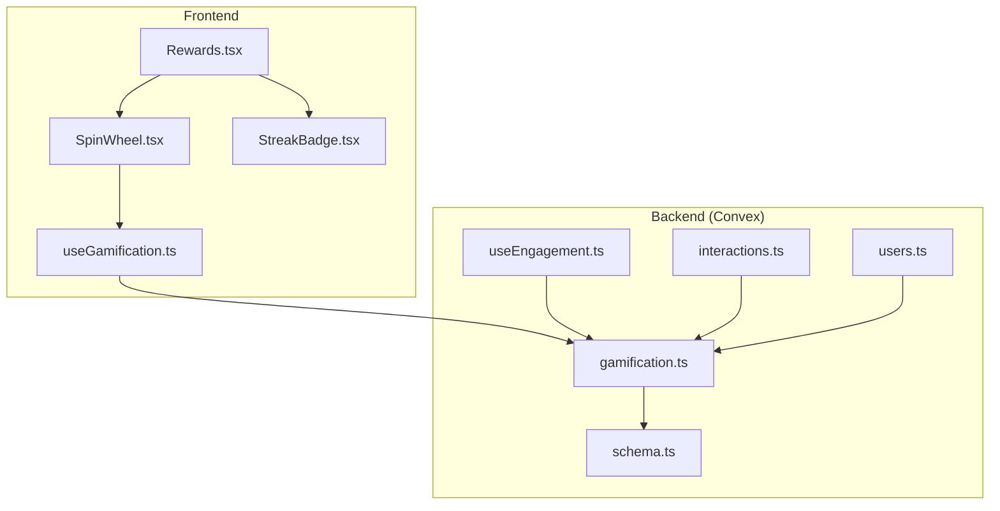
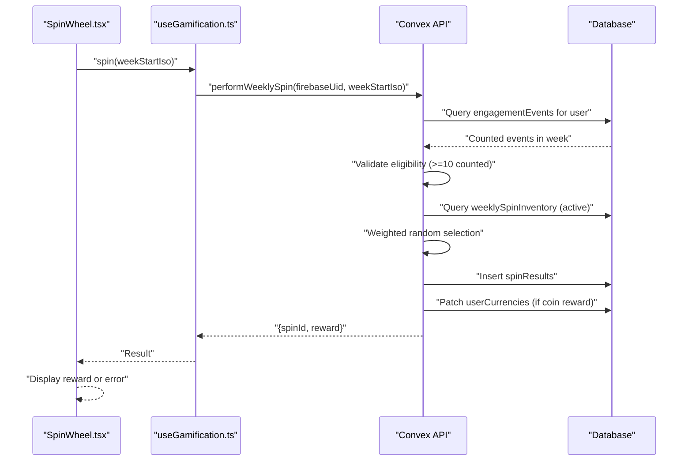
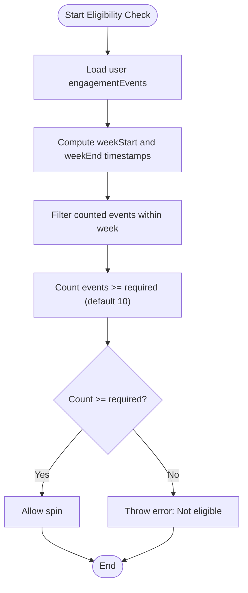
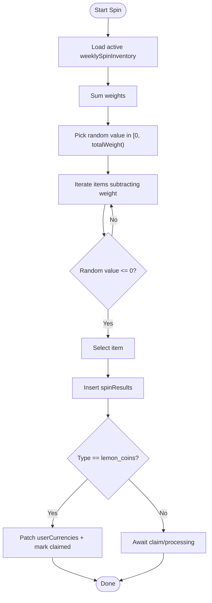
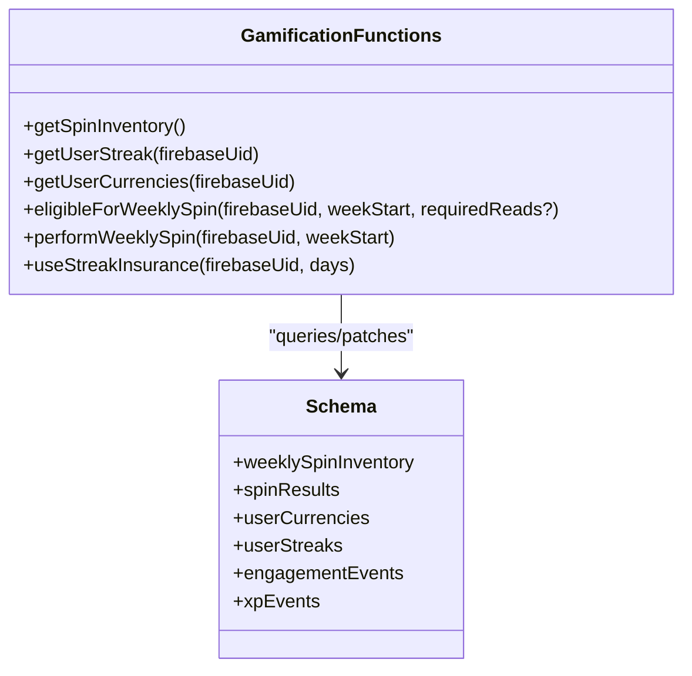
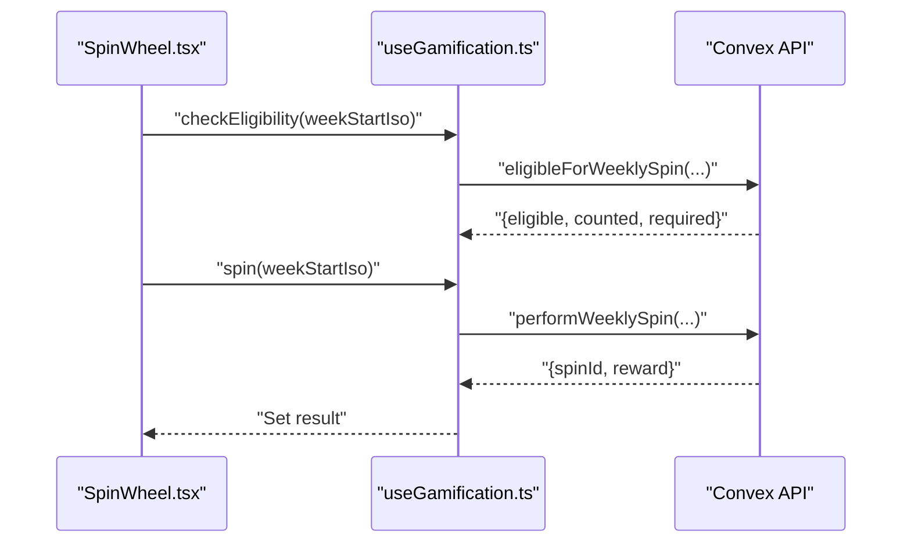
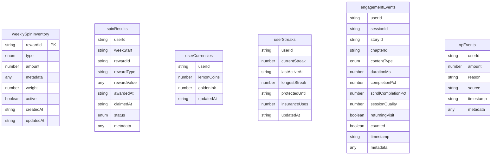
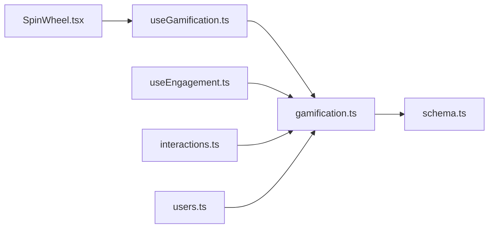

# Weekly Spin Wheel Game

<cite>
**Referenced Files in This Document**
- [useGamification.ts](file://src/hooks/useGamification.ts)
- [SpinWheel.tsx](file://src/components/ui/SpinWheel.tsx)
- [gamification.ts](file://convex/gamification.ts)
- [schema.ts](file://convex/schema.ts)
- [useEngagement.ts](file://src/hooks/useEngagement.ts)
- [Rewards.tsx](file://src/screens/Rewards.tsx)
- [StreakBadge.tsx](file://src/components/ui/StreakBadge.tsx)
- [interactions.ts](file://convex/interactions.ts)
- [users.ts](file://convex/users.ts)
</cite>

## Table of Contents
1. [Introduction](#introduction)
2. [Project Structure](#project-structure)
3. [Core Components](#core-components)
4. [Architecture Overview](#architecture-overview)
5. [Detailed Component Analysis](#detailed-component-analysis)
6. [Dependency Analysis](#dependency-analysis)
7. [Performance Considerations](#performance-considerations)
8. [Troubleshooting Guide](#troubleshooting-guide)
9. [Conclusion](#conclusion)
10. [Appendices](#appendices)

## Introduction
This document explains the weekly spin wheel game system: how spins are triggered, how rewards are selected via weighted probabilities, and how user engagement drives eligibility. It covers backend gamification functions, frontend integration via a dedicated React hook, the reward inventory system, and UI components that enable users to spin and manage their currencies. It also outlines the mathematical foundations of reward probability calculations and strategies to maintain fairness while encouraging continued engagement.

## Project Structure
The weekly spin wheel spans three layers:
- Frontend React components and hooks that render the wheel, collect eligibility and spin requests, and display results.
- Convex backend functions that enforce eligibility rules, select rewards from inventory, and update user currencies and streaks.
- Convex schema that defines the data model for users, currencies, streaks, weekly spin inventory, and spin results.

**Diagram sources**
- [Rewards.tsx:1-121](file://src/screens/Rewards.tsx#L1-L121)
- [SpinWheel.tsx:1-94](file://src/components/ui/SpinWheel.tsx#L1-L94)
- [useGamification.ts:1-48](file://src/hooks/useGamification.ts#L1-L48)
- [StreakBadge.tsx:1-21](file://src/components/ui/StreakBadge.tsx#L1-L21)
- [gamification.ts:1-331](file://convex/gamification.ts#L1-L331)
- [schema.ts:354-430](file://convex/schema.ts#L354-L430)
- [useEngagement.ts:1-63](file://src/hooks/useEngagement.ts#L1-L63)
- [interactions.ts:74-109](file://convex/interactions.ts#L74-L109)
- [users.ts:42-90](file://convex/users.ts#L42-L90)

**Section sources**
- [Rewards.tsx:1-121](file://src/screens/Rewards.tsx#L1-L121)
- [SpinWheel.tsx:1-94](file://src/components/ui/SpinWheel.tsx#L1-L94)
- [useGamification.ts:1-48](file://src/hooks/useGamification.ts#L1-L48)
- [StreakBadge.tsx:1-21](file://src/components/ui/StreakBadge.tsx#L1-L21)
- [gamification.ts:1-331](file://convex/gamification.ts#L1-L331)
- [schema.ts:354-430](file://convex/schema.ts#L354-L430)
- [useEngagement.ts:1-63](file://src/hooks/useEngagement.ts#L1-L63)
- [interactions.ts:74-109](file://convex/interactions.ts#L74-L109)
- [users.ts:42-90](file://convex/users.ts#L42-L90)

## Core Components
- Frontend hook for gamification:
  - Loads inventory, streak, and currencies.
  - Checks weekly spin eligibility for a given week start.
  - Executes a spin and purchases streak protection.
- Spin wheel UI:
  - Renders slices proportional to reward weights.
  - Computes a week start ISO string and triggers a spin.
  - Displays result or errors.
- Backend gamification functions:
  - Query weekly spin inventory.
  - Determine weekly spin eligibility based on engagement events.
  - Perform weighted random draw and allocate rewards.
  - Manage streak protection purchases and user currencies.
- Schema for gamification entities:
  - weeklySpinInventory, spinResults, userCurrencies, userStreaks, engagementEvents, xpEvents.

**Section sources**
- [useGamification.ts:6-47](file://src/hooks/useGamification.ts#L6-L47)
- [SpinWheel.tsx:16-94](file://src/components/ui/SpinWheel.tsx#L16-L94)
- [gamification.ts:4-12, 119-145, 147-232, 234-287, 289-311, 313-331:4-12](file://convex/gamification.ts#L4-L12)
- [schema.ts:356-404](file://convex/schema.ts#L356-L404)

## Architecture Overview
The weekly spin wheel integrates frontend and backend as follows:
- The Rewards screen loads gamification data and renders the SpinWheel component.
- The SpinWheel component computes the current week’s start date and calls the useGamification hook to spin.
- The backend checks eligibility against engagement events and performs a weighted random selection from weeklySpinInventory.
- Successful rewards are recorded in spinResults and, for coin-type rewards, userCurrencies is updated immediately.

**Diagram sources**
- [SpinWheel.tsx:24-45](file://src/components/ui/SpinWheel.tsx#L24-L45)
- [useGamification.ts:36-39](file://src/hooks/useGamification.ts#L36-L39)
- [gamification.ts:147-232](file://convex/gamification.ts#L147-L232)

## Detailed Component Analysis

### Eligibility and Cost Structures
- Eligibility:
  - Weekly spin eligibility requires a minimum number of counted engagement events during the target week.
  - Counted events are determined by thresholds on completion percentage, scroll completion, or duration.
- Cost structure:
  - Streak protection is purchased with Lemon Coins at a fixed rate per day.
  - The backend validates currency balance before extending protection.

**Diagram sources**
- [gamification.ts:119-145](file://convex/gamification.ts#L119-L145)
- [useEngagement.ts:15-41](file://src/hooks/useEngagement.ts#L15-L41)

**Section sources**
- [gamification.ts:119-145](file://convex/gamification.ts#L119-L145)
- [useEngagement.ts:15-41](file://src/hooks/useEngagement.ts#L15-L41)

### Reward Probability Calculations and Distribution
- Inventory:
  - weeklySpinInventory stores reward entries with type, amount, weight, and active flag.
- Weighted selection:
  - The backend sums weights and selects a reward by iterating until a random threshold is met.
- Immediate vs deferred rewards:
  - Coin-type rewards are credited immediately to userCurrencies and spinResults marked as claimed.
  - Other reward types are recorded in spinResults for later collection or processing.

**Diagram sources**
- [gamification.ts:175-232](file://convex/gamification.ts#L175-L232)
- [schema.ts:373-404](file://convex/schema.ts#L373-L404)

**Section sources**
- [gamification.ts:175-232](file://convex/gamification.ts#L175-L232)
- [schema.ts:373-404](file://convex/schema.ts#L373-L404)

### Backend Gamification Functions
- Queries:
  - getSpinInventory: returns active weekly rewards.
  - getUserStreak: retrieves current streak and protection window.
  - getUserCurrencies: returns user’s Lemon Coins and Golden Ink balances.
- Mutations:
  - eligibleForWeeklySpin: checks eligibility for a given week.
  - performWeeklySpin: validates eligibility, selects reward, updates currencies/results.
  - useStreakInsurance: purchases protection by spending Lemon Coins.
- Engagement recording:
  - recordEngagement: logs reading sessions and awards XP and Lemon Coins for qualifying sessions.

**Diagram sources**
- [gamification.ts:4-12, 119-145, 147-232, 234-287, 289-311, 313-331:4-12](file://convex/gamification.ts#L4-L12)
- [schema.ts:356-404](file://convex/schema.ts#L356-L404)

**Section sources**
- [gamification.ts:4-12, 119-145, 147-232, 234-287, 289-311, 313-331:4-12](file://convex/gamification.ts#L4-L12)
- [schema.ts:356-404](file://convex/schema.ts#L356-L404)

### Frontend Integration via useGamification Hook
- Responsibilities:
  - Load inventory, streak, and currencies on mount.
  - Check eligibility for a given week start.
  - Execute spin and purchase streak protection.
- Usage:
  - SpinWheel uses the hook to trigger spins and display results.
  - Rewards screen displays streak and currencies alongside the wheel.

**Diagram sources**
- [SpinWheel.tsx:24-45](file://src/components/ui/SpinWheel.tsx#L24-L45)
- [useGamification.ts:31-39](file://src/hooks/useGamification.ts#L31-L39)

**Section sources**
- [useGamification.ts:6-47](file://src/hooks/useGamification.ts#L6-L47)
- [SpinWheel.tsx:16-94](file://src/components/ui/SpinWheel.tsx#L16-L94)
- [Rewards.tsx:9-121](file://src/screens/Rewards.tsx#L9-L121)

### Reward Inventory System
- Types:
  - Airtime, data, cash, gift card, premium, bonus spin, lemon_coins, cosmetic, badge.
- Weights:
  - Controls probability; higher weight increases chance of selection.
- Active flag:
  - Only active rewards are considered for draws.
- Results:
  - spinResults tracks awarded and claimed status, including metadata.

**Diagram sources**
- [schema.ts:373-429](file://convex/schema.ts#L373-L429)

**Section sources**
- [schema.ts:373-429](file://convex/schema.ts#L373-L429)

### Mathematical Foundations and Fairness
- Weighted probability:
  - Each reward i has a weight w_i; total W = Σ w_i.
  - A random value r ∈ [0, W) is generated; iterate items subtracting weights until reaching a selected item.
  - Ensures proportionality to configured weights while maintaining deterministic selection per random seed.
- Fairness strategies:
  - Adjustable weights to balance rare and common rewards.
  - Optional caps or decay mechanisms can be introduced in inventory weights to prevent streaks of bad luck.
  - Transparency: expose reward probabilities to users via UI tooltips or a “what you can win” panel.

[No sources needed since this section provides general guidance]

### User Engagement Strategies
- Eligibility threshold:
  - Requires a minimum number of counted engagement events per week to spin.
- Session quality:
  - Completion percentage, scroll depth, and duration influence whether a session counts toward eligibility.
- Incentives:
  - Streak protection reduces churn risk by allowing users to maintain streaks despite missed days.
  - Lemon Coins reward periodic reading sessions to encourage continued engagement.

**Section sources**
- [gamification.ts:14-117](file://convex/gamification.ts#L14-L117)
- [useEngagement.ts:15-41](file://src/hooks/useEngagement.ts#L15-L41)
- [gamification.ts:234-287](file://convex/gamification.ts#L234-L287)

## Dependency Analysis
- Frontend depends on Convex API for all gamification operations.
- Backend functions depend on schema-defined tables for data persistence.
- Engagement recording feeds into eligibility computations.
- Streak protection interacts with user currencies and streak records.

**Diagram sources**
- [SpinWheel.tsx:1-94](file://src/components/ui/SpinWheel.tsx#L1-L94)
- [useGamification.ts:1-48](file://src/hooks/useGamification.ts#L1-L48)
- [gamification.ts:1-331](file://convex/gamification.ts#L1-L331)
- [schema.ts:354-430](file://convex/schema.ts#L354-L430)
- [useEngagement.ts:1-63](file://src/hooks/useEngagement.ts#L1-L63)
- [interactions.ts:74-109](file://convex/interactions.ts#L74-L109)
- [users.ts:42-90](file://convex/users.ts#L42-L90)

**Section sources**
- [SpinWheel.tsx:1-94](file://src/components/ui/SpinWheel.tsx#L1-L94)
- [useGamification.ts:1-48](file://src/hooks/useGamification.ts#L1-L48)
- [gamification.ts:1-331](file://convex/gamification.ts#L1-L331)
- [schema.ts:354-430](file://convex/schema.ts#L354-L430)
- [useEngagement.ts:1-63](file://src/hooks/useEngagement.ts#L1-L63)
- [interactions.ts:74-109](file://convex/interactions.ts#L74-L109)
- [users.ts:42-90](file://convex/users.ts#L42-L90)

## Performance Considerations
- Indexed queries:
  - weeklySpinInventory is queried with an active index; ensure active flag is indexed for fast filtering.
  - engagementEvents and spinResults are indexed by user and week to speed up eligibility and reporting.
- Weighted selection:
  - Linear scan over inventory is acceptable for small to moderate inventories; consider precomputing cumulative weights for very large inventories.
- Frontend responsiveness:
  - Debounce spin button presses and disable UI during network calls to avoid duplicate spins.
  - Cache recent inventory and streak/currency data to reduce redundant queries.

[No sources needed since this section provides general guidance]

## Troubleshooting Guide
- Eligibility errors:
  - “Not eligible for weekly spin” indicates insufficient counted events in the week; verify engagement recording and thresholds.
- No active inventory:
  - “No active spin inventory configured” suggests missing or inactive rewards; confirm weeklySpinInventory entries.
- Currency errors:
  - Insufficient Lemon Coins for streak protection; prompt users to earn more coins or adjust protection length.
- Network failures:
  - Wrap spin calls in error boundaries; display user-friendly messages and allow retry.

**Section sources**
- [gamification.ts:171-173](file://convex/gamification.ts#L171-L173)
- [gamification.ts:180](file://convex/gamification.ts#L180)
- [gamification.ts:252-254](file://convex/gamification.ts#L252-L254)

## Conclusion
The weekly spin wheel combines clear eligibility rules, transparent weighted probability, and immediate reward feedback to drive continued engagement. The frontend hook centralizes gamification logic, while the backend enforces fairness and maintains robust data integrity. By tuning inventory weights and leveraging streak protection, the system encourages sustained participation without compromising long-term retention.

## Appendices

### Appendix A: Eligibility Thresholds and Session Quality
- Counted sessions require either:
  - High completion percentage, or
  - Scroll completion percentage, or
  - Minimum duration threshold.
- These heuristics ensure meaningful engagement rather than passive presence.

**Section sources**
- [gamification.ts:38-45](file://convex/gamification.ts#L38-L45)
- [useEngagement.ts:15-41](file://src/hooks/useEngagement.ts#L15-L41)

### Appendix B: Streak Protection Mechanics
- Cost:
  - Fixed Lemon Coins per day of protection.
- Extension:
  - Extends the protected window; if none exists, creates a new streak record with protection.

**Section sources**
- [gamification.ts:249-287](file://convex/gamification.ts#L249-L287)