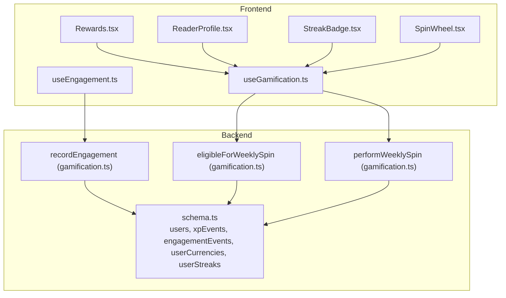
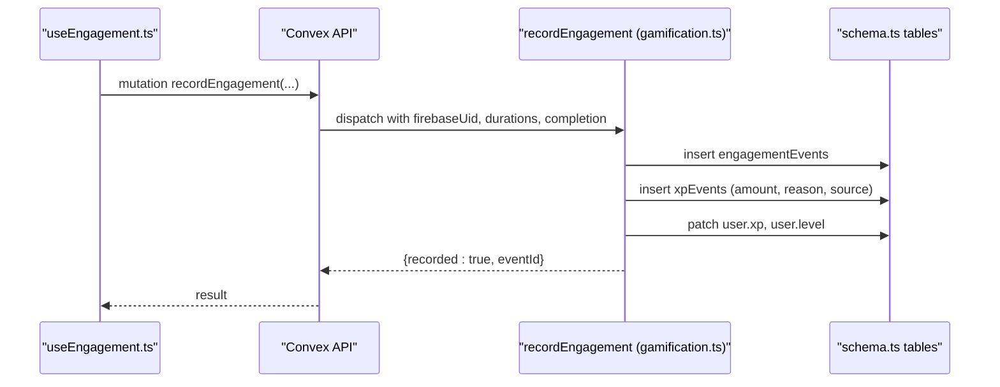
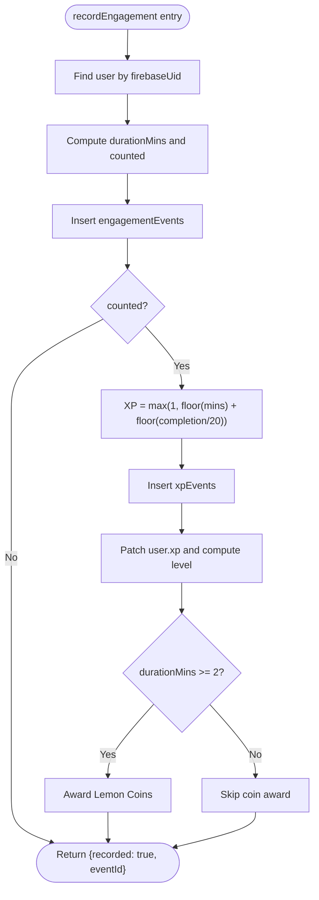
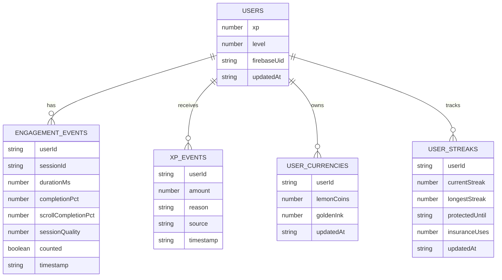
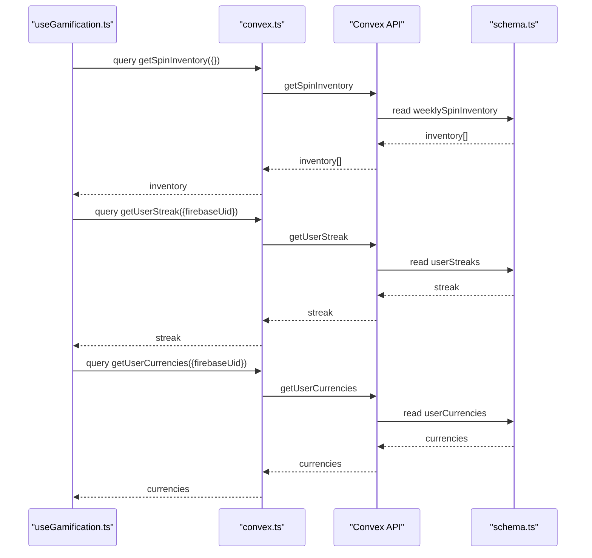
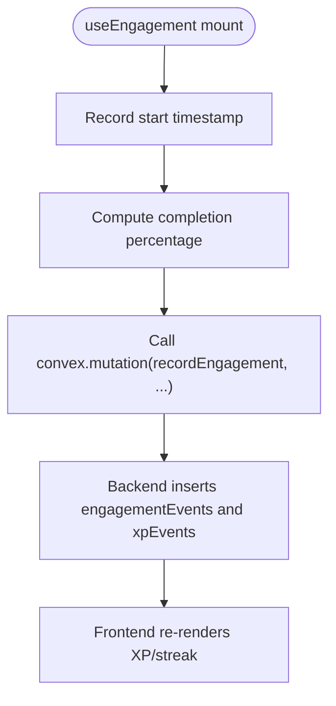
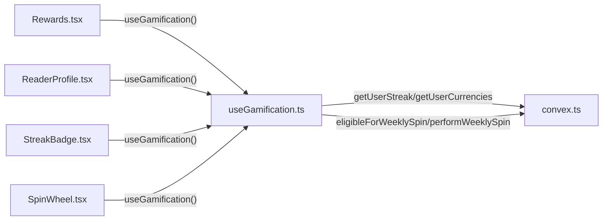
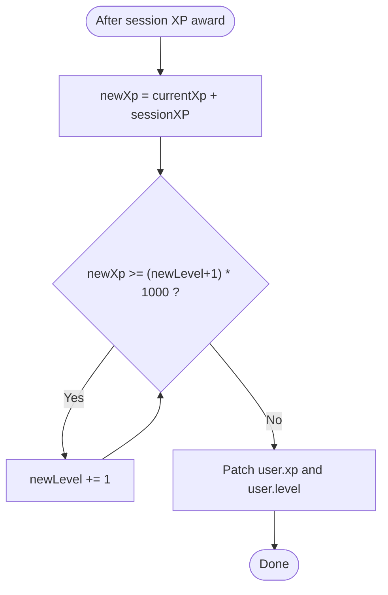
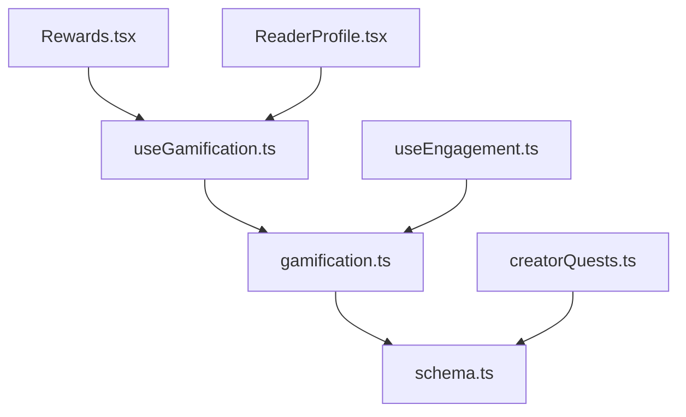

# XP System and Experience Points

<cite>
**Referenced Files in This Document**
- [gamification.ts](file://convex/gamification.ts)
- [schema.ts](file://convex/schema.ts)
- [useGamification.ts](file://src/hooks/useGamification.ts)
- [useEngagement.ts](file://src/hooks/useEngagement.ts)
- [Rewards.tsx](file://src/screens/Rewards.tsx)
- [ReaderProfile.tsx](file://src/screens/ReaderProfile.tsx)
- [StreakBadge.tsx](file://src/components/ui/StreakBadge.tsx)
- [SpinWheel.tsx](file://src/components/ui/SpinWheel.tsx)
- [creatorQuests.ts](file://convex/creatorQuests.ts)
- [convex.ts](file://src/lib/convex.ts)
</cite>

## Table of Contents
1. [Introduction](#introduction)
2. [Project Structure](#project-structure)
3. [Core Components](#core-components)
4. [Architecture Overview](#architecture-overview)
5. [Detailed Component Analysis](#detailed-component-analysis)
6. [Dependency Analysis](#dependency-analysis)
7. [Performance Considerations](#performance-considerations)
8. [Troubleshooting Guide](#troubleshooting-guide)
9. [Conclusion](#conclusion)

## Introduction
This document explains the Experience Points (XP) system powering reader engagement and progression in the platform. It covers how XP is calculated from reading sessions, how XP contributes to leveling up, and how XP is recorded and surfaced to users. It also documents the backend implementation in gamification.ts, the frontend integration via useGamification and useEngagement hooks, and the display of XP-related data in Rewards and ReaderProfile screens. Finally, it outlines performance considerations for real-time XP updates and caching strategies.

## Project Structure
The XP system spans backend Convex functions and tables, and frontend hooks and screens:
- Backend: gamification.ts defines mutations and queries for engagement tracking, XP awarding, and weekly spin eligibility; schema.ts defines the data model for users, XP events, and related entities.
- Frontend: useGamification.ts loads XP-related data and exposes actions; useEngagement.ts tracks reading sessions and records engagement; Rewards.tsx and ReaderProfile.tsx display XP and streaks; StreakBadge.tsx and SpinWheel.tsx present streak and spin features.

**Diagram sources**
- [gamification.ts:14-117](file://convex/gamification.ts#L14-L117)
- [schema.ts:25-120](file://convex/schema.ts#L25-L120)
- [useGamification.ts:6-47](file://src/hooks/useGamification.ts#L6-L47)
- [useEngagement.ts:6-31](file://src/hooks/useEngagement.ts#L6-L31)
- [Rewards.tsx:9-58](file://src/screens/Rewards.tsx#L9-L58)
- [ReaderProfile.tsx:17-544](file://src/screens/ReaderProfile.tsx#L17-L544)
- [StreakBadge.tsx:4-20](file://src/components/ui/StreakBadge.tsx#L4-L20)
- [SpinWheel.tsx:16-39](file://src/components/ui/SpinWheel.tsx#L16-L39)

**Section sources**
- [gamification.ts:14-117](file://convex/gamification.ts#L14-L117)
- [schema.ts:25-120](file://convex/schema.ts#L25-L120)
- [useGamification.ts:6-47](file://src/hooks/useGamification.ts#L6-L47)
- [useEngagement.ts:6-31](file://src/hooks/useEngagement.ts#L6-L31)
- [Rewards.tsx:9-58](file://src/screens/Rewards.tsx#L9-L58)
- [ReaderProfile.tsx:17-544](file://src/screens/ReaderProfile.tsx#L17-L544)
- [StreakBadge.tsx:4-20](file://src/components/ui/StreakBadge.tsx#L4-L20)
- [SpinWheel.tsx:16-39](file://src/components/ui/SpinWheel.tsx#L16-L39)

## Core Components
- Engagement recording and XP awarding: The backend mutation records reading sessions and awards XP based on duration and completion percentage. It also optionally awards Lemon Coins and updates user XP and level.
- Weekly spin eligibility and rewards: Eligibility is computed by counting “counted” engagement events within a week; spinning uses weighted random selection from weeklySpinInventory.
- Frontend integration: useGamification.ts loads spin inventory, streak, and currencies; useEngagement.ts tracks sessions and sends engagement events; UI screens display streaks and XP-related features.

Key XP calculation and progression mechanics:
- XP per session: Minimum 1 XP plus floor(duration in minutes) plus floor(completion percentage / 20).
- Level progression: Linear thresholds where the XP needed to reach the next level equals currentLevel × 1000.
- Optional coin reward: For sessions of 2+ minutes, a small amount of Lemon Coins is awarded.

**Section sources**
- [gamification.ts:38-117](file://convex/gamification.ts#L38-L117)
- [schema.ts:25-62](file://convex/schema.ts#L25-L62)
- [schema.ts:404-427](file://convex/schema.ts#L404-L427)

## Architecture Overview
The XP system follows a clean separation of concerns:
- Frontend captures engagement metrics and triggers backend mutations.
- Backend validates user context, computes XP, persists events, and updates user state.
- Frontend reacts to persisted state changes to render XP, levels, streaks, and rewards.

**Diagram sources**
- [useEngagement.ts:15-31](file://src/hooks/useEngagement.ts#L15-L31)
- [gamification.ts:14-117](file://convex/gamification.ts#L14-L117)
- [schema.ts:404-427](file://convex/schema.ts#L404-L427)

## Detailed Component Analysis

### Backend: Gamification Functions
- recordEngagement: Validates user, determines if a session counts, inserts engagementEvents, computes XP, inserts xpEvents, updates user XP and level, optionally awards Lemon Coins.
- eligibleForWeeklySpin: Counts “counted” engagementEvents within a week window and checks eligibility against a required threshold.
- performWeeklySpin: Verifies eligibility, selects a reward from weeklySpinInventory using weighted random selection, and updates spinResults and user currencies if applicable.

**Diagram sources**
- [gamification.ts:28-117](file://convex/gamification.ts#L28-L117)

**Section sources**
- [gamification.ts:14-117](file://convex/gamification.ts#L14-L117)

### Data Model: Users, XP Events, and Related Entities
- users: Stores xp and level, along with timestamps and other profile fields.
- engagementEvents: Captures session metadata including duration, completion percentage, scroll completion, and whether the session counted.
- xpEvents: Records XP grants with reason and source.
- userCurrencies: Tracks Lemon Coins and Golden Ink balances.
- userStreaks: Tracks streak metrics including current and longest streaks, and protection windows.

**Diagram sources**
- [schema.ts:25-62](file://convex/schema.ts#L25-L62)
- [schema.ts:404-427](file://convex/schema.ts#L404-L427)
- [schema.ts:354-369](file://convex/schema.ts#L354-L369)
- [schema.ts:419-427](file://convex/schema.ts#L419-L427)

**Section sources**
- [schema.ts:25-62](file://convex/schema.ts#L25-L62)
- [schema.ts:404-427](file://convex/schema.ts#L404-L427)
- [schema.ts:354-369](file://convex/schema.ts#L354-L369)
- [schema.ts:419-427](file://convex/schema.ts#L419-L427)

### Frontend Integration: useGamification Hook
- Loads spin inventory, user streak, and currencies on mount.
- Provides eligibility checks and spin actions for weekly rewards.
- Exposes loading state and error handling.

**Diagram sources**
- [useGamification.ts:12-27](file://src/hooks/useGamification.ts#L12-L27)
- [convex.ts:1-12](file://src/lib/convex.ts#L1-L12)
- [gamification.ts:313-331](file://convex/gamification.ts#L313-L331)

**Section sources**
- [useGamification.ts:6-47](file://src/hooks/useGamification.ts#L6-L47)
- [convex.ts:1-12](file://src/lib/convex.ts#L1-L12)

### Frontend Integration: useEngagement Hook
- Tracks session start time and scroll-based completion percentage.
- Sends engagement events to the backend on cleanup or at intervals.
- Uses a unique session ID to group related events.

**Diagram sources**
- [useEngagement.ts:11-31](file://src/hooks/useEngagement.ts#L11-L31)
- [gamification.ts:14-117](file://convex/gamification.ts#L14-L117)

**Section sources**
- [useEngagement.ts:6-31](file://src/hooks/useEngagement.ts#L6-L31)
- [gamification.ts:14-117](file://convex/gamification.ts#L14-L117)

### Frontend Screens: Displaying XP and Streaks
- Rewards screen: Shows daily streak progress toward milestones and integrates the spin wheel.
- ReaderProfile screen: Displays chapters read, daily streak, and badges; integrates with gamification data.
- StreakBadge component: Renders current and longest streaks.
- SpinWheel component: Uses current week’s ISO string to check eligibility and perform spins.

**Diagram sources**
- [Rewards.tsx:9-58](file://src/screens/Rewards.tsx#L9-L58)
- [ReaderProfile.tsx:17-544](file://src/screens/ReaderProfile.tsx#L17-L544)
- [StreakBadge.tsx:4-20](file://src/components/ui/StreakBadge.tsx#L4-L20)
- [SpinWheel.tsx:16-39](file://src/components/ui/SpinWheel.tsx#L16-L39)
- [useGamification.ts:6-47](file://src/hooks/useGamification.ts#L6-L47)
- [convex.ts:1-12](file://src/lib/convex.ts#L1-L12)

**Section sources**
- [Rewards.tsx:9-58](file://src/screens/Rewards.tsx#L9-L58)
- [ReaderProfile.tsx:17-544](file://src/screens/ReaderProfile.tsx#L17-L544)
- [StreakBadge.tsx:4-20](file://src/components/ui/StreakBadge.tsx#L4-L20)
- [SpinWheel.tsx:16-39](file://src/components/ui/SpinWheel.tsx#L16-L39)
- [useGamification.ts:6-47](file://src/hooks/useGamification.ts#L6-L47)

### Activity-Based XP Scoring System
- Reading chapters: XP is awarded when sessions meet minimum thresholds (completion percentage ≥ 80%, scroll completion ≥ 80%, or duration ≥ 1 minute). XP formula: min 1 + floor(minutes) + floor(completion/20).
- Social interactions and milestones: While the primary XP mechanism is reading engagement, the system supports:
  - Quest-based XP via creatorQuests.claimQuest, which inserts xpEvents and updates user XP.
  - Weekly spin eligibility and rewards, indirectly reinforcing engagement through periodic incentives.

Examples of activities and corresponding XP values:
- Example A: 10-minute session with 90% completion → XP = 1 + floor(10) + floor(90/20) = 1 + 10 + 4 = 15 XP.
- Example B: 3-minute session with 70% completion → XP = 1 + floor(3) + floor(70/20) = 1 + 3 + 3 = 7 XP.
- Example C: 1-minute session with 60% completion → XP = 1 + floor(1) + floor(60/20) = 1 + 1 + 3 = 5 XP (only if completion or scroll meets thresholds).

Note: These examples illustrate the algorithmic computation; actual values depend on the precise completion percentage and duration captured during the session.

**Section sources**
- [gamification.ts:38-117](file://convex/gamification.ts#L38-L117)
- [creatorQuests.ts:84-89](file://convex/creatorQuests.ts#L84-L89)

### XP Progression Tiers and Level-Up Mechanics
- Level progression uses a simple linear threshold: to advance to level L+1, a user needs L × 1000 XP.
- After awarding XP for a session, the backend recalculates the user’s level and patches it accordingly.

**Diagram sources**
- [gamification.ts:75-89](file://convex/gamification.ts#L75-L89)

**Section sources**
- [gamification.ts:75-89](file://convex/gamification.ts#L75-L89)

## Dependency Analysis
- Backend dependencies:
  - gamification.ts depends on schema.ts tables for users, engagementEvents, xpEvents, userCurrencies, and userStreaks.
  - creatorQuests.ts also inserts xpEvents and updates user XP for quest completions.
- Frontend dependencies:
  - useGamification.ts depends on convex.ts for API access and on gamification.ts backend functions.
  - useEngagement.ts depends on convex.ts and gamification.ts for recording sessions.
  - UI screens depend on useGamification.ts for rendering XP and streak data.

**Diagram sources**
- [gamification.ts:14-117](file://convex/gamification.ts#L14-L117)
- [creatorQuests.ts:44-96](file://convex/creatorQuests.ts#L44-L96)
- [schema.ts:25-120](file://convex/schema.ts#L25-L120)
- [useGamification.ts:6-47](file://src/hooks/useGamification.ts#L6-L47)
- [useEngagement.ts:6-31](file://src/hooks/useEngagement.ts#L6-L31)
- [Rewards.tsx:9-58](file://src/screens/Rewards.tsx#L9-L58)
- [ReaderProfile.tsx:17-544](file://src/screens/ReaderProfile.tsx#L17-L544)

**Section sources**
- [gamification.ts:14-117](file://convex/gamification.ts#L14-L117)
- [creatorQuests.ts:44-96](file://convex/creatorQuests.ts#L44-L96)
- [schema.ts:25-120](file://convex/schema.ts#L25-L120)
- [useGamification.ts:6-47](file://src/hooks/useGamification.ts#L6-L47)
- [useEngagement.ts:6-31](file://src/hooks/useEngagement.ts#L6-L31)
- [Rewards.tsx:9-58](file://src/screens/Rewards.tsx#L9-L58)
- [ReaderProfile.tsx:17-544](file://src/screens/ReaderProfile.tsx#L17-L544)

## Performance Considerations
- Minimize reactive subscriptions: Batch related data (e.g., spin inventory, streak, currencies) in a single hook call to reduce subscription overhead.
- Separate frequently updated fields: Keep user XP/level and high-frequency heartbeat fields in separate documents to avoid unnecessary invalidations.
- Use skip and memoization: Avoid subscribing until user ID is available; memoize derived values like weekly spin eligibility.
- Pagination and point-in-time reads: For reporting-like surfaces, prefer point-in-time reads with manual “load more” to reduce subscription churn.
- Cache strategy: Cache spin inventory and user streak/currency locally for a short TTL to reduce backend calls during normal usage.

[No sources needed since this section provides general guidance]

## Troubleshooting Guide
Common issues and resolutions:
- User not found when recording engagement: Ensure the authenticated user’s firebaseUid is passed correctly to recordEngagement.
- No XP awarded despite reading: Verify that the session meets the “counted” thresholds (completion percentage, scroll completion, or duration).
- Level not increasing: Confirm that the XP threshold for the next level is met (level × 1000).
- Weekly spin eligibility errors: Check that the weekStart ISO string is computed correctly and that the requiredReads threshold is met.
- Streak or currency not updating: Ensure useGamification is mounted and that convex is initialized with VITE_CONVEX_URL.

**Section sources**
- [gamification.ts:28-117](file://convex/gamification.ts#L28-L117)
- [useGamification.ts:12-27](file://src/hooks/useGamification.ts#L12-L27)
- [convex.ts:1-12](file://src/lib/convex.ts#L1-L12)

## Conclusion
The XP system is centered on meaningful reading engagement with a straightforward algorithm that rewards sustained reading and high completion. The backend efficiently records events, computes XP, and updates user state, while the frontend integrates seamlessly to display streaks, XP, and rewards. By following the recommended performance strategies and troubleshooting steps, the system can scale effectively and provide a responsive, motivating user experience.