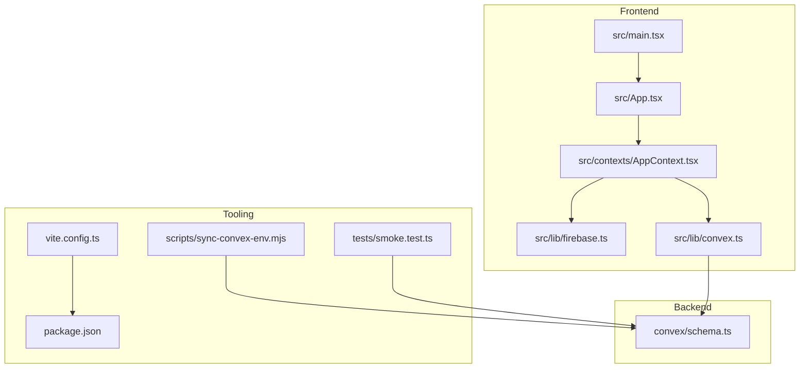
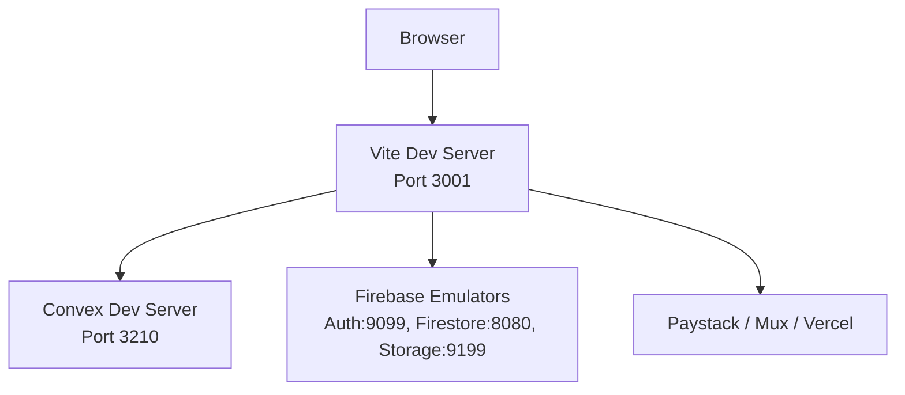
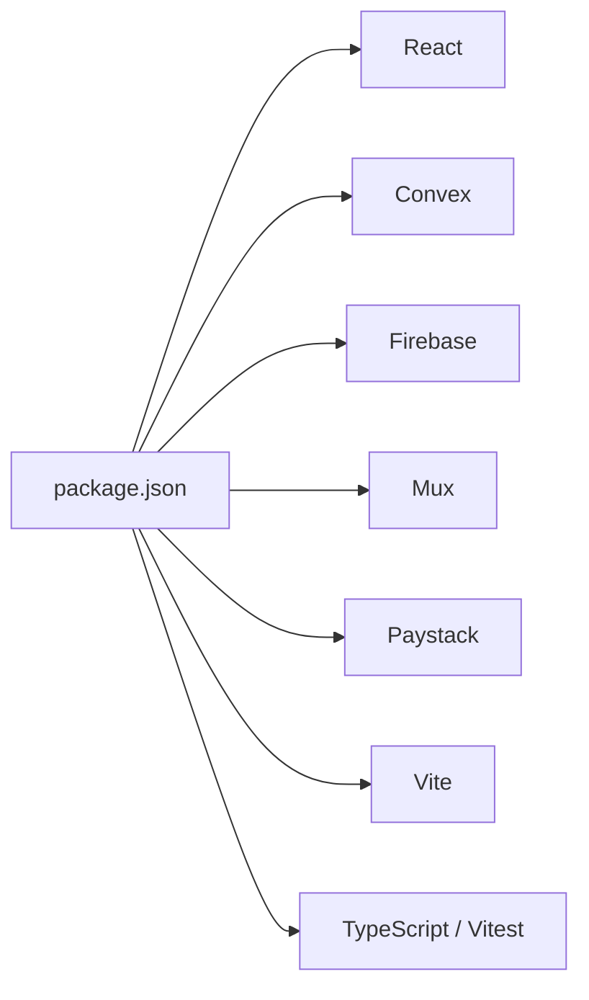

# Getting Started

<cite>
**Referenced Files in This Document**
- [README.md](file://README.md)
- [DEVELOPMENT_SETUP.md](file://DEVELOPMENT_SETUP.md)
- [TECH_STACK_SETUP.md](file://TECH_STACK_SETUP.md)
- [package.json](file://package.json)
- [vite.config.ts](file://vite.config.ts)
- [src/main.tsx](file://src/main.tsx)
- [src/App.tsx](file://src/App.tsx)
- [src/lib/convex.ts](file://src/lib/convex.ts)
- [src/lib/firebase.ts](file://src/lib/firebase.ts)
- [src/contexts/AppContext.tsx](file://src/contexts/AppContext.tsx)
- [convex/schema.ts](file://convex/schema.ts)
- [scripts/sync-convex-env.mjs](file://scripts/sync-convex-env.mjs)
- [tests/smoke.test.ts](file://tests/smoke.test.ts)
</cite>

## Table of Contents
1. [Introduction](#introduction)
2. [Project Structure](#project-structure)
3. [Core Components](#core-components)
4. [Architecture Overview](#architecture-overview)
5. [Detailed Component Analysis](#detailed-component-analysis)
6. [Dependency Analysis](#dependency-analysis)
7. [Performance Considerations](#performance-considerations)
8. [Troubleshooting Guide](#troubleshooting-guide)
9. [Conclusion](#conclusion)
10. [Appendices](#appendices)

## Introduction
Welcome to the Lemonade platform. This guide helps you set up a local development environment, configure environment variables, run the application, and understand the development workflow. It also includes troubleshooting tips and quick-start steps to verify your setup.

## Project Structure
Lemonade is a frontend-first React + TypeScript application built with Vite, integrated with a Convex backend, Firebase, Mux, Paystack, and optionally Vercel. The repository includes:
- Frontend under src/
- Backend schema and generated client under convex/
- Scripts for environment synchronization under scripts/
- Tests under tests/
- Configuration files for Vite, package management, and environment variables

**Diagram sources**
- [src/main.tsx:1-26](file://src/main.tsx#L1-L26)
- [src/App.tsx:1-375](file://src/App.tsx#L1-L375)
- [src/lib/firebase.ts:1-55](file://src/lib/firebase.ts#L1-L55)
- [src/lib/convex.ts:1-12](file://src/lib/convex.ts#L1-L12)
- [src/contexts/AppContext.tsx:1-800](file://src/contexts/AppContext.tsx#L1-L800)
- [convex/schema.ts:1-493](file://convex/schema.ts#L1-L493)
- [vite.config.ts:1-37](file://vite.config.ts#L1-L37)
- [package.json:1-45](file://package.json#L1-L45)
- [scripts/sync-convex-env.mjs:1-17](file://scripts/sync-convex-env.mjs#L1-L17)
- [tests/smoke.test.ts:1-13](file://tests/smoke.test.ts#L1-L13)

**Section sources**
- [README.md:11-21](file://README.md#L11-L21)
- [DEVELOPMENT_SETUP.md:38-95](file://DEVELOPMENT_SETUP.md#L38-L95)
- [TECH_STACK_SETUP.md:182-210](file://TECH_STACK_SETUP.md#L182-L210)

## Core Components
- Vite dev server with React plugin and Tailwind CSS integration
- Firebase for authentication, Firestore, and Cloud Storage
- Convex for database and serverless functions
- Mux for video upload and playback
- Paystack for payments
- Testing with Vitest and Convex test utilities

Key runtime behaviors:
- Environment variables are loaded via Vite and exposed to the app
- Convex client is conditionally enabled based on VITE_CONVEX_URL
- Firebase initializes with optional emulator connections in development
- App routing and global state are managed in App.tsx and AppContext.tsx

**Section sources**
- [vite.config.ts:6-36](file://vite.config.ts#L6-L36)
- [src/lib/convex.ts:3-9](file://src/lib/convex.ts#L3-L9)
- [src/lib/firebase.ts:12-52](file://src/lib/firebase.ts#L12-L52)
- [src/App.tsx:83-374](file://src/App.tsx#L83-L374)
- [src/contexts/AppContext.tsx:509-601](file://src/contexts/AppContext.tsx#L509-L601)

## Architecture Overview
The development environment runs three primary servers:
- React/Vite frontend on port 3001
- Convex backend development server on port 3210
- Optional Firebase emulators (Auth, Firestore, Storage) on localhost ports

**Diagram sources**
- [DEVELOPMENT_SETUP.md:71-94](file://DEVELOPMENT_SETUP.md#L71-L94)
- [src/lib/firebase.ts:34-52](file://src/lib/firebase.ts#L34-L52)

**Section sources**
- [DEVELOPMENT_SETUP.md:38-95](file://DEVELOPMENT_SETUP.md#L38-L95)

## Detailed Component Analysis

### Environment Configuration (.env.local)
Create a .env.local file at the project root with the following variables:
- Firebase: VITE_FIREBASE_API_KEY, VITE_FIREBASE_AUTH_DOMAIN, VITE_FIREBASE_PROJECT_ID, VITE_FIREBASE_STORAGE_BUCKET, VITE_FIREBASE_MESSAGING_SENDER_ID, VITE_FIREBASE_APP_ID
- Convex: VITE_CONVEX_URL
- Mux: VITE_MUX_TOKEN_ID, VITE_MUX_TOKEN_SECRET
- Paystack: VITE_PAYSTACK_PUBLIC_KEY, VITE_PAYSTACK_SECRET_KEY
- Vercel: VITE_VERCEL_URL, VITE_ENVIRONMENT

Notes:
- GEMINI_API_KEY is defined in Vite config and can be set in .env.local
- For local development, VITE_CONVEX_URL should point to the Convex dev server (http://localhost:3210)
- Firebase emulators can be enabled by setting VITE_USE_FIREBASE_EMULATORS=true

**Section sources**
- [README.md:16-20](file://README.md#L16-L20)
- [DEVELOPMENT_SETUP.md:46-69](file://DEVELOPMENT_SETUP.md#L46-L69)
- [TECH_STACK_SETUP.md:182-210](file://TECH_STACK_SETUP.md#L182-L210)
- [vite.config.ts:10-11](file://vite.config.ts#L10-L11)

### Installation and Prerequisites
- Prerequisite: Node.js
- Install dependencies: npm install
- Start development servers:
  - Terminal 1: npm run dev (frontend)
  - Terminal 2: npx convex dev (backend)
  - Terminal 3 (optional): firebase emulators:start (emulators)

Verify:
- App opens at http://localhost:3001
- Convex dashboard at http://localhost:3210
- Firebase emulator at http://localhost:4000 (if running)

**Section sources**
- [README.md:13-20](file://README.md#L13-L20)
- [DEVELOPMENT_SETUP.md:40-94](file://DEVELOPMENT_SETUP.md#L40-L94)

### Local Development Workflow
- Hot reloading: Enabled by default; can be toggled via DISABLE_HMR environment variable
- Debugging:
  - Frontend console: Inspect import.meta.env and window.__CONVEX__
  - Convex dashboard: Check tables and API logs
  - Firebase console: Check users, storage, and Firestore
- Testing:
  - Unit tests: npm run test
  - Build verification: npm run build
  - Smoke tests validate schema presence of gamification tables

**Section sources**
- [vite.config.ts:30-34](file://vite.config.ts#L30-L34)
- [DEVELOPMENT_SETUP.md:98-120](file://DEVELOPMENT_SETUP.md#L98-L120)
- [tests/smoke.test.ts:1-13](file://tests/smoke.test.ts#L1-L13)

### Accessing the AI Studio Interface
- The README links to the AI Studio app URL for viewing the hosted app
- For local development, open http://localhost:3001 in your browser

**Section sources**
- [README.md:9](file://README.md#L9)
- [README.md:19](file://README.md#L19)

### Understanding the Development Environment Structure
- Frontend entry: src/main.tsx renders App.tsx
- Routing and layout: App.tsx defines routes and wraps content in AppProvider
- Global state and integrations: AppContext.tsx orchestrates Firebase and Convex
- Backend schema: convex/schema.ts defines tables and indices
- Tooling: vite.config.ts configures plugins, aliases, and HMR; package.json defines scripts and dependencies

**Section sources**
- [src/main.tsx:1-26](file://src/main.tsx#L1-L26)
- [src/App.tsx:83-374](file://src/App.tsx#L83-L374)
- [src/contexts/AppContext.tsx:509-601](file://src/contexts/AppContext.tsx#L509-L601)
- [convex/schema.ts:24-493](file://convex/schema.ts#L24-L493)
- [vite.config.ts:6-36](file://vite.config.ts#L6-L36)
- [package.json:6-13](file://package.json#L6-L13)

## Dependency Analysis
Runtime dependencies include React, Convex, Firebase, Mux, Paystack, and Vite tooling. Development dependencies include TypeScript, Vitest, Tailwind, and related plugins.

**Diagram sources**
- [package.json:14-43](file://package.json#L14-L43)

**Section sources**
- [package.json:14-43](file://package.json#L14-L43)

## Performance Considerations
- Monitor bundle size with npm run build and use the visualizer if needed
- Track API call counts and optimize network usage
- Keep environment variables scoped and avoid unnecessary re-renders in AppContext

[No sources needed since this section provides general guidance]

## Troubleshooting Guide
Common issues and resolutions:
- Missing VITE_CONVEX_URL: Set to http://localhost:3210 for local development
- Module resolution errors for Convex: Ensure convex is installed and run npx convex dev
- Firebase initialization failures: Verify all Firebase env vars are set and not placeholders
- Paystack payment issues: Use test keys and verify CORS
- Profile picture upload failures: Check Firebase Storage rules, CORS, and file constraints

Verification checklist:
- React app loads at http://localhost:3001
- No critical console errors
- Convex connection established
- Firebase initialized
- Navigation and auth work as expected

**Section sources**
- [DEVELOPMENT_SETUP.md:213-258](file://DEVELOPMENT_SETUP.md#L213-L258)
- [DEVELOPMENT_SETUP.md:192-210](file://DEVELOPMENT_SETUP.md#L192-L210)

## Conclusion
You now have the essentials to install dependencies, configure environment variables, run the frontend and backend servers, and verify your setup. Use the troubleshooting guide to resolve common issues and refer to the development workflow for ongoing development and testing.

[No sources needed since this section summarizes without analyzing specific files]

## Appendices

### Quick Start Checklist
- Install dependencies: npm install
- Create .env.local with required keys
- Start frontend: npm run dev
- Start backend: npx convex dev
- Open http://localhost:3001
- Confirm Convex dashboard at http://localhost:3210

**Section sources**
- [README.md:16-20](file://README.md#L16-L20)
- [DEVELOPMENT_SETUP.md:71-94](file://DEVELOPMENT_SETUP.md#L71-L94)