# Creator Monetization

<cite>
**Referenced Files in This Document**
- [creators.ts](file://convex/creators.ts)
- [payments.ts](file://convex/payments.ts)
- [gamification.ts](file://convex/gamification.ts)
- [schema.ts](file://convex/schema.ts)
- [ads.ts](file://convex/ads.ts)
- [paystack.ts](file://convex/paystack.ts)
- [paystack-initialize.ts](file://api/paystack-initialize.ts)
- [paystack.ts](file://src/lib/paystack.ts)
- [CreatorDashboard.tsx](file://src/screens/CreatorDashboard.tsx)
- [CreatorWallet.tsx](file://src/screens/CreatorWallet.tsx)
- [SettingsCreator.tsx](file://src/screens/settings/SettingsCreator.tsx)
- [useGamification.ts](file://src/hooks/useGamification.ts)
- [Rewards.tsx](file://src/screens/Rewards.tsx)
- [creatorQuests.ts](file://convex/creatorQuests.ts)
- [badges.ts](file://src/data/badges.ts)
</cite>

## Table of Contents
1. [Introduction](#introduction)
2. [Project Structure](#project-structure)
3. [Core Components](#core-components)
4. [Architecture Overview](#architecture-overview)
5. [Detailed Component Analysis](#detailed-component-analysis)
6. [Dependency Analysis](#dependency-analysis)
7. [Performance Considerations](#performance-considerations)
8. [Troubleshooting Guide](#troubleshooting-guide)
9. [Conclusion](#conclusion)
10. [Appendices](#appendices)

## Introduction
This document explains the creator monetization system in the Lemonade platform. It covers revenue generation and payouts for content creators, including supporter payments, ad revenue sharing, and gamification-driven rewards. It also documents the creator payout summary, account management, revenue tracking, reporting, creator commission structures, tax implications, payout scheduling, dashboard features, and compliance for international payment processing.

## Project Structure
The monetization stack spans backend Convex functions, frontend screens, and integrations with Paystack. Key areas:
- Creator profiles and support toggles
- Wallet transactions and creator payout summaries
- Ad campaigns, events, and revenue attribution
- Gamification mechanics (spins, streaks, currencies)
- Premium subscriptions and premium activation
- Paystack integration for initialization and verification
- Creator dashboard and wallet UI

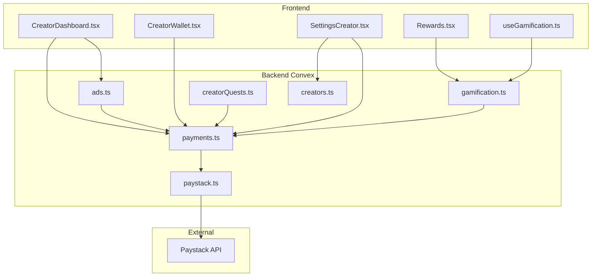

**Diagram sources**
- [CreatorDashboard.tsx:1-322](file://src/screens/CreatorDashboard.tsx#L1-L322)
- [CreatorWallet.tsx:1-287](file://src/screens/CreatorWallet.tsx#L1-L287)
- [SettingsCreator.tsx:1-519](file://src/screens/settings/SettingsCreator.tsx#L1-L519)
- [Rewards.tsx:1-121](file://src/screens/Rewards.tsx#L1-L121)
- [useGamification.ts:1-48](file://src/hooks/useGamification.ts#L1-L48)
- [creators.ts:1-87](file://convex/creators.ts#L1-L87)
- [payments.ts:1-291](file://convex/payments.ts#L1-L291)
- [ads.ts:1-360](file://convex/ads.ts#L1-L360)
- [gamification.ts:1-331](file://convex/gamification.ts#L1-L331)
- [creatorQuests.ts:1-97](file://convex/creatorQuests.ts#L1-L97)
- [paystack.ts:1-71](file://convex/paystack.ts#L1-L71)

**Section sources**
- [CreatorDashboard.tsx:1-322](file://src/screens/CreatorDashboard.tsx#L1-L322)
- [CreatorWallet.tsx:1-287](file://src/screens/CreatorWallet.tsx#L1-L287)
- [SettingsCreator.tsx:1-519](file://src/screens/settings/SettingsCreator.tsx#L1-L519)
- [Rewards.tsx:1-121](file://src/screens/Rewards.tsx#L1-L121)
- [useGamification.ts:1-48](file://src/hooks/useGamification.ts#L1-L48)
- [creators.ts:1-87](file://convex/creators.ts#L1-L87)
- [payments.ts:1-291](file://convex/payments.ts#L1-L291)
- [ads.ts:1-360](file://convex/ads.ts#L1-L360)
- [gamification.ts:1-331](file://convex/gamification.ts#L1-L331)
- [creatorQuests.ts:1-97](file://convex/creatorQuests.ts#L1-L97)
- [paystack.ts:1-71](file://convex/paystack.ts#L1-L71)

## Core Components
- Creator profiles and support toggles: Upsert creator records, manage categories, and enable/disable supporter payments.
- Wallet and transactions: Record and summarize creator support earnings, top-ups, premium purchases, and refunds.
- Ad monetization: Select ads for content gating, track events, compute revenue shares, and produce creator summaries.
- Gamification: Track engagement, award XP and Lemon Coins, weekly spins, streak protection, and quests.
- Premium subscriptions: Activate premium plans via Paystack and manage renewal cycles.
- Paystack integration: Initialize and verify transactions through Convex actions and client helpers.

**Section sources**
- [creators.ts:24-67](file://convex/creators.ts#L24-L67)
- [payments.ts:21-80](file://convex/payments.ts#L21-L80)
- [payments.ts:82-172](file://convex/payments.ts#L82-L172)
- [ads.ts:105-165](file://convex/ads.ts#L105-L165)
- [ads.ts:167-237](file://convex/ads.ts#L167-L237)
- [ads.ts:239-273](file://convex/ads.ts#L239-L273)
- [gamification.ts:14-117](file://convex/gamification.ts#L14-L117)
- [gamification.ts:147-232](file://convex/gamification.ts#L147-L232)
- [gamification.ts:234-287](file://convex/gamification.ts#L234-L287)
- [paystack.ts:5-44](file://convex/paystack.ts#L5-L44)
- [paystack.ts:46-70](file://convex/paystack.ts#L46-L70)

## Architecture Overview
The monetization pipeline integrates user actions, Convex functions, and external payment processing:

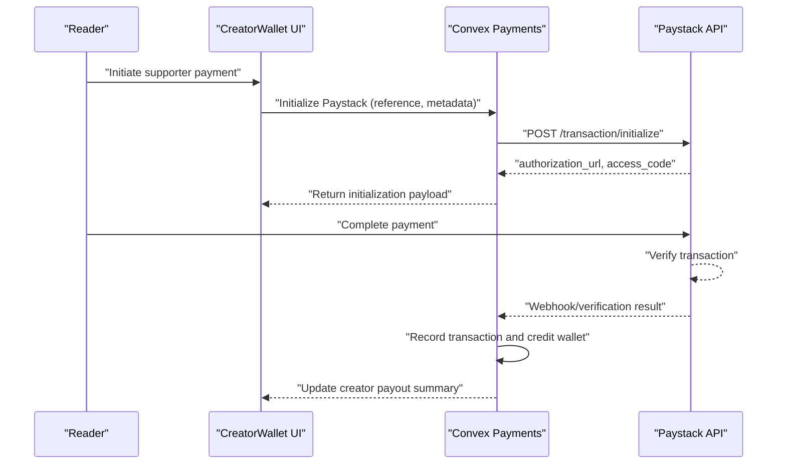

**Diagram sources**
- [CreatorWallet.tsx:1-287](file://src/screens/CreatorWallet.tsx#L1-L287)
- [payments.ts:113-172](file://convex/payments.ts#L113-L172)
- [paystack.ts:5-44](file://convex/paystack.ts#L5-L44)
- [paystack.ts:46-70](file://convex/paystack.ts#L46-L70)

## Detailed Component Analysis

### Creator Profiles and Support Toggle
- Upsert creator records with categories, location, avatar, and supportEnabled flag.
- Adjust follower counts atomically.
- Creator support is enabled/disabled per profile and surfaced in creator settings and dashboard.

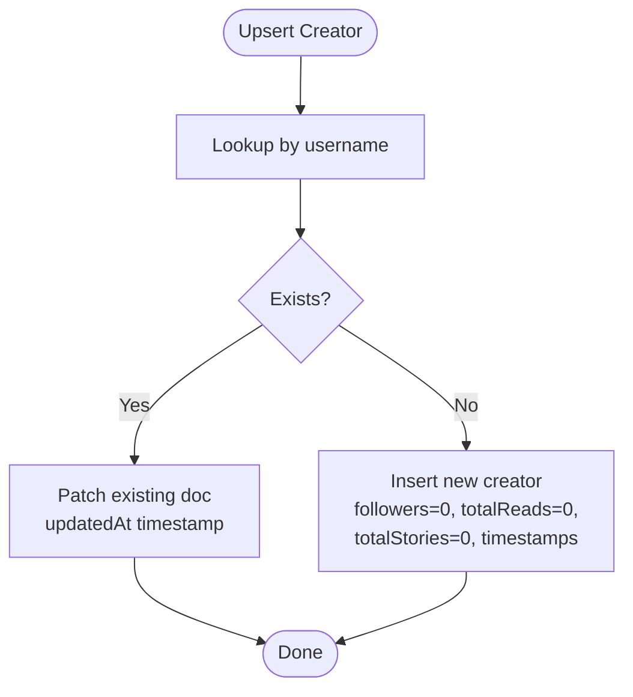

**Diagram sources**
- [creators.ts:24-67](file://convex/creators.ts#L24-L67)

**Section sources**
- [creators.ts:14-22](file://convex/creators.ts#L14-L22)
- [creators.ts:69-87](file://convex/creators.ts#L69-L87)
- [SettingsCreator.tsx:430-500](file://src/screens/settings/SettingsCreator.tsx#L430-L500)

### Wallet and Transactions
- Transaction types include wallet_topup, chapter_unlock, creator_support, premium, refund.
- Wallet balances tracked per user; creator payout summary aggregates successful creator_support transactions.
- Supports Paystack callbacks to credit wallet and premium activation.

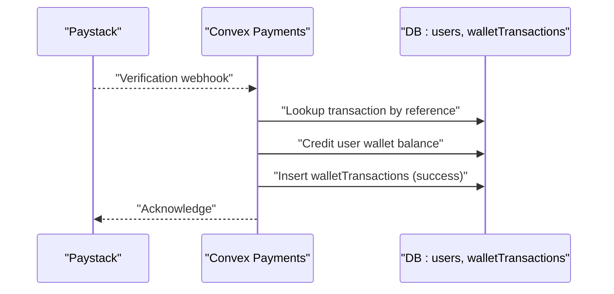

**Diagram sources**
- [payments.ts:113-172](file://convex/payments.ts#L113-L172)
- [payments.ts:174-263](file://convex/payments.ts#L174-L263)

**Section sources**
- [payments.ts:4-19](file://convex/payments.ts#L4-L19)
- [payments.ts:21-80](file://convex/payments.ts#L21-L80)
- [payments.ts:82-111](file://convex/payments.ts#L82-L111)
- [payments.ts:113-172](file://convex/payments.ts#L113-L172)
- [payments.ts:174-263](file://convex/payments.ts#L174-L263)

### Ad Monetization and Revenue Sharing
- Ad selection considers content type, chapter gating, and frequency caps.
- Event tracking computes revenue and splits into creator and platform shares.
- Creator summary aggregates impressions, completions, RPM, and top content.

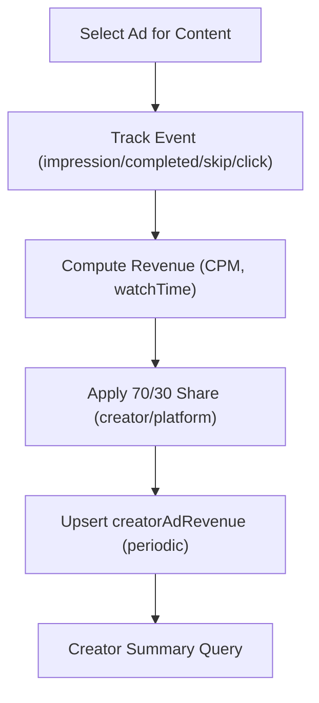

**Diagram sources**
- [ads.ts:105-165](file://convex/ads.ts#L105-L165)
- [ads.ts:167-237](file://convex/ads.ts#L167-L237)
- [ads.ts:239-273](file://convex/ads.ts#L239-L273)

**Section sources**
- [ads.ts:4-6](file://convex/ads.ts#L4-L6)
- [ads.ts:79-88](file://convex/ads.ts#L79-L88)
- [ads.ts:239-273](file://convex/ads.ts#L239-L273)

### Gamification and Engagement-Driven Rewards
- Engagement recording determines if a session counts toward XP and Lemon Coins.
- Weekly spins require a minimum number of counted sessions per week; eligible spins award Lemon Coins or other rewards.
- Streak protection allows creators to purchase insurance with Lemon Coins.

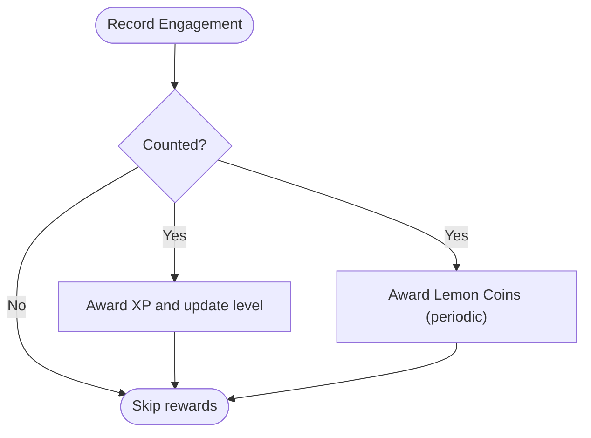

**Diagram sources**
- [gamification.ts:14-117](file://convex/gamification.ts#L14-L117)

**Section sources**
- [gamification.ts:147-232](file://convex/gamification.ts#L147-L232)
- [gamification.ts:234-287](file://convex/gamification.ts#L234-L287)
- [Rewards.tsx:1-121](file://src/screens/Rewards.tsx#L1-L121)
- [useGamification.ts:1-48](file://src/hooks/useGamification.ts#L1-L48)

### Creator Quests and Achievement-Based Monetization
- Creators can define quests with requirements and rewards.
- Users claim quests and receive Lemon Coins and XP, recorded as achievements.

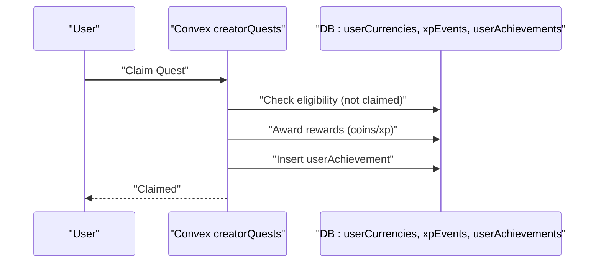

**Diagram sources**
- [creatorQuests.ts:44-97](file://convex/creatorQuests.ts#L44-L97)

**Section sources**
- [creatorQuests.ts:6-32](file://convex/creatorQuests.ts#L6-L32)
- [creatorQuests.ts:44-97](file://convex/creatorQuests.ts#L44-L97)

### Premium Subscriptions via Paystack
- Premium activation supports monthly/yearly billing cycles and tracks renewal dates.
- Re-activation checks existing references to avoid duplicate credits.

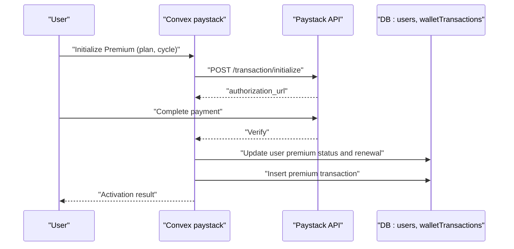

**Diagram sources**
- [payments.ts:174-263](file://convex/payments.ts#L174-L263)
- [paystack.ts:5-44](file://convex/paystack.ts#L5-L44)
- [paystack.ts:46-70](file://convex/paystack.ts#L46-L70)

**Section sources**
- [payments.ts:174-263](file://convex/payments.ts#L174-L263)
- [paystack.ts:5-44](file://convex/paystack.ts#L5-L44)
- [paystack.ts:46-70](file://convex/paystack.ts#L46-L70)

### Creator Dashboard Features
- Displays total reads, followers, creator wallet balance, active stories, ad earnings, and RPM.
- Integrates with ad analytics and recent comments for engagement insights.
- Provides quick links to upload stories and open wallet.

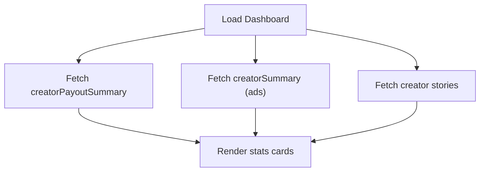

**Diagram sources**
- [CreatorDashboard.tsx:33-90](file://src/screens/CreatorDashboard.tsx#L33-L90)
- [payments.ts:21-80](file://convex/payments.ts#L21-L80)
- [ads.ts:239-273](file://convex/ads.ts#L239-L273)

**Section sources**
- [CreatorDashboard.tsx:12-48](file://src/screens/CreatorDashboard.tsx#L12-L48)
- [CreatorDashboard.tsx:50-64](file://src/screens/CreatorDashboard.tsx#L50-L64)
- [CreatorDashboard.tsx:66-90](file://src/screens/CreatorDashboard.tsx#L66-L90)

### Creator Wallet Management
- Shows available earnings, pending clearance, lifetime earnings, and recent earnings history.
- Allows saving payout account details (bank name, account number, account name).
- Enables withdrawal when payout account is set and earnings are available.

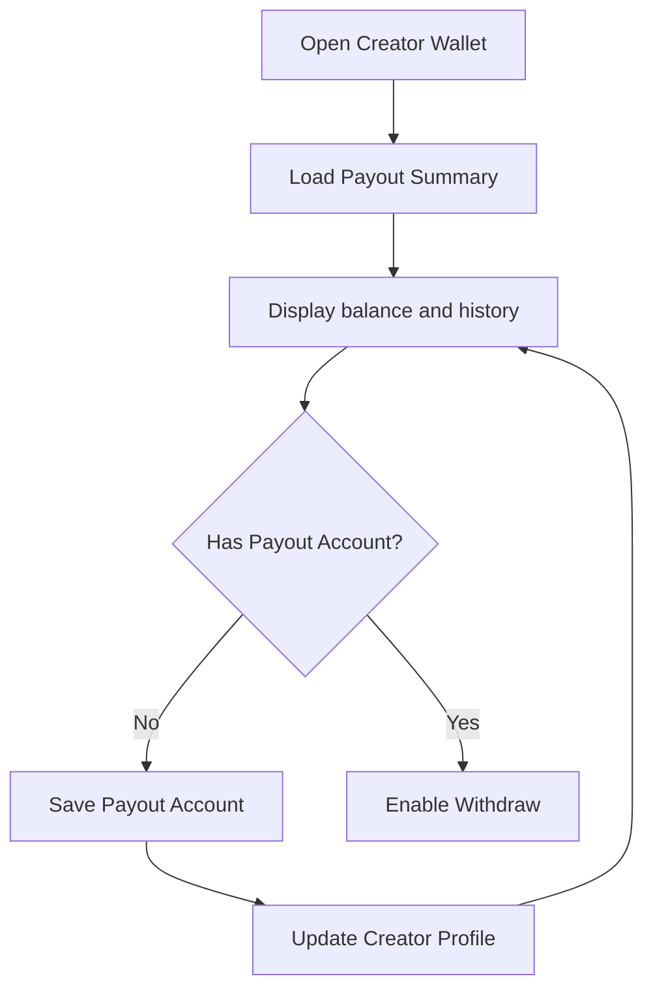

**Diagram sources**
- [CreatorWallet.tsx:55-80](file://src/screens/CreatorWallet.tsx#L55-L80)
- [CreatorWallet.tsx:89-128](file://src/screens/CreatorWallet.tsx#L89-L128)
- [payments.ts:21-80](file://convex/payments.ts#L21-L80)

**Section sources**
- [CreatorWallet.tsx:41-80](file://src/screens/CreatorWallet.tsx#L41-L80)
- [CreatorWallet.tsx:89-128](file://src/screens/CreatorWallet.tsx#L89-L128)
- [CreatorWallet.tsx:130-287](file://src/screens/CreatorWallet.tsx#L130-L287)

### Creator Settings and Compliance
- Creator settings include portfolio visibility, DropSomething URL, and payout account fields.
- Ensures compliance by requiring complete payout account details before enabling withdrawals.

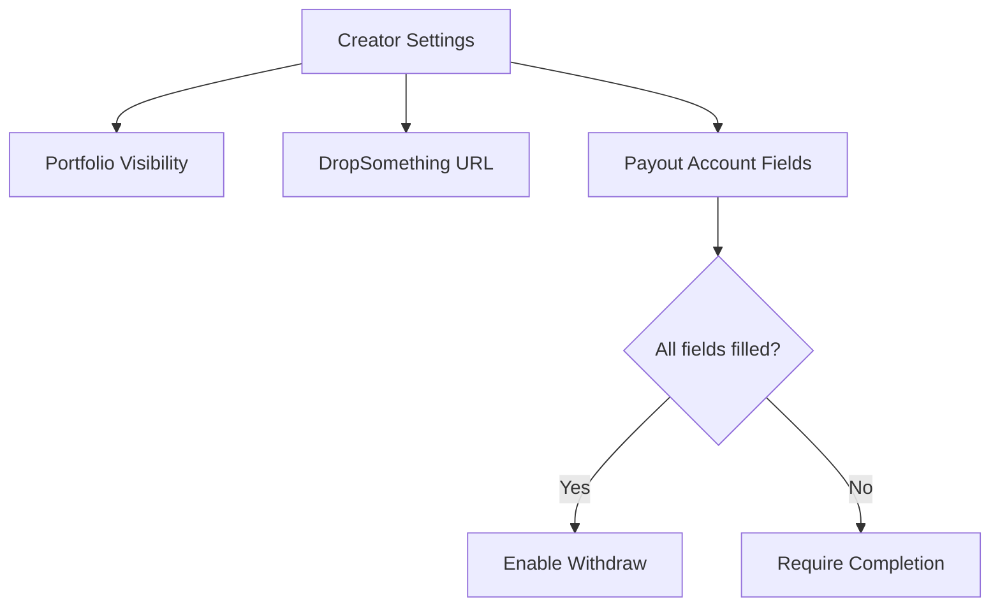

**Diagram sources**
- [SettingsCreator.tsx:430-500](file://src/screens/settings/SettingsCreator.tsx#L430-L500)

**Section sources**
- [SettingsCreator.tsx:430-500](file://src/screens/settings/SettingsCreator.tsx#L430-L500)

## Dependency Analysis
- Creator payouts depend on successful creator_support transactions and presence of a validated payout account.
- Ad revenue depends on ad selection logic, event tracking, and periodic aggregation.
- Premium activation depends on Paystack verification and user state updates.
- Gamification rewards depend on engagement thresholds and spin inventory.

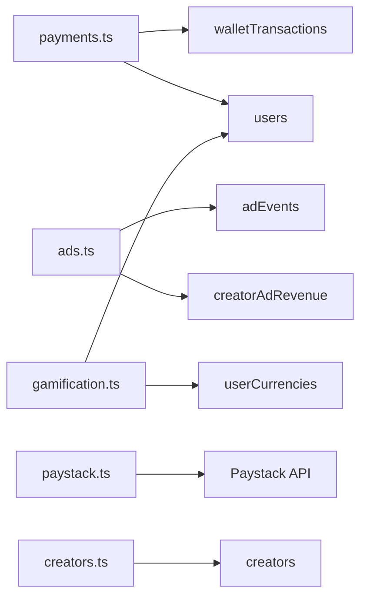

**Diagram sources**
- [payments.ts:198-223](file://convex/payments.ts#L198-L223)
- [ads.ts:167-237](file://convex/ads.ts#L167-L237)
- [gamification.ts:14-117](file://convex/gamification.ts#L14-L117)
- [paystack.ts:5-44](file://convex/paystack.ts#L5-L44)
- [creators.ts:69-93](file://convex/creators.ts#L69-L93)

**Section sources**
- [schema.ts:198-223](file://convex/schema.ts#L198-L223)
- [schema.ts:337-352](file://convex/schema.ts#L337-L352)
- [schema.ts:356-361](file://convex/schema.ts#L356-L361)
- [schema.ts:406-429](file://convex/schema.ts#L406-L429)

## Performance Considerations
- Index usage: Queries leverage indexes on usernames, user IDs, references, and status to minimize scans.
- Aggregation efficiency: Creator summaries and ad analytics use reduce operations on collected rows.
- Event-driven updates: Ad revenue is updated incrementally per event to avoid heavy recomputation.
- Frontend caching: Dashboard and wallet pages cache results and refresh on user/session changes.

[No sources needed since this section provides general guidance]

## Troubleshooting Guide
- Paystack initialization failures: Ensure environment variables are set and return errors are normalized.
- Payment verification errors: Confirm webhook/callback reaches Convex and reference uniqueness is enforced.
- Premium activation duplicates: Existing references prevent duplicate activations; check renewal dates.
- Missing payout account: Wallet UI prevents withdrawals until all payout fields are filled.

**Section sources**
- [paystack.ts:15-18](file://convex/paystack.ts#L15-L18)
- [paystack.ts:48-66](file://convex/paystack.ts#L48-L66)
- [paystack-initialize.ts:11-14](file://api/paystack-initialize.ts#L11-L14)
- [paystack-initialize.ts:16-19](file://api/paystack-initialize.ts#L16-L19)
- [payments.ts:132-139](file://convex/payments.ts#L132-L139)
- [payments.ts:212-219](file://convex/payments.ts#L212-L219)
- [CreatorWallet.tsx:250-258](file://src/screens/CreatorWallet.tsx#L250-L258)

## Conclusion
The Lemonade creator monetization system combines supporter payments, ad revenue sharing, gamification rewards, and premium subscriptions. It provides transparent payout summaries, robust transaction tracking, and a comprehensive creator dashboard. Paystack integration ensures secure payment processing, while schema-defined indexes and incremental aggregations maintain performance. Compliance is enforced through payout account requirements, and future enhancements like creator quests and badges expand engagement-driven monetization.

[No sources needed since this section summarizes without analyzing specific files]

## Appendices

### Creator Payout Summary Fields
- availableToWithdraw: Sum of successful creator_support transactions attributed to the creator.
- pendingClearance: Placeholder for funds under review.
- lifetimeEarnings: Total lifetime earnings from creator_support.
- recentEarnings: Last N successful creator_support transactions with amount, date, and supporter.
- hasPayoutAccount: Whether bank account fields are present.
- payoutAccount: Bank details stored on the creator profile.

**Section sources**
- [payments.ts:21-80](file://convex/payments.ts#L21-L80)

### Ad Revenue Calculation
- Revenue computed from CPM and event type, adjusted by watch time quality multiplier.
- Creator share: 70%, Platform share: 30%.
- Aggregated per creator and period for reporting.

**Section sources**
- [ads.ts:79-88](file://convex/ads.ts#L79-L88)
- [ads.ts:182-184](file://convex/ads.ts#L182-L184)
- [ads.ts:204-233](file://convex/ads.ts#L204-L233)
- [ads.ts:239-273](file://convex/ads.ts#L239-L273)

### Gamification Mechanics
- Engagement recording: Session quality and completion thresholds determine counted sessions.
- Weekly spins: Eligibility requires a minimum number of counted sessions per week.
- Streak protection: Costs Lemon Coins to extend protection window.

**Section sources**
- [gamification.ts:14-117](file://convex/gamification.ts#L14-L117)
- [gamification.ts:147-232](file://convex/gamification.ts#L147-L232)
- [gamification.ts:234-287](file://convex/gamification.ts#L234-L287)

### Premium Billing and Renewal
- Plan types: premium or patron.
- Billing cycles: monthly or yearly.
- Renewal date calculated from current time plus cycle length.

**Section sources**
- [payments.ts:174-263](file://convex/payments.ts#L174-L263)

### International Payment Processing and Compliance
- Paystack integration supports card, bank, USSD, and bank transfer channels.
- Payout account requirements enforce KYC-like fields for withdrawals.
- Creator settings screen warns about content guidelines and potential suspensions.

**Section sources**
- [paystack.ts:33-34](file://convex/paystack.ts#L33-L34)
- [SettingsCreator.tsx:502-513](file://src/screens/settings/SettingsCreator.tsx#L502-L513)