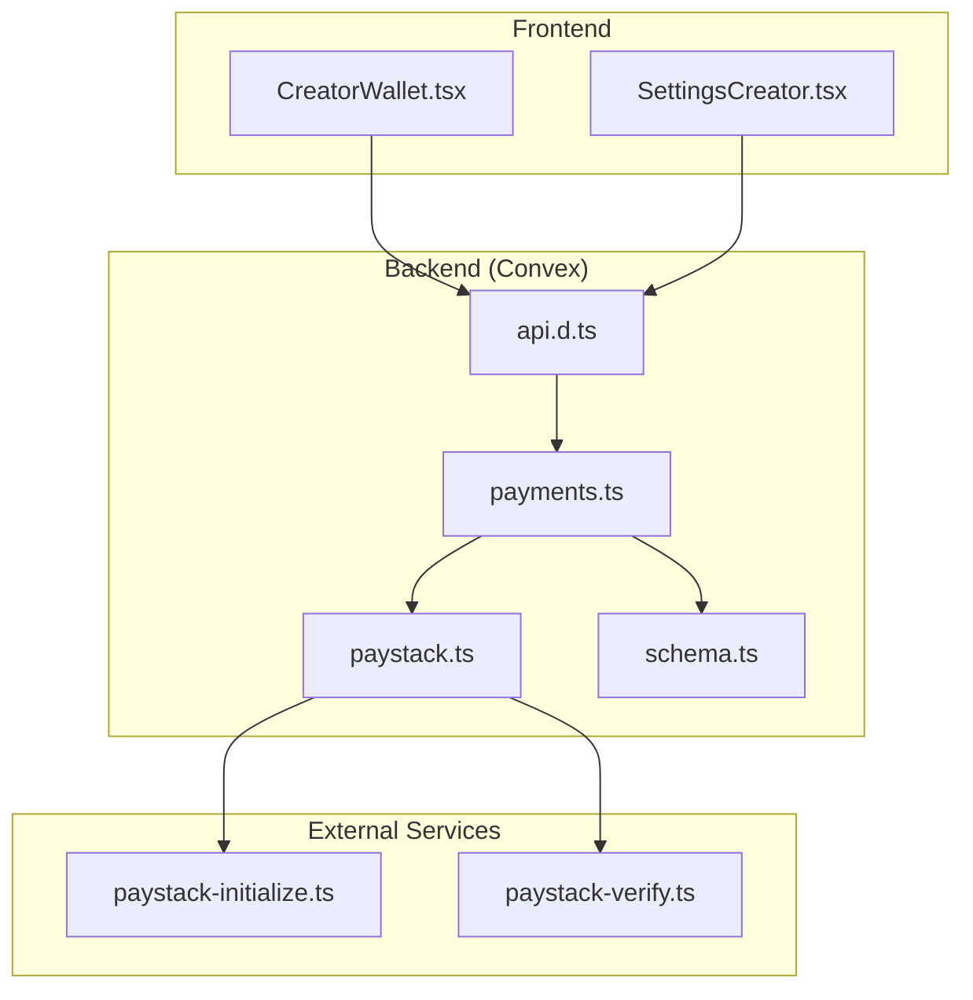
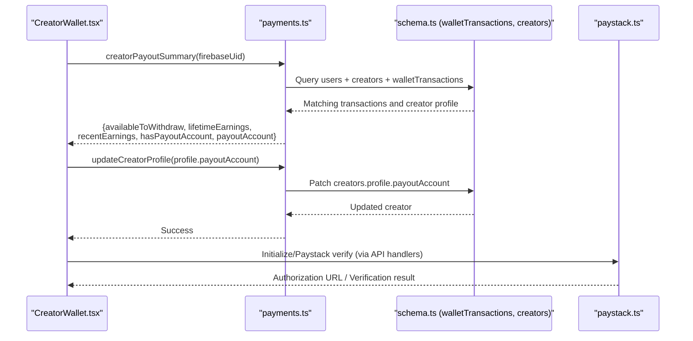
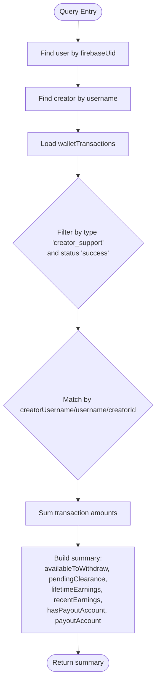
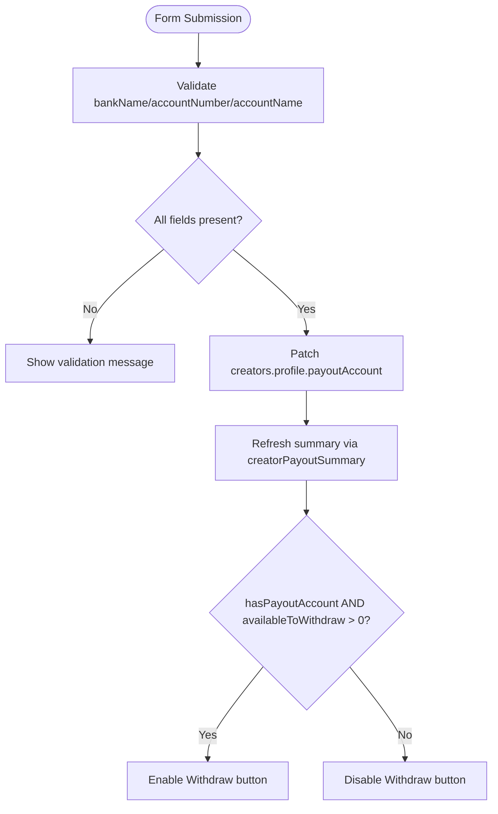
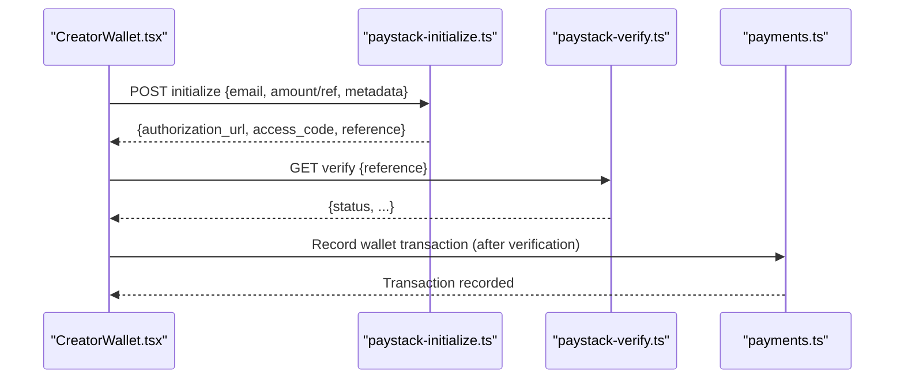
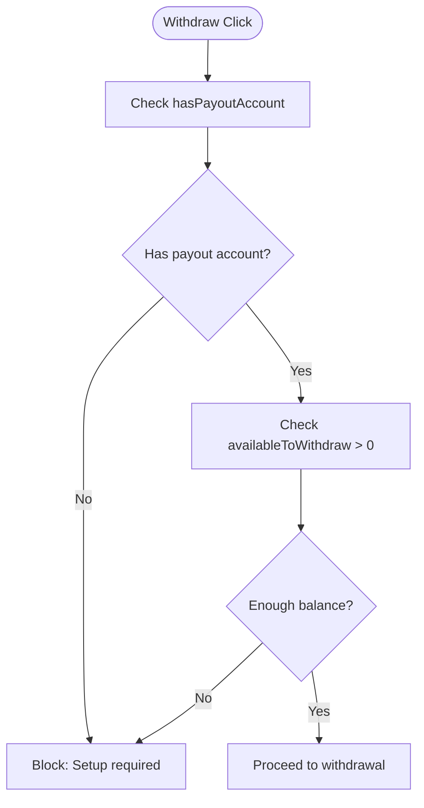
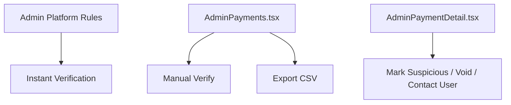
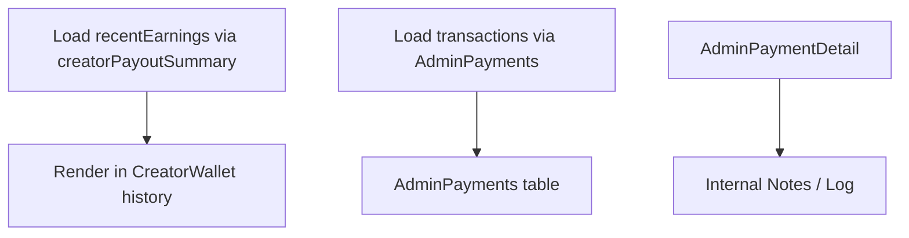
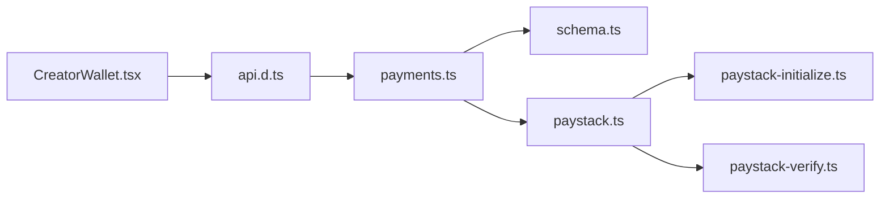
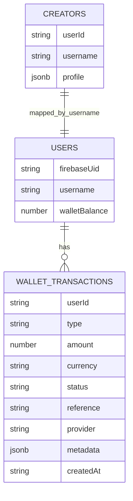

# Creator Payout Management

<cite>
**Referenced Files in This Document**
- [CreatorWallet.tsx](file://src/screens/CreatorWallet.tsx)
- [SettingsCreator.tsx](file://src/screens/settings/SettingsCreator.tsx)
- [payments.ts](file://convex/payments.ts)
- [schema.ts](file://convex/schema.ts)
- [paystack.ts](file://convex/paystack.ts)
- [paystack-initialize.ts](file://api/paystack-initialize.ts)
- [paystack-verify.ts](file://api/paystack-verify.ts)
- [AdminPayments.tsx](file://src/screens/admin/AdminPayments.tsx)
- [AdminPaymentDetail.tsx](file://src/screens/admin/details/AdminPaymentDetail.tsx)
- [api.d.ts](file://convex/_generated/api.d.ts)
</cite>

## Table of Contents
1. [Introduction](#introduction)
2. [Project Structure](#project-structure)
3. [Core Components](#core-components)
4. [Architecture Overview](#architecture-overview)
5. [Detailed Component Analysis](#detailed-component-analysis)
6. [Dependency Analysis](#dependency-analysis)
7. [Performance Considerations](#performance-considerations)
8. [Troubleshooting Guide](#troubleshooting-guide)
9. [Conclusion](#conclusion)
10. [Appendices](#appendices)

## Introduction
This document explains the Creator Payout Management system, focusing on:
- Payout summary calculations and recent earnings tracking
- Payout account setup and validation
- Withdrawal processing and eligibility checks
- Compliance and KYC considerations
- Reporting and administrative oversight

It synthesizes frontend UI flows, backend Convex queries and mutations, and supporting payment integrations to provide a complete picture of how creators manage earnings and payouts.

## Project Structure
The Creator Payout Management spans three layers:
- Frontend UI: Creator dashboard and settings screens
- Backend (Convex): Queries, mutations, and payment integrations
- Payment Provider APIs: Paystack initialization and verification

**Diagram sources**
- [CreatorWallet.tsx:1-287](file://src/screens/CreatorWallet.tsx#L1-L287)
- [SettingsCreator.tsx:462-500](file://src/screens/settings/SettingsCreator.tsx#L462-L500)
- [api.d.ts:27-62](file://convex/_generated/api.d.ts#L27-L62)
- [payments.ts:21-80](file://convex/payments.ts#L21-L80)
- [paystack.ts:42-70](file://convex/paystack.ts#L42-L70)
- [schema.ts:198-223](file://convex/schema.ts#L198-L223)
- [paystack-initialize.ts:1-47](file://api/paystack-initialize.ts#L1-L47)
- [paystack-verify.ts:1-36](file://api/paystack-verify.ts#L1-L36)

**Section sources**
- [CreatorWallet.tsx:1-287](file://src/screens/CreatorWallet.tsx#L1-L287)
- [SettingsCreator.tsx:462-500](file://src/screens/settings/SettingsCreator.tsx#L462-L500)
- [payments.ts:21-80](file://convex/payments.ts#L21-L80)
- [paystack.ts:42-70](file://convex/paystack.ts#L42-L70)
- [schema.ts:198-223](file://convex/schema.ts#L198-L223)
- [api.d.ts:27-62](file://convex/_generated/api.d.ts#L27-L62)

## Core Components
- Creator payout summary query: aggregates lifetime earnings, available withdrawal balance, recent earnings, and payout account completeness.
- Payout account management: stores bank name, account number, and account holder name on the creator profile; validates completeness for withdrawals.
- Eligibility checks: requires a complete payout account and positive available balance.
- Withdrawal processing: integrates with Paystack for payment initiation and verification; records wallet transactions.
- Administrative oversight: admin panels for transaction review, export, and manual actions.

**Section sources**
- [payments.ts:21-80](file://convex/payments.ts#L21-L80)
- [CreatorWallet.tsx:41-128](file://src/screens/CreatorWallet.tsx#L41-L128)
- [SettingsCreator.tsx:462-500](file://src/screens/settings/SettingsCreator.tsx#L462-L500)
- [paystack.ts:42-70](file://convex/paystack.ts#L42-L70)
- [AdminPayments.tsx:1-197](file://src/screens/admin/AdminPayments.tsx#L1-L197)
- [AdminPaymentDetail.tsx:1-257](file://src/screens/admin/details/AdminPaymentDetail.tsx#L1-L257)

## Architecture Overview
The system orchestrates creator earnings, payout accounts, and withdrawal requests across frontend, backend, and external payment APIs.

**Diagram sources**
- [CreatorWallet.tsx:55-128](file://src/screens/CreatorWallet.tsx#L55-L128)
- [payments.ts:21-80](file://convex/payments.ts#L21-L80)
- [schema.ts:198-223](file://convex/schema.ts#L198-L223)
- [paystack.ts:42-70](file://convex/paystack.ts#L42-L70)

## Detailed Component Analysis

### Creator Payout Summary Query
The creatorPayoutSummary query computes:
- Lifetime earnings: sum of successful creator support transactions matching the creator’s identity
- Available to withdraw: currently mirrors lifetime earnings
- Pending clearance: placeholder value
- Recent earnings: top 10 most recent successful creator support transactions with metadata
- Payout account completeness: presence of bankName, accountNumber, and accountName
- Payout account details: returned from creator profile

**Diagram sources**
- [payments.ts:21-80](file://convex/payments.ts#L21-L80)

**Section sources**
- [payments.ts:21-80](file://convex/payments.ts#L21-L80)

### Payout Account Management
- Storage: payout account stored under creators.profile.payoutAccount
- Validation: completeness check requires bankName, accountNumber, and accountName
- UI: CreatorWallet and SettingsCreator forms capture and persist these fields
- Eligibility: withdrawals require a complete payout account and positive available balance

**Diagram sources**
- [CreatorWallet.tsx:89-128](file://src/screens/CreatorWallet.tsx#L89-L128)
- [SettingsCreator.tsx:462-500](file://src/screens/settings/SettingsCreator.tsx#L462-L500)
- [payments.ts:72-78](file://convex/payments.ts#L72-L78)

**Section sources**
- [CreatorWallet.tsx:41-128](file://src/screens/CreatorWallet.tsx#L41-L128)
- [SettingsCreator.tsx:462-500](file://src/screens/settings/SettingsCreator.tsx#L462-L500)
- [payments.ts:72-78](file://convex/payments.ts#L72-L78)

### Withdrawal Processing Workflow
- Initialization: Paystack initialization endpoint constructs a charge request and returns an authorization URL/reference
- Verification: Paystack verification endpoint confirms transaction status
- Recording: Wallet transactions are recorded upon successful payment events

**Diagram sources**
- [paystack-initialize.ts:1-47](file://api/paystack-initialize.ts#L1-L47)
- [paystack-verify.ts:1-36](file://api/paystack-verify.ts#L1-L36)
- [payments.ts:113-172](file://convex/payments.ts#L113-L172)

**Section sources**
- [paystack-initialize.ts:1-47](file://api/paystack-initialize.ts#L1-L47)
- [paystack-verify.ts:1-36](file://api/paystack-verify.ts#L1-L36)
- [payments.ts:113-172](file://convex/payments.ts#L113-L172)

### Payout Eligibility Checks
Eligibility for withdrawals is determined by:
- Account completeness: bankName, accountNumber, accountName must be present
- Positive available balance: availableToWithdraw > 0

**Diagram sources**
- [CreatorWallet.tsx:82-87](file://src/screens/CreatorWallet.tsx#L82-L87)
- [payments.ts:72-78](file://convex/payments.ts#L72-L78)

**Section sources**
- [CreatorWallet.tsx:82-87](file://src/screens/CreatorWallet.tsx#L82-L87)
- [payments.ts:72-78](file://convex/payments.ts#L72-L78)

### Compliance and KYC Considerations
- Instant Verification: Admin settings indicate “Instant Verification” for creators with portfolios on trusted platforms, suggesting automated eligibility checks for certain profiles.
- Manual Review: Admin payment panels allow verifying transactions, marking suspicious activity, and exporting reports, supporting manual compliance workflows.
- Data Protection: Payment verification uses secure keys from environment variables; ensure secrets are managed securely.

**Diagram sources**
- [AdminPayments.tsx:1-197](file://src/screens/admin/AdminPayments.tsx#L1-L197)
- [AdminPaymentDetail.tsx:1-257](file://src/screens/admin/details/AdminPaymentDetail.tsx#L1-L257)

**Section sources**
- [AdminPayments.tsx:1-197](file://src/screens/admin/AdminPayments.tsx#L1-L197)
- [AdminPaymentDetail.tsx:1-257](file://src/screens/admin/details/AdminPaymentDetail.tsx#L1-L257)

### Payout History Tracking and Reporting
- Creator earnings history: recent earnings list displays type, date, and amount for the most recent successful creator support transactions.
- Admin reporting: Financial Ops dashboard supports filtering, exporting, and reviewing transactions, enabling transparency and auditability.

**Diagram sources**
- [CreatorWallet.tsx:262-283](file://src/screens/CreatorWallet.tsx#L262-L283)
- [AdminPayments.tsx:1-197](file://src/screens/admin/AdminPayments.tsx#L1-L197)
- [AdminPaymentDetail.tsx:148-251](file://src/screens/admin/details/AdminPaymentDetail.tsx#L148-L251)

**Section sources**
- [CreatorWallet.tsx:262-283](file://src/screens/CreatorWallet.tsx#L262-L283)
- [AdminPayments.tsx:1-197](file://src/screens/admin/AdminPayments.tsx#L1-L197)
- [AdminPaymentDetail.tsx:148-251](file://src/screens/admin/details/AdminPaymentDetail.tsx#L148-L251)

## Dependency Analysis
- CreatorWallet depends on the payments.api.creatorPayoutSummary to render balances and recent earnings.
- Payout account updates are persisted via creators.upsert or profile patching; the summary reflects completeness.
- Paystack integration is encapsulated in Convex actions and API handlers; the UI triggers initialization and verification flows.
- Wallet transactions are modeled in schema.ts and used by payments.ts for recording and aggregation.

**Diagram sources**
- [api.d.ts:27-62](file://convex/_generated/api.d.ts#L27-L62)
- [payments.ts:21-80](file://convex/payments.ts#L21-L80)
- [schema.ts:198-223](file://convex/schema.ts#L198-L223)
- [paystack.ts:42-70](file://convex/paystack.ts#L42-L70)
- [CreatorWallet.tsx:55-128](file://src/screens/CreatorWallet.tsx#L55-L128)

**Section sources**
- [api.d.ts:27-62](file://convex/_generated/api.d.ts#L27-L62)
- [payments.ts:21-80](file://convex/payments.ts#L21-L80)
- [schema.ts:198-223](file://convex/schema.ts#L198-L223)
- [paystack.ts:42-70](file://convex/paystack.ts#L42-L70)
- [CreatorWallet.tsx:55-128](file://src/screens/CreatorWallet.tsx#L55-L128)

## Performance Considerations
- Query filtering: The creatorPayoutSummary filters walletTransactions by type and status; ensure appropriate indexing exists on the database for efficient lookups.
- Aggregation cost: Summing transaction amounts is linear in the number of matched transactions; limit recent earnings slices to reduce rendering overhead.
- UI responsiveness: Debounce form inputs and batch updates to creators.profile.payoutAccount to avoid excessive writes.

## Troubleshooting Guide
- Missing user or creator: creatorPayoutSummary throws if user or creator is not found; verify firebaseUid mapping and creator username alignment.
- Incomplete payout account: withdrawals are blocked if any of bankName, accountNumber, or accountName is missing; prompt users to complete the form.
- Paystack errors: Ensure PAYSTACK_SECRET_KEY is configured; verify reference correctness and network connectivity for initialization and verification endpoints.
- Transaction duplication: Wallet credit mutations check for existing references to prevent duplicates; confirm unique references per transaction.

**Section sources**
- [payments.ts:29-31](file://convex/payments.ts#L29-L31)
- [payments.ts:72-78](file://convex/payments.ts#L72-L78)
- [paystack.ts:49-51](file://convex/paystack.ts#L49-L51)
- [paystack-initialize.ts:11-14](file://api/paystack-initialize.ts#L11-L14)
- [paystack-verify.ts:11-14](file://api/paystack-verify.ts#L11-L14)
- [payments.ts:132-139](file://convex/payments.ts#L132-L139)

## Conclusion
The Creator Payout Management system integrates a straightforward summary query, a simple account setup flow, and Paystack-based payment processing. Administrators benefit from robust reporting and manual controls to maintain compliance and transparency. Extending the system to enforce minimum balance thresholds, split pending and cleared funds, or integrate additional verification steps would further strengthen operational rigor.

## Appendices

### Data Model Overview (Relevant Entities)

**Diagram sources**
- [schema.ts:25-67](file://convex/schema.ts#L25-L67)
- [schema.ts:69-93](file://convex/schema.ts#L69-L93)
- [schema.ts:198-223](file://convex/schema.ts#L198-L223)