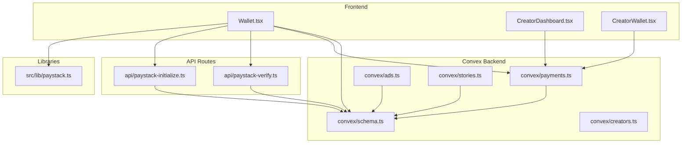
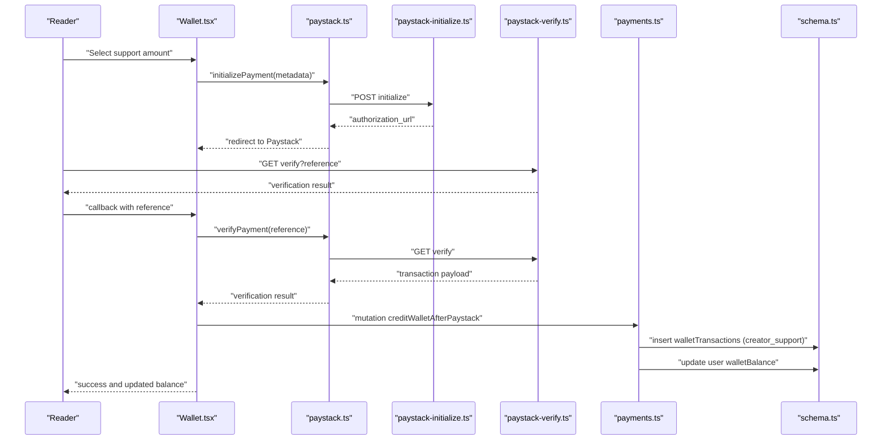
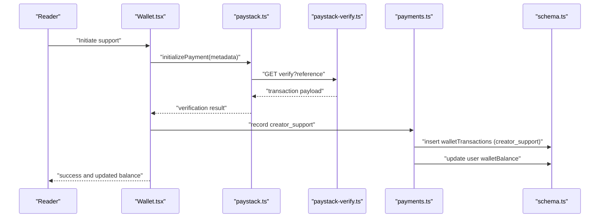
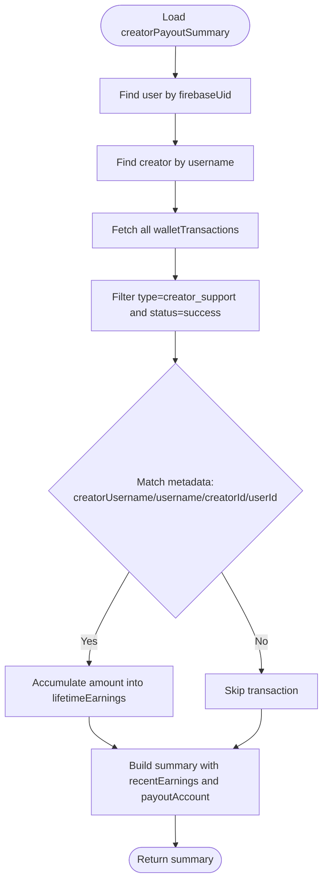
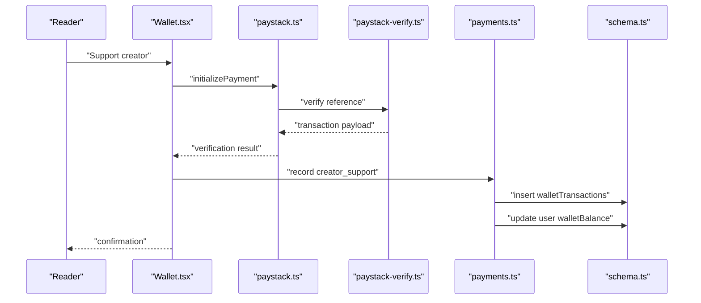
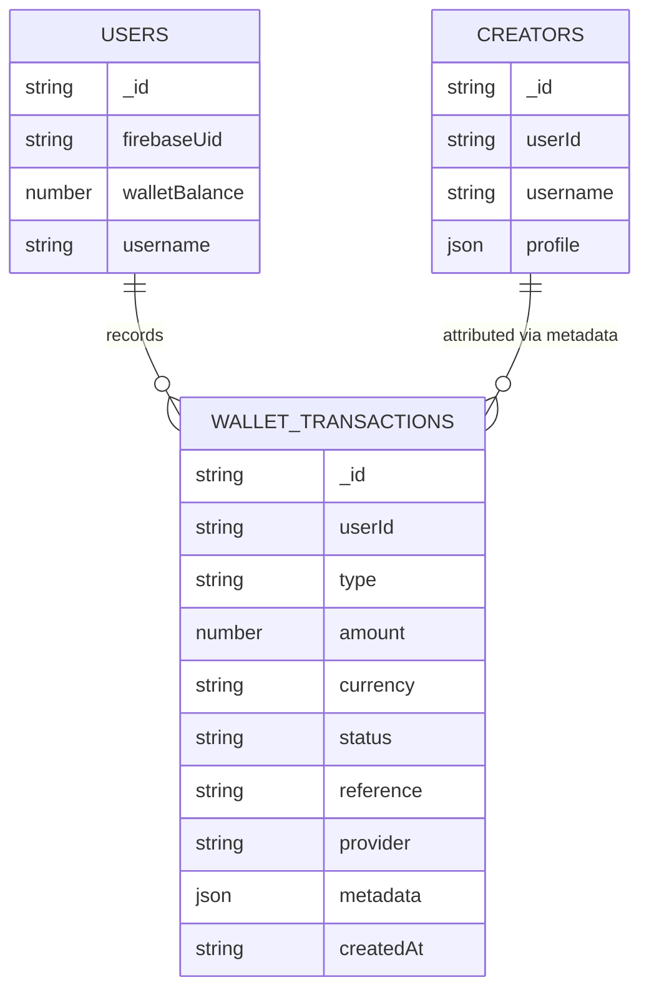
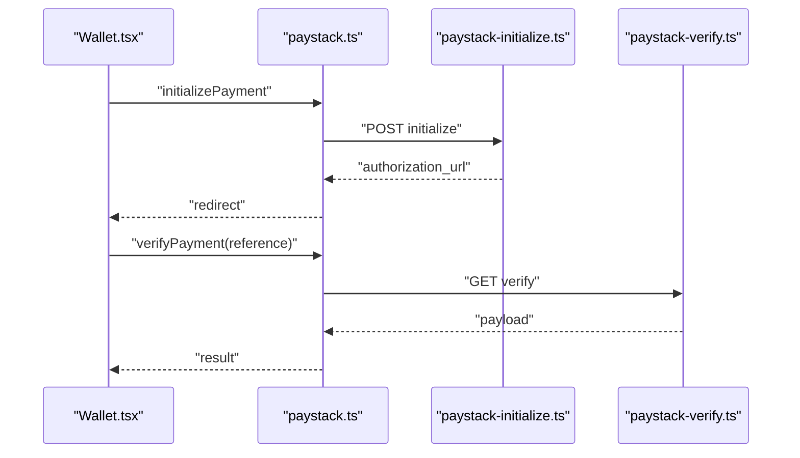
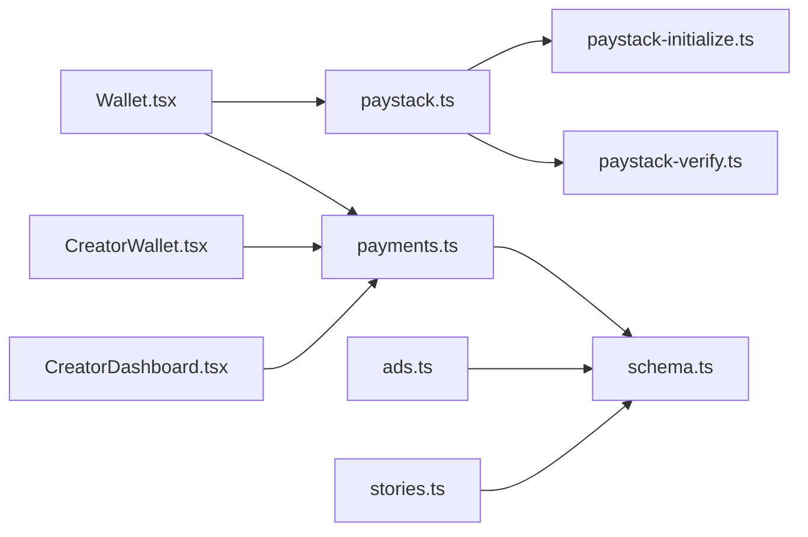

# Creator Support System

<cite>
**Referenced Files in This Document**
- [schema.ts](file://convex/schema.ts)
- [payments.ts](file://convex/payments.ts)
- [creators.ts](file://convex/creators.ts)
- [paystack-initialize.ts](file://api/paystack-initialize.ts)
- [paystack-verify.ts](file://api/paystack-verify.ts)
- [paystack.ts](file://src/lib/paystack.ts)
- [Wallet.tsx](file://src/screens/Wallet.tsx)
- [CreatorWallet.tsx](file://src/screens/CreatorWallet.tsx)
- [CreatorDashboard.tsx](file://src/screens/CreatorDashboard.tsx)
- [AdminPayments.tsx](file://src/screens/admin/AdminPayments.tsx)
- [ads.ts](file://convex/ads.ts)
- [stories.ts](file://convex/stories.ts)
</cite>

## Table of Contents
1. [Introduction](#introduction)
2. [Project Structure](#project-structure)
3. [Core Components](#core-components)
4. [Architecture Overview](#architecture-overview)
5. [Detailed Component Analysis](#detailed-component-analysis)
6. [Dependency Analysis](#dependency-analysis)
7. [Performance Considerations](#performance-considerations)
8. [Troubleshooting Guide](#troubleshooting-guide)
9. [Conclusion](#conclusion)

## Introduction
This document explains the Creator Support System, focusing on supporter payments, chapter unlock pricing, and revenue sharing mechanisms. It documents the creator_support transaction type, payment processing workflows, metadata handling for creator identification, and revenue distribution calculations. It also covers the supporter payment flow from reader initiation to creator earnings capture, including transaction recording and wallet balance updates, and outlines chapter unlock pricing, promotional discounts, and creator commission structures. Finally, it details payment gateway integration specifics, error handling for failed transactions, refund processing workflows, creator payout eligibility criteria, minimum withdrawal thresholds, and tax implications for supporter payments.

## Project Structure
The Creator Support System spans frontend screens, Convex backend functions, and API routes:
- Frontend screens for wallet/top-up, creator dashboard, and creator wallet
- Convex schema defining wallet transactions and creator profiles
- Convex mutations and queries for payments, payouts, and premium activation
- API routes integrating with Paystack for initialization and verification
- Supporting modules for Paystack integration and UI components

**Diagram sources**
- [Wallet.tsx:1-452](file://src/screens/Wallet.tsx#L1-L452)
- [CreatorDashboard.tsx:1-322](file://src/screens/CreatorDashboard.tsx#L1-L322)
- [CreatorWallet.tsx:1-287](file://src/screens/CreatorWallet.tsx#L1-L287)
- [paystack.ts:1-115](file://src/lib/paystack.ts#L1-L115)
- [schema.ts:198-223](file://convex/schema.ts#L198-L223)
- [payments.ts:1-291](file://convex/payments.ts#L1-L291)
- [creators.ts:1-87](file://convex/creators.ts#L1-L87)
- [ads.ts:182-245](file://convex/ads.ts#L182-L245)
- [stories.ts:1-180](file://convex/stories.ts#L1-L180)
- [paystack-initialize.ts:1-47](file://api/paystack-initialize.ts#L1-L47)
- [paystack-verify.ts:1-36](file://api/paystack-verify.ts#L1-L36)

**Section sources**
- [schema.ts:198-223](file://convex/schema.ts#L198-L223)
- [payments.ts:1-291](file://convex/payments.ts#L1-L291)
- [paystack-initialize.ts:1-47](file://api/paystack-initialize.ts#L1-L47)
- [paystack-verify.ts:1-36](file://api/paystack-verify.ts#L1-L36)
- [paystack.ts:1-115](file://src/lib/paystack.ts#L1-L115)
- [Wallet.tsx:1-452](file://src/screens/Wallet.tsx#L1-L452)
- [CreatorWallet.tsx:1-287](file://src/screens/CreatorWallet.tsx#L1-L287)
- [CreatorDashboard.tsx:1-322](file://src/screens/CreatorDashboard.tsx#L1-L322)
- [ads.ts:182-245](file://convex/ads.ts#L182-L245)
- [stories.ts:1-180](file://convex/stories.ts#L1-L180)

## Core Components
- Wallet Transactions Schema: Defines transaction types including creator_support, wallet_topup, chapter_unlock, premium, and refund, with fields for amount, currency, status, reference, provider, providerPayload, and metadata.
- Payments Module: Provides queries and mutations for listing transactions, recording creator_support, crediting wallets after Paystack top-ups, activating premium subscriptions, and summarizing creator payouts.
- Paystack Integration: Frontend library and API routes for initializing and verifying Paystack transactions.
- Creator Profile and Wallet Screens: UI for creators to manage payout accounts and view earnings summaries.

Key responsibilities:
- Transaction recording and categorization
- Metadata extraction for creator identification
- Earnings aggregation and payout eligibility
- Payment gateway integration and verification
- Error handling and refund workflows

**Section sources**
- [schema.ts:198-223](file://convex/schema.ts#L198-L223)
- [payments.ts:21-80](file://convex/payments.ts#L21-L80)
- [payments.ts:82-172](file://convex/payments.ts#L82-L172)
- [paystack.ts:56-84](file://src/lib/paystack.ts#L56-L84)
- [paystack-initialize.ts:16-46](file://api/paystack-initialize.ts#L16-L46)
- [paystack-verify.ts:16-35](file://api/paystack-verify.ts#L16-L35)

## Architecture Overview
The system integrates reader payments and creator support contributions through Paystack, records all transactions in the walletTransactions table, and aggregates creator earnings for payout eligibility.

**Diagram sources**
- [Wallet.tsx:45-91](file://src/screens/Wallet.tsx#L45-L91)
- [paystack.ts:56-84](file://src/lib/paystack.ts#L56-L84)
- [paystack-initialize.ts:16-46](file://api/paystack-initialize.ts#L16-L46)
- [paystack-verify.ts:16-35](file://api/paystack-verify.ts#L16-L35)
- [payments.ts:113-172](file://convex/payments.ts#L113-L172)
- [schema.ts:198-223](file://convex/schema.ts#L198-L223)

## Detailed Component Analysis

### Creator Support Transaction Type and Payment Processing
The creator_support transaction type captures supporter payments routed through Paystack. The flow includes:
- Reader initiates payment via the wallet screen
- Paystack initializes the transaction and redirects to verification
- After verification, the frontend triggers a Convex mutation to record the transaction and update balances
- The transaction is categorized and stored with metadata for creator identification

**Diagram sources**
- [Wallet.tsx:45-91](file://src/screens/Wallet.tsx#L45-L91)
- [paystack.ts:56-84](file://src/lib/paystack.ts#L56-L84)
- [paystack-verify.ts:16-35](file://api/paystack-verify.ts#L16-L35)
- [payments.ts:82-111](file://convex/payments.ts#L82-L111)
- [payments.ts:113-172](file://convex/payments.ts#L113-L172)
- [schema.ts:198-223](file://convex/schema.ts#L198-L223)

**Section sources**
- [Wallet.tsx:45-91](file://src/screens/Wallet.tsx#L45-L91)
- [paystack.ts:56-84](file://src/lib/paystack.ts#L56-L84)
- [paystack-verify.ts:16-35](file://api/paystack-verify.ts#L16-L35)
- [payments.ts:82-111](file://convex/payments.ts#L82-L111)
- [payments.ts:113-172](file://convex/payments.ts#L113-L172)
- [schema.ts:198-223](file://convex/schema.ts#L198-L223)

### Metadata Handling for Creator Identification
The creatorPayoutSummary query filters creator_support transactions by metadata fields to identify earnings attributable to a specific creator. Supported identifiers include:
- creatorUsername
- username
- creatorId (internal or external)
- userId

This ensures accurate attribution even if usernames change or external IDs are used.

**Section sources**
- [payments.ts:40-50](file://convex/payments.ts#L40-L50)
- [payments.ts:21-79](file://convex/payments.ts#L21-L79)

### Revenue Distribution Calculations
Creator earnings are aggregated from successful creator_support transactions attributed to a creator. The summary exposes:
- availableToWithdraw: Lifetime earnings attributed to the creator
- pendingClearance: Placeholder for future accruals
- lifetimeEarnings: Total aggregated amount
- recentEarnings: Latest earnings with supporter metadata
- hasPayoutAccount: Indicates readiness for withdrawals
- payoutAccount: Bank account details stored on the creator profile

**Diagram sources**
- [payments.ts:21-79](file://convex/payments.ts#L21-L79)
- [schema.ts:198-223](file://convex/schema.ts#L198-L223)

**Section sources**
- [payments.ts:21-79](file://convex/payments.ts#L21-L79)

### Supporter Payment Flow: Reader to Creator Earnings Capture
The end-to-end flow from reader initiation to creator earnings capture:
- Reader selects support amount and initiates payment
- Paystack initializes and verifies the transaction
- Frontend verifies and triggers Convex mutation to record creator_support
- Transaction recorded with metadata for creator identification
- Creator earnings updated and retrievable via creatorPayoutSummary

**Diagram sources**
- [Wallet.tsx:45-91](file://src/screens/Wallet.tsx#L45-L91)
- [paystack.ts:56-84](file://src/lib/paystack.ts#L56-L84)
- [paystack-verify.ts:16-35](file://api/paystack-verify.ts#L16-L35)
- [payments.ts:82-111](file://convex/payments.ts#L82-L111)
- [schema.ts:198-223](file://convex/schema.ts#L198-L223)

**Section sources**
- [Wallet.tsx:45-91](file://src/screens/Wallet.tsx#L45-L91)
- [paystack.ts:56-84](file://src/lib/paystack.ts#L56-L84)
- [paystack-verify.ts:16-35](file://api/paystack-verify.ts#L16-L35)
- [payments.ts:82-111](file://convex/payments.ts#L82-L111)
- [schema.ts:198-223](file://convex/schema.ts#L198-L223)

### Chapter Unlock Pricing System
Chapter unlock pricing is indicated in UI components:
- Standard rate: 15–30 coins per chapter
- Premium rate: 40–60 coins per chapter

These rates inform reader decisions and are distinct from supporter payments. While the schema defines a chapter_unlock transaction type, the UI and backend logic indicate that unlock pricing is separate from the creator_support mechanism documented here.

**Section sources**
- [Wallet.tsx:214-219](file://src/screens/Wallet.tsx#L214-L219)
- [schema.ts:198-223](file://convex/schema.ts#L198-L223)

### Revenue Tracking for Creator Support
Revenue tracking centers on the walletTransactions table:
- Transaction categorization by type (creator_support, wallet_topup, chapter_unlock, premium, refund)
- Metadata extraction for creator identification
- Earnings aggregation via creatorPayoutSummary
- Transaction history surfaced in creator wallet and user wallet screens

**Diagram sources**
- [schema.ts:25-62](file://convex/schema.ts#L25-L62)
- [schema.ts:69-93](file://convex/schema.ts#L69-L93)
- [schema.ts:198-223](file://convex/schema.ts#L198-L223)

**Section sources**
- [schema.ts:198-223](file://convex/schema.ts#L198-L223)
- [payments.ts:21-79](file://convex/payments.ts#L21-L79)
- [CreatorWallet.tsx:262-283](file://src/screens/CreatorWallet.tsx#L262-L283)
- [Wallet.tsx:371-432](file://src/screens/Wallet.tsx#L371-L432)

### Payment Gateway Integration Specifics
Integration with Paystack:
- Initialization: POST to Paystack API with email, amount, reference, metadata, callback URL, and channels
- Verification: GET to Paystack API with reference to confirm transaction status
- Frontend helpers: generateReference, naiiraToKobo/koboToNaira, initializePayment, verifyPayment
- Backend actions: Convex actions wrap API routes for secure initialization and verification

**Diagram sources**
- [paystack.ts:56-84](file://src/lib/paystack.ts#L56-L84)
- [paystack-initialize.ts:16-46](file://api/paystack-initialize.ts#L16-L46)
- [paystack-verify.ts:16-35](file://api/paystack-verify.ts#L16-L35)

**Section sources**
- [paystack.ts:56-84](file://src/lib/paystack.ts#L56-L84)
- [paystack-initialize.ts:16-46](file://api/paystack-initialize.ts#L16-L46)
- [paystack-verify.ts:16-35](file://api/paystack-verify.ts#L16-L35)

### Error Handling for Failed Transactions
- Validation: Amounts validated before crediting wallets or activating premium
- Duplicate detection: Existing reference check prevents double crediting
- User lookup: Errors thrown if user not found during wallet credit or premium activation
- Frontend verification: Payment status checked; non-successful statuses notify users and avoid crediting

**Section sources**
- [payments.ts:122-130](file://convex/payments.ts#L122-L130)
- [payments.ts:132-139](file://convex/payments.ts#L132-L139)
- [payments.ts:146-148](file://convex/payments.ts#L146-L148)
- [Wallet.tsx:57-60](file://src/screens/Wallet.tsx#L57-L60)

### Refund Processing Workflows
- Refund capability is exposed in the admin UI for manual processing (mock implementation)
- The walletTransactions schema supports a refund type and refunded status
- No automatic refund mutation is present in the payments module; refunds appear to be handled externally or via admin actions

**Section sources**
- [schema.ts:198-223](file://convex/schema.ts#L198-L223)
- [AdminPayments.tsx:43-47](file://src/screens/admin/AdminPayments.tsx#L43-L47)

### Creator Payout Eligibility Criteria, Minimum Withdrawal Thresholds, and Tax Implications
- Payout eligibility: Creator must have a complete payout account (bankName, accountNumber, accountName) and positive available earnings
- Minimum threshold: Not enforced in code; creators can withdraw when availableToWithdraw > 0
- Tax implications: Not modeled in code; implementational guidance would require legal and accounting policies outside this codebase

**Section sources**
- [payments.ts:72-78](file://convex/payments.ts#L72-L78)
- [CreatorWallet.tsx:82-87](file://src/screens/CreatorWallet.tsx#L82-L87)

## Dependency Analysis
The system exhibits clear separation of concerns:
- Frontend handles user interactions and Paystack integration
- Convex backend manages data persistence and business logic
- API routes encapsulate external service calls
- Schema defines shared data contracts

**Diagram sources**
- [Wallet.tsx:1-452](file://src/screens/Wallet.tsx#L1-L452)
- [paystack.ts:1-115](file://src/lib/paystack.ts#L1-L115)
- [paystack-initialize.ts:1-47](file://api/paystack-initialize.ts#L1-L47)
- [paystack-verify.ts:1-36](file://api/paystack-verify.ts#L1-L36)
- [payments.ts:1-291](file://convex/payments.ts#L1-L291)
- [schema.ts:198-223](file://convex/schema.ts#L198-L223)
- [CreatorWallet.tsx:1-287](file://src/screens/CreatorWallet.tsx#L1-L287)
- [CreatorDashboard.tsx:1-322](file://src/screens/CreatorDashboard.tsx#L1-L322)
- [ads.ts:182-245](file://convex/ads.ts#L182-L245)
- [stories.ts:1-180](file://convex/stories.ts#L1-L180)

**Section sources**
- [Wallet.tsx:1-452](file://src/screens/Wallet.tsx#L1-L452)
- [paystack.ts:1-115](file://src/lib/paystack.ts#L1-L115)
- [paystack-initialize.ts:1-47](file://api/paystack-initialize.ts#L1-L47)
- [paystack-verify.ts:1-36](file://api/paystack-verify.ts#L1-L36)
- [payments.ts:1-291](file://convex/payments.ts#L1-L291)
- [schema.ts:198-223](file://convex/schema.ts#L198-L223)
- [CreatorWallet.tsx:1-287](file://src/screens/CreatorWallet.tsx#L1-L287)
- [CreatorDashboard.tsx:1-322](file://src/screens/CreatorDashboard.tsx#L1-L322)
- [ads.ts:182-245](file://convex/ads.ts#L182-L245)
- [stories.ts:1-180](file://convex/stories.ts#L1-L180)

## Performance Considerations
- Index usage: Queries leverage indexes on by_userId, by_reference, and by_status for efficient filtering
- Aggregation: creatorPayoutSummary performs client-side filtering and reduce; consider server-side aggregation if volumes grow
- Deduplication: Reference checks prevent duplicate transaction inserts
- UI responsiveness: Debounce or batch updates for frequent polling of payment verification

[No sources needed since this section provides general guidance]

## Troubleshooting Guide
Common issues and resolutions:
- Missing Paystack keys: Ensure PAYSTACK_SECRET_KEY and VITE_PAYSTACK_PUBLIC_KEY are configured; errors are normalized to user-friendly messages
- Invalid amounts: Ensure amounts are finite and greater than zero before crediting or activating premium
- User not found: Verify firebaseUid and userId mappings; ensure user records exist before attempting wallet credit or premium activation
- Duplicate references: If a reference already exists, the system avoids double crediting and returns the existing transaction ID
- Non-successful payments: The frontend checks transaction status and avoids crediting the wallet on failure

**Section sources**
- [paystack.ts:37-51](file://src/lib/paystack.ts#L37-L51)
- [payments.ts:122-130](file://convex/payments.ts#L122-L130)
- [payments.ts:132-139](file://convex/payments.ts#L132-L139)
- [payments.ts:146-148](file://convex/payments.ts#L146-L148)
- [Wallet.tsx:57-60](file://src/screens/Wallet.tsx#L57-L60)

## Conclusion
The Creator Support System integrates reader payments and supporter contributions via Paystack, records all transactions in a structured schema, and aggregates creator earnings for payout eligibility. The system’s design separates frontend interactions, backend logic, and external API integrations while providing clear metadata-based attribution for creators. Future enhancements could include server-side aggregation of earnings, automated refund processing, and explicit minimum withdrawal thresholds or tax handling.