# Revenue Tracking System

<cite>
**Referenced Files in This Document**
- [schema.ts](file://convex/schema.ts)
- [payments.ts](file://convex/payments.ts)
- [ads.ts](file://convex/ads.ts)
- [gamification.ts](file://convex/gamification.ts)
- [users.ts](file://convex/users.ts)
- [admin.ts](file://convex/admin.ts)
- [paystack.ts](file://convex/paystack.ts)
- [CreatorDashboard.tsx](file://src/screens/CreatorDashboard.tsx)
- [CreatorWallet.tsx](file://src/screens/CreatorWallet.tsx)
- [paystack.ts](file://src/lib/paystack.ts)
</cite>

## Table of Contents
1. [Introduction](#introduction)
2. [Project Structure](#project-structure)
3. [Core Components](#core-components)
4. [Architecture Overview](#architecture-overview)
5. [Detailed Component Analysis](#detailed-component-analysis)
6. [Dependency Analysis](#dependency-analysis)
7. [Performance Considerations](#performance-considerations)
8. [Troubleshooting Guide](#troubleshooting-guide)
9. [Conclusion](#conclusion)

## Introduction
This document describes the revenue tracking system for the Lemonade platform, focusing on transaction categorization, metadata handling, and comprehensive reporting. It covers the walletTransactions table structure, transaction types and statuses, metadata extraction for revenue attribution, aggregation functions for lifetime and monthly earnings, integration with the gamification system for achievement-based monetization, and administrative reporting and reconciliation capabilities. It also documents real-time revenue monitoring and dashboard integration for creator financial insights.

## Project Structure
The revenue tracking system spans the Convex backend schema and functions, the Paystack integration, and frontend dashboards for creators and administrators.

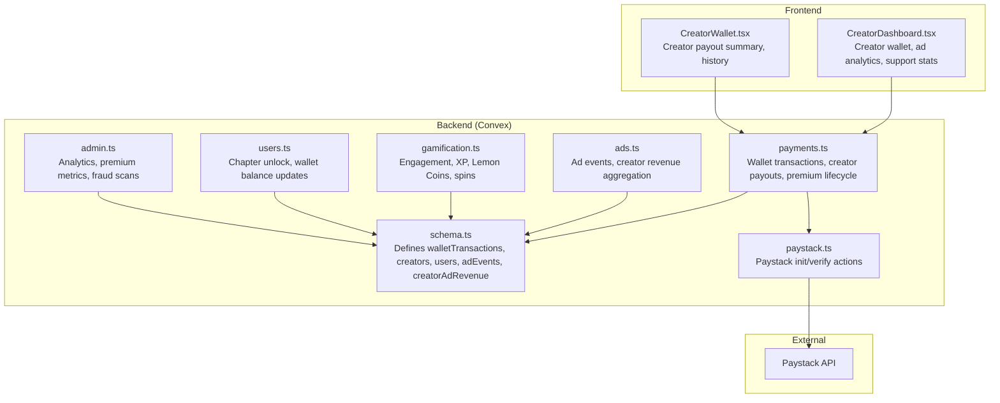

**Diagram sources**
- [schema.ts:198-223](file://convex/schema.ts#L198-L223)
- [payments.ts:1-291](file://convex/payments.ts#L1-L291)
- [ads.ts:1-360](file://convex/ads.ts#L1-L360)
- [gamification.ts:1-331](file://convex/gamification.ts#L1-L331)
- [users.ts:269-310](file://convex/users.ts#L269-L310)
- [admin.ts:31-128](file://convex/admin.ts#L31-L128)
- [paystack.ts:1-71](file://convex/paystack.ts#L1-L71)
- [CreatorDashboard.tsx:1-322](file://src/screens/CreatorDashboard.tsx#L1-L322)
- [CreatorWallet.tsx:1-287](file://src/screens/CreatorWallet.tsx#L1-L287)

**Section sources**
- [schema.ts:198-223](file://convex/schema.ts#L198-L223)
- [payments.ts:1-291](file://convex/payments.ts#L1-L291)
- [ads.ts:1-360](file://convex/ads.ts#L1-L360)
- [CreatorDashboard.tsx:1-322](file://src/screens/CreatorDashboard.tsx#L1-L322)
- [CreatorWallet.tsx:1-287](file://src/screens/CreatorWallet.tsx#L1-L287)

## Core Components
- walletTransactions: Central ledger for all monetary events, including wallet_topup, chapter_unlock, creator_support, premium, and refund. Supports indexing by userId, reference, and status for efficient queries.
- creators: Creator profiles with payout account storage for withdrawals.
- users: Reader profiles with wallet balances and premium status.
- adEvents and creatorAdRevenue: Ad monetization pipeline aggregating revenue by creator and period.
- gamification: Engagement and reward system that indirectly drives revenue via retention and premium conversions.
- Payments API: Wallet top-ups, premium purchases, chapter unlocks, and creator support transactions.
- Paystack integration: Payment initialization and verification actions.

**Section sources**
- [schema.ts:198-223](file://convex/schema.ts#L198-L223)
- [payments.ts:82-111](file://convex/payments.ts#L82-L111)
- [ads.ts:167-237](file://convex/ads.ts#L167-L237)
- [gamification.ts:14-117](file://convex/gamification.ts#L14-L117)

## Architecture Overview
The system integrates reader payments, creator monetization, and creator support donations into a unified revenue tracking architecture.

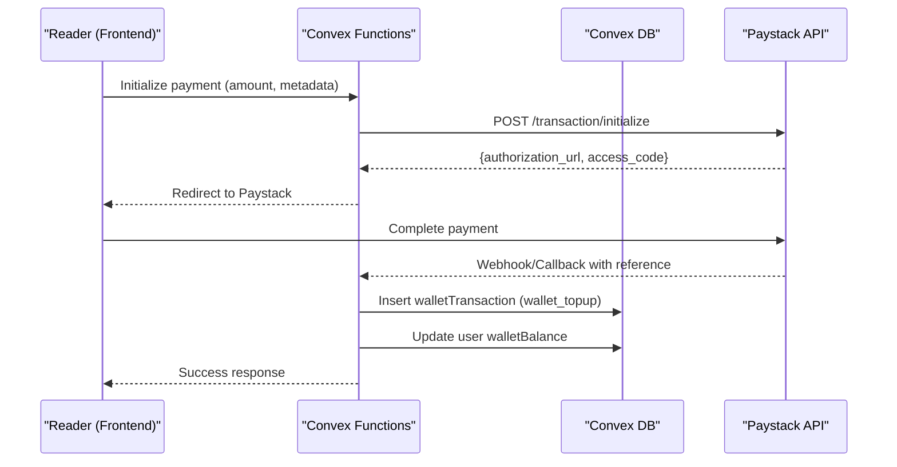

**Diagram sources**
- [paystack.ts:5-44](file://convex/paystack.ts#L5-L44)
- [payments.ts:113-172](file://convex/payments.ts#L113-L172)
- [users.ts:129-147](file://convex/users.ts#L129-L147)

## Detailed Component Analysis

### Wallet Transactions and Categorization
- Transaction types:
  - wallet_topup: Funds added via payment provider; metadata includes nairaAmount.
  - chapter_unlock: Single chapter purchase; metadata includes storyId and chapterId.
  - creator_support: Creator support donation; metadata includes creator identifiers and supporter info.
  - premium: Recurring subscription purchases; metadata includes planType and billingCycle.
  - refund: Refund records for reversals.
- Status tracking: pending, success, failed, refunded.
- Metadata fields:
  - creatorUsername, username, creatorId for attribution.
  - nairaAmount for wallet_topup revenue conversion.
  - storyId, chapterId for chapter_unlock attribution.
  - planType, billingCycle for premium analytics.
- Indexes enable efficient filtering by userId, reference, and status.

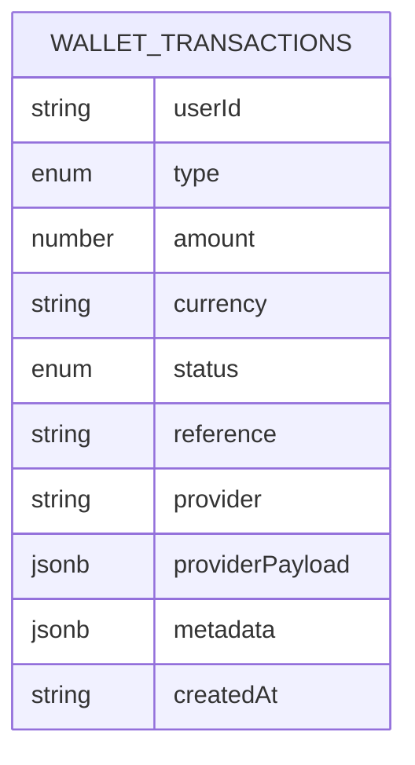

**Diagram sources**
- [schema.ts:198-223](file://convex/schema.ts#L198-L223)

**Section sources**
- [schema.ts:198-223](file://convex/schema.ts#L198-L223)
- [payments.ts:82-111](file://convex/payments.ts#L82-L111)

### Metadata Extraction and Revenue Attribution
- Creator support attribution:
  - Filters success transactions where metadata matches creator identifiers (creatorUsername, username, creatorId).
  - Aggregates lifetime earnings and recent earnings for creator payout summary.
- Chapter unlock attribution:
  - Records unlock transactions with metadata containing storyId and chapterId for content analytics.
- Premium attribution:
  - Stores planType and billingCycle in metadata for analytics and churn modeling.

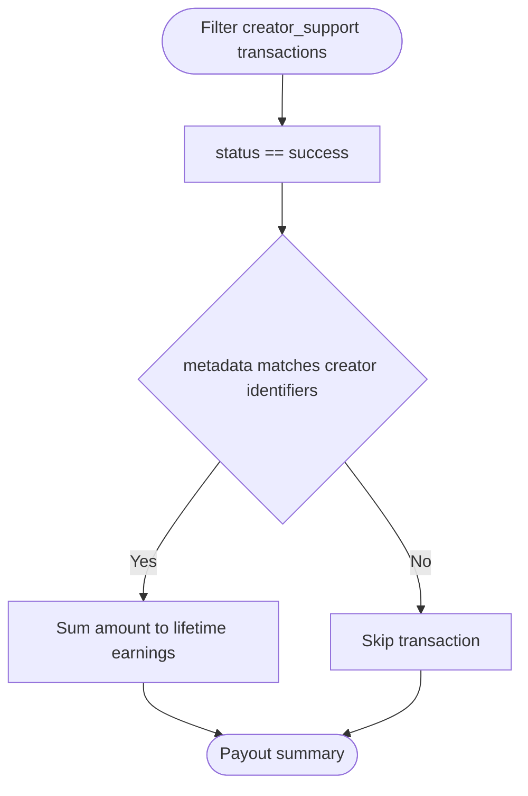

**Diagram sources**
- [payments.ts:21-80](file://convex/payments.ts#L21-L80)

**Section sources**
- [payments.ts:21-80](file://convex/payments.ts#L21-L80)
- [users.ts:269-310](file://convex/users.ts#L269-L310)

### Revenue Aggregation Functions
- Lifetime earnings calculation:
  - Sum of successful creator_support amounts attributed to a creator.
- Monthly earnings tracking:
  - Premium revenue segmented by billing cycle (monthly/yearly) for MRR/ARR computation.
  - Ad revenue aggregated by creator and period for RPM and performance reporting.
- Creator-specific reports:
  - Creator dashboard displays ad earnings, RPM, and support metrics.
  - Creator wallet shows available earnings, pending clearance, lifetime earnings, and recent earnings history.

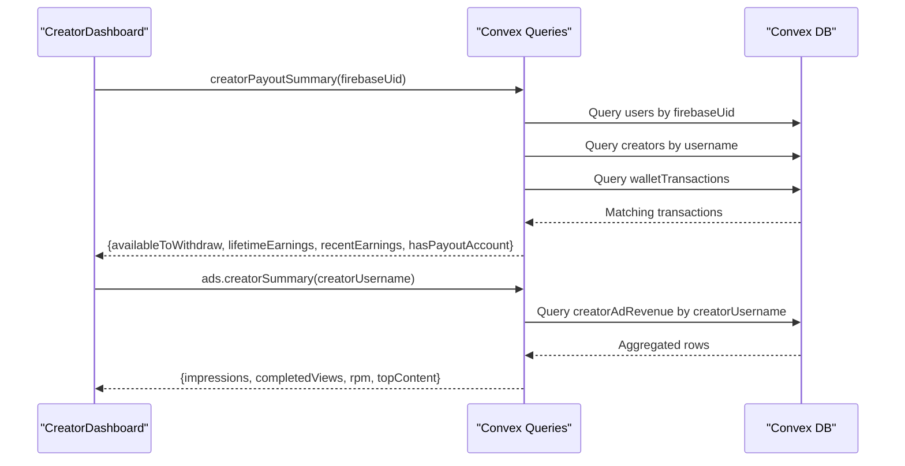

**Diagram sources**
- [payments.ts:21-80](file://convex/payments.ts#L21-L80)
- [ads.ts:239-273](file://convex/ads.ts#L239-L273)
- [CreatorDashboard.tsx:33-64](file://src/screens/CreatorDashboard.tsx#L33-L64)

**Section sources**
- [payments.ts:21-80](file://convex/payments.ts#L21-L80)
- [ads.ts:239-273](file://convex/ads.ts#L239-L273)
- [CreatorDashboard.tsx:33-64](file://src/screens/CreatorDashboard.tsx#L33-L64)

### Integration with Gamification System
- Engagement-based monetization:
  - Engagement events are recorded with completion percentage, scroll completion, duration, and session quality.
  - Counted sessions grant XP and Lemon Coins, encouraging retention and premium conversion.
- Achievement-based rewards:
  - Quests and spins provide coins and XP, indirectly supporting monetization by increasing user engagement and in-app currency availability.
- Streak protection:
  - Users can spend Lemon Coins to protect streaks, reinforcing retention and long-term engagement.

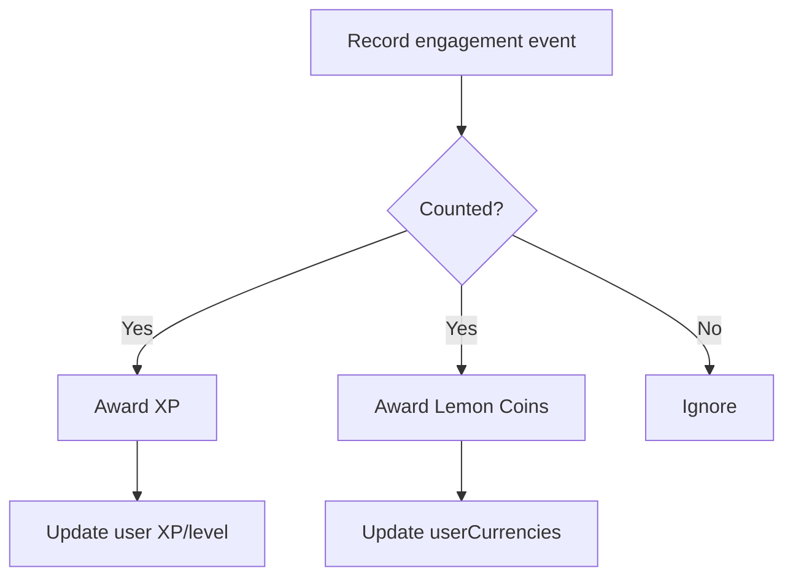

**Diagram sources**
- [gamification.ts:14-117](file://convex/gamification.ts#L14-L117)

**Section sources**
- [gamification.ts:14-117](file://convex/gamification.ts#L14-L117)

### Ad Revenue Tracking and Attribution
- Ad events capture impressions, completed views, skips, and clicks with quality multipliers based on watch time.
- Revenue split: 70% creator share, 30% platform share.
- Periodic aggregation by creator and story for monthly reporting and RPM calculations.

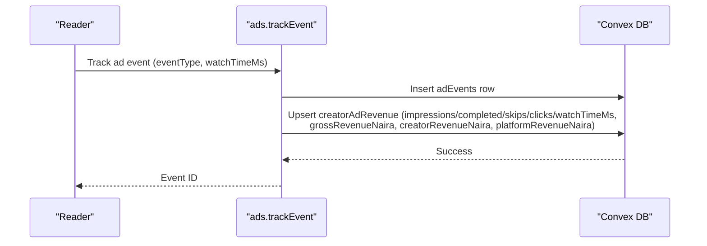

**Diagram sources**
- [ads.ts:167-237](file://convex/ads.ts#L167-L237)

**Section sources**
- [ads.ts:167-237](file://convex/ads.ts#L167-L237)

### Payment Lifecycle and Premium Management
- Wallet top-up:
  - Paystack initialization and verification handled by Convex actions.
  - On success, user wallet balance is credited and a wallet_topup transaction is recorded with metadata nairaAmount.
- Premium subscriptions:
  - Activation mutation sets premium status, plan type, billing cycle, renewal dates, and provider metadata.
  - Re-activation checks prevent duplicate transactions and cycles.
- Chapter unlock:
  - Deducts wallet balance and records a chapter_unlock transaction with metadata storyId and chapterId.

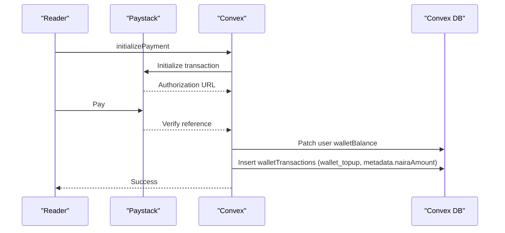

**Diagram sources**
- [paystack.ts:5-44](file://convex/paystack.ts#L5-L44)
- [payments.ts:113-172](file://convex/payments.ts#L113-L172)
- [users.ts:269-310](file://convex/users.ts#L269-L310)

**Section sources**
- [paystack.ts:5-44](file://convex/paystack.ts#L5-L44)
- [payments.ts:113-172](file://convex/payments.ts#L113-L172)
- [users.ts:269-310](file://convex/users.ts#L269-L310)

### Administrative Reporting and Reconciliation
- Platform overview:
  - Computes total revenue from successful transactions, categorized by type.
- Premium analytics:
  - Active subscribers, trial members, churn rate, MRR, ARR, and subscriber details.
- Fraud detection:
  - Scans engagement events for suspicious patterns and creates fraudEvents for review.

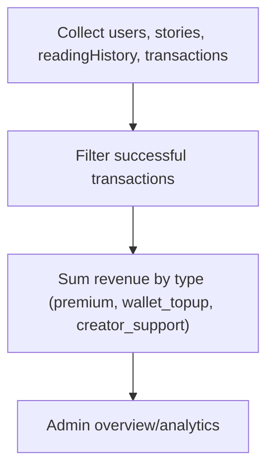

**Diagram sources**
- [admin.ts:31-128](file://convex/admin.ts#L31-L128)

**Section sources**
- [admin.ts:31-128](file://convex/admin.ts#L31-L128)
- [admin.ts:312-348](file://convex/admin.ts#L312-L348)

### Real-Time Monitoring and Dashboard Integration
- Creator dashboard:
  - Displays total reads, followers, creator wallet balance, active stories, ad earnings, RPM, and recent comments.
  - Integrates creator payout summary and ad analytics for real-time insights.
- Creator wallet:
  - Shows available earnings, pending clearance, lifetime earnings, payout account status, and recent earnings history.
- Frontend integration:
  - Uses Convex queries to fetch real-time data and format currency values.

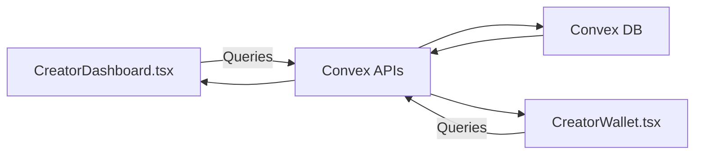

**Diagram sources**
- [CreatorDashboard.tsx:33-64](file://src/screens/CreatorDashboard.tsx#L33-L64)
- [CreatorWallet.tsx:55-80](file://src/screens/CreatorWallet.tsx#L55-L80)

**Section sources**
- [CreatorDashboard.tsx:33-64](file://src/screens/CreatorDashboard.tsx#L33-L64)
- [CreatorWallet.tsx:55-80](file://src/screens/CreatorWallet.tsx#L55-L80)

## Dependency Analysis
- Coupling:
  - payments.ts depends on schema.ts for walletTransactions and users/creators for identity resolution.
  - ads.ts depends on schema.ts for adEvents and creatorAdRevenue.
  - gamification.ts depends on schema.ts for engagement and reward tables.
  - admin.ts aggregates data from multiple tables for reporting.
- Cohesion:
  - Each module encapsulates a domain (payments, ads, gamification, admin) with clear boundaries.
- External dependencies:
  - Paystack integration via Convex actions for payment initialization and verification.

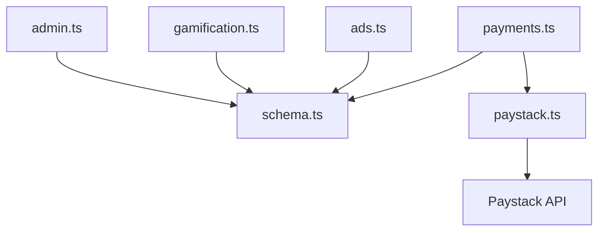

**Diagram sources**
- [payments.ts:1-291](file://convex/payments.ts#L1-L291)
- [ads.ts:1-360](file://convex/ads.ts#L1-L360)
- [gamification.ts:1-331](file://convex/gamification.ts#L1-L331)
- [admin.ts:1-364](file://convex/admin.ts#L1-L364)
- [paystack.ts:1-71](file://convex/paystack.ts#L1-L71)

**Section sources**
- [payments.ts:1-291](file://convex/payments.ts#L1-L291)
- [ads.ts:1-360](file://convex/ads.ts#L1-L360)
- [gamification.ts:1-331](file://convex/gamification.ts#L1-L331)
- [admin.ts:1-364](file://convex/admin.ts#L1-L364)
- [paystack.ts:1-71](file://convex/paystack.ts#L1-L71)

## Performance Considerations
- Index utilization:
  - Use by_userId, by_reference, and by_status indexes on walletTransactions for fast filtering and sorting.
  - Use by_creator_and_period on creatorAdRevenue for monthly aggregation.
- Aggregation efficiency:
  - Pre-filter transactions by status and type to minimize reduce operations.
  - Batch reads for admin analytics using Promise.all to reduce latency.
- Cost control:
  - Limit result sizes (take/collect) and pagination where appropriate.
  - Avoid unnecessary joins; rely on indexed lookups.

## Troubleshooting Guide
- Payment initialization failures:
  - Verify Paystack secret key is configured in Convex environment variables.
  - Check callback URL and metadata payload formatting.
- Duplicate transaction handling:
  - Wallet top-up and premium mutations check for existing references to avoid duplication.
- Insufficient funds:
  - Chapter unlock mutation validates user wallet balance before proceeding.
- Payout account setup:
  - Creator payout summary requires a complete payout account (bankName, accountNumber, accountName).
- Fraud detection:
  - Use admin scanEngagementForFraud to identify suspicious engagement patterns and resolve events.

**Section sources**
- [paystack.ts:14-44](file://convex/paystack.ts#L14-L44)
- [payments.ts:132-172](file://convex/payments.ts#L132-L172)
- [users.ts:276-310](file://convex/users.ts#L276-L310)
- [payments.ts:72-78](file://convex/payments.ts#L72-L78)
- [admin.ts:312-348](file://convex/admin.ts#L312-L348)

## Conclusion
The Lemonade revenue tracking system provides a robust foundation for transaction categorization, metadata-driven attribution, and comprehensive reporting. It integrates reader payments, creator monetization, and gamification to drive sustainable revenue streams. The schema, functions, and frontend dashboards collectively enable real-time monitoring, accurate reconciliation, and actionable insights for creators and administrators.