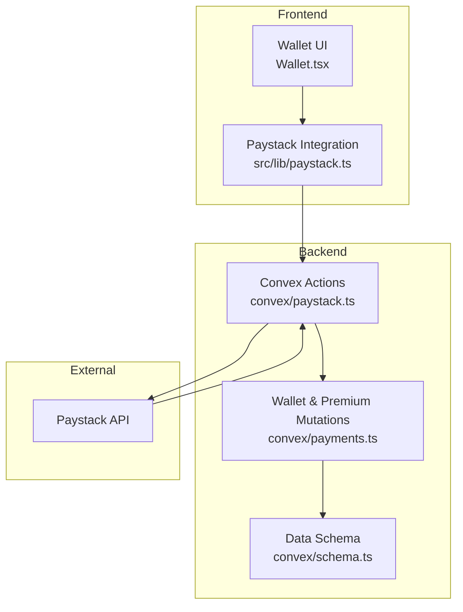
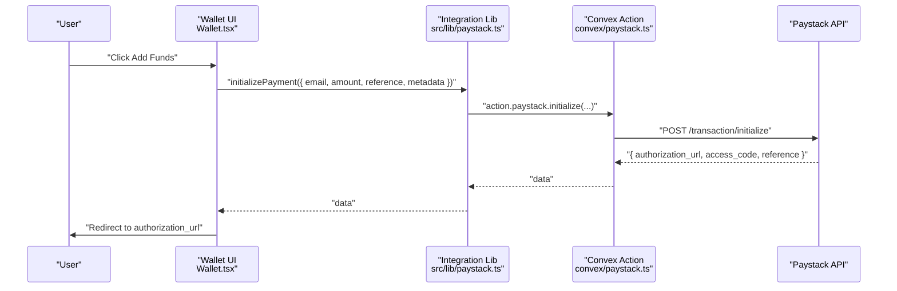
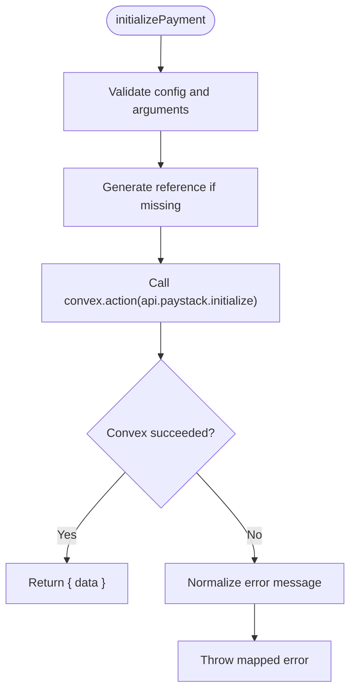
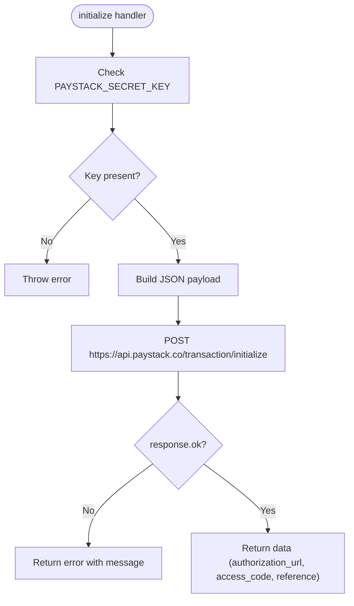
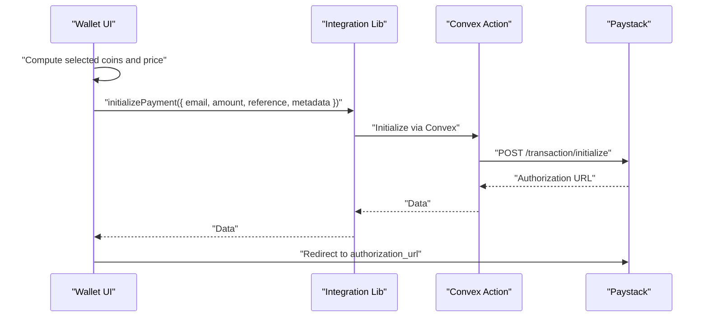
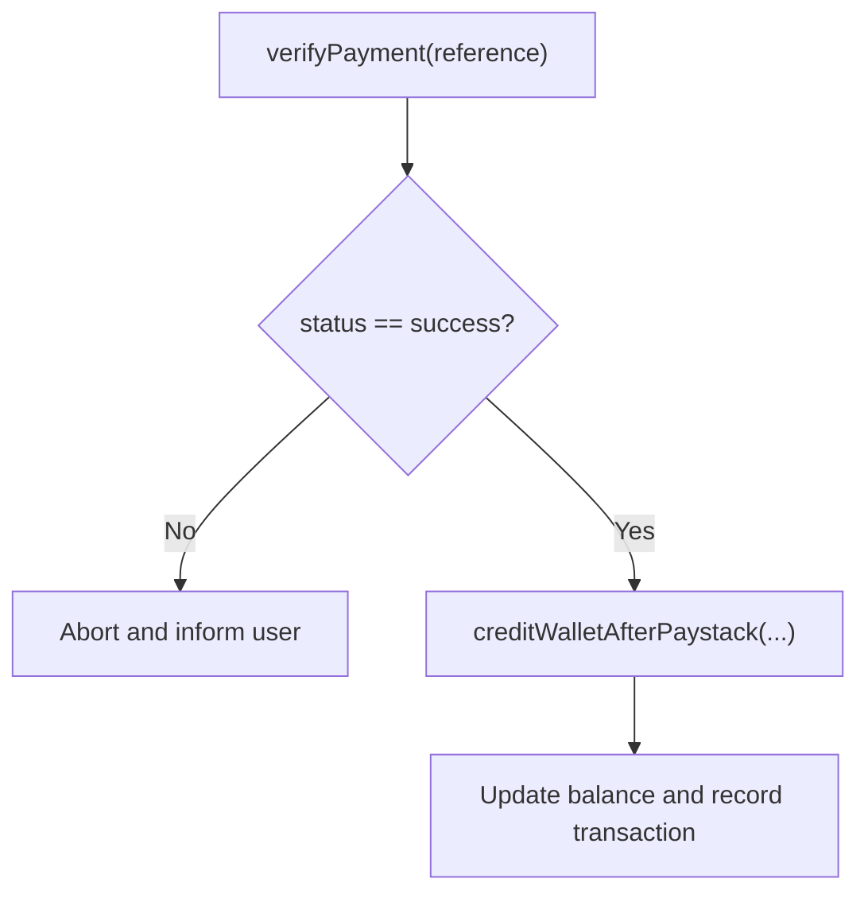
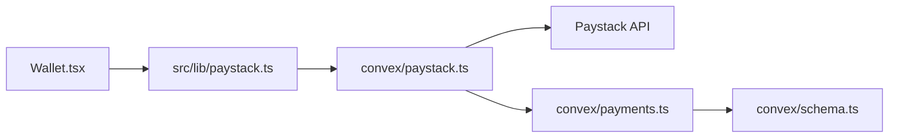

# Payment Initialization

<cite>
**Referenced Files in This Document**
- [paystack-initialize.ts](file://api/paystack-initialize.ts)
- [paystack-verify.ts](file://api/paystack-verify.ts)
- [paystack.ts](file://convex/paystack.ts)
- [paystack.ts](file://src/lib/paystack.ts)
- [Wallet.tsx](file://src/screens/Wallet.tsx)
- [SensitiveActionWrapper.tsx](file://src/components/SensitiveActionWrapper.tsx)
- [payments.ts](file://convex/payments.ts)
- [schema.ts](file://convex/schema.ts)
- [sync-convex-env.mjs](file://scripts/sync-convex-env.mjs)
- [DEVELOPMENT_SETUP.md](file://DEVELOPMENT_SETUP.md)
- [PRODUCTION_DEPLOYMENT.md](file://PRODUCTION_DEPLOYMENT.md)
</cite>

## Table of Contents
1. [Introduction](#introduction)
2. [Project Structure](#project-structure)
3. [Core Components](#core-components)
4. [Architecture Overview](#architecture-overview)
5. [Detailed Component Analysis](#detailed-component-analysis)
6. [Dependency Analysis](#dependency-analysis)
7. [Performance Considerations](#performance-considerations)
8. [Troubleshooting Guide](#troubleshooting-guide)
9. [Conclusion](#conclusion)
10. [Appendices](#appendices)

## Introduction
This document explains the payment initialization system built around Paystack within the Lemonade platform. It covers how the frontend initiates a payment, how the backend validates and forwards requests to Paystack, and how responses are handled. It also documents environment variable management, request validation, error handling, and security considerations. Practical examples illustrate initialization requests, response schemas, and integration patterns with the frontend payment forms.

## Project Structure
The payment initialization spans three layers:
- Frontend integration library and UI: constructs requests, generates references, and redirects to Paystack.
- Convex actions: centralize server-side Paystack calls and enforce environment configuration.
- Legacy Express API handlers: provide direct serverless endpoints for initialization and verification.

**Diagram sources**
- [Wallet.tsx:93-131](file://src/screens/Wallet.tsx#L93-L131)
- [paystack.ts:5-44](file://src/lib/paystack.ts#L5-L44)
- [paystack.ts:5-44](file://convex/paystack.ts#L5-L44)
- [payments.ts:113-172](file://convex/payments.ts#L113-L172)
- [schema.ts:198-223](file://convex/schema.ts#L198-L223)

**Section sources**
- [Wallet.tsx:93-131](file://src/screens/Wallet.tsx#L93-L131)
- [paystack.ts:5-44](file://src/lib/paystack.ts#L5-L44)
- [paystack.ts:5-44](file://convex/paystack.ts#L5-L44)
- [payments.ts:113-172](file://convex/payments.ts#L113-L172)
- [schema.ts:198-223](file://convex/schema.ts#L198-L223)

## Core Components
- Frontend integration library:
  - Validates configuration, normalizes errors, initializes payments via Convex, verifies payments, generates references, and converts currency units.
- Convex actions:
  - Enforce environment configuration, forward requests to Paystack, and return structured responses.
- Wallet UI:
  - Collects user selection, computes amounts, generates references, and redirects to Paystack checkout.
- Backend mutations:
  - Credit wallets and activate premium subscriptions upon successful verification.

**Section sources**
- [paystack.ts:56-84](file://src/lib/paystack.ts#L56-L84)
- [paystack.ts:5-44](file://convex/paystack.ts#L5-L44)
- [Wallet.tsx:93-131](file://src/screens/Wallet.tsx#L93-L131)
- [payments.ts:113-172](file://convex/payments.ts#L113-L172)

## Architecture Overview
The initialization workflow is a coordinated flow across frontend, Convex, and Paystack:

**Diagram sources**
- [Wallet.tsx:93-131](file://src/screens/Wallet.tsx#L93-L131)
- [paystack.ts:56-84](file://src/lib/paystack.ts#L56-L84)
- [paystack.ts:5-44](file://convex/paystack.ts#L5-L44)

## Detailed Component Analysis

### Frontend Integration Library
Responsibilities:
- Validate and normalize configuration and errors.
- Initialize payments via Convex actions.
- Verify payments via Convex actions.
- Generate unique references and convert currency units.

Key behaviors:
- Reference generation uses timestamp and random suffix.
- Currency conversion ensures kobo-to-naira arithmetic.
- Error normalization maps missing keys to a consistent user-facing message.

**Diagram sources**
- [paystack.ts:56-84](file://src/lib/paystack.ts#L56-L84)
- [paystack.ts:89-91](file://src/lib/paystack.ts#L89-L91)
- [paystack.ts:96-105](file://src/lib/paystack.ts#L96-L105)

**Section sources**
- [paystack.ts:56-84](file://src/lib/paystack.ts#L56-L84)
- [paystack.ts:89-91](file://src/lib/paystack.ts#L89-L91)
- [paystack.ts:96-105](file://src/lib/paystack.ts#L96-L105)

### Convex Action: Initialize Payment
Responsibilities:
- Enforce presence of Paystack secret key in environment.
- Forward a POST request to Paystack’s initialization endpoint.
- Return the authorization URL and related data on success.

Important fields:
- Authorization header uses Bearer token from environment.
- Payload includes email, amount (when not using a plan), optional plan, reference, metadata, callback URL, and allowed channels.

**Diagram sources**
- [paystack.ts:5-44](file://convex/paystack.ts#L5-L44)

**Section sources**
- [paystack.ts:5-44](file://convex/paystack.ts#L5-L44)

### Legacy Express API Handlers
Two serverless endpoints mirror the Convex action behavior:
- POST /api/paystack-initialize: validates method and body, authenticates with Paystack, and forwards to Paystack.
- GET /api/paystack-verify: validates method and query, authenticates with Paystack, and returns verification result.

Security and validation:
- Rejects non-POST for initialization and non-GET for verification.
- Requires secret key in environment.
- Returns Paystack’s error messages when present.

**Section sources**
- [paystack-initialize.ts:5-46](file://api/paystack-initialize.ts#L5-L46)
- [paystack-verify.ts:5-35](file://api/paystack-verify.ts#L5-L35)

### Wallet UI Integration
Responsibilities:
- Capture user selection and compute price.
- Generate a reference and metadata.
- Invoke the integration library to initialize payment.
- Redirect the user to Paystack’s authorization URL.

**Diagram sources**
- [Wallet.tsx:93-131](file://src/screens/Wallet.tsx#L93-L131)
- [paystack.ts:56-84](file://src/lib/paystack.ts#L56-L84)
- [paystack.ts:5-44](file://convex/paystack.ts#L5-L44)

**Section sources**
- [Wallet.tsx:93-131](file://src/screens/Wallet.tsx#L93-L131)

### Backend Mutations: Credit Wallet and Activate Premium
After successful verification, the system credits the user’s wallet or activates premium:
- creditWalletAfterPaystack: validates amounts, prevents duplicates, updates user balance, and records a transaction.
- activatePremiumAfterPaystack: validates amounts, resolves user identity, updates premium status and renewal dates, and records a transaction.

**Diagram sources**
- [Wallet.tsx:49-91](file://src/screens/Wallet.tsx#L49-L91)
- [payments.ts:113-172](file://convex/payments.ts#L113-L172)

**Section sources**
- [Wallet.tsx:49-91](file://src/screens/Wallet.tsx#L49-L91)
- [payments.ts:113-172](file://convex/payments.ts#L113-L172)

## Dependency Analysis
- Frontend depends on the integration library for configuration, initialization, and verification.
- Integration library depends on Convex actions for server-side Paystack calls.
- Convex actions depend on Paystack APIs and environment variables.
- Backend mutations depend on the schema for transaction records and user state.

**Diagram sources**
- [Wallet.tsx:93-131](file://src/screens/Wallet.tsx#L93-L131)
- [paystack.ts:56-84](file://src/lib/paystack.ts#L56-L84)
- [paystack.ts:5-44](file://convex/paystack.ts#L5-L44)
- [payments.ts:113-172](file://convex/payments.ts#L113-L172)
- [schema.ts:198-223](file://convex/schema.ts#L198-L223)

**Section sources**
- [Wallet.tsx:93-131](file://src/screens/Wallet.tsx#L93-L131)
- [paystack.ts:56-84](file://src/lib/paystack.ts#L56-L84)
- [paystack.ts:5-44](file://convex/paystack.ts#L5-L44)
- [payments.ts:113-172](file://convex/payments.ts#L113-L172)
- [schema.ts:198-223](file://convex/schema.ts#L198-L223)

## Performance Considerations
- Minimize network round-trips: initialize and verify are separate steps to keep UI responsive.
- Avoid redundant calls: the UI checks for a reference in URL params before attempting verification.
- Keep payload minimal: only required fields are sent to Paystack.
- Cache-safe behavior: references are unique per transaction to prevent accidental reuse.

[No sources needed since this section provides general guidance]

## Troubleshooting Guide
Common issues and resolutions:
- Missing Paystack secret key:
  - Convex action throws an error if the key is not set.
  - Frontend maps missing keys to a consistent user-facing message.
- Invalid request parameters:
  - Express endpoints reject non-POST for initialization and non-GET for verification.
  - Missing email or amount/plan triggers a 400 error.
- Paystack API failures:
  - Non-OK responses return Paystack’s message or a generic failure message.
- Environment synchronization:
  - Use the provided script to sync environment variables to Convex.

**Section sources**
- [paystack.ts:15-18](file://convex/paystack.ts#L15-L18)
- [paystack.ts:40-42](file://convex/paystack.ts#L40-L42)
- [paystack.ts:40-51](file://src/lib/paystack.ts#L40-L51)
- [paystack-initialize.ts:6-19](file://api/paystack-initialize.ts#L6-L19)
- [paystack-verify.ts:6-19](file://api/paystack-verify.ts#L6-L19)
- [sync-convex-env.mjs:1-18](file://scripts/sync-convex-env.mjs#L1-L18)

## Conclusion
The payment initialization system integrates the frontend, Convex, and Paystack to provide a secure and reliable checkout experience. It enforces environment configuration, validates requests, and handles responses gracefully. The separation of concerns across layers simplifies maintenance and improves reliability.

[No sources needed since this section summarizes without analyzing specific files]

## Appendices

### API Endpoint Definitions
- POST /api/paystack-initialize
  - Method: POST
  - Headers: Content-Type: application/json
  - Body fields: email, amount, reference, metadata, callbackUrl, plan
  - Response: On success, returns Paystack’s initialization payload; on failure, returns an error object with a message field.

- GET /api/paystack-verify
  - Method: GET
  - Query: reference
  - Response: On success, returns Paystack’s verification payload; on failure, returns an error object with a message field.

**Section sources**
- [paystack-initialize.ts:21-46](file://api/paystack-initialize.ts#L21-L46)
- [paystack-verify.ts:21-35](file://api/paystack-verify.ts#L21-L35)

### Request Validation Rules
- Initialization:
  - Required: email and either amount or plan.
  - Optional: reference, metadata, callbackUrl.
- Verification:
  - Required: reference query parameter.

**Section sources**
- [paystack-initialize.ts:16-19](file://api/paystack-initialize.ts#L16-L19)
- [paystack-verify.ts:16-19](file://api/paystack-verify.ts#L16-L19)

### Environment Variables
- Frontend:
  - VITE_PAYSTACK_PUBLIC_KEY: Used by the frontend integration library to configure Paystack.
- Backend:
  - PAYSTACK_SECRET_KEY: Required by Convex actions and legacy API handlers to authenticate with Paystack.
  - Optional: VITE_PAYSTACK_SECRET_KEY (legacy fallback in Express handler).

**Section sources**
- [paystack.ts:24-32](file://src/lib/paystack.ts#L24-L32)
- [paystack.ts:15-18](file://convex/paystack.ts#L15-L18)
- [paystack-initialize.ts:3](file://api/paystack-initialize.ts#L3)
- [DEVELOPMENT_SETUP.md:64-66](file://DEVELOPMENT_SETUP.md#L64-L66)
- [PRODUCTION_DEPLOYMENT.md:10-12](file://PRODUCTION_DEPLOYMENT.md#L10-L12)

### Security Considerations
- Environment variable management:
  - Store PAYSTACK_SECRET_KEY securely and avoid exposing it in client code.
  - Use encrypted environment variables in production.
- Request validation:
  - Validate required fields before forwarding to Paystack.
- Response sanitization:
  - Return only necessary fields to clients; avoid leaking internal errors.
- Authentication:
  - Use Bearer tokens with Paystack secret keys for all server-side calls.

**Section sources**
- [paystack.ts:15-18](file://convex/paystack.ts#L15-L18)
- [paystack-initialize.ts:23-26](file://api/paystack-initialize.ts#L23-L26)
- [paystack-verify.ts:22-24](file://api/paystack-verify.ts#L22-L24)
- [PRODUCTION_DEPLOYMENT.md:47-50](file://PRODUCTION_DEPLOYMENT.md#L47-L50)

### Integration Patterns with Frontend Forms
- Amount calculation:
  - Convert Naira to kobo using the provided utility before sending to Paystack.
- Reference generation:
  - Generate a unique reference per transaction to prevent duplication.
- Metadata attachment:
  - Attach user identifiers and product details to support post-payment processing.
- Callback URL:
  - Provide a safe redirect URL for Paystack to return users after payment.

**Section sources**
- [Wallet.tsx:108-126](file://src/screens/Wallet.tsx#L108-L126)
- [paystack.ts:89-91](file://src/lib/paystack.ts#L89-L91)
- [paystack.ts:96-105](file://src/lib/paystack.ts#L96-L105)