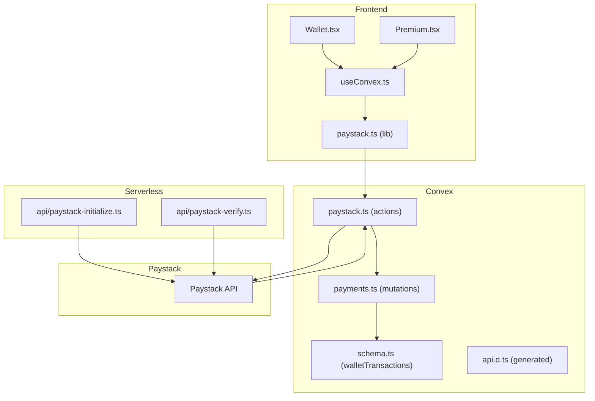
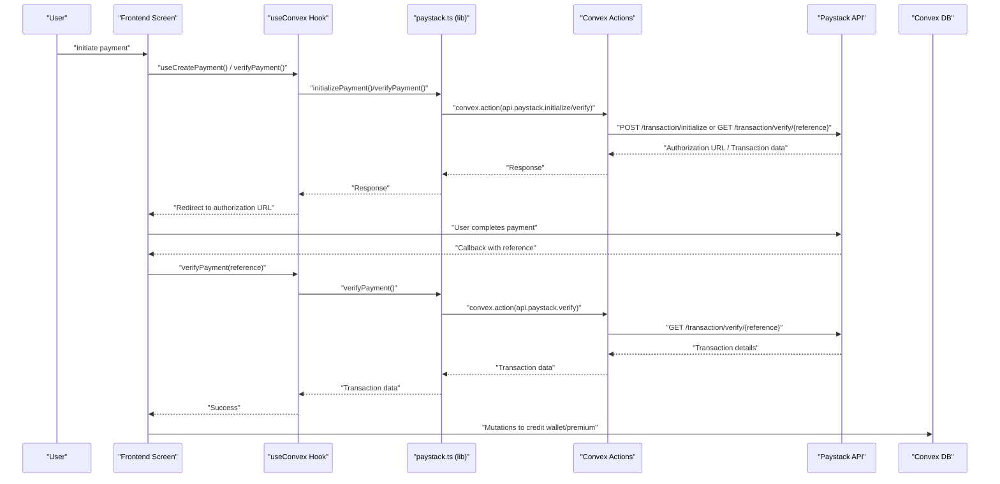
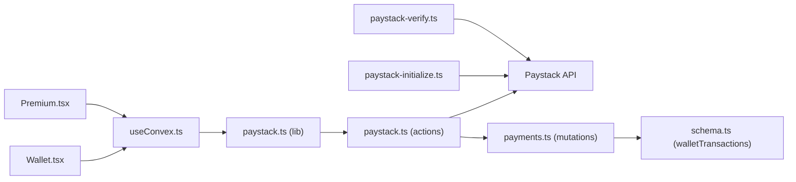

# Payment Processing

<cite>
**Referenced Files in This Document**
- [paystack-initialize.ts](file://api/paystack-initialize.ts)
- [paystack-verify.ts](file://api/paystack-verify.ts)
- [paystack.ts](file://convex/paystack.ts)
- [payments.ts](file://convex/payments.ts)
- [paystack.ts](file://src/lib/paystack.ts)
- [Wallet.tsx](file://src/screens/Wallet.tsx)
- [Premium.tsx](file://src/screens/Premium.tsx)
- [useConvex.ts](file://src/hooks/useConvex.ts)
- [schema.ts](file://convex/schema.ts)
- [api.d.ts](file://convex/_generated/api.d.ts)
- [integrations.ts](file://src/lib/integrations.ts)
- [PRODUCTION_DEPLOYMENT.md](file://PRODUCTION_DEPLOYMENT.md)
- [package.json](file://package.json)
</cite>

## Table of Contents
1. [Introduction](#introduction)
2. [Project Structure](#project-structure)
3. [Core Components](#core-components)
4. [Architecture Overview](#architecture-overview)
5. [Detailed Component Analysis](#detailed-component-analysis)
6. [Dependency Analysis](#dependency-analysis)
7. [Performance Considerations](#performance-considerations)
8. [Security Measures](#security-measures)
9. [Failure Scenarios and Retry Mechanisms](#failure-scenarios-and-retry-mechanisms)
10. [Webhook Handling and Reconciliation](#webhook-handling-and-reconciliation)
11. [Serverless API Endpoints](#serverless-api-endpoints)
12. [Troubleshooting Guide](#troubleshooting-guide)
13. [Conclusion](#conclusion)

## Introduction
This document explains the complete payment processing flow in the Lemonade project, from initialization to completion. It covers the Paystack integration architecture, API endpoints, webhook handling, payment verification, and reconciliation processes. It also documents the frontend-to-backend integration, serverless endpoints, and security measures such as signature verification, rate limiting, and fraud detection.

## Project Structure
The payment system spans three layers:
- Frontend screens and hooks orchestrate user actions and payment initiation/verification.
- Convex Actions call Paystack APIs and persist transaction records.
- Serverless API handlers provide legacy endpoints for initialization and verification.

**Diagram sources**
- [Wallet.tsx:1-452](file://src/screens/Wallet.tsx#L1-452)
- [Premium.tsx:1-360](file://src/screens/Premium.tsx#L1-360)
- [useConvex.ts:1-213](file://src/hooks/useConvex.ts#L1-213)
- [paystack.ts:1-115](file://src/lib/paystack.ts#L1-115)
- [paystack.ts:1-71](file://convex/paystack.ts#L1-71)
- [payments.ts:1-291](file://convex/payments.ts#L1-291)
- [schema.ts:198-223](file://convex/schema.ts#L198-223)
- [api.d.ts:1-78](file://convex/_generated/api.d.ts#L1-78)
- [paystack-initialize.ts:1-47](file://api/paystack-initialize.ts#L1-47)
- [paystack-verify.ts:1-36](file://api/paystack-verify.ts#L1-36)

**Section sources**
- [Wallet.tsx:1-452](file://src/screens/Wallet.tsx#L1-452)
- [Premium.tsx:1-360](file://src/screens/Premium.tsx#L1-360)
- [useConvex.ts:1-213](file://src/hooks/useConvex.ts#L1-213)
- [paystack.ts:1-115](file://src/lib/paystack.ts#L1-115)
- [paystack.ts:1-71](file://convex/paystack.ts#L1-71)
- [payments.ts:1-291](file://convex/payments.ts#L1-291)
- [schema.ts:198-223](file://convex/schema.ts#L198-223)
- [api.d.ts:1-78](file://convex/_generated/api.d.ts#L1-78)
- [paystack-initialize.ts:1-47](file://api/paystack-initialize.ts#L1-47)
- [paystack-verify.ts:1-36](file://api/paystack-verify.ts#L1-36)

## Core Components
- Paystack client library: Provides initialization, verification, reference generation, and currency conversion helpers.
- Convex Actions: Call Paystack APIs and return structured responses to the client.
- Convex Mutations: Persist wallet transactions and update user premium status.
- Serverless endpoints: Legacy endpoints for initialization and verification via serverless functions.
- Frontend screens: Wallet top-ups and Premium subscriptions orchestrate the payment lifecycle.

**Section sources**
- [paystack.ts:1-115](file://src/lib/paystack.ts#L1-115)
- [paystack.ts:1-71](file://convex/paystack.ts#L1-71)
- [payments.ts:113-172](file://convex/payments.ts#L113-172)
- [paystack-initialize.ts:1-47](file://api/paystack-initialize.ts#L1-47)
- [paystack-verify.ts:1-36](file://api/paystack-verify.ts#L1-36)
- [Wallet.tsx:1-452](file://src/screens/Wallet.tsx#L1-452)
- [Premium.tsx:1-360](file://src/screens/Premium.tsx#L1-360)

## Architecture Overview
The payment flow integrates frontend, Convex, and Paystack:
- Frontend initiates payment via Convex Actions.
- Convex forwards requests to Paystack and receives authorization URLs.
- Users complete payment in Paystack’s hosted checkout.
- After payment, Paystack redirects to the callback URL with a reference.
- Frontend verifies the transaction via Convex Actions.
- Convex mutations update user balances or premium status and persist transaction records.

**Diagram sources**
- [useConvex.ts:65-109](file://src/hooks/useConvex.ts#L65-109)
- [paystack.ts:56-84](file://src/lib/paystack.ts#L56-84)
- [paystack.ts:5-44](file://convex/paystack.ts#L5-44)
- [paystack.ts:46-70](file://convex/paystack.ts#L46-70)
- [Wallet.tsx:49-91](file://src/screens/Wallet.tsx#L49-91)
- [Premium.tsx:27-101](file://src/screens/Premium.tsx#L27-101)
- [payments.ts:113-172](file://convex/payments.ts#L113-172)
- [payments.ts:174-262](file://convex/payments.ts#L174-262)

## Detailed Component Analysis

### Paystack Client Library (src/lib/paystack.ts)
Responsibilities:
- Define request/response interfaces for initialization and verification.
- Provide helpers for reference generation, currency conversion (Naira to Kobo and vice versa).
- Wrap Convex Actions for initialization and verification.
- Normalize errors for consistent client handling.

Key behaviors:
- Generates unique references prefixed with the project identifier.
- Converts amounts to kobo for Paystack (1 Naira = 100 kobo).
- Calls Convex Actions to avoid exposing server secrets in the browser.

**Section sources**
- [paystack.ts:6-22](file://src/lib/paystack.ts#L6-22)
- [paystack.ts:56-84](file://src/lib/paystack.ts#L56-84)
- [paystack.ts:89-105](file://src/lib/paystack.ts#L89-105)

### Convex Actions (convex/paystack.ts)
Responsibilities:
- Initialize Paystack transactions with email, amount/reference, optional plan, metadata, and callback URL.
- Verify Paystack transactions by reference.
- Enforce environment variable presence for Paystack secret key.

Behavior:
- Uses Paystack’s official endpoints.
- Returns structured data to the client (authorization URL, access code, reference).

**Section sources**
- [paystack.ts:5-44](file://convex/paystack.ts#L5-44)
- [paystack.ts:46-70](file://convex/paystack.ts#L46-70)

### Wallet Top-Up Flow (src/screens/Wallet.tsx)
Responsibilities:
- Collect user selection (packages/custom amount).
- Generate a reference and call the payment initialization.
- Redirect to Paystack authorization URL.
- On callback, verify the transaction and credit the wallet.

Flow highlights:
- Validates user session and amount range.
- Reads reference from URL query params.
- Verifies transaction status and credits coins accordingly.

**Section sources**
- [Wallet.tsx:21-42](file://src/screens/Wallet.tsx#L21-42)
- [Wallet.tsx:93-131](file://src/screens/Wallet.tsx#L93-131)
- [Wallet.tsx:49-91](file://src/screens/Wallet.tsx#L49-91)

### Premium Subscription Flow (src/screens/Premium.tsx)
Responsibilities:
- Allow users to choose plan type (Premium/Patron) and billing cycle (Monthly/Yearly).
- Generate a reference and initialize a Paystack plan-based transaction.
- On callback, verify the transaction and activate premium membership.

Flow highlights:
- Determines plan codes from environment variables.
- Parses metadata to extract plan type and billing cycle.
- Updates local user state and persists transaction via mutation.

**Section sources**
- [Premium.tsx:130-163](file://src/screens/Premium.tsx#L130-163)
- [Premium.tsx:27-101](file://src/screens/Premium.tsx#L27-101)

### Frontend Hooks (src/hooks/useConvex.ts)
Responsibilities:
- Provide a typed interface to create payments and verify them.
- Resolve plan codes from environment variables for recurring plans.
- Generate references and construct metadata payloads.

**Section sources**
- [useConvex.ts:65-109](file://src/hooks/useConvex.ts#L65-109)
- [useConvex.ts:15-22](file://src/hooks/useConvex.ts#L15-22)

### Backend Mutations (convex/payments.ts)
Responsibilities:
- Credit wallet after successful Paystack top-up.
- Activate premium membership after successful Paystack plan payment.
- Cancel premium subscriptions.
- Record all transactions in the walletTransactions table.

Key logic:
- Deduplicate by reference to prevent double crediting.
- Update user premium fields and renewal dates.
- Persist transaction metadata for audit and reconciliation.

**Section sources**
- [payments.ts:113-172](file://convex/payments.ts#L113-172)
- [payments.ts:174-262](file://convex/payments.ts#L174-262)
- [payments.ts:265-291](file://convex/payments.ts#L265-291)

### Data Model (convex/schema.ts)
Responsibilities:
- Define the walletTransactions table with fields for type, amount, currency, status, reference, provider, providerPayload, and metadata.
- Indexes enable efficient lookups by user and reference.

**Section sources**
- [schema.ts:198-223](file://convex/schema.ts#L198-223)

### Legacy Serverless Endpoints (api/)
Responsibilities:
- Provide serverless endpoints for initialization and verification.
- Enforce HTTP method constraints and validate inputs.
- Forward requests to Paystack and return standardized responses.

Notes:
- These endpoints rely on environment variables for Paystack secret keys.
- Prefer Convex Actions for new integrations to centralize secrets and improve observability.

**Section sources**
- [paystack-initialize.ts:5-46](file://api/paystack-initialize.ts#L5-46)
- [paystack-verify.ts:5-35](file://api/paystack-verify.ts#L5-35)

## Dependency Analysis
- Frontend depends on Convex Actions via the generated API module.
- Convex Actions depend on Paystack APIs and environment variables.
- Mutations depend on the schema-defined tables and indexes.
- Serverless endpoints depend on environment variables and forward to Paystack.

**Diagram sources**
- [paystack.ts:34-35](file://src/lib/paystack.ts#L34-35)
- [api.d.ts:59-62](file://convex/_generated/api.d.ts#L59-62)
- [paystack.ts:1-71](file://convex/paystack.ts#L1-71)
- [payments.ts:1-291](file://convex/payments.ts#L1-291)
- [schema.ts:198-223](file://convex/schema.ts#L198-223)
- [Wallet.tsx:16-19](file://src/screens/Wallet.tsx#L16-19)
- [Premium.tsx:9-11](file://src/screens/Premium.tsx#L9-11)
- [useConvex.ts:3-6](file://src/hooks/useConvex.ts#L3-6)
- [paystack-initialize.ts:1-47](file://api/paystack-initialize.ts#L1-47)
- [paystack-verify.ts:1-36](file://api/paystack-verify.ts#L1-36)

**Section sources**
- [api.d.ts:1-78](file://convex/_generated/api.d.ts#L1-78)
- [paystack.ts:34-35](file://src/lib/paystack.ts#L34-35)
- [paystack.ts:1-71](file://convex/paystack.ts#L1-71)
- [payments.ts:1-291](file://convex/payments.ts#L1-291)
- [schema.ts:198-223](file://convex/schema.ts#L198-223)
- [Wallet.tsx:16-19](file://src/screens/Wallet.tsx#L16-19)
- [Premium.tsx:9-11](file://src/screens/Premium.tsx#L9-11)
- [useConvex.ts:3-6](file://src/hooks/useConvex.ts#L3-6)
- [paystack-initialize.ts:1-47](file://api/paystack-initialize.ts#L1-47)
- [paystack-verify.ts:1-36](file://api/paystack-verify.ts#L1-36)

## Performance Considerations
- Minimize redundant verifications: Use references to deduplicate checks.
- Batch UI updates: Debounce status messages and avoid frequent re-renders during verification.
- Optimize database queries: Leverage indexes on walletTransactions by reference and user ID.
- Reduce network hops: Prefer Convex Actions over serverless endpoints when possible for centralized caching and logging.

## Security Measures
- Secret management:
  - Store Paystack secret keys in encrypted environment variables in production.
  - Avoid exposing secret keys in client code; use Convex Actions to proxy requests.
- Signature verification:
  - For webhooks, verify Paystack signatures using the shared secret before processing events.
- Rate limiting:
  - Implement per-user or per-IP rate limiting on payment initiation endpoints.
- Fraud detection:
  - Track suspicious transactions in the fraudEvents table and flag high-risk users.
  - Monitor transaction amounts, currencies, and user behavior anomalies.

[No sources needed since this section provides general guidance]

## Failure Scenarios and Retry Mechanisms
Common failure modes:
- Invalid or missing inputs (email, amount, reference).
- Paystack API errors or timeouts.
- Duplicate references causing double crediting.
- User cancels payment or fails to complete checkout.

Recommended retries:
- Idempotent initialization: Regenerate reference and retry initialization if needed.
- Verification backoff: Poll verification with exponential backoff until success or timeout.
- Deduplication: Check existing transactions by reference before crediting.

**Section sources**
- [paystack-initialize.ts:16-19](file://api/paystack-initialize.ts#L16-19)
- [paystack-verify.ts:16-19](file://api/paystack-verify.ts#L16-19)
- [payments.ts:132-139](file://convex/payments.ts#L132-139)

## Webhook Handling and Reconciliation
- Webhook endpoint: Configure Paystack to send events to the serverless webhook URL.
- Signature verification: Use the Paystack secret key to verify webhook authenticity.
- Event processing: Update transaction statuses, credit wallets, and manage premium renewals.
- Reconciliation: Periodically reconcile Paystack-reported transactions against stored references to detect discrepancies.

Deployment guidance:
- Add the webhook URL to Paystack dashboard and configure event types.
- Encrypt sensitive environment variables and restrict access to webhook handlers.

**Section sources**
- [PRODUCTION_DEPLOYMENT.md:47-50](file://PRODUCTION_DEPLOYMENT.md#L47-L50)
- [PRODUCTION_DEPLOYMENT.md:140-144](file://PRODUCTION_DEPLOYMENT.md#L140-L144)

## Serverless API Endpoints
- POST /api/paystack-initialize
  - Purpose: Initialize a Paystack transaction.
  - Required headers: Authorization Bearer with Paystack secret key.
  - Request body: email, amount (kobo), reference, metadata, callback_url, plan (optional).
  - Response: Paystack initialization payload including authorization_url.
  - Error handling: Validates method, secret key, and required fields.

- GET /api/paystack-verify?reference=...
  - Purpose: Verify a Paystack transaction by reference.
  - Required headers: Authorization Bearer with Paystack secret key.
  - Query param: reference (required).
  - Response: Paystack verification payload.
  - Error handling: Validates method, secret key, and reference.

Authentication:
- Both endpoints require a valid Paystack secret key in environment variables.

**Section sources**
- [paystack-initialize.ts:5-46](file://api/paystack-initialize.ts#L5-46)
- [paystack-verify.ts:5-35](file://api/paystack-verify.ts#L5-35)

## Troubleshooting Guide
- Missing Paystack keys:
  - Symptom: 500 errors indicating secret key not configured.
  - Resolution: Set PAYSTACK_SECRET_KEY in environment variables.

- Missing public key:
  - Symptom: Client throws error about missing Paystack public key.
  - Resolution: Set VITE_PAYSTACK_PUBLIC_KEY in frontend environment.

- Invalid inputs:
  - Symptom: 400 errors for missing email or invalid amount/plan combination.
  - Resolution: Ensure proper validation and currency conversion.

- Duplicate references:
  - Symptom: Wallet not credited or premium not activated.
  - Resolution: Check existing transactions by reference and avoid duplicates.

- Webhook signature verification failures:
  - Symptom: Webhooks ignored or rejected.
  - Resolution: Verify Paystack signature using the shared secret.

**Section sources**
- [paystack-initialize.ts:11-14](file://api/paystack-initialize.ts#L11-14)
- [paystack.ts:24-32](file://src/lib/paystack.ts#L24-32)
- [paystack.ts:40-51](file://src/lib/paystack.ts#L40-51)
- [payments.ts:132-139](file://convex/payments.ts#L132-139)
- [PRODUCTION_DEPLOYMENT.md:47-50](file://PRODUCTION_DEPLOYMENT.md#L47-L50)

## Conclusion
The Lemonade payment system integrates Paystack securely through Convex Actions and frontend hooks. It supports wallet top-ups and premium subscriptions with robust verification, deduplication, and transaction persistence. For production, ensure encrypted secrets, webhook signature verification, rate limiting, and fraud monitoring. Prefer Convex Actions over serverless endpoints for improved security and observability.