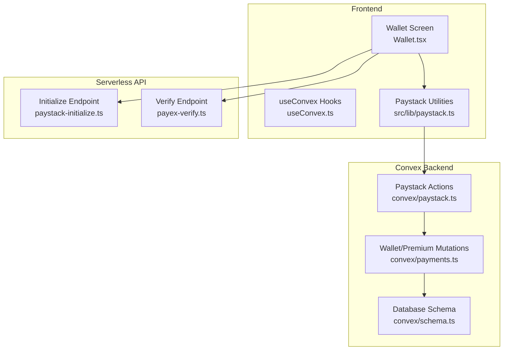
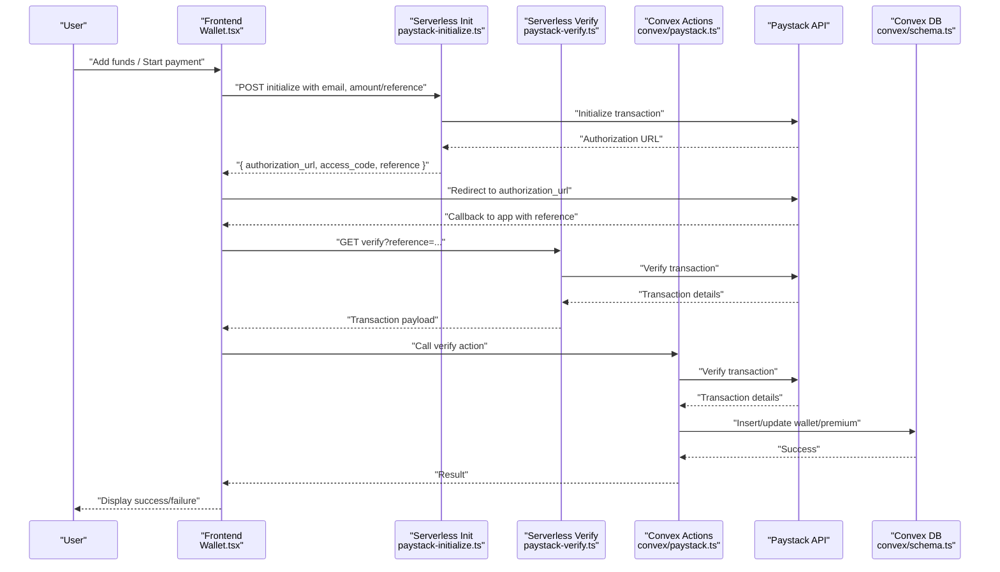
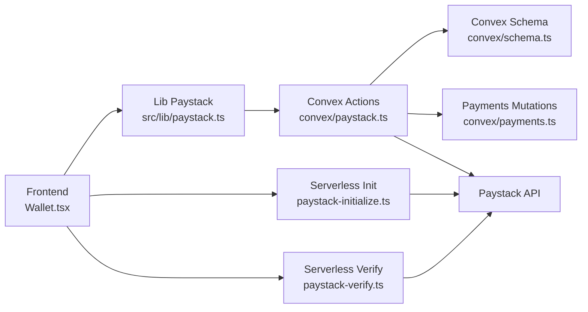

# Payment Verification

<cite>
**Referenced Files in This Document**
- [paystack-verify.ts](file://api/paystack-verify.ts)
- [paystack-initialize.ts](file://api/paystack-initialize.ts)
- [paystack.ts](file://convex/paystack.ts)
- [paystack.ts](file://src/lib/paystack.ts)
- [payments.ts](file://convex/payments.ts)
- [schema.ts](file://convex/schema.ts)
- [Wallet.tsx](file://src/screens/Wallet.tsx)
- [useConvex.ts](file://src/hooks/useConvex.ts)
- [vercel.ts](file://src/lib/vercel.ts)
- [PRODUCTION_DEPLOYMENT.md](file://PRODUCTION_DEPLOYMENT.md)
</cite>

## Table of Contents
1. [Introduction](#introduction)
2. [Project Structure](#project-structure)
3. [Core Components](#core-components)
4. [Architecture Overview](#architecture-overview)
5. [Detailed Component Analysis](#detailed-component-analysis)
6. [Dependency Analysis](#dependency-analysis)
7. [Performance Considerations](#performance-considerations)
8. [Troubleshooting Guide](#troubleshooting-guide)
9. [Conclusion](#conclusion)

## Introduction
This document explains the payment verification system in Lemonade, focusing on transaction verification, webhook callback handling, transaction status checking, and payment confirmation workflows. It documents the serverless verification endpoint implementation, request validation, signature verification, and Paystack API integration. It also covers the verification workflow from Paystack webhook notifications to database updates, including transaction ID matching, amount verification, and status tracking. Security measures such as webhook signature validation, IP address filtering, and request replay protection are addressed. Finally, it describes the integration between verification callbacks, Convex database updates, and frontend notification systems, with examples of webhook payloads, verification responses, and error scenarios.

## Project Structure
The payment verification system spans three layers:
- Frontend: Initiates payment and verifies transactions after redirect.
- Serverless API: Provides a GET endpoint to verify Paystack transactions.
- Convex backend: Integrates with Paystack APIs and updates the database.

**Diagram sources**
- [Wallet.tsx](file://src/screens/Wallet.tsx)
- [useConvex.ts](file://src/hooks/useConvex.ts)
- [paystack.ts](file://src/lib/paystack.ts)
- [paystack-initialize.ts](file://api/paystack-initialize.ts)
- [paystack-verify.ts](file://api/paystack-verify.ts)
- [paystack.ts](file://convex/paystack.ts)
- [payments.ts](file://convex/payments.ts)
- [schema.ts](file://convex/schema.ts)

**Section sources**
- [Wallet.tsx](file://src/screens/Wallet.tsx)
- [paystack.ts](file://src/lib/paystack.ts)
- [paystack-initialize.ts](file://api/paystack-initialize.ts)
- [paystack-verify.ts](file://api/paystack-verify.ts)
- [paystack.ts](file://convex/paystack.ts)
- [payments.ts](file://convex/payments.ts)
- [schema.ts](file://convex/schema.ts)

## Core Components
- Frontend payment initiation and verification:
  - Generates a unique reference, initializes a Paystack transaction, and redirects the user to Paystack for payment.
  - After redirection, verifies the transaction using a Convex action and updates the user’s wallet or premium status accordingly.
- Serverless verification endpoint:
  - A GET endpoint that validates the presence of a reference, authenticates with Paystack using a secret key, and returns the transaction details.
- Convex actions and mutations:
  - Paystack initialization and verification actions integrate with Paystack APIs.
  - Mutations update the database with verified transaction details, ensuring idempotency and correctness.

Key responsibilities:
- Request validation and error handling
- Paystack API integration
- Database updates and idempotency checks
- Frontend notifications and user feedback

**Section sources**
- [Wallet.tsx](file://src/screens/Wallet.tsx)
- [paystack.ts](file://src/lib/paystack.ts)
- [paystack-initialize.ts](file://api/paystack-initialize.ts)
- [paystack-verify.ts](file://api/paystack-verify.ts)
- [paystack.ts](file://convex/paystack.ts)
- [payments.ts](file://convex/payments.ts)

## Architecture Overview
The payment verification workflow connects the frontend, serverless API, and Convex backend to ensure secure and reliable transaction confirmation.

**Diagram sources**
- [paystack-initialize.ts](file://api/paystack-initialize.ts)
- [paystack-verify.ts](file://api/paystack-verify.ts)
- [paystack.ts](file://convex/paystack.ts)
- [payments.ts](file://convex/payments.ts)
- [schema.ts](file://convex/schema.ts)
- [Wallet.tsx](file://src/screens/Wallet.tsx)

## Detailed Component Analysis

### Serverless Verification Endpoint
The serverless verification endpoint validates requests, authenticates with Paystack, and returns transaction details.

Implementation highlights:
- Validates HTTP method and presence of reference query parameter.
- Retrieves the Paystack secret key from environment variables.
- Calls Paystack verify API with Authorization header.
- Returns JSON payload on success or error on failure.

Security considerations:
- Enforce GET method only.
- Validate presence of reference.
- Use server-side secret key for Authorization header.

Operational notes:
- Suitable for lightweight verification flows; prefer Convex actions for production-grade idempotent updates.

**Section sources**
- [paystack-verify.ts](file://api/paystack-verify.ts)

### Convex Paystack Actions
Convex actions encapsulate Paystack initialization and verification, centralizing API integration and error handling.

Key behaviors:
- Initialization action posts to Paystack initialize endpoint with email, amount/reference, optional plan, and callback URL.
- Verification action fetches transaction details from Paystack verify endpoint using the reference.
- Both actions validate the presence of the Paystack secret key and propagate errors appropriately.

Idempotency and safety:
- Prefer Convex actions for database updates to leverage idempotency and transaction semantics.

**Section sources**
- [paystack.ts](file://convex/paystack.ts)

### Frontend Payment Flow and Verification
The frontend initiates payments and verifies transactions post-redirect.

Flow:
- Generates a unique reference and initializes payment via Convex action.
- Redirects the user to Paystack authorization URL.
- On callback, verifies the transaction using a Convex action.
- Updates the user’s wallet or premium status based on the transaction payload.

User feedback:
- Displays loading states and messages during verification.
- Adds coins to the wallet upon successful verification.

**Section sources**
- [Wallet.tsx](file://src/screens/Wallet.tsx)
- [paystack.ts](file://src/lib/paystack.ts)
- [useConvex.ts](file://src/hooks/useConvex.ts)

### Database Updates and Idempotency
Convex mutations update the database with verified transaction details, ensuring idempotency and correctness.

Wallet top-up:
- Checks for existing transaction by reference to avoid duplicates.
- Credits coins to the user’s wallet and records a wallet transaction.
- Stores provider payload and metadata for auditability.

Premium activation:
- Resolves user by Firebase UID or user ID.
- Handles renewal logic and duplicate detection for premium subscriptions.
- Records premium transaction with metadata.

Schema references:
- walletTransactions table stores transaction records with indexes for efficient lookups.

**Section sources**
- [payments.ts](file://convex/payments.ts)
- [schema.ts](file://convex/schema.ts)

### Webhook Callback Handling and Security
The system supports Paystack webhooks for asynchronous transaction notifications. Security measures and integration points are documented below.

Security measures:
- Signature verification: Use Paystack secret key to verify webhook signatures server-side.
- IP address filtering: Restrict webhook endpoints to trusted IP ranges.
- Request replay protection: Implement idempotency keys and deduplicate events.

Integration points:
- Webhook URL: Configure Paystack webhook to deliver events to the serverless endpoint.
- Convex mutation: Process webhook events and update user premium status or wallet balances.

Deployment guidance:
- Configure Paystack webhook URL and enable relevant events.
- Ensure server-side secret keys are encrypted and environment variables are properly set.

**Section sources**
- [PRODUCTION_DEPLOYMENT.md](file://PRODUCTION_DEPLOYMENT.md)

## Dependency Analysis
The payment verification system exhibits layered dependencies:

**Diagram sources**
- [Wallet.tsx](file://src/screens/Wallet.tsx)
- [paystack.ts](file://src/lib/paystack.ts)
- [paystack-initialize.ts](file://api/paystack-initialize.ts)
- [paystack-verify.ts](file://api/paystack-verify.ts)
- [paystack.ts](file://convex/paystack.ts)
- [payments.ts](file://convex/payments.ts)
- [schema.ts](file://convex/schema.ts)

**Section sources**
- [Wallet.tsx](file://src/screens/Wallet.tsx)
- [paystack.ts](file://src/lib/paystack.ts)
- [paystack-initialize.ts](file://api/paystack-initialize.ts)
- [paystack-verify.ts](file://api/paystack-verify.ts)
- [paystack.ts](file://convex/paystack.ts)
- [payments.ts](file://convex/payments.ts)
- [schema.ts](file://convex/schema.ts)

## Performance Considerations
- Minimize round trips: Use Convex actions for end-to-end verification to reduce latency and ensure atomicity.
- Optimize database queries: Leverage indexes on reference and user ID for fast lookups.
- Avoid redundant verifications: Frontend should only trigger verification after a successful redirect.
- Network resilience: Implement retry logic and timeouts for Paystack API calls.

## Troubleshooting Guide
Common issues and resolutions:
- Missing Paystack secret key:
  - Symptom: Server returns 500 with configuration error.
  - Resolution: Set PAYSTACK_SECRET_KEY in environment variables.
- Invalid reference:
  - Symptom: Server returns 400 with “Payment reference is required.”
  - Resolution: Ensure reference is present in query parameters.
- Non-allowed HTTP method:
  - Symptom: Server returns 405 with “Method not allowed.”
  - Resolution: Use GET for verification endpoint; use POST for initialization.
- Paystack API errors:
  - Symptom: Transaction verification fails with error message.
  - Resolution: Inspect returned message and validate transaction reference.
- Duplicate transactions:
  - Symptom: Wallet not credited or premium status unchanged.
  - Resolution: Database mutations check for existing reference and return idempotent results.
- Frontend verification failures:
  - Symptom: User sees “Unable to verify payment.”
  - Resolution: Check console logs and ensure Convex action is reachable and environment variables are configured.

**Section sources**
- [paystack-verify.ts](file://api/paystack-verify.ts)
- [paystack-initialize.ts](file://api/paystack-initialize.ts)
- [paystack.ts](file://convex/paystack.ts)
- [payments.ts](file://convex/payments.ts)
- [Wallet.tsx](file://src/screens/Wallet.tsx)

## Conclusion
The payment verification system integrates a frontend-driven flow with serverless and Convex backend components to securely and reliably confirm Paystack transactions. The serverless verify endpoint provides a lightweight verification mechanism, while Convex actions and mutations ensure robust, idempotent database updates. Security is strengthened through signature verification, IP filtering, and replay protection for webhook events. Together, these components deliver a scalable and maintainable payment verification pipeline.