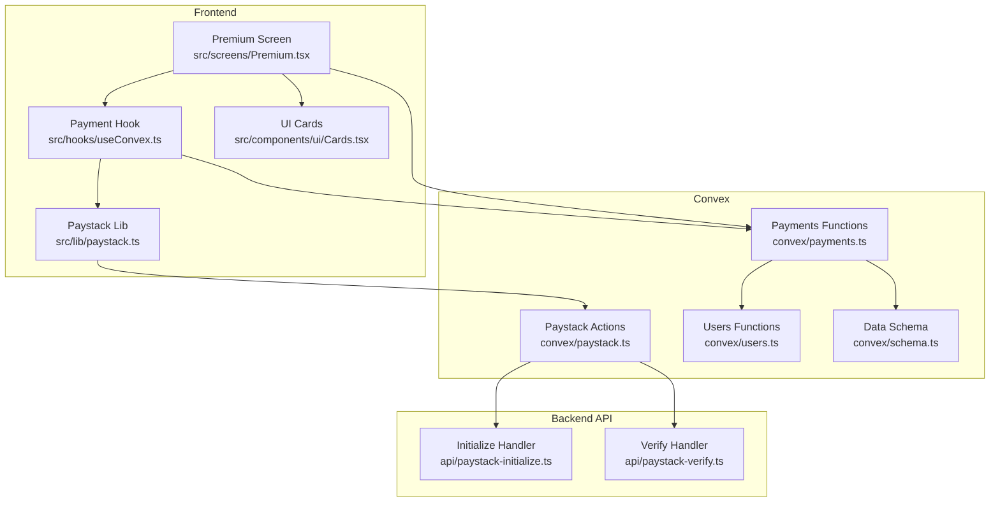
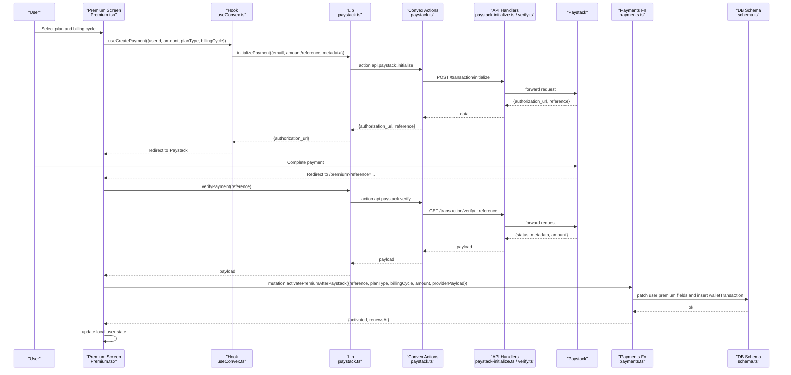
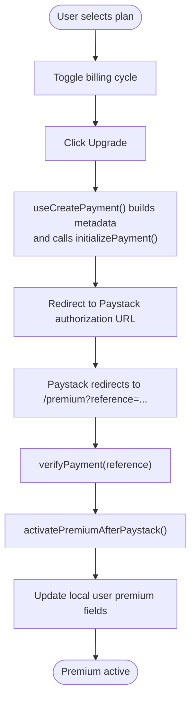
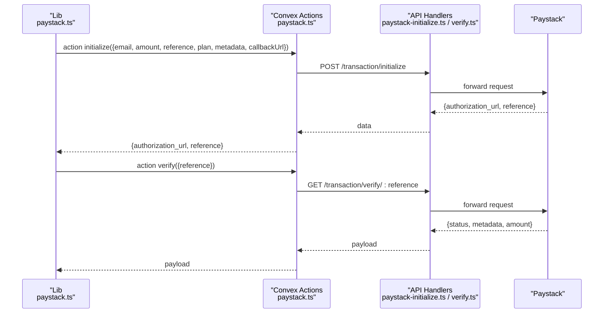
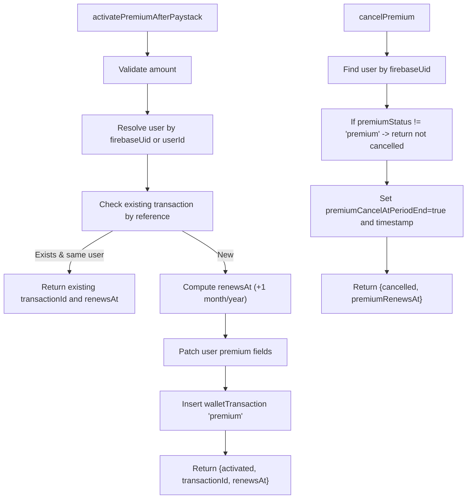
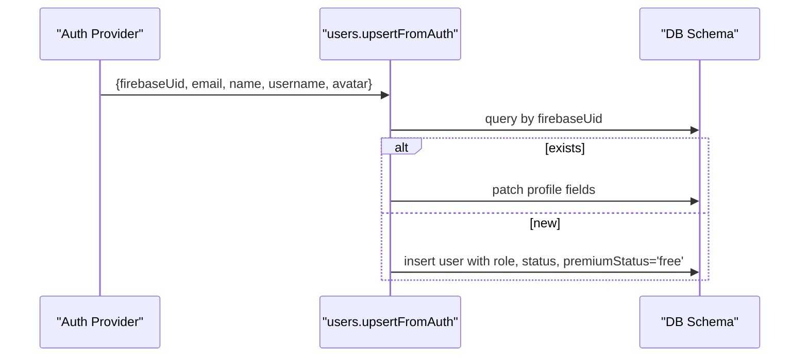
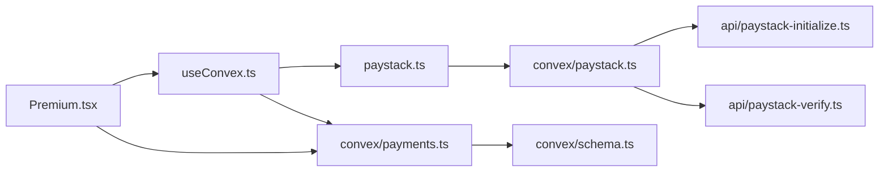

# Premium Subscriptions

<cite>
**Referenced Files in This Document**
- [Premium.tsx](file://src/screens/Premium.tsx)
- [useConvex.ts](file://src/hooks/useConvex.ts)
- [paystack.ts](file://src/lib/paystack.ts)
- [paystack-initialize.ts](file://api/paystack-initialize.ts)
- [paystack-verify.ts](file://api/paystack-verify.ts)
- [payments.ts](file://convex/payments.ts)
- [users.ts](file://convex/users.ts)
- [schema.ts](file://convex/schema.ts)
- [Cards.tsx](file://src/components/ui/Cards.tsx)
- [ReaderProfile.tsx](file://src/screens/ReaderProfile.tsx)
</cite>

## Table of Contents
1. [Introduction](#introduction)
2. [Project Structure](#project-structure)
3. [Core Components](#core-components)
4. [Architecture Overview](#architecture-overview)
5. [Detailed Component Analysis](#detailed-component-analysis)
6. [Dependency Analysis](#dependency-analysis)
7. [Performance Considerations](#performance-considerations)
8. [Troubleshooting Guide](#troubleshooting-guide)
9. [Conclusion](#conclusion)

## Introduction
This document explains the premium subscription system end-to-end: how users select plans, how recurring billing is set up via Paystack, how payments are verified, and how subscription lifecycles are managed. It documents the Convex functions for subscription operations, the premium screen implementation, and the integration between payment processing and premium feature access control. It also covers cancellation, renewal, and security considerations.

## Project Structure
The premium subscription system spans three layers:
- Frontend screens and hooks for plan selection, payment initiation, and post-payment activation
- Convex actions/functions for payment initialization/verification and subscription state updates
- Backend API handlers for Paystack integration and database schema for user and transaction records



**Diagram sources**
- [Premium.tsx:13-360](file://src/screens/Premium.tsx#L13-L360)
- [useConvex.ts:65-109](file://src/hooks/useConvex.ts#L65-L109)
- [paystack.ts:1-115](file://src/lib/paystack.ts#L1-L115)
- [paystack-initialize.ts:5-46](file://api/paystack-initialize.ts#L5-L46)
- [paystack-verify.ts:5-35](file://api/paystack-verify.ts#L5-L35)
- [payments.ts:174-291](file://convex/payments.ts#L174-L291)
- [users.ts:42-90](file://convex/users.ts#L42-L90)
- [schema.ts:24-67](file://convex/schema.ts#L24-L67)
- [Cards.tsx:161-216](file://src/components/ui/Cards.tsx#L161-L216)

**Section sources**
- [Premium.tsx:13-360](file://src/screens/Premium.tsx#L13-L360)
- [useConvex.ts:65-109](file://src/hooks/useConvex.ts#L65-L109)
- [paystack.ts:1-115](file://src/lib/paystack.ts#L1-L115)
- [paystack-initialize.ts:5-46](file://api/paystack-initialize.ts#L5-L46)
- [paystack-verify.ts:5-35](file://api/paystack-verify.ts#L5-L35)
- [payments.ts:174-291](file://convex/payments.ts#L174-L291)
- [users.ts:42-90](file://convex/users.ts#L42-L90)
- [schema.ts:24-67](file://convex/schema.ts#L24-L67)
- [Cards.tsx:161-216](file://src/components/ui/Cards.tsx#L161-L216)

## Core Components
- Premium screen: Allows plan selection (Premium vs Patron), billing cycle (monthly/yearly), initiates payment, and verifies post-payment activation.
- Payment hook: Builds Paystack metadata, generates references, and calls Convex actions to initialize payment.
- Paystack library: Wraps Convex actions for initialize and verify, normalizes errors, and handles reference generation.
- Convex actions: Forward requests to Paystack API and return authorization URLs and verification results.
- Payments functions: Activate premium after successful verification, record transactions, and cancel subscriptions.
- Users functions: Upsert user on auth and maintain profile state.
- Schema: Defines user premium fields and wallet transaction records.

**Section sources**
- [Premium.tsx:13-360](file://src/screens/Premium.tsx#L13-L360)
- [useConvex.ts:65-109](file://src/hooks/useConvex.ts#L65-L109)
- [paystack.ts:56-84](file://src/lib/paystack.ts#L56-L84)
- [paystack-initialize.ts:21-46](file://api/paystack-initialize.ts#L21-L46)
- [paystack-verify.ts:21-35](file://api/paystack-verify.ts#L21-L35)
- [payments.ts:174-291](file://convex/payments.ts#L174-L291)
- [users.ts:42-90](file://convex/users.ts#L42-L90)
- [schema.ts:24-67](file://convex/schema.ts#L24-L67)

## Architecture Overview
The subscription workflow integrates frontend, Convex, backend API, and database:



**Diagram sources**
- [Premium.tsx:39-101](file://src/screens/Premium.tsx#L39-L101)
- [useConvex.ts:65-109](file://src/hooks/useConvex.ts#L65-L109)
- [paystack.ts:56-84](file://src/lib/paystack.ts#L56-L84)
- [paystack-initialize.ts:21-46](file://api/paystack-initialize.ts#L21-L46)
- [paystack-verify.ts:21-35](file://api/paystack-verify.ts#L21-L35)
- [payments.ts:174-263](file://convex/payments.ts#L174-L263)
- [schema.ts:24-67](file://convex/schema.ts#L24-L67)

## Detailed Component Analysis

### Premium Screen: Plan Selection, Pricing, and Activation
- Plan selection: Monthly/yearly toggle and plan cards for Premium and Patron.
- Pricing display: Formatted prices per cycle.
- Payment initiation: Uses the payment hook to build metadata and call Convex actions.
- Post-payment verification: Reads reference from URL, verifies with Paystack, activates premium via Convex mutation, and updates local user state.



**Diagram sources**
- [Premium.tsx:130-163](file://src/screens/Premium.tsx#L130-L163)
- [Premium.tsx:39-101](file://src/screens/Premium.tsx#L39-L101)
- [useConvex.ts:65-109](file://src/hooks/useConvex.ts#L65-L109)
- [paystack.ts:77-84](file://src/lib/paystack.ts#L77-L84)
- [payments.ts:174-263](file://convex/payments.ts#L174-L263)

**Section sources**
- [Premium.tsx:13-360](file://src/screens/Premium.tsx#L13-L360)
- [Cards.tsx:161-216](file://src/components/ui/Cards.tsx#L161-L216)

### Payment Hook and Paystack Library
- Payment hook:
  - Determines plan code for monthly/yearly Premium/Patron plans.
  - Generates a unique reference.
  - Calls Convex action to initialize payment with metadata including plan type, billing cycle, and amount.
- Paystack library:
  - Wraps Convex actions for initialize and verify.
  - Normalizes errors and throws actionable messages.
  - Provides reference generation and currency conversion helpers.

```mermaid
classDiagram
class PaymentHook {
+useCreatePayment(args) Promise~{reference, authorizationUrl}~
}
class PaystackLib {
+initializePayment(data) Promise
+verifyPayment(reference) Promise
+generateReference() string
+naiiraToKobo(n) number
+koboToNaira(k) number
}
PaymentHook --> PaystackLib : "calls"
```

**Diagram sources**
- [useConvex.ts:65-109](file://src/hooks/useConvex.ts#L65-L109)
- [paystack.ts:56-114](file://src/lib/paystack.ts#L56-L114)

**Section sources**
- [useConvex.ts:65-109](file://src/hooks/useConvex.ts#L65-L109)
- [paystack.ts:56-114](file://src/lib/paystack.ts#L56-L114)

### Convex Actions: Paystack Initialization and Verification
- Initialize action:
  - Validates presence of Paystack secret key.
  - Posts to Paystack initialize endpoint with email, amount/reference, plan, metadata, and callback URL.
  - Returns authorization URL and reference.
- Verify action:
  - Validates presence of Paystack secret key.
  - Fetches verification result from Paystack verify endpoint.
  - Returns transaction payload.



**Diagram sources**
- [paystack-initialize.ts:21-46](file://api/paystack-initialize.ts#L21-L46)
- [paystack-verify.ts:21-35](file://api/paystack-verify.ts#L21-L35)
- [paystack.ts:5-70](file://convex/paystack.ts#L5-L70)

**Section sources**
- [paystack.ts:5-70](file://convex/paystack.ts#L5-L70)
- [paystack-initialize.ts:5-46](file://api/paystack-initialize.ts#L5-L46)
- [paystack-verify.ts:5-35](file://api/paystack-verify.ts#L5-L35)

### Payments Functions: Activation, Renewal, Cancellation
- Activate premium after Paystack:
  - Validates amount.
  - Resolves user by firebaseUid or userId.
  - Prevents duplicate activation for the same reference.
  - Sets premium fields and inserts a premium-type wallet transaction.
  - Computes renewal date based on billing cycle.
- Cancel premium:
  - Marks cancellation at period end and timestamps.
  - Preserves active access until renewal date.



**Diagram sources**
- [payments.ts:174-291](file://convex/payments.ts#L174-L291)

**Section sources**
- [payments.ts:174-291](file://convex/payments.ts#L174-L291)

### Users Upsert and Profile Integration
- Upsert user on auth:
  - Creates or updates user with default free premium status and basic fields.
- Profile screen integration:
  - Displays premium status, next billing date, and cancellation option.
  - Cancels renewal via mutation and updates local state.



**Diagram sources**
- [users.ts:42-90](file://convex/users.ts#L42-L90)
- [schema.ts:24-67](file://convex/schema.ts#L24-L67)
- [ReaderProfile.tsx:77-107](file://src/screens/ReaderProfile.tsx#L77-L107)

**Section sources**
- [users.ts:42-90](file://convex/users.ts#L42-L90)
- [ReaderProfile.tsx:77-107](file://src/screens/ReaderProfile.tsx#L77-L107)

### Premium Screen Implementation Details
- State management:
  - Billing cycle toggle, plan selection, processing flags, and error/success messaging.
- Pricing logic:
  - Hardcoded plan prices per cycle; computed dynamically for display.
- Purchase flow:
  - Requires signed-in user; builds metadata; calls hook; redirects to Paystack.
- Post-payment activation:
  - Parses reference from URL, verifies with Paystack, calls activation mutation, updates local user state.

**Section sources**
- [Premium.tsx:13-360](file://src/screens/Premium.tsx#L13-L360)

## Dependency Analysis
- Frontend depends on:
  - Payment hook for building requests and metadata.
  - Paystack library for Convex action wrappers and error normalization.
  - Convex payments functions for activation and cancellation.
- Convex actions depend on:
  - Backend API handlers for Paystack integration.
- Database schema defines:
  - User premium fields and wallet transaction records.



**Diagram sources**
- [Premium.tsx:13-360](file://src/screens/Premium.tsx#L13-L360)
- [useConvex.ts:65-109](file://src/hooks/useConvex.ts#L65-L109)
- [paystack.ts:56-84](file://src/lib/paystack.ts#L56-L84)
- [paystack-initialize.ts:21-46](file://api/paystack-initialize.ts#L21-L46)
- [paystack-verify.ts:21-35](file://api/paystack-verify.ts#L21-L35)
- [payments.ts:174-291](file://convex/payments.ts#L174-L291)
- [schema.ts:24-67](file://convex/schema.ts#L24-L67)

**Section sources**
- [Premium.tsx:13-360](file://src/screens/Premium.tsx#L13-L360)
- [useConvex.ts:65-109](file://src/hooks/useConvex.ts#L65-L109)
- [paystack.ts:56-84](file://src/lib/paystack.ts#L56-L84)
- [paystack-initialize.ts:21-46](file://api/paystack-initialize.ts#L21-L46)
- [paystack-verify.ts:21-35](file://api/paystack-verify.ts#L21-L35)
- [payments.ts:174-291](file://convex/payments.ts#L174-L291)
- [schema.ts:24-67](file://convex/schema.ts#L24-L67)

## Performance Considerations
- Minimize redundant activations: The activation function checks existing transactions by reference to avoid duplicate writes.
- Efficient user lookup: Resolve user by firebaseUid or normalized userId to reduce DB scans.
- Batch reads/writes: Use indexes on user and transaction collections for fast queries.
- Frontend UX: Debounce toggling billing cycles and plan selections to avoid unnecessary computations.

## Troubleshooting Guide
- Missing Paystack keys:
  - Convex actions throw explicit errors if the Paystack secret key is not configured.
  - Frontend library normalizes errors mentioning missing public key or secret key.
- Payment initialization failures:
  - Ensure metadata includes a valid email and either amount or plan code.
  - Confirm callback URL is reachable and includes the reference parameter.
- Payment verification failures:
  - Verify the reference is present and valid.
  - Check network connectivity to Paystack endpoints.
- Activation errors:
  - Ensure the amount is positive and the user exists.
  - Confirm the reference is unique and not reused.
- Cancellation issues:
  - Verify the user has an active premium subscription.
  - Ensure the cancellation flag is set to end-of-period.

**Section sources**
- [paystack.ts:37-51](file://src/lib/paystack.ts#L37-L51)
- [paystack-initialize.ts:11-19](file://api/paystack-initialize.ts#L11-L19)
- [paystack-verify.ts:11-19](file://api/paystack-verify.ts#L11-L19)
- [payments.ts:184-210](file://convex/payments.ts#L184-L210)
- [payments.ts:265-291](file://convex/payments.ts#L265-L291)

## Conclusion
The premium subscription system integrates a clean frontend experience with robust backend processing via Convex and Paystack. It supports plan selection, recurring billing setup, payment verification, and lifecycle management including cancellation at period end. The schema and functions ensure reliable state tracking and transaction logging, while the UI provides clear feedback and controls for users.