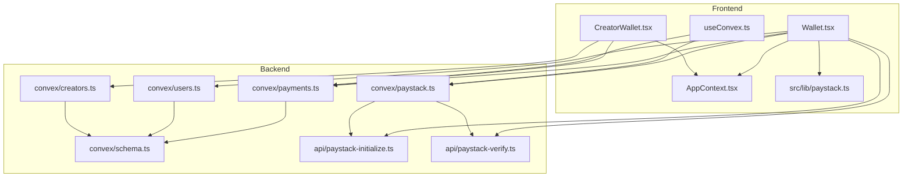
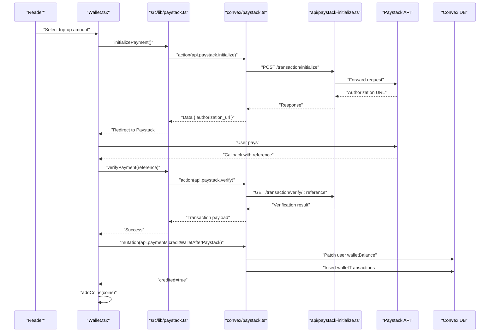
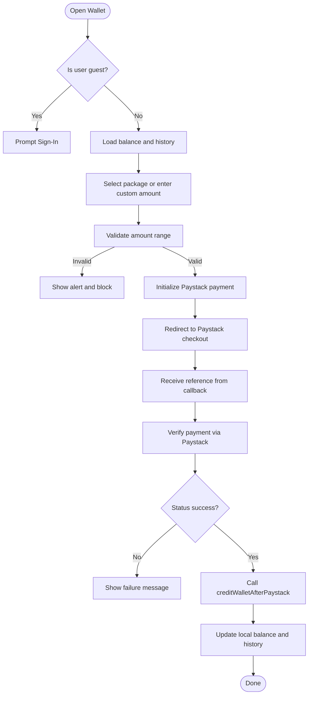
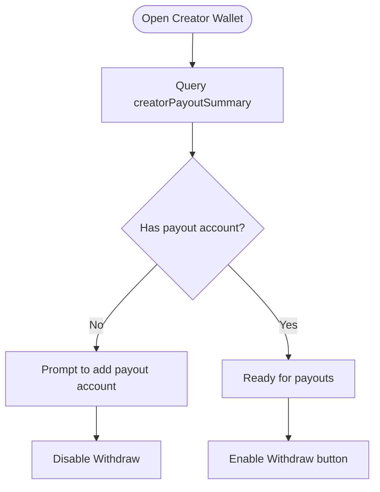
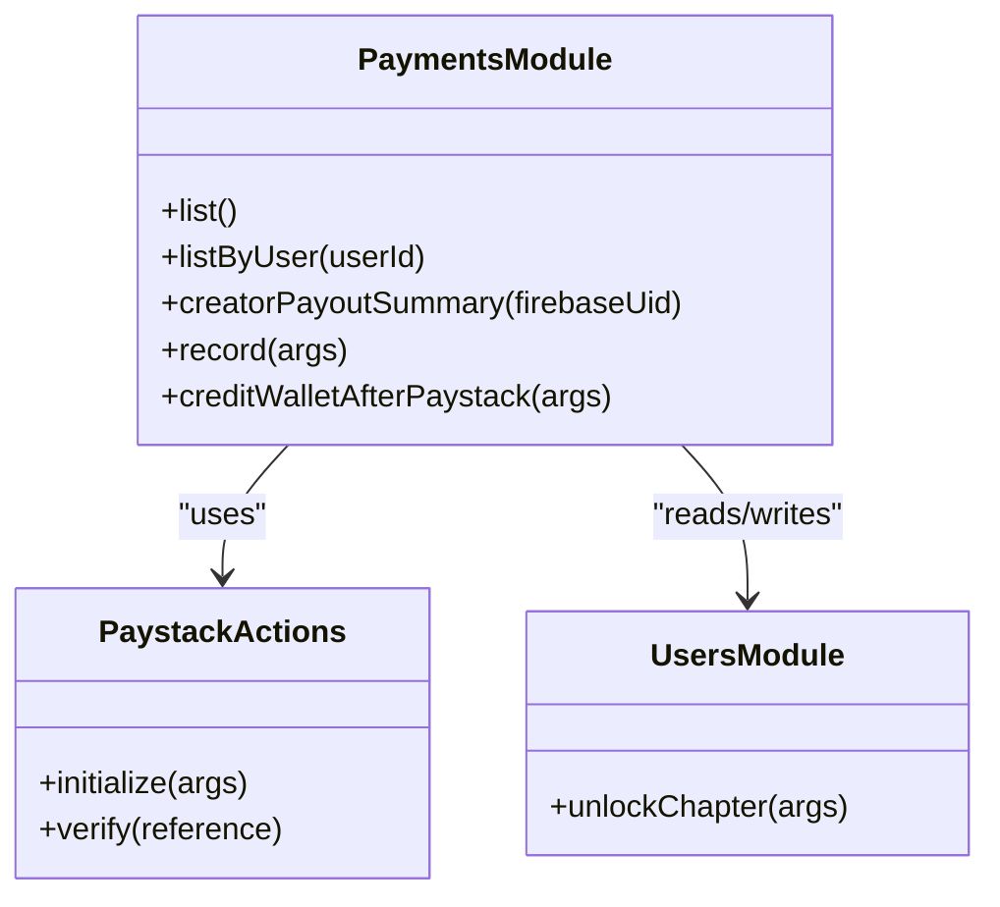
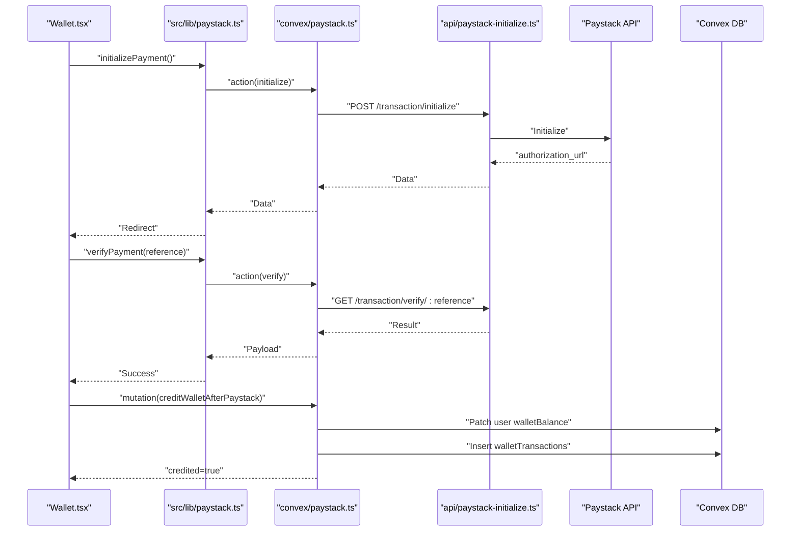
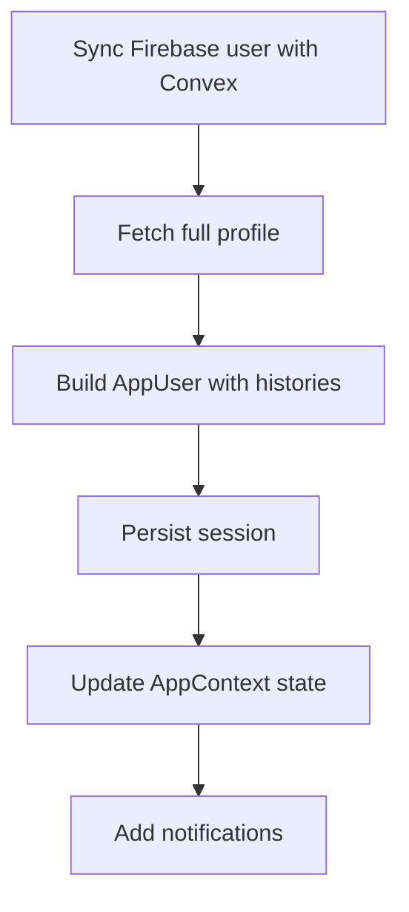
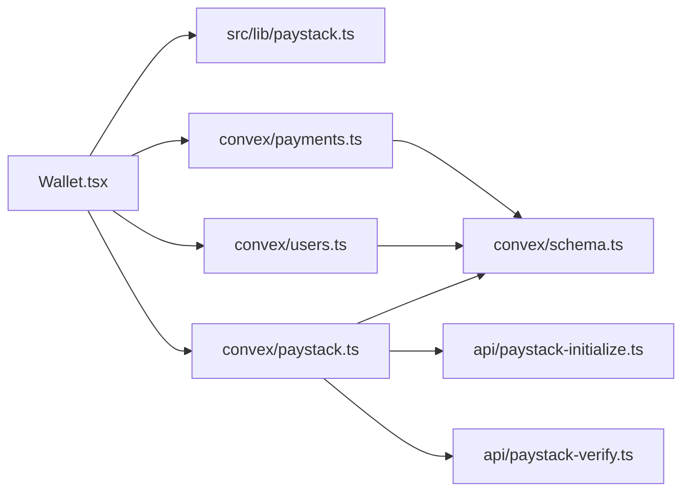

# Wallet Management

<cite>
**Referenced Files in This Document**
- [Wallet.tsx](file://src/screens/Wallet.tsx)
- [CreatorWallet.tsx](file://src/screens/CreatorWallet.tsx)
- [schema.ts](file://convex/schema.ts)
- [payments.ts](file://convex/payments.ts)
- [paystack.ts](file://convex/paystack.ts)
- [paystack-initialize.ts](file://api/paystack-initialize.ts)
- [paystack-verify.ts](file://api/paystack-verify.ts)
- [paystack.ts](file://src/lib/paystack.ts)
- [users.ts](file://convex/users.ts)
- [creators.ts](file://convex/creators.ts)
- [useConvex.ts](file://src/hooks/useConvex.ts)
- [AppContext.tsx](file://src/contexts/AppContext.tsx)
</cite>

## Table of Contents
1. [Introduction](#introduction)
2. [Project Structure](#project-structure)
3. [Core Components](#core-components)
4. [Architecture Overview](#architecture-overview)
5. [Detailed Component Analysis](#detailed-component-analysis)
6. [Dependency Analysis](#dependency-analysis)
7. [Performance Considerations](#performance-considerations)
8. [Troubleshooting Guide](#troubleshooting-guide)
9. [Conclusion](#conclusion)
10. [Appendices](#appendices)

## Introduction
This document explains the wallet management system in Lemonade, focusing on balance tracking, funding mechanisms, and withdrawal processes. It covers the Convex functions for wallet operations, the wallet screen implementations for readers and creators, the funding workflow (payment initialization, verification, and balance updates), security measures, state management, real-time balance updates, error handling for insufficient funds, and integration with payment processing and creator earnings calculations.

## Project Structure
The wallet system spans frontend screens, Convex backend functions, and API handlers for Paystack integration:
- Frontend screens:
  - Reader wallet: src/screens/Wallet.tsx
  - Creator wallet: src/screens/CreatorWallet.tsx
- Backend:
  - Convex schema defines wallet-related tables and indices
  - Convex payments module exposes queries and mutations for wallet operations
  - Convex users module manages user balances and unlocks
  - Convex creators module stores creator payout accounts
  - Convex paystack module wraps Paystack actions
  - API handlers for Paystack initialization and verification
  - Frontend lib for Paystack integration and helpers
  - App context for state management and real-time updates
  - Hooks for payment creation and verification

**Diagram sources**
- [Wallet.tsx:1-452](file://src/screens/Wallet.tsx#L1-L452)
- [CreatorWallet.tsx:1-287](file://src/screens/CreatorWallet.tsx#L1-L287)
- [AppContext.tsx:1-1452](file://src/contexts/AppContext.tsx#L1-L1452)
- [useConvex.ts:1-213](file://src/hooks/useConvex.ts#L1-L213)
- [paystack.ts:1-115](file://src/lib/paystack.ts#L1-L115)
- [schema.ts:1-495](file://convex/schema.ts#L1-L495)
- [payments.ts:1-291](file://convex/payments.ts#L1-L291)
- [users.ts:1-360](file://convex/users.ts#L1-L360)
- [creators.ts:1-87](file://convex/creators.ts#L1-L87)
- [paystack.ts:1-71](file://convex/paystack.ts#L1-L71)
- [paystack-initialize.ts:1-47](file://api/paystack-initialize.ts#L1-L47)
- [paystack-verify.ts:1-36](file://api/paystack-verify.ts#L1-L36)

**Section sources**
- [Wallet.tsx:1-452](file://src/screens/Wallet.tsx#L1-L452)
- [CreatorWallet.tsx:1-287](file://src/screens/CreatorWallet.tsx#L1-L287)
- [schema.ts:1-495](file://convex/schema.ts#L1-L495)

## Core Components
- Wallet screen (Reader):
  - Balance display panel
  - Top-up options with predefined packages and custom amounts
  - Payment initiation and verification flow
  - Transaction history panel
- Creator wallet:
  - Available earnings summary
  - Payout account setup
  - Recent earnings history
- Convex wallet functions:
  - Queries: list wallet transactions, list by user, creator payout summary
  - Mutations: record transaction, credit wallet after Paystack, unlock chapter
  - Paystack actions: initialize and verify transactions
- State management:
  - AppContext aggregates user data, balances, and histories
  - Real-time updates for balance and notifications

**Section sources**
- [Wallet.tsx:1-452](file://src/screens/Wallet.tsx#L1-L452)
- [CreatorWallet.tsx:1-287](file://src/screens/CreatorWallet.tsx#L1-L287)
- [payments.ts:1-291](file://convex/payments.ts#L1-L291)
- [users.ts:1-360](file://convex/users.ts#L1-L360)
- [paystack.ts:1-71](file://convex/paystack.ts#L1-L71)
- [AppContext.tsx:1-1452](file://src/contexts/AppContext.tsx#L1-L1452)

## Architecture Overview
The wallet architecture integrates frontend screens with Convex backend functions and external Paystack APIs. Payment flows are initiated via the frontend, verified by Paystack, and reconciled in Convex to update user balances and transaction records.

**Diagram sources**
- [Wallet.tsx:93-131](file://src/screens/Wallet.tsx#L93-L131)
- [paystack.ts:5-70](file://convex/paystack.ts#L5-L70)
- [paystack-initialize.ts:1-47](file://api/paystack-initialize.ts#L1-L47)
- [paystack-verify.ts:1-36](file://api/paystack-verify.ts#L1-L36)
- [paystack.ts:1-115](file://src/lib/paystack.ts#L1-L115)
- [payments.ts:113-172](file://convex/payments.ts#L113-L172)
- [users.ts:129-147](file://convex/users.ts#L129-L147)

## Detailed Component Analysis

### Reader Wallet Screen
The reader wallet screen provides:
- Balance panel showing current coin balance
- Top-up panel with predefined packages and custom coin amounts
- Payment initiation via Paystack
- Verification and balance crediting after payment
- Activity history panel for unlocks, supports, and top-ups

Key behaviors:
- Authentication gating: redirects to sign-in when adding funds
- Amount validation: enforces minimum and maximum top-up limits
- Payment flow: initializes Paystack, redirects to checkout, verifies callback, credits wallet, and updates local state
- History rendering: displays unlock, support, and top-up events

**Diagram sources**
- [Wallet.tsx:93-131](file://src/screens/Wallet.tsx#L93-L131)
- [Wallet.tsx:45-91](file://src/screens/Wallet.tsx#L45-L91)
- [Wallet.tsx:193-230](file://src/screens/Wallet.tsx#L193-L230)
- [Wallet.tsx:245-369](file://src/screens/Wallet.tsx#L245-L369)
- [Wallet.tsx:371-452](file://src/screens/Wallet.tsx#L371-L452)

**Section sources**
- [Wallet.tsx:1-452](file://src/screens/Wallet.tsx#L1-L452)

### Creator Wallet Screen
The creator wallet screen provides:
- Available earnings summary and lifetime earnings
- Payout account setup and validation
- Recent earnings history from creator_support transactions
- Withdraw button disabled until conditions are met

Key behaviors:
- Loads payout summary via a Convex query
- Validates payout account completeness
- Enables withdrawal when eligible

**Diagram sources**
- [CreatorWallet.tsx:41-80](file://src/screens/CreatorWallet.tsx#L41-L80)
- [payments.ts:21-80](file://convex/payments.ts#L21-L80)
- [CreatorWallet.tsx:89-128](file://src/screens/CreatorWallet.tsx#L89-L128)

**Section sources**
- [CreatorWallet.tsx:1-287](file://src/screens/CreatorWallet.tsx#L1-L287)
- [payments.ts:21-80](file://convex/payments.ts#L21-L80)

### Convex Functions for Wallet Operations
- Queries:
  - List all wallet transactions
  - List transactions by user ID
  - Creator payout summary (aggregates earnings and recent transactions)
- Mutations:
  - Record a transaction
  - Credit wallet after Paystack (validates reference, user, and amounts)
  - Unlock chapter (deducts balance and records transaction)
- Paystack actions:
  - Initialize payment (calls Paystack API via API handler)
  - Verify payment (calls Paystack API via API handler)

**Diagram sources**
- [payments.ts:1-291](file://convex/payments.ts#L1-L291)
- [users.ts:269-310](file://convex/users.ts#L269-L310)
- [paystack.ts:1-71](file://convex/paystack.ts#L1-L71)

**Section sources**
- [payments.ts:1-291](file://convex/payments.ts#L1-L291)
- [users.ts:269-310](file://convex/users.ts#L269-L310)
- [paystack.ts:1-71](file://convex/paystack.ts#L1-L71)

### Wallet Funding Workflow
- Initialization:
  - Frontend generates a reference and calls Paystack initialize via Convex action
  - Convex action forwards to API handler which calls Paystack API
  - Returns authorization URL to redirect the user
- Verification:
  - After payment, Paystack callback passes a reference
  - Frontend verifies via Paystack verify action
  - On success, credits wallet via mutation
- Balance update:
  - Mutation patches user walletBalance and inserts walletTransactions record
  - Frontend updates local state and notifies user

**Diagram sources**
- [Wallet.tsx:93-131](file://src/screens/Wallet.tsx#L93-L131)
- [Wallet.tsx:45-91](file://src/screens/Wallet.tsx#L45-L91)
- [paystack.ts:5-70](file://convex/paystack.ts#L5-L70)
- [paystack-initialize.ts:1-47](file://api/paystack-initialize.ts#L1-L47)
- [paystack-verify.ts:1-36](file://api/paystack-verify.ts#L1-L36)
- [payments.ts:113-172](file://convex/payments.ts#L113-L172)

**Section sources**
- [Wallet.tsx:93-131](file://src/screens/Wallet.tsx#L93-L131)
- [Wallet.tsx:45-91](file://src/screens/Wallet.tsx#L45-L91)
- [paystack.ts:5-70](file://convex/paystack.ts#L5-L70)
- [payments.ts:113-172](file://convex/payments.ts#L113-L172)

### Security Measures and Controls
- Authentication:
  - Reader wallet requires signed-in user for funding
  - Creator wallet loads via authenticated context
- Transaction limits:
  - Frontend enforces minimum and maximum top-up amounts
  - Backend validates numeric and positive amounts
- Audit logging:
  - Wallet transactions recorded with type, amount, status, and metadata
  - Creator payout summary aggregates earnings and recent transactions
- Payout account validation:
  - Creator wallet checks presence of bank name, account number, and account name

**Section sources**
- [Wallet.tsx:93-131](file://src/screens/Wallet.tsx#L93-L131)
- [Wallet.tsx:99-102](file://src/screens/Wallet.tsx#L99-L102)
- [payments.ts:123-130](file://convex/payments.ts#L123-L130)
- [payments.ts:21-80](file://convex/payments.ts#L21-L80)
- [CreatorWallet.tsx:89-128](file://src/screens/CreatorWallet.tsx#L89-L128)

### State Management and Real-Time Updates
- AppContext aggregates user data, balances, and histories from Convex
- Local state updates immediately upon successful operations
- Notifications reflect wallet changes and activities
- Real-time refreshes content periodically

**Diagram sources**
- [AppContext.tsx:612-634](file://src/contexts/AppContext.tsx#L612-L634)
- [AppContext.tsx:324-388](file://src/contexts/AppContext.tsx#L324-L388)

**Section sources**
- [AppContext.tsx:1-1452](file://src/contexts/AppContext.tsx#L1-L1452)

### Error Handling for Insufficient Funds
- Unlock chapter mutation checks balance before deducting
- Frontend also guards unlock to prevent invalid operations
- Errors surfaced to user via alerts and notifications

**Section sources**
- [users.ts:282](file://convex/users.ts#L282)
- [AppContext.tsx:1043-1065](file://src/contexts/AppContext.tsx#L1043-L1065)

### Integration Between Wallet, Payments, and Creator Earnings
- Paystack integration:
  - Initialize and verify actions forward to Paystack API
  - Frontend lib normalizes errors and provides helpers
- Wallet transactions:
  - Recording and crediting handled by Convex mutations
  - Reader top-ups and chapter unlocks create transaction records
- Creator earnings:
  - Creator payout summary aggregates creator_support transactions
  - Payout account stored in creator profile for withdrawals

**Section sources**
- [paystack.ts:1-71](file://convex/paystack.ts#L1-L71)
- [paystack.ts:1-115](file://src/lib/paystack.ts#L1-L115)
- [payments.ts:82-172](file://convex/payments.ts#L82-L172)
- [payments.ts:21-80](file://convex/payments.ts#L21-L80)
- [creators.ts:24-66](file://convex/creators.ts#L24-L66)

## Dependency Analysis
The wallet system exhibits clear separation of concerns:
- Frontend depends on Convex actions and API handlers for payment operations
- Convex actions depend on API handlers for external service calls
- Backend modules depend on schema definitions for data integrity
- State management orchestrates UI updates and user experiences

**Diagram sources**
- [Wallet.tsx:16-19](file://src/screens/Wallet.tsx#L16-L19)
- [paystack.ts:1-71](file://convex/paystack.ts#L1-L71)
- [paystack-initialize.ts:1-47](file://api/paystack-initialize.ts#L1-L47)
- [paystack-verify.ts:1-36](file://api/paystack-verify.ts#L1-L36)
- [schema.ts:198-223](file://convex/schema.ts#L198-L223)

**Section sources**
- [Wallet.tsx:1-452](file://src/screens/Wallet.tsx#L1-L452)
- [paystack.ts:1-71](file://convex/paystack.ts#L1-L71)
- [schema.ts:1-495](file://convex/schema.ts#L1-L495)

## Performance Considerations
- Minimize database reads by batching queries and using indexed lookups
- Cache frequently accessed user data in AppContext to reduce network requests
- Debounce or throttle payment initiation to avoid redundant API calls
- Use optimistic UI updates for immediate feedback during balance changes

## Troubleshooting Guide
Common issues and resolutions:
- Missing Paystack keys:
  - Ensure environment variables are set for Paystack secret key and public key
  - Convex actions and API handlers check for key presence and surface errors
- Payment initialization failures:
  - Verify email and amount/plan correctness
  - Check callback URL configuration
- Payment verification failures:
  - Confirm reference validity and network connectivity
  - Review Paystack response messages
- Insufficient funds:
  - Prevent unlock attempts when balance is lower than chapter price
  - Provide user-friendly error messaging

**Section sources**
- [paystack.ts:15-18](file://convex/paystack.ts#L15-L18)
- [paystack-initialize.ts:11-14](file://api/paystack-initialize.ts#L11-L14)
- [paystack-verify.ts:11-14](file://api/paystack-verify.ts#L11-L14)
- [users.ts:282](file://convex/users.ts#L282)

## Conclusion
The wallet management system integrates secure, auditable payment processing with robust frontend experiences for readers and creators. It leverages Convex for reliable state management, Paystack for payment orchestration, and AppContext for real-time updates. The design ensures strong validation, clear error handling, and transparent transaction histories.

## Appendices

### Example Wallet Operations
- Balance queries:
  - List all wallet transactions
  - List transactions by user ID
  - Creator payout summary
- Funding operations:
  - Initialize Paystack payment
  - Verify payment
  - Credit wallet after Paystack
- Transaction histories:
  - Reader: unlocks, supports, top-ups
  - Creator: recent earnings from creator_support

**Section sources**
- [payments.ts:4-19](file://convex/payments.ts#L4-L19)
- [payments.ts:21-80](file://convex/payments.ts#L21-L80)
- [paystack.ts:5-70](file://convex/paystack.ts#L5-L70)
- [Wallet.tsx:371-452](file://src/screens/Wallet.tsx#L371-L452)
- [CreatorWallet.tsx:262-283](file://src/screens/CreatorWallet.tsx#L262-L283)