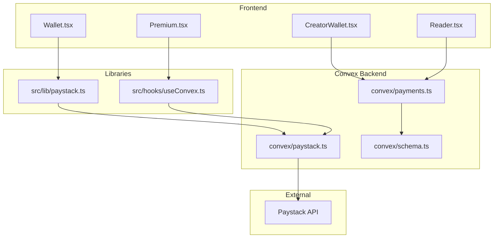
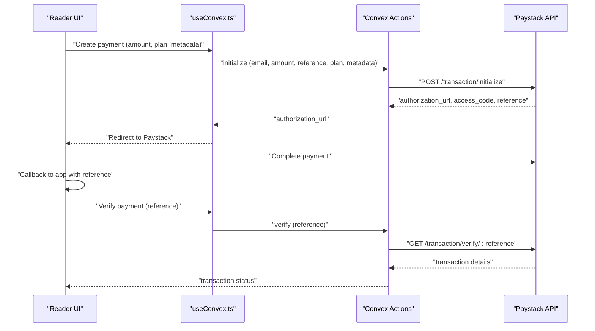
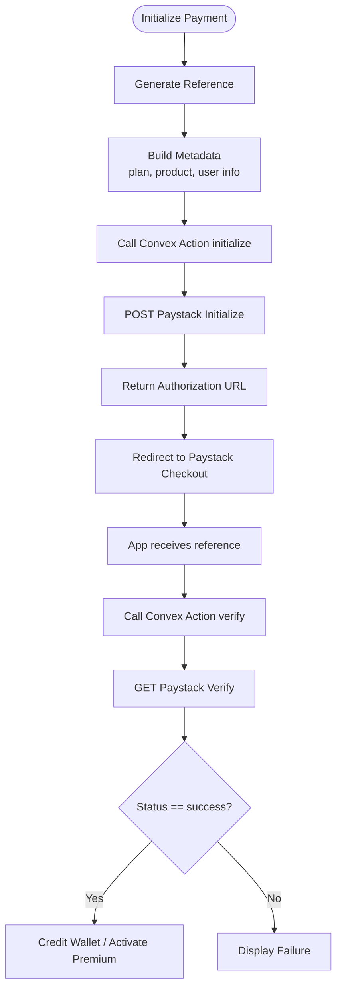
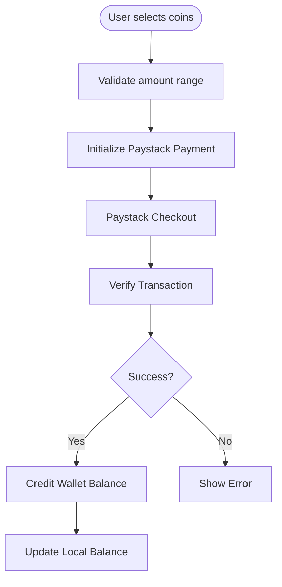
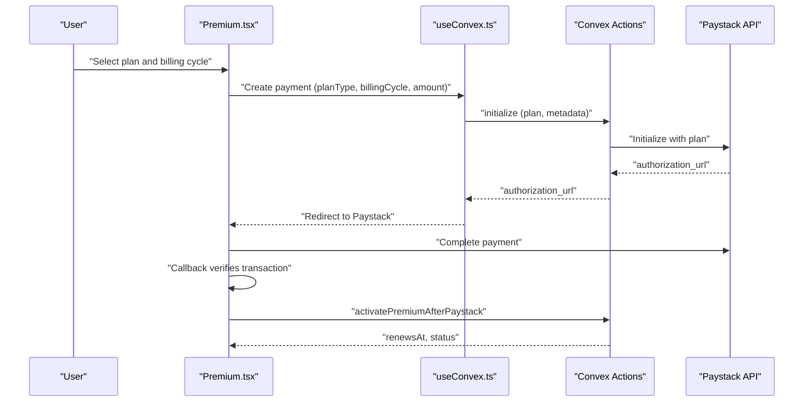
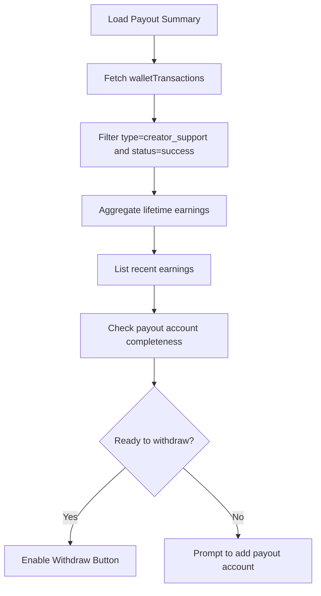
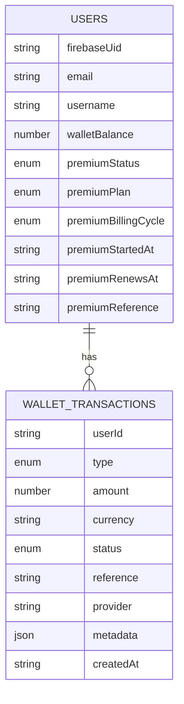
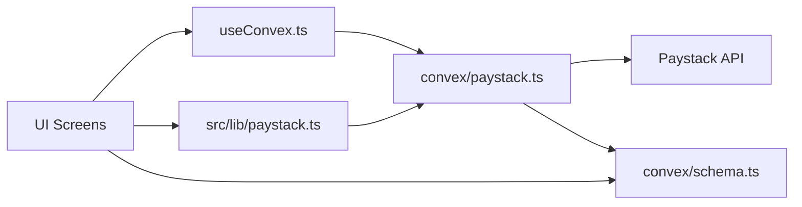

# Payment and Monetization System

<cite>
**Referenced Files in This Document**
- [paystack-initialize.ts](file://api/paystack-initialize.ts)
- [paystack-verify.ts](file://api/paystack-verify.ts)
- [paystack.ts](file://convex/paystack.ts)
- [payments.ts](file://convex/payments.ts)
- [paystack.ts](file://src/lib/paystack.ts)
- [Wallet.tsx](file://src/screens/Wallet.tsx)
- [Premium.tsx](file://src/screens/Premium.tsx)
- [CreatorWallet.tsx](file://src/screens/CreatorWallet.tsx)
- [Reader.tsx](file://src/screens/Reader.tsx)
- [useConvex.ts](file://src/hooks/useConvex.ts)
- [schema.ts](file://convex/schema.ts)
- [types.ts](file://src/data/types.ts)
</cite>

## Table of Contents
1. [Introduction](#introduction)
2. [Project Structure](#project-structure)
3. [Core Components](#core-components)
4. [Architecture Overview](#architecture-overview)
5. [Detailed Component Analysis](#detailed-component-analysis)
6. [Dependency Analysis](#dependency-analysis)
7. [Performance Considerations](#performance-considerations)
8. [Troubleshooting Guide](#troubleshooting-guide)
9. [Conclusion](#conclusion)

## Introduction
This document explains the payment and monetization system powering Lemonade’s wallet, creator support, premium subscriptions, and Paystack integration. It covers:
- Wallet management: top-ups, balance tracking, and transaction history
- Payment processing: Paystack initialization, verification, and transaction recording
- Creator monetization: support payments and creator payout summaries
- Premium subscription system: plan selection, recurring billing, renewal, and cancellation
- Security and compliance: environment configuration, error handling, and retry considerations
- Revenue tracking and reporting: transaction schema and creator analytics

## Project Structure
The payment system spans client-side UI, Convex serverless functions, and external Paystack APIs:
- Frontend screens orchestrate user actions (top-up, unlock chapters, subscribe)
- Convex actions and mutations handle secure server-side payment orchestration
- API routes proxy Paystack requests for environments without direct client access
- Schema defines transaction records and user premium state

**Diagram sources**
- [Wallet.tsx:30-131](file://src/screens/Wallet.tsx#L30-L131)
- [Premium.tsx:13-101](file://src/screens/Premium.tsx#L13-L101)
- [CreatorWallet.tsx:41-128](file://src/screens/CreatorWallet.tsx#L41-L128)
- [Reader.tsx:489-543](file://src/screens/Reader.tsx#L489-L543)
- [paystack.ts:56-84](file://src/lib/paystack.ts#L56-L84)
- [useConvex.ts:65-109](file://src/hooks/useConvex.ts#L65-L109)
- [paystack.ts:5-70](file://convex/paystack.ts#L5-L70)
- [payments.ts:113-172](file://convex/payments.ts#L113-L172)
- [schema.ts:198-223](file://convex/schema.ts#L198-L223)

**Section sources**
- [Wallet.tsx:30-131](file://src/screens/Wallet.tsx#L30-L131)
- [Premium.tsx:13-101](file://src/screens/Premium.tsx#L13-L101)
- [CreatorWallet.tsx:41-128](file://src/screens/CreatorWallet.tsx#L41-L128)
- [Reader.tsx:489-543](file://src/screens/Reader.tsx#L489-L543)
- [paystack.ts:56-84](file://src/lib/paystack.ts#L56-L84)
- [useConvex.ts:65-109](file://src/hooks/useConvex.ts#L65-L109)
- [paystack.ts:5-70](file://convex/paystack.ts#L5-L70)
- [payments.ts:113-172](file://convex/payments.ts#L113-L172)
- [schema.ts:198-223](file://convex/schema.ts#L198-L223)

## Core Components
- Paystack integration
  - Client-side helpers for initialization and verification
  - Convex actions to securely call Paystack APIs
  - API routes for environments without direct client access
- Wallet and transactions
  - Credit wallet after successful Paystack top-up
  - Transaction recording and history queries
- Premium subscriptions
  - Plan selection and recurring billing via Paystack plans
  - Activation, renewal, and cancellation logic
- Creator monetization
  - Creator payout summary and support transaction aggregation
- Access control
  - Premium status gates chapter unlocking
  - Reader screen enforces unlock flow

**Section sources**
- [paystack.ts:56-84](file://src/lib/paystack.ts#L56-L84)
- [paystack.ts:5-70](file://convex/paystack.ts#L5-L70)
- [paystack-initialize.ts:1-47](file://api/paystack-initialize.ts#L1-L47)
- [paystack-verify.ts:1-36](file://api/paystack-verify.ts#L1-L36)
- [payments.ts:113-172](file://convex/payments.ts#L113-L172)
- [payments.ts:174-263](file://convex/payments.ts#L174-L263)
- [payments.ts:265-291](file://convex/payments.ts#L265-L291)
- [CreatorWallet.tsx:41-128](file://src/screens/CreatorWallet.tsx#L41-L128)
- [Reader.tsx:489-543](file://src/screens/Reader.tsx#L489-L543)

## Architecture Overview
The system uses a hybrid approach:
- Frontend initializes payments via Convex actions to avoid exposing secrets
- Convex actions call Paystack APIs and return authorization URLs or verification results
- After payment completion, the frontend verifies the transaction and credits the wallet or activates premium
- Transactions are recorded in Convex schema for audit and reporting

**Diagram sources**
- [useConvex.ts:65-109](file://src/hooks/useConvex.ts#L65-L109)
- [paystack.ts:5-44](file://convex/paystack.ts#L5-L44)
- [paystack.ts:56-84](file://src/lib/paystack.ts#L56-L84)
- [paystack.ts:46-69](file://convex/paystack.ts#L46-L69)

**Section sources**
- [useConvex.ts:65-109](file://src/hooks/useConvex.ts#L65-L109)
- [paystack.ts:5-44](file://convex/paystack.ts#L5-L44)
- [paystack.ts:56-84](file://src/lib/paystack.ts#L56-L84)
- [paystack.ts:46-69](file://convex/paystack.ts#L46-L69)

## Detailed Component Analysis

### Paystack Integration
- Client-side helpers
  - Initialization: generates a reference, constructs metadata, and calls the Convex action
  - Verification: retrieves transaction details for confirmation
- Convex actions
  - Securely reads Paystack secret keys from environment
  - Calls Paystack initialize and verify endpoints
- API routes
  - Alternative serverless endpoints for environments where direct client calls are restricted

**Diagram sources**
- [paystack.ts:56-84](file://src/lib/paystack.ts#L56-L84)
- [paystack.ts:5-44](file://convex/paystack.ts#L5-L44)
- [paystack.ts:46-69](file://convex/paystack.ts#L46-L69)

**Section sources**
- [paystack.ts:56-84](file://src/lib/paystack.ts#L56-L84)
- [paystack.ts:5-44](file://convex/paystack.ts#L5-L44)
- [paystack.ts:46-69](file://convex/paystack.ts#L46-L69)
- [paystack-initialize.ts:1-47](file://api/paystack-initialize.ts#L1-L47)
- [paystack-verify.ts:1-36](file://api/paystack-verify.ts#L1-L36)

### Wallet Management
- Funding methods
  - Coin packages and custom amounts
  - Conversion between Naira and kobo for Paystack
- Balance management
  - Wallet balance stored per user
  - Top-up transactions recorded with type “wallet_topup”
- Unlocking chapters
  - Reader UI checks balance and premium status
  - Unlock flow decrements balance and records “chapter_unlock”

**Diagram sources**
- [Wallet.tsx:93-131](file://src/screens/Wallet.tsx#L93-L131)
- [Wallet.tsx:45-91](file://src/screens/Wallet.tsx#L45-L91)
- [payments.ts:113-172](file://convex/payments.ts#L113-L172)

**Section sources**
- [Wallet.tsx:21-43](file://src/screens/Wallet.tsx#L21-L43)
- [Wallet.tsx:93-131](file://src/screens/Wallet.tsx#L93-L131)
- [Wallet.tsx:45-91](file://src/screens/Wallet.tsx#L45-L91)
- [Reader.tsx:489-543](file://src/screens/Reader.tsx#L489-L543)
- [payments.ts:113-172](file://convex/payments.ts#L113-L172)
- [schema.ts:198-223](file://convex/schema.ts#L198-L223)

### Premium Subscription System
- Plan selection
  - Monthly/yearly premium and patron tiers
  - Uses Paystack plan codes for recurring billing
- Renewal and access control
  - Premium status and renewal dates stored per user
  - Reader UI gates chapter access based on premium status
- Cancellation
  - Schedule cancellation at period end; access remains until renewal date

**Diagram sources**
- [Premium.tsx:130-163](file://src/screens/Premium.tsx#L130-L163)
- [useConvex.ts:65-109](file://src/hooks/useConvex.ts#L65-L109)
- [payments.ts:174-263](file://convex/payments.ts#L174-L263)

**Section sources**
- [Premium.tsx:130-163](file://src/screens/Premium.tsx#L130-L163)
- [useConvex.ts:65-109](file://src/hooks/useConvex.ts#L65-L109)
- [payments.ts:174-263](file://convex/payments.ts#L174-L263)
- [Reader.tsx:489-543](file://src/screens/Reader.tsx#L489-L543)

### Creator Monetization
- Creator payout summary
  - Aggregates successful “creator_support” transactions
  - Requires payout account details to enable withdrawals
- Creator wallet UI
  - Displays available earnings, lifetime earnings, and recent support history
  - Allows saving payout account details

**Diagram sources**
- [payments.ts:21-80](file://convex/payments.ts#L21-L80)
- [CreatorWallet.tsx:41-128](file://src/screens/CreatorWallet.tsx#L41-L128)

**Section sources**
- [payments.ts:21-80](file://convex/payments.ts#L21-L80)
- [CreatorWallet.tsx:41-128](file://src/screens/CreatorWallet.tsx#L41-L128)

### Transaction Schema and Queries
- Types of transactions
  - wallet_topup, chapter_unlock, creator_support, premium, refund
- Indexed queries
  - List all transactions, list by user, list by reference, filter by status
- Premium state fields
  - Status, plan, billing cycle, renewal dates, provider, reference

**Diagram sources**
- [schema.ts:25-67](file://convex/schema.ts#L25-L67)
- [schema.ts:198-223](file://convex/schema.ts#L198-L223)

**Section sources**
- [schema.ts:25-67](file://convex/schema.ts#L25-L67)
- [schema.ts:198-223](file://convex/schema.ts#L198-L223)

## Dependency Analysis
- Frontend depends on Convex for secure Paystack calls
- Convex actions depend on Paystack secret keys and environment configuration
- UI screens coordinate with hooks and libraries to orchestrate flows
- Schema ensures data integrity and efficient querying

**Diagram sources**
- [useConvex.ts:65-109](file://src/hooks/useConvex.ts#L65-L109)
- [paystack.ts:56-84](file://src/lib/paystack.ts#L56-L84)
- [paystack.ts:5-70](file://convex/paystack.ts#L5-L70)
- [schema.ts:198-223](file://convex/schema.ts#L198-L223)

**Section sources**
- [useConvex.ts:65-109](file://src/hooks/useConvex.ts#L65-L109)
- [paystack.ts:56-84](file://src/lib/paystack.ts#L56-L84)
- [paystack.ts:5-70](file://convex/paystack.ts#L5-L70)
- [schema.ts:198-223](file://convex/schema.ts#L198-L223)

## Performance Considerations
- Minimize repeated Paystack calls by caching references and statuses
- Batch UI updates locally before updating remote state
- Use indexed queries for transaction lists and user-specific data
- Offload heavy computations to Convex mutations to keep UI responsive

## Troubleshooting Guide
- Environment configuration
  - Ensure Paystack secret key is set in Convex environment
  - Ensure Paystack public key is set for client-side configuration
- Payment failures
  - Verify transaction status via verification endpoint
  - Check reference uniqueness and retry logic
- Premium cancellation
  - Confirm cancellation at period end and renewal date updates
- Creator payouts
  - Ensure payout account details are complete before enabling withdrawals

**Section sources**
- [paystack.ts:24-32](file://src/lib/paystack.ts#L24-L32)
- [paystack.ts:15-18](file://convex/paystack.ts#L15-L18)
- [Premium.tsx:76-98](file://src/screens/Premium.tsx#L76-L98)
- [CreatorWallet.tsx:89-128](file://src/screens/CreatorWallet.tsx#L89-L128)

## Conclusion
Lemonade’s payment and monetization system integrates Paystack securely through Convex, supports flexible wallet top-ups, chapter unlocking, and premium subscriptions, and provides robust transaction tracking and creator payout capabilities. The architecture balances security, scalability, and user experience while maintaining clear separation of concerns between frontend, backend, and external payment processing.