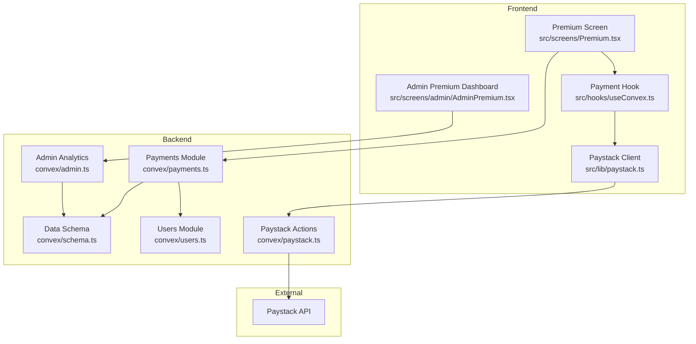
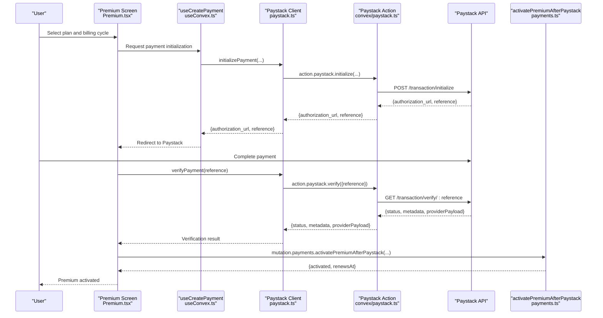
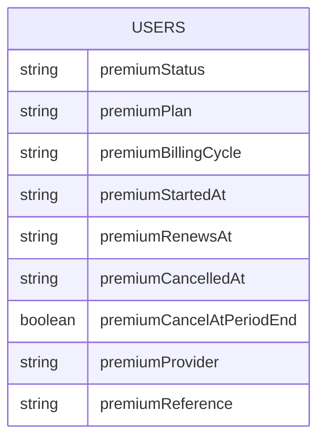
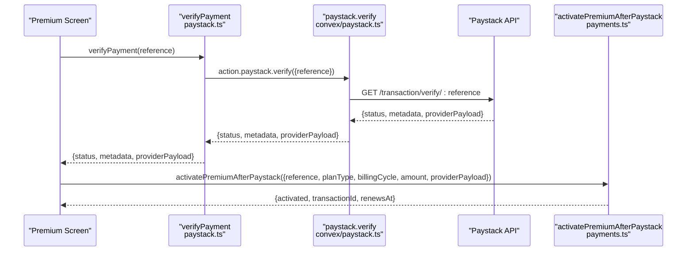
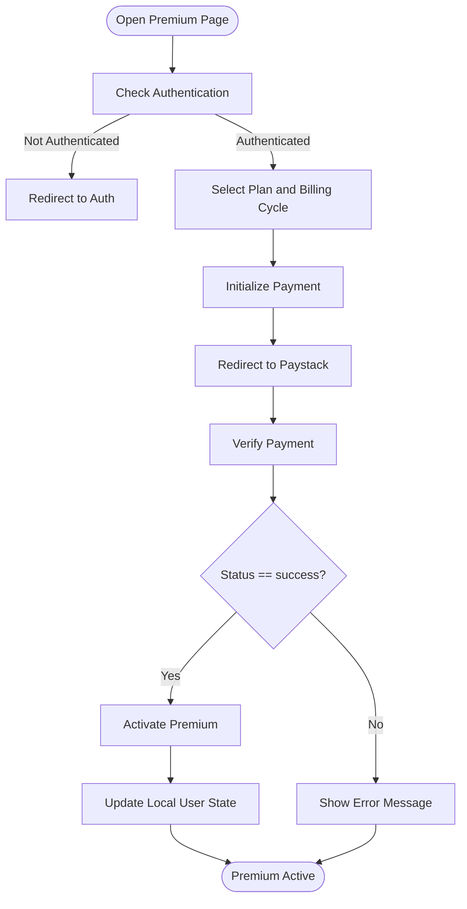
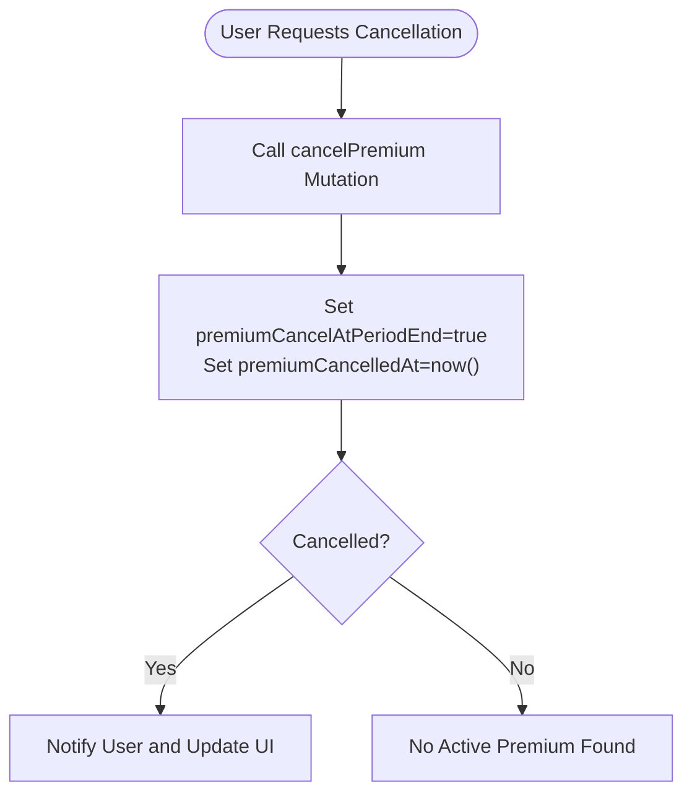
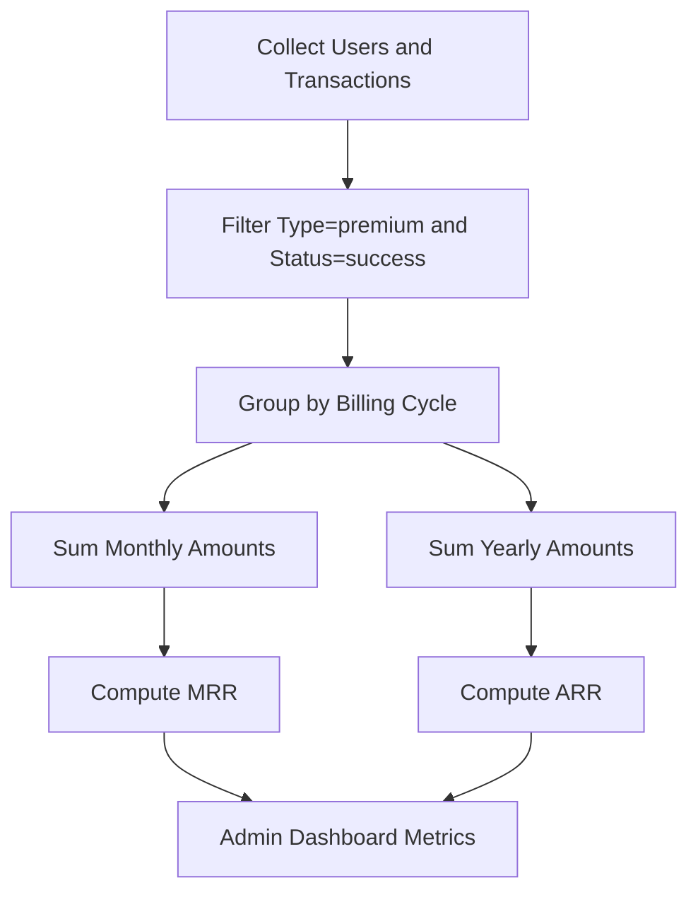
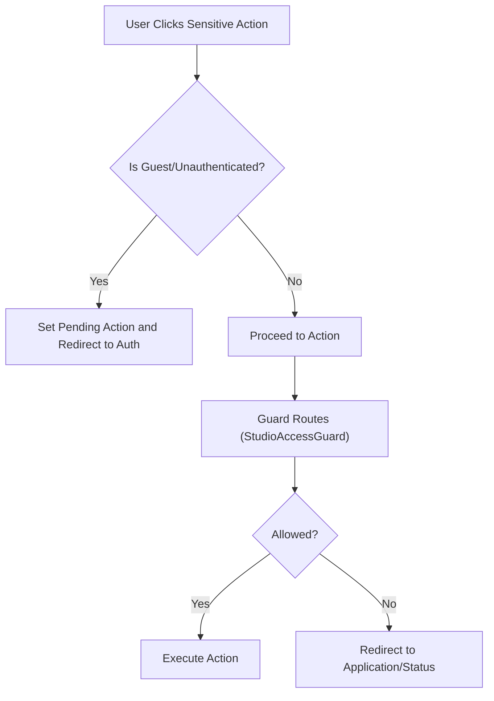
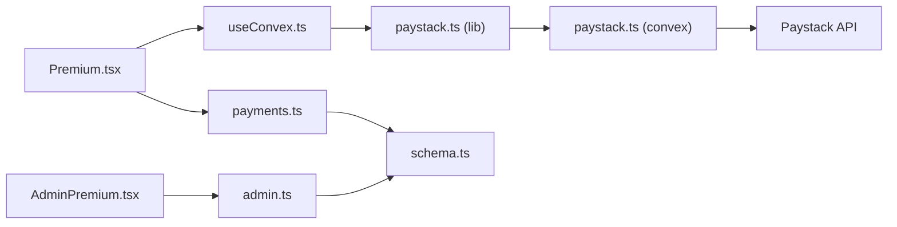

# Subscription System

<cite>
**Referenced Files in This Document**
- [schema.ts](file://convex/schema.ts)
- [users.ts](file://convex/users.ts)
- [payments.ts](file://convex/payments.ts)
- [paystack.ts](file://convex/paystack.ts)
- [paystack-initialize.ts](file://api/paystack-initialize.ts)
- [paystack-verify.ts](file://api/paystack-verify.ts)
- [Premium.tsx](file://src/screens/Premium.tsx)
- [useConvex.ts](file://src/hooks/useConvex.ts)
- [paystack.ts](file://src/lib/paystack.ts)
- [AdminPremium.tsx](file://src/screens/admin/AdminPremium.tsx)
- [admin.ts](file://convex/admin.ts)
- [ReaderProfile.tsx](file://src/screens/ReaderProfile.tsx)
- [SensitiveActionWrapper.tsx](file://src/components/SensitiveActionWrapper.tsx)
- [StudioAccessGuard.tsx](file://src/components/StudioAccessGuard.tsx)
</cite>

## Table of Contents
1. [Introduction](#introduction)
2. [Project Structure](#project-structure)
3. [Core Components](#core-components)
4. [Architecture Overview](#architecture-overview)
5. [Detailed Component Analysis](#detailed-component-analysis)
6. [Dependency Analysis](#dependency-analysis)
7. [Performance Considerations](#performance-considerations)
8. [Troubleshooting Guide](#troubleshooting-guide)
9. [Conclusion](#conclusion)
10. [Appendices](#appendices)

## Introduction
This document describes the subscription system for premium and patron memberships, focusing on the end-to-end lifecycle from plan selection to renewal and cancellation. It covers the Paystack integration for subscription creation and recurring billing, the backend state machine for subscription management, the frontend subscription management UI, analytics and revenue tracking, and security controls around access and validation.

## Project Structure
The subscription system spans three layers:
- Frontend screens and hooks for plan selection, payment initiation, and subscription management
- Convex backend mutations and queries for user state updates, transaction recording, and analytics
- Paystack integration via Convex actions and legacy API handlers

**Diagram sources**
- [Premium.tsx:13-360](file://src/screens/Premium.tsx#L13-L360)
- [useConvex.ts:65-109](file://src/hooks/useConvex.ts#L65-L109)
- [paystack.ts:1-115](file://src/lib/paystack.ts#L1-L115)
- [schema.ts:24-67](file://convex/schema.ts#L24-L67)
- [users.ts:1-360](file://convex/users.ts#L1-L360)
- [payments.ts:174-291](file://convex/payments.ts#L174-L291)
- [paystack.ts:5-71](file://convex/paystack.ts#L5-L71)
- [admin.ts:130-177](file://convex/admin.ts#L130-L177)

**Section sources**
- [schema.ts:24-67](file://convex/schema.ts#L24-L67)
- [Premium.tsx:13-360](file://src/screens/Premium.tsx#L13-L360)
- [useConvex.ts:65-109](file://src/hooks/useConvex.ts#L65-L109)
- [paystack.ts:1-115](file://src/lib/paystack.ts#L1-L115)
- [payments.ts:174-291](file://convex/payments.ts#L174-L291)
- [paystack.ts:5-71](file://convex/paystack.ts#L5-L71)
- [admin.ts:130-177](file://convex/admin.ts#L130-L177)

## Core Components
- Subscription state model: stored in the users table with fields for status, plan type, billing cycle, start/renew/cancel timestamps, provider, and reference.
- Payment orchestration: initializes Paystack transactions (either one-time or plan-based), verifies payments, and activates premium subscriptions.
- Frontend subscription UI: plan selection, billing cycle toggle, payment initiation, and post-payment activation.
- Admin analytics dashboard: counts active subscribers, conversion/churn rates, and revenue forecasts.

**Section sources**
- [schema.ts:38-51](file://convex/schema.ts#L38-L51)
- [payments.ts:174-263](file://convex/payments.ts#L174-L263)
- [Premium.tsx:130-163](file://src/screens/Premium.tsx#L130-L163)
- [AdminPremium.tsx:8-28](file://src/screens/admin/AdminPremium.tsx#L8-L28)

## Architecture Overview
The subscription lifecycle integrates frontend UI, Convex backend, and Paystack. The flow begins with plan selection and payment initiation, proceeds through Paystack authorization, and concludes with premium activation and transaction recording.

**Diagram sources**
- [Premium.tsx:130-163](file://src/screens/Premium.tsx#L130-L163)
- [useConvex.ts:65-109](file://src/hooks/useConvex.ts#L65-L109)
- [paystack.ts:1-115](file://src/lib/paystack.ts#L1-L115)
- [paystack.ts:5-71](file://convex/paystack.ts#L5-L71)
- [payments.ts:174-263](file://convex/payments.ts#L174-L263)

## Detailed Component Analysis

### Subscription State Model
The subscription state is persisted in the users table with the following fields:
- premiumStatus: free, trial, premium, expired
- premiumPlan: premium or patron
- premiumBillingCycle: monthly or yearly
- premiumStartedAt: ISO timestamp when subscription started
- premiumRenewsAt: ISO timestamp of next renewal
- premiumCancelledAt: ISO timestamp when cancellation requested
- premiumCancelAtPeriodEnd: boolean flag for cancellation at period end
- premiumProvider: paystack
- premiumReference: Paystack reference

**Diagram sources**
- [schema.ts:38-51](file://convex/schema.ts#L38-L51)

**Section sources**
- [schema.ts:38-51](file://convex/schema.ts#L38-L51)

### Premium Activation Workflow (Paystack Integration)
Activation occurs after successful payment verification. The backend:
- Validates amount and reference
- Resolves user by firebaseUid or userId
- Computes next renewal based on billing cycle
- Updates user subscription fields
- Records a premium transaction

**Diagram sources**
- [Premium.tsx:39-101](file://src/screens/Premium.tsx#L39-L101)
- [paystack.ts:46-71](file://convex/paystack.ts#L46-L71)
- [payments.ts:174-263](file://convex/payments.ts#L174-L263)

**Section sources**
- [Premium.tsx:39-101](file://src/screens/Premium.tsx#L39-L101)
- [payments.ts:174-263](file://convex/payments.ts#L174-L263)

### Subscription Management UI
The Premium screen allows:
- Plan selection (Premium vs Patron)
- Billing cycle toggle (Monthly/Yearly)
- Payment initiation via Paystack
- Post-payment verification and activation
- Display of success/error messages

**Diagram sources**
- [Premium.tsx:130-163](file://src/screens/Premium.tsx#L130-L163)
- [Premium.tsx:39-101](file://src/screens/Premium.tsx#L39-L101)

**Section sources**
- [Premium.tsx:130-163](file://src/screens/Premium.tsx#L130-L163)
- [Premium.tsx:39-101](file://src/screens/Premium.tsx#L39-L101)

### Cancellation and Renewal Control
Cancellation sets a flag to continue until the end of the current billing period. The admin dashboard displays cancellation-at-period-end status and renewal dates.

**Diagram sources**
- [ReaderProfile.tsx:77-106](file://src/screens/ReaderProfile.tsx#L77-L106)
- [payments.ts:265-291](file://convex/payments.ts#L265-L291)

**Section sources**
- [ReaderProfile.tsx:77-106](file://src/screens/ReaderProfile.tsx#L77-L106)
- [payments.ts:265-291](file://convex/payments.ts#L265-L291)

### Subscription Analytics and Revenue Tracking
Admin analytics compute:
- Active subscribers and trial members
- Conversion rate and churn rate
- Monthly recurring revenue (MRR) and annual run-rate (ARR)
- Total premium revenue

**Diagram sources**
- [admin.ts:130-177](file://convex/admin.ts#L130-L177)

**Section sources**
- [admin.ts:130-177](file://convex/admin.ts#L130-L177)
- [AdminPremium.tsx:70-82](file://src/screens/admin/AdminPremium.tsx#L70-L82)

### Security and Access Control
- SensitiveActionWrapper intercepts sensitive actions for guests and redirects to authentication with intent preservation.
- StudioAccessGuard enforces creator access eligibility and admin privileges for protected routes.
- Payment initialization requires signed-in users and plan metadata injection for auditability.
- Backend mutations validate presence of environment variables and user identity before processing.

**Diagram sources**
- [SensitiveActionWrapper.tsx:13-37](file://src/components/SensitiveActionWrapper.tsx#L13-L37)
- [StudioAccessGuard.tsx:9-35](file://src/components/StudioAccessGuard.tsx#L9-L35)

**Section sources**
- [SensitiveActionWrapper.tsx:13-37](file://src/components/SensitiveActionWrapper.tsx#L13-L37)
- [StudioAccessGuard.tsx:9-35](file://src/components/StudioAccessGuard.tsx#L9-L35)
- [useConvex.ts:65-109](file://src/hooks/useConvex.ts#L65-L109)
- [paystack.ts:15-18](file://convex/paystack.ts#L15-L18)

## Dependency Analysis
The subscription system exhibits clear separation of concerns:
- Frontend depends on Convex for mutations/actions and on Paystack for payment processing
- Backend depends on the schema for data modeling and on Paystack for verification
- Admin analytics depend on user and transaction collections

**Diagram sources**
- [Premium.tsx:13-360](file://src/screens/Premium.tsx#L13-L360)
- [useConvex.ts:65-109](file://src/hooks/useConvex.ts#L65-L109)
- [paystack.ts:1-115](file://src/lib/paystack.ts#L1-L115)
- [paystack.ts:5-71](file://convex/paystack.ts#L5-L71)
- [payments.ts:174-263](file://convex/payments.ts#L174-L263)
- [schema.ts:24-67](file://convex/schema.ts#L24-L67)
- [AdminPremium.tsx:1-187](file://src/screens/admin/AdminPremium.tsx#L1-L187)
- [admin.ts:130-177](file://convex/admin.ts#L130-L177)

**Section sources**
- [Premium.tsx:13-360](file://src/screens/Premium.tsx#L13-L360)
- [useConvex.ts:65-109](file://src/hooks/useConvex.ts#L65-L109)
- [paystack.ts:1-115](file://src/lib/paystack.ts#L1-L115)
- [paystack.ts:5-71](file://convex/paystack.ts#L5-L71)
- [payments.ts:174-263](file://convex/payments.ts#L174-L263)
- [schema.ts:24-67](file://convex/schema.ts#L24-L67)
- [AdminPremium.tsx:1-187](file://src/screens/admin/AdminPremium.tsx#L1-L187)
- [admin.ts:130-177](file://convex/admin.ts#L130-L177)

## Performance Considerations
- Minimize redundant database writes by checking existing transactions and user state before patching.
- Batch analytics computations using indexed queries on users and walletTransactions.
- Cache frequently accessed user subscription state in the frontend to reduce network requests.
- Use Paystack plans for recurring billing to avoid per-transaction overhead.

## Troubleshooting Guide
Common issues and resolutions:
- Missing Paystack secret key: Ensure environment variables are set in Convex; errors will surface during action invocation.
- Payment verification failures: Confirm reference validity and network connectivity to Paystack.
- User not found during activation: Verify firebaseUid or userId resolution and ensure user exists.
- Duplicate activation attempts: The backend checks existing transactions and prevents duplicate activations.

**Section sources**
- [paystack.ts:15-18](file://convex/paystack.ts#L15-L18)
- [Premium.tsx:92-97](file://src/screens/Premium.tsx#L92-L97)
- [payments.ts:208-210](file://convex/payments.ts#L208-L210)
- [payments.ts:212-219](file://convex/payments.ts#L212-L219)

## Conclusion
The subscription system integrates a clean frontend UX with robust backend state management and analytics. Paystack handles secure payment processing, while Convex mutations enforce validation and maintain accurate subscription state. Admin dashboards provide actionable insights into subscriber trends and revenue.

## Appendices

### Subscription Lifecycle Summary
- Plan Selection: Monthly/Yearly, Premium/Patron
- Billing Cycles: One-time or recurring via Paystack plans
- Renewal: Next renewal computed from current date plus cycle
- Cancellation: At period end with flagging and admin visibility

**Section sources**
- [Premium.tsx:20-25](file://src/screens/Premium.tsx#L20-L25)
- [payments.ts:221-228](file://convex/payments.ts#L221-L228)
- [payments.ts:265-291](file://convex/payments.ts#L265-L291)