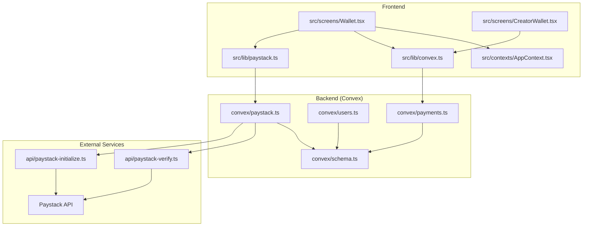
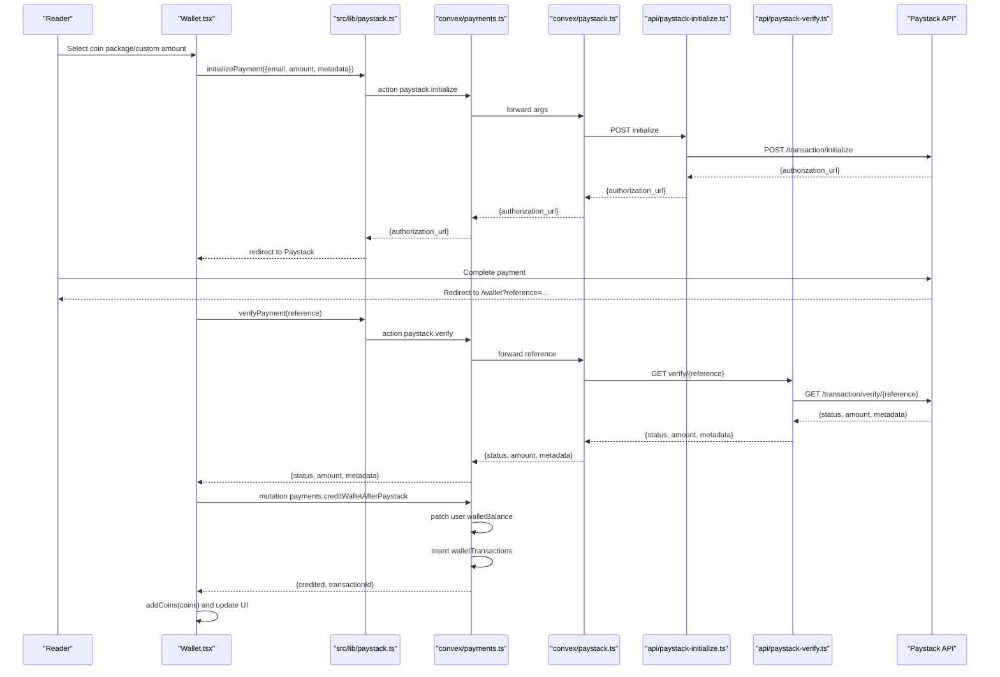
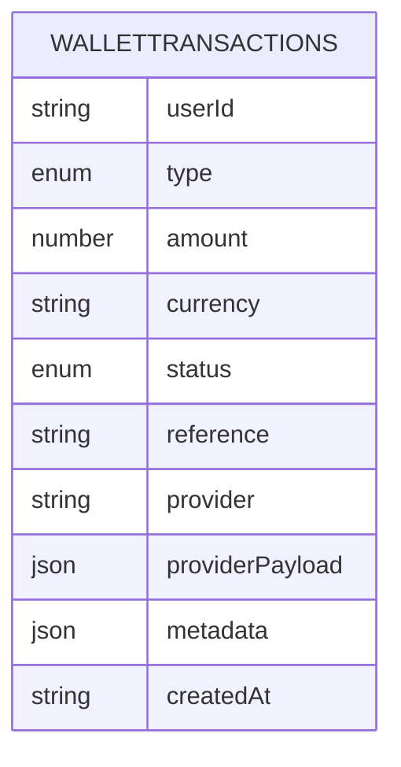
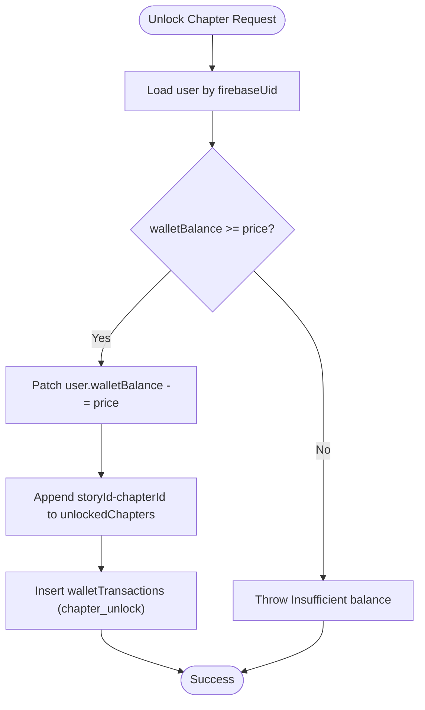
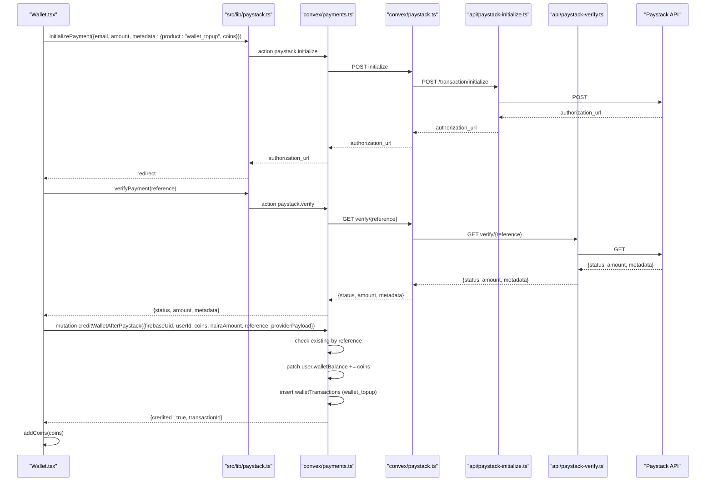
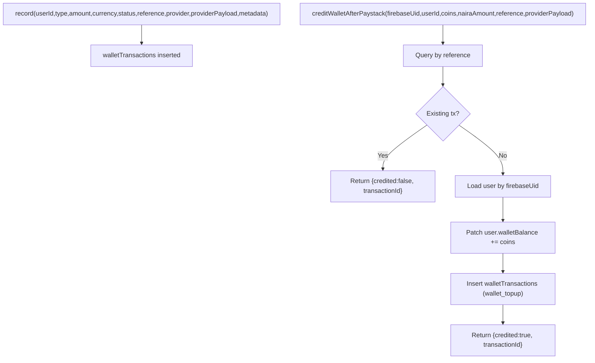
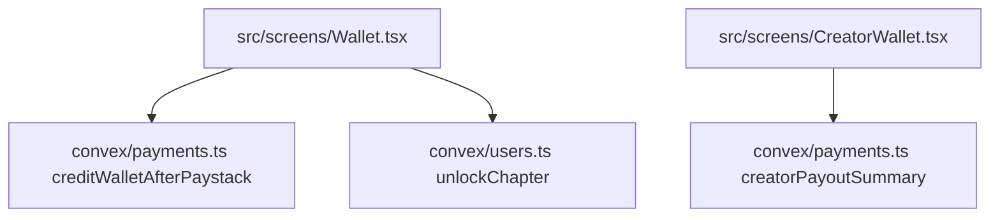
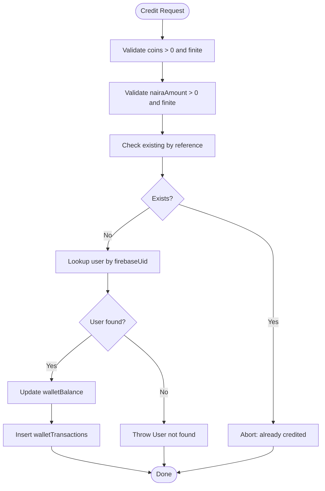
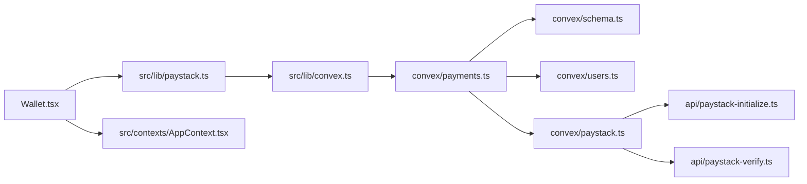

# Wallet Management

<cite>
**Referenced Files in This Document**
- [Wallet.tsx](file://src/screens/Wallet.tsx)
- [CreatorWallet.tsx](file://src/screens/CreatorWallet.tsx)
- [schema.ts](file://convex/schema.ts)
- [payments.ts](file://convex/payments.ts)
- [users.ts](file://convex/users.ts)
- [paystack.ts](file://convex/paystack.ts)
- [paystack-initialize.ts](file://api/paystack-initialize.ts)
- [paystack-verify.ts](file://api/paystack-verify.ts)
- [paystack.ts](file://src/lib/paystack.ts)
- [convex.ts](file://src/lib/convex.ts)
- [AppContext.tsx](file://src/contexts/AppContext.tsx)
- [admin.ts](file://convex/admin.ts)
</cite>

## Table of Contents
1. [Introduction](#introduction)
2. [Project Structure](#project-structure)
3. [Core Components](#core-components)
4. [Architecture Overview](#architecture-overview)
5. [Detailed Component Analysis](#detailed-component-analysis)
6. [Dependency Analysis](#dependency-analysis)
7. [Performance Considerations](#performance-considerations)
8. [Troubleshooting Guide](#troubleshooting-guide)
9. [Conclusion](#conclusion)

## Introduction
This document describes the digital wallet system for the Lemonade platform. It covers the transaction model, balance tracking, transaction history, Paystack integration for wallet top-ups, transaction recording, UI components, security and fraud considerations, and state synchronization between frontend and backend.

## Project Structure
The wallet system spans frontend UI components, Convex backend functions, and Paystack APIs:
- Frontend screens and UI: Wallet and CreatorWallet pages
- Backend schema and mutations: walletTransactions table, payment queries and mutations
- Paystack integration: Convex actions and API handlers
- Utilities: Paystack helpers and Convex client configuration

**Diagram sources**
- [Wallet.tsx:1-452](file://src/screens/Wallet.tsx#L1-L452)
- [CreatorWallet.tsx:1-287](file://src/screens/CreatorWallet.tsx#L1-L287)
- [paystack.ts:1-115](file://src/lib/paystack.ts#L1-L115)
- [convex.ts:1-12](file://src/lib/convex.ts#L1-L12)
- [schema.ts:198-223](file://convex/schema.ts#L198-L223)
- [payments.ts:1-291](file://convex/payments.ts#L1-L291)
- [users.ts:1-360](file://convex/users.ts#L1-L360)
- [paystack.ts:1-71](file://convex/paystack.ts#L1-L71)
- [paystack-initialize.ts:1-47](file://api/paystack-initialize.ts#L1-L47)
- [paystack-verify.ts:1-36](file://api/paystack-verify.ts#L1-L36)

**Section sources**
- [Wallet.tsx:1-452](file://src/screens/Wallet.tsx#L1-L452)
- [CreatorWallet.tsx:1-287](file://src/screens/CreatorWallet.tsx#L1-L287)
- [schema.ts:198-223](file://convex/schema.ts#L198-L223)
- [payments.ts:1-291](file://convex/payments.ts#L1-L291)
- [users.ts:1-360](file://convex/users.ts#L1-L360)
- [paystack.ts:1-71](file://convex/paystack.ts#L1-L71)
- [paystack-initialize.ts:1-47](file://api/paystack-initialize.ts#L1-L47)
- [paystack-verify.ts:1-36](file://api/paystack-verify.ts#L1-L36)
- [paystack.ts:1-115](file://src/lib/paystack.ts#L1-L115)
- [convex.ts:1-12](file://src/lib/convex.ts#L1-L12)

## Core Components
- Wallet screen: Balance display, coin packages, custom amounts, funding via Paystack, and transaction history
- Creator wallet: Earnings summary, payout account setup, and creator earnings history
- Backend schema: walletTransactions table with type, amount, currency, status, reference, provider, providerPayload, metadata
- Payment mutations: record, creditWalletAfterPaystack, creatorPayoutSummary, premium activation/cancellation
- Paystack integration: initialize and verify actions, plus API handlers
- Utilities: Paystack helpers (reference generation, currency conversion), Convex client

**Section sources**
- [Wallet.tsx:1-452](file://src/screens/Wallet.tsx#L1-L452)
- [CreatorWallet.tsx:1-287](file://src/screens/CreatorWallet.tsx#L1-L287)
- [schema.ts:198-223](file://convex/schema.ts#L198-L223)
- [payments.ts:82-172](file://convex/payments.ts#L82-L172)
- [paystack.ts:5-71](file://convex/paystack.ts#L5-L71)
- [paystack-initialize.ts:1-47](file://api/paystack-initialize.ts#L1-L47)
- [paystack-verify.ts:1-36](file://api/paystack-verify.ts#L1-L36)
- [paystack.ts:56-114](file://src/lib/paystack.ts#L56-L114)
- [convex.ts:1-12](file://src/lib/convex.ts#L1-L12)

## Architecture Overview
The wallet credit workflow integrates Paystack with backend mutations and frontend state updates.

**Diagram sources**
- [Wallet.tsx:45-91](file://src/screens/Wallet.tsx#L45-L91)
- [paystack.ts:56-84](file://src/lib/paystack.ts#L56-L84)
- [paystack.ts:5-71](file://convex/paystack.ts#L5-L71)
- [paystack-initialize.ts:1-47](file://api/paystack-initialize.ts#L1-L47)
- [paystack-verify.ts:1-36](file://api/paystack-verify.ts#L1-L36)
- [payments.ts:113-172](file://convex/payments.ts#L113-L172)

## Detailed Component Analysis

### Wallet Transaction Model
- Types: wallet_topup, chapter_unlock, creator_support, premium, refund
- Fields: userId, type, amount, currency, status, reference, provider, providerPayload, metadata, createdAt
- Indexes: by_userId, by_reference, by_status

**Diagram sources**
- [schema.ts:198-223](file://convex/schema.ts#L198-L223)

**Section sources**
- [schema.ts:198-223](file://convex/schema.ts#L198-L223)

### Balance Tracking and Chapter Unlock
- Users table includes walletBalance and arrays for unlock tracking
- Unlock mutation validates balance, updates balance and unlocked chapters, records transaction

**Diagram sources**
- [users.ts:269-310](file://convex/users.ts#L269-L310)

**Section sources**
- [users.ts:269-310](file://convex/users.ts#L269-L310)

### Wallet Credit Workflow (Paystack)
- Frontend initializes payment with metadata including product type and coin amount
- Backend forwards to Paystack via Convex action and API handler
- After redirect, frontend verifies payment and credits wallet via mutation
- Mutation ensures idempotency by checking reference, updates user balance, and inserts transaction

**Diagram sources**
- [Wallet.tsx:93-131](file://src/screens/Wallet.tsx#L93-L131)
- [Wallet.tsx:45-91](file://src/screens/Wallet.tsx#L45-L91)
- [paystack.ts:56-84](file://src/lib/paystack.ts#L56-L84)
- [paystack.ts:5-71](file://convex/paystack.ts#L5-L71)
- [paystack-initialize.ts:1-47](file://api/paystack-initialize.ts#L1-L47)
- [paystack-verify.ts:1-36](file://api/paystack-verify.ts#L1-L36)
- [payments.ts:113-172](file://convex/payments.ts#L113-L172)

**Section sources**
- [Wallet.tsx:45-131](file://src/screens/Wallet.tsx#L45-L131)
- [paystack.ts:56-84](file://src/lib/paystack.ts#L56-L84)
- [paystack.ts:5-71](file://convex/paystack.ts#L5-L71)
- [paystack-initialize.ts:1-47](file://api/paystack-initialize.ts#L1-L47)
- [paystack-verify.ts:1-36](file://api/paystack-verify.ts#L1-L36)
- [payments.ts:113-172](file://convex/payments.ts#L113-L172)

### Transaction Recording System
- record mutation inserts walletTransactions with provided fields and timestamps
- creditWalletAfterPaystack mutation enforces idempotency by reference, updates user balance, and records transaction
- creatorPayoutSummary aggregates creator_support transactions for a creator’s earnings

**Diagram sources**
- [payments.ts:82-111](file://convex/payments.ts#L82-L111)
- [payments.ts:113-172](file://convex/payments.ts#L113-L172)

**Section sources**
- [payments.ts:82-172](file://convex/payments.ts#L82-L172)

### Wallet UI Components
- Wallet screen displays balance, coin packages, custom coin input, Paystack-secured badge, and activity history
- CreatorWallet displays available earnings, pending/paid status, lifetime earnings, payout account setup, and recent earnings
- Both screens rely on Convex queries and mutations for data and actions

**Diagram sources**
- [Wallet.tsx:1-452](file://src/screens/Wallet.tsx#L1-L452)
- [CreatorWallet.tsx:1-287](file://src/screens/CreatorWallet.tsx#L1-L287)
- [payments.ts:21-80](file://convex/payments.ts#L21-L80)
- [users.ts:269-310](file://convex/users.ts#L269-L310)

**Section sources**
- [Wallet.tsx:1-452](file://src/screens/Wallet.tsx#L1-L452)
- [CreatorWallet.tsx:1-287](file://src/screens/CreatorWallet.tsx#L1-L287)
- [payments.ts:21-80](file://convex/payments.ts#L21-L80)
- [users.ts:269-310](file://convex/users.ts#L269-L310)

### Security and Fraud Considerations
- Idempotent crediting: backend checks reference to avoid double crediting
- Validation: backend validates coin and naira amounts are finite and positive
- User lookup: backend resolves user by firebaseUid for credit operations
- Fraud detection: admin module scans engagement events and creates fraudEvents for suspicious activity
- Admin actions: list, scan, and resolve fraud events

**Diagram sources**
- [payments.ts:113-172](file://convex/payments.ts#L113-L172)
- [admin.ts:312-363](file://convex/admin.ts#L312-L363)

**Section sources**
- [payments.ts:113-172](file://convex/payments.ts#L113-L172)
- [admin.ts:312-363](file://convex/admin.ts#L312-L363)

### State Synchronization and Real-time Updates
- Frontend state updates via AppContext addCoins/addFunds notifications and immediate balance increments
- Backend state updates via Convex mutations and database writes
- Real-time balance updates occur after successful mutations; UI reflects changes immediately upon mutation completion

**Section sources**
- [AppContext.tsx:1091-1117](file://src/contexts/AppContext.tsx#L1091-L1117)
- [payments.ts:113-172](file://convex/payments.ts#L113-L172)
- [users.ts:269-310](file://convex/users.ts#L269-L310)

## Dependency Analysis
- Frontend depends on Convex client and Paystack utilities for payment lifecycle
- Backend depends on Paystack API via Convex actions and API handlers
- Transactions depend on schema indexes for efficient querying and filtering
- Creator wallet depends on creatorSupport transactions aggregation

**Diagram sources**
- [Wallet.tsx:1-452](file://src/screens/Wallet.tsx#L1-L452)
- [paystack.ts:1-115](file://src/lib/paystack.ts#L1-L115)
- [convex.ts:1-12](file://src/lib/convex.ts#L1-L12)
- [payments.ts:1-291](file://convex/payments.ts#L1-L291)
- [schema.ts:198-223](file://convex/schema.ts#L198-L223)
- [users.ts:1-360](file://convex/users.ts#L1-L360)
- [paystack.ts:1-71](file://convex/paystack.ts#L1-L71)
- [paystack-initialize.ts:1-47](file://api/paystack-initialize.ts#L1-L47)
- [paystack-verify.ts:1-36](file://api/paystack-verify.ts#L1-L36)

**Section sources**
- [Wallet.tsx:1-452](file://src/screens/Wallet.tsx#L1-L452)
- [paystack.ts:1-115](file://src/lib/paystack.ts#L1-L115)
- [convex.ts:1-12](file://src/lib/convex.ts#L1-L12)
- [payments.ts:1-291](file://convex/payments.ts#L1-L291)
- [schema.ts:198-223](file://convex/schema.ts#L198-L223)
- [users.ts:1-360](file://convex/users.ts#L1-L360)
- [paystack.ts:1-71](file://convex/paystack.ts#L1-L71)
- [paystack-initialize.ts:1-47](file://api/paystack-initialize.ts#L1-L47)
- [paystack-verify.ts:1-36](file://api/paystack-verify.ts#L1-L36)

## Performance Considerations
- Use indexes on walletTransactions by userId, reference, and status for fast queries
- Batch reads/writes where possible; leverage Convex’s query batching
- Avoid redundant balance updates; ensure idempotency prevents unnecessary writes
- Cache frequently accessed user data in frontend state to reduce backend round trips

## Troubleshooting Guide
Common issues and resolutions:
- Missing Paystack keys: Ensure environment variables are set; errors are normalized to guide configuration
- Payment verification failure: Confirm reference exists and Paystack returned success status
- Double crediting: Reference-based idempotency prevents duplicate credits
- User not found during credit: Verify firebaseUid mapping and user existence
- Insufficient balance on unlock: Ensure user has sufficient walletBalance before attempting unlock

**Section sources**
- [paystack.ts:37-51](file://src/lib/paystack.ts#L37-L51)
- [payments.ts:113-172](file://convex/payments.ts#L113-L172)
- [users.ts:269-310](file://convex/users.ts#L269-L310)

## Conclusion
The Lemonade wallet system provides a secure, auditable, and user-friendly mechanism for managing digital currency. It integrates Paystack for payments, maintains a robust transaction ledger, and offers clear UI components for readers and creators. Idempotent crediting, validation, and fraud detection safeguards protect the integrity of the system, while frontend/backend synchronization ensures a responsive user experience.