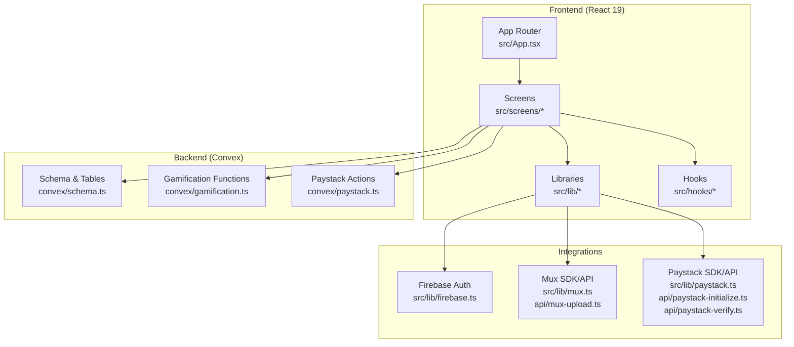
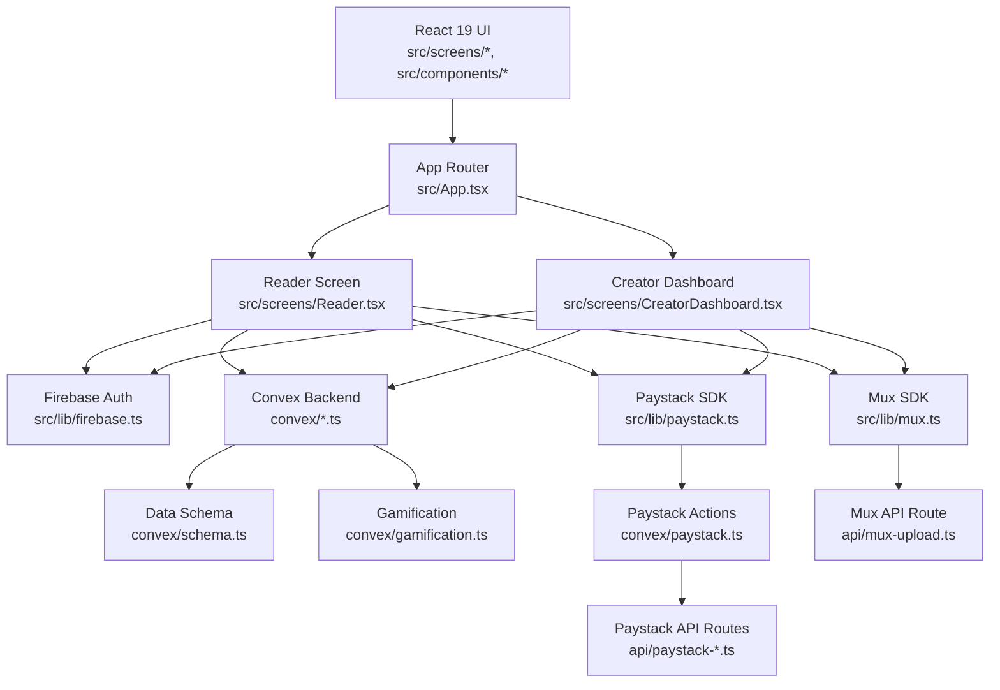
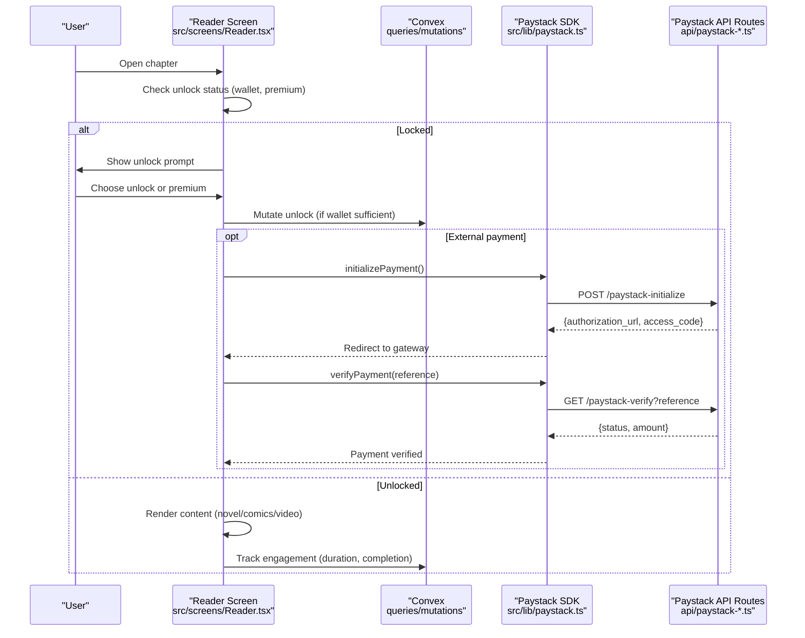
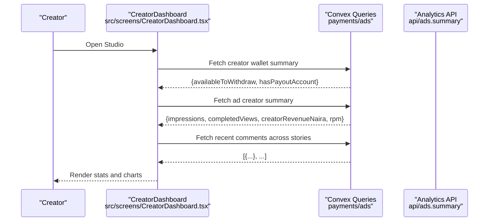
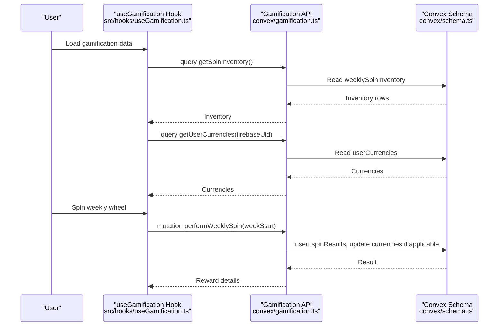
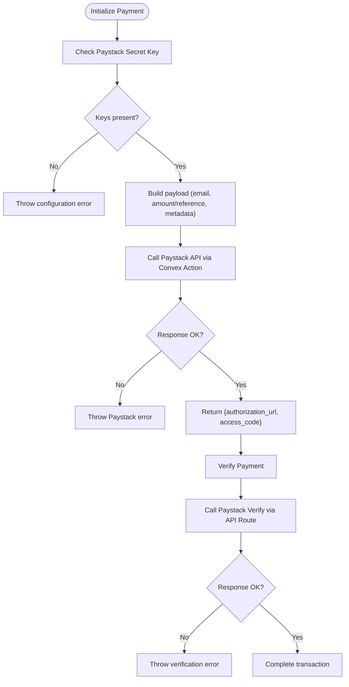
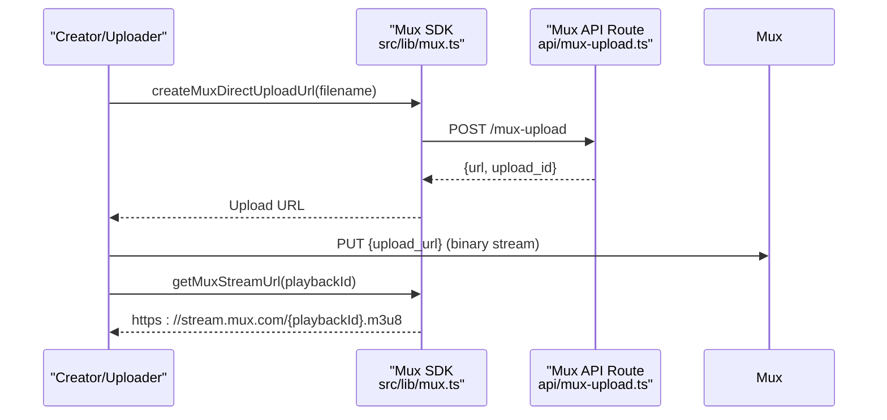
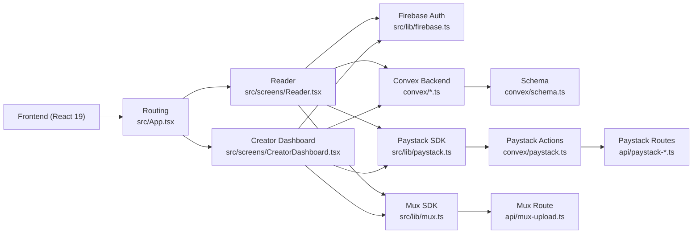

# Project Overview

<cite>
**Referenced Files in This Document**
- [README.md](file://README.md)
- [package.json](file://package.json)
- [src/App.tsx](file://src/App.tsx)
- [convex/schema.ts](file://convex/schema.ts)
- [src/lib/firebase.ts](file://src/lib/firebase.ts)
- [convex/gamification.ts](file://convex/gamification.ts)
- [src/hooks/useGamification.ts](file://src/hooks/useGamification.ts)
- [src/lib/paystack.ts](file://src/lib/paystack.ts)
- [convex/paystack.ts](file://convex/paystack.ts)
- [api/paystack-initialize.ts](file://api/paystack-initialize.ts)
- [api/paystack-verify.ts](file://api/paystack-verify.ts)
- [src/lib/mux.ts](file://src/lib/mux.ts)
- [api/mux-upload.ts](file://api/mux-upload.ts)
- [src/screens/CreatorDashboard.tsx](file://src/screens/CreatorDashboard.tsx)
- [src/screens/Reader.tsx](file://src/screens/Reader.tsx)
</cite>

## Table of Contents
1. [Introduction](#introduction)
2. [Project Structure](#project-structure)
3. [Core Components](#core-components)
4. [Architecture Overview](#architecture-overview)
5. [Detailed Component Analysis](#detailed-component-analysis)
6. [Dependency Analysis](#dependency-analysis)
7. [Performance Considerations](#performance-considerations)
8. [Troubleshooting Guide](#troubleshooting-guide)
9. [Conclusion](#conclusion)

## Introduction
Lemonade is a digital storytelling marketplace designed for manga, novels, and movies. It offers a dual-user experience:
- Reader mode: discover, read, and engage with stories; access premium content and earn reader rewards.
- Creator mode: publish, monetize, manage analytics, and grow a fanbase.

Key value propositions:
- For creators: monetization through ad revenue sharing, chapter-level payments, and creator support programs; analytics and wallet management; gamification-driven engagement.
- For readers: premium content access, ad-gated free reading, and gamified engagement (coins, streaks, spins).
- Platform-wide: robust moderation, reporting, and admin controls; integrated video streaming and secure payments.

Target audiences:
- Readers: casual and dedicated fans seeking manga, novels, and movies with flexible access and premium tiers.
- Creators: artists, writers, and studios building portfolios and sustainable income streams.
- Administrators: platform moderators and operators managing content, ads, and financial settlements.

Primary use cases:
- Reader: browse stories, unlock chapters, read in-app or via video, participate in comments, and engage with gamification.
- Creator: upload stories, configure monetization, monitor earnings, and manage community interactions.
- Administrator: review reports, moderate content, configure campaigns, and audit activities.

Technology stack overview:
- Frontend: React 19 with Vite and React Router for a modern, responsive UI.
- Backend: Convex for database, serverless functions, and real-time queries.
- Authentication: Firebase Authentication for secure sign-in and persistence.
- Media: Mux for video upload and playback orchestration.
- Payments: Paystack for initialization and verification of transactions.
- Integrations: Convex actions and API routes bridge frontend and third-party services.

## Project Structure
The project follows a feature-based frontend structure with a dedicated Convex backend and API routes for integrations. Key areas:
- Frontend routing and screens under src/screens and src/components.
- Convex schema and server-side logic under convex/.
- Utility libraries for integrations under src/lib.
- API routes for Paystack and Mux under api/.

**Diagram sources**
- [src/App.tsx:1-375](file://src/App.tsx#L1-L375)
- [convex/schema.ts:1-493](file://convex/schema.ts#L1-L493)
- [convex/gamification.ts:1-331](file://convex/gamification.ts#L1-L331)
- [convex/paystack.ts:1-71](file://convex/paystack.ts#L1-L71)
- [src/lib/firebase.ts:1-55](file://src/lib/firebase.ts#L1-L55)
- [src/lib/mux.ts:1-66](file://src/lib/mux.ts#L1-L66)
- [api/mux-upload.ts:1-45](file://api/mux-upload.ts#L1-L45)
- [src/lib/paystack.ts:1-115](file://src/lib/paystack.ts#L1-L115)
- [api/paystack-initialize.ts:1-47](file://api/paystack-initialize.ts#L1-L47)
- [api/paystack-verify.ts:1-36](file://api/paystack-verify.ts#L1-L36)

**Section sources**
- [src/App.tsx:1-375](file://src/App.tsx#L1-L375)
- [convex/schema.ts:1-493](file://convex/schema.ts#L1-L493)

## Core Components
- Routing and navigation: centralized in App Router with animated transitions and route guards for admin and studio access.
- Authentication: Firebase Auth initialized with persistence and emulator support for development.
- Data model: Convex schema defines users, creators, stories, wallet transactions, gamification tables, and ad analytics.
- Reader experience: Reader screen handles unlocking, ad gating, comments, and engagement tracking.
- Creator dashboard: CreatorDashboard aggregates earnings, ad metrics, and recent activity.
- Payments: Paystack integration via Convex actions and API routes for initialization and verification.
- Video streaming: Mux integration for upload creation and playback URLs.
- Gamification: Weekly spins, streak protection, XP, and currencies managed through Convex queries and mutations.

**Section sources**
- [src/App.tsx:1-375](file://src/App.tsx#L1-L375)
- [src/lib/firebase.ts:1-55](file://src/lib/firebase.ts#L1-L55)
- [convex/schema.ts:1-493](file://convex/schema.ts#L1-L493)
- [src/screens/Reader.tsx:1-544](file://src/screens/Reader.tsx#L1-L544)
- [src/screens/CreatorDashboard.tsx:1-322](file://src/screens/CreatorDashboard.tsx#L1-L322)
- [src/lib/paystack.ts:1-115](file://src/lib/paystack.ts#L1-L115)
- [convex/paystack.ts:1-71](file://convex/paystack.ts#L1-L71)
- [api/paystack-initialize.ts:1-47](file://api/paystack-initialize.ts#L1-L47)
- [api/paystack-verify.ts:1-36](file://api/paystack-verify.ts#L1-L36)
- [src/lib/mux.ts:1-66](file://src/lib/mux.ts#L1-L66)
- [api/mux-upload.ts:1-45](file://api/mux-upload.ts#L1-L45)
- [convex/gamification.ts:1-331](file://convex/gamification.ts#L1-L331)
- [src/hooks/useGamification.ts:1-48](file://src/hooks/useGamification.ts#L1-L48)

## Architecture Overview
High-level architecture ties the frontend, Convex backend, and third-party services together to deliver a seamless storytelling experience.

**Diagram sources**
- [src/App.tsx:1-375](file://src/App.tsx#L1-L375)
- [src/lib/firebase.ts:1-55](file://src/lib/firebase.ts#L1-L55)
- [convex/schema.ts:1-493](file://convex/schema.ts#L1-L493)
- [convex/gamification.ts:1-331](file://convex/gamification.ts#L1-L331)
- [convex/paystack.ts:1-71](file://convex/paystack.ts#L1-L71)
- [api/paystack-initialize.ts:1-47](file://api/paystack-initialize.ts#L1-L47)
- [api/paystack-verify.ts:1-36](file://api/paystack-verify.ts#L1-L36)
- [src/lib/mux.ts:1-66](file://src/lib/mux.ts#L1-L66)
- [api/mux-upload.ts:1-45](file://api/mux-upload.ts#L1-L45)
- [src/screens/Reader.tsx:1-544](file://src/screens/Reader.tsx#L1-L544)
- [src/screens/CreatorDashboard.tsx:1-322](file://src/screens/CreatorDashboard.tsx#L1-L322)

## Detailed Component Analysis

### Reader Experience and Monetization
The Reader screen orchestrates unlocking, ad gating, comments, and engagement tracking. It supports chapter-level monetization and premium tiers.

**Diagram sources**
- [src/screens/Reader.tsx:1-544](file://src/screens/Reader.tsx#L1-L544)
- [src/lib/paystack.ts:1-115](file://src/lib/paystack.ts#L1-L115)
- [api/paystack-initialize.ts:1-47](file://api/paystack-initialize.ts#L1-L47)
- [api/paystack-verify.ts:1-36](file://api/paystack-verify.ts#L1-L36)

**Section sources**
- [src/screens/Reader.tsx:1-544](file://src/screens/Reader.tsx#L1-L544)
- [src/lib/paystack.ts:1-115](file://src/lib/paystack.ts#L1-L115)
- [api/paystack-initialize.ts:1-47](file://api/paystack-initialize.ts#L1-L47)
- [api/paystack-verify.ts:1-36](file://api/paystack-verify.ts#L1-L36)

### Creator Dashboard and Analytics
The CreatorDashboard aggregates earnings, ad metrics, and recent comments to support monetization decisions and community growth.

**Diagram sources**
- [src/screens/CreatorDashboard.tsx:1-322](file://src/screens/CreatorDashboard.tsx#L1-L322)
- [convex/schema.ts:1-493](file://convex/schema.ts#L1-L493)

**Section sources**
- [src/screens/CreatorDashboard.tsx:1-322](file://src/screens/CreatorDashboard.tsx#L1-L322)
- [convex/schema.ts:1-493](file://convex/schema.ts#L1-L493)

### Gamification and Reader Engagement
Gamification drives retention and engagement through streaks, weekly spins, XP, and currencies.

**Diagram sources**
- [src/hooks/useGamification.ts:1-48](file://src/hooks/useGamification.ts#L1-L48)
- [convex/gamification.ts:1-331](file://convex/gamification.ts#L1-L331)
- [convex/schema.ts:1-493](file://convex/schema.ts#L1-L493)

**Section sources**
- [src/hooks/useGamification.ts:1-48](file://src/hooks/useGamification.ts#L1-L48)
- [convex/gamification.ts:1-331](file://convex/gamification.ts#L1-L331)
- [convex/schema.ts:1-493](file://convex/schema.ts#L1-L493)

### Payments with Paystack
Payments are handled securely through Paystack using Convex actions and API routes.

**Diagram sources**
- [src/lib/paystack.ts:1-115](file://src/lib/paystack.ts#L1-L115)
- [convex/paystack.ts:1-71](file://convex/paystack.ts#L1-L71)
- [api/paystack-initialize.ts:1-47](file://api/paystack-initialize.ts#L1-L47)
- [api/paystack-verify.ts:1-36](file://api/paystack-verify.ts#L1-L36)

**Section sources**
- [src/lib/paystack.ts:1-115](file://src/lib/paystack.ts#L1-L115)
- [convex/paystack.ts:1-71](file://convex/paystack.ts#L1-L71)
- [api/paystack-initialize.ts:1-47](file://api/paystack-initialize.ts#L1-L47)
- [api/paystack-verify.ts:1-36](file://api/paystack-verify.ts#L1-L36)

### Video Streaming with Mux
Mux enables efficient video uploads and playback for movie content.

**Diagram sources**
- [src/lib/mux.ts:1-66](file://src/lib/mux.ts#L1-L66)
- [api/mux-upload.ts:1-45](file://api/mux-upload.ts#L1-L45)

**Section sources**
- [src/lib/mux.ts:1-66](file://src/lib/mux.ts#L1-L66)
- [api/mux-upload.ts:1-45](file://api/mux-upload.ts#L1-L45)

## Dependency Analysis
The frontend depends on Convex for data and serverless logic, Firebase for identity, and external services for payments and media. Convex encapsulates schema and business logic, while API routes provide controlled access to third-party providers.

**Diagram sources**
- [src/App.tsx:1-375](file://src/App.tsx#L1-L375)
- [src/lib/firebase.ts:1-55](file://src/lib/firebase.ts#L1-L55)
- [convex/schema.ts:1-493](file://convex/schema.ts#L1-L493)
- [convex/paystack.ts:1-71](file://convex/paystack.ts#L1-L71)
- [src/lib/paystack.ts:1-115](file://src/lib/paystack.ts#L1-L115)
- [api/paystack-initialize.ts:1-47](file://api/paystack-initialize.ts#L1-L47)
- [api/paystack-verify.ts:1-36](file://api/paystack-verify.ts#L1-L36)
- [src/lib/mux.ts:1-66](file://src/lib/mux.ts#L1-L66)
- [api/mux-upload.ts:1-45](file://api/mux-upload.ts#L1-L45)
- [src/screens/Reader.tsx:1-544](file://src/screens/Reader.tsx#L1-L544)
- [src/screens/CreatorDashboard.tsx:1-322](file://src/screens/CreatorDashboard.tsx#L1-L322)

**Section sources**
- [src/App.tsx:1-375](file://src/App.tsx#L1-L375)
- [convex/schema.ts:1-493](file://convex/schema.ts#L1-L493)
- [src/lib/firebase.ts:1-55](file://src/lib/firebase.ts#L1-L55)
- [src/lib/paystack.ts:1-115](file://src/lib/paystack.ts#L1-L115)
- [convex/paystack.ts:1-71](file://convex/paystack.ts#L1-L71)
- [api/paystack-initialize.ts:1-47](file://api/paystack-initialize.ts#L1-L47)
- [api/paystack-verify.ts:1-36](file://api/paystack-verify.ts#L1-L36)
- [src/lib/mux.ts:1-66](file://src/lib/mux.ts#L1-L66)
- [api/mux-upload.ts:1-45](file://api/mux-upload.ts#L1-L45)
- [src/screens/Reader.tsx:1-544](file://src/screens/Reader.tsx#L1-L544)
- [src/screens/CreatorDashboard.tsx:1-322](file://src/screens/CreatorDashboard.tsx#L1-L322)

## Performance Considerations
- Lazy loading and route-based code splitting reduce initial bundle size.
- Convex queries and mutations should be indexed appropriately to minimize latency (as seen in schema indexes).
- Debounce or throttle engagement tracking to avoid excessive writes.
- Use pagination for comments and analytics to limit payload sizes.
- Cache frequently accessed data (e.g., story metadata) in memory or via Convex caching patterns.

## Troubleshooting Guide
Common issues and resolutions:
- Missing environment keys:
  - Paystack: ensure PAYSTACK_SECRET_KEY is configured in Convex environment and VITE_PAYSTACK_PUBLIC_KEY in the frontend.
  - Mux: ensure MUX_TOKEN_ID and MUX_TOKEN_SECRET are set for API routes.
  - Firebase: confirm VITE_FIREBASE_* variables and emulator toggles for local development.
- Payment errors:
  - Verify Paystack initialization and verification endpoints return success; inspect normalized error messages for setup problems.
- Video upload failures:
  - Confirm Mux credentials and CORS origin; ensure upload route responds with a valid URL.
- Gamification not updating:
  - Check weekly spin inventory is active and user engagement events are being recorded.

**Section sources**
- [src/lib/paystack.ts:1-115](file://src/lib/paystack.ts#L1-L115)
- [api/paystack-initialize.ts:1-47](file://api/paystack-initialize.ts#L1-L47)
- [api/paystack-verify.ts:1-36](file://api/paystack-verify.ts#L1-L36)
- [api/mux-upload.ts:1-45](file://api/mux-upload.ts#L1-L45)
- [src/lib/mux.ts:1-66](file://src/lib/mux.ts#L1-L66)
- [src/lib/firebase.ts:1-55](file://src/lib/firebase.ts#L1-L55)

## Conclusion
Lemonade combines a modern React 19 frontend with a robust Convex backend and integrations to deliver a cohesive storytelling marketplace. Its dual-mode design, strong monetization pathways for creators, reader-centric premium access, and gamification features position it to build engaged communities across manga, novels, and movies. The architecture cleanly separates concerns, enabling scalable enhancements and reliable operations.