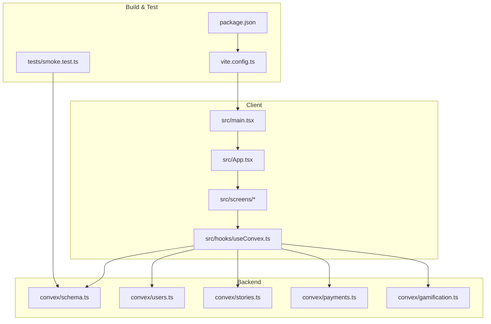
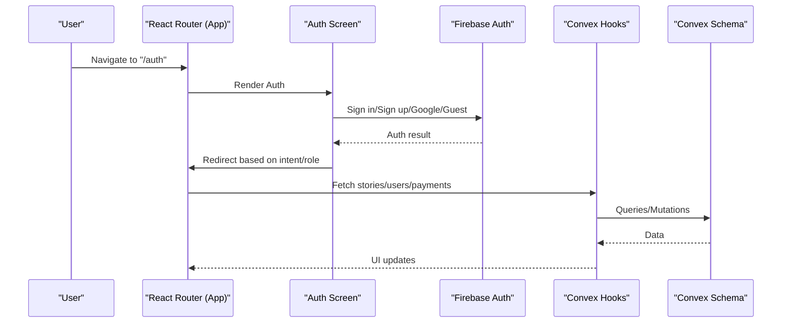
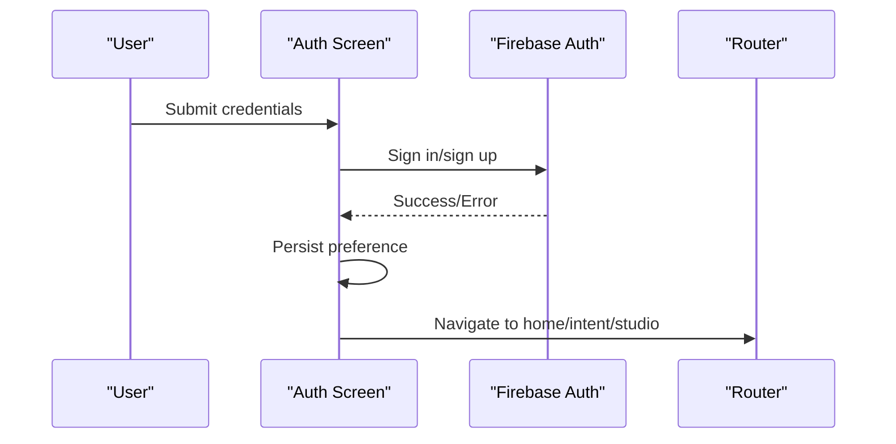
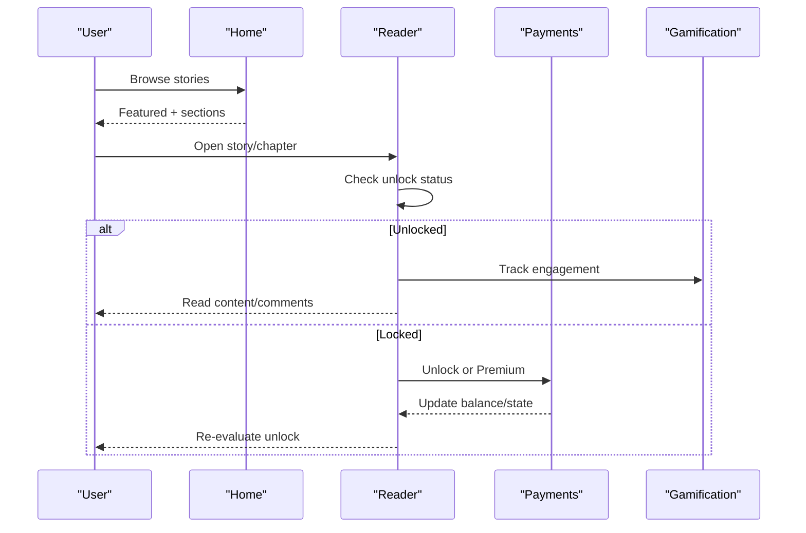
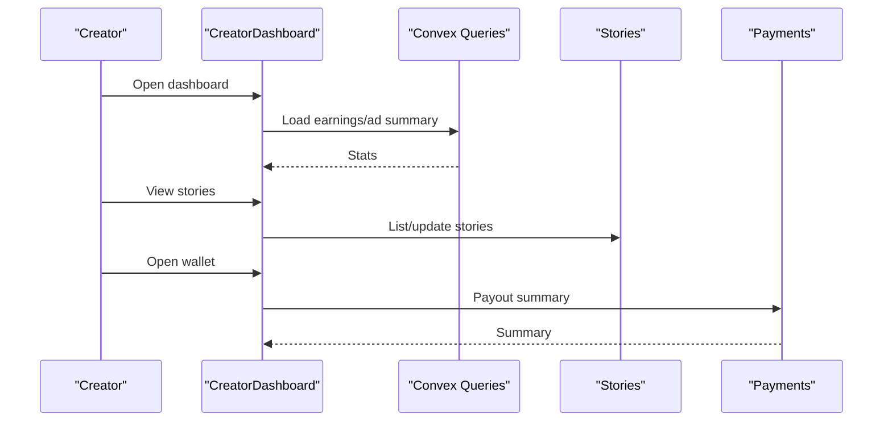
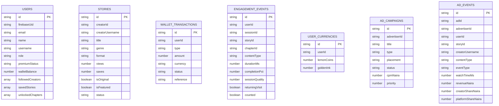
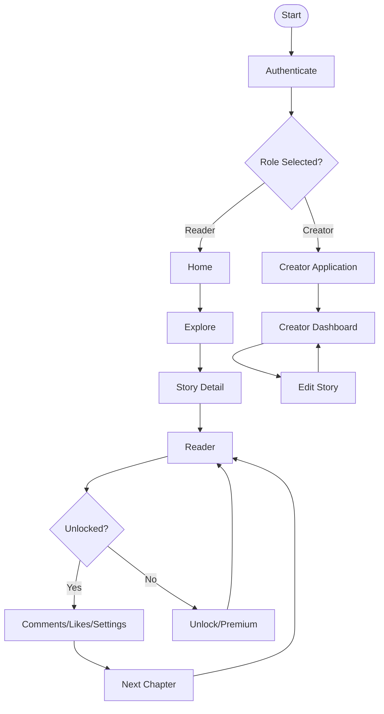
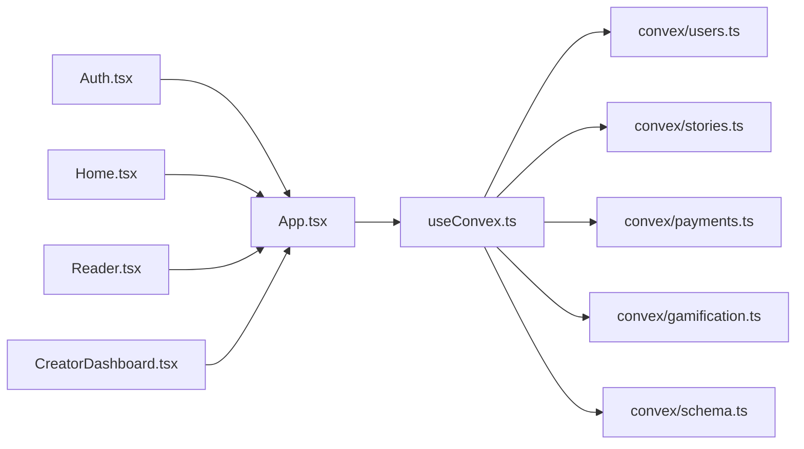

# End-to-End Testing

<cite>
**Referenced Files in This Document**
- [package.json](file://package.json)
- [vite.config.ts](file://vite.config.ts)
- [tests/smoke.test.ts](file://tests/smoke.test.ts)
- [src/main.tsx](file://src/main.tsx)
- [src/App.tsx](file://src/App.tsx)
- [src/screens/Auth.tsx](file://src/screens/Auth.tsx)
- [src/screens/Home.tsx](file://src/screens/Home.tsx)
- [src/screens/Reader.tsx](file://src/screens/Reader.tsx)
- [src/screens/CreatorDashboard.tsx](file://src/screens/CreatorDashboard.tsx)
- [src/hooks/useConvex.ts](file://src/hooks/useConvex.ts)
- [convex/schema.ts](file://convex/schema.ts)
- [convex/gamification.ts](file://convex/gamification.ts)
- [convex/users.ts](file://convex/users.ts)
- [convex/stories.ts](file://convex/stories.ts)
- [convex/payments.ts](file://convex/payments.ts)
</cite>

## Table of Contents
1. [Introduction](#introduction)
2. [Project Structure](#project-structure)
3. [Core Components](#core-components)
4. [Architecture Overview](#architecture-overview)
5. [Detailed Component Analysis](#detailed-component-analysis)
6. [Dependency Analysis](#dependency-analysis)
7. [Performance Considerations](#performance-considerations)
8. [Troubleshooting Guide](#troubleshooting-guide)
9. [Conclusion](#conclusion)
10. [Appendices](#appendices)

## Introduction
This document provides comprehensive end-to-end (E2E) testing guidance for validating complete user workflows across authentication, content discovery, reading, monetization, and creator studio paths. It covers smoke testing approaches, multi-step workflow validation, form submissions, navigation flows, state transitions, real-time-like interactions, browser automation setup, cross-browser compatibility, responsive/mobile-first testing, progressive web app (PWA) features, performance validation, and test data/session management.

## Project Structure
The application is a React client bundled with Vite and integrates with Convex backend functions and Firebase authentication. Routing is handled by React Router DOM, and PWA installation is supported via a service worker registration.

**Diagram sources**
- [src/main.tsx:1-26](file://src/main.tsx#L1-L26)
- [src/App.tsx:1-375](file://src/App.tsx#L1-L375)
- [src/hooks/useConvex.ts:1-213](file://src/hooks/useConvex.ts#L1-L213)
- [convex/schema.ts:1-495](file://convex/schema.ts#L1-L495)
- [convex/users.ts:1-360](file://convex/users.ts#L1-L360)
- [convex/stories.ts:1-180](file://convex/stories.ts#L1-L180)
- [convex/payments.ts:1-291](file://convex/payments.ts#L1-L291)
- [convex/gamification.ts:1-331](file://convex/gamification.ts#L1-L331)
- [vite.config.ts:1-37](file://vite.config.ts#L1-L37)
- [package.json:1-45](file://package.json#L1-L45)
- [tests/smoke.test.ts:1-13](file://tests/smoke.test.ts#L1-L13)

**Section sources**
- [src/main.tsx:1-26](file://src/main.tsx#L1-L26)
- [src/App.tsx:1-375](file://src/App.tsx#L1-L375)
- [vite.config.ts:1-37](file://vite.config.ts#L1-L37)
- [package.json:1-45](file://package.json#L1-L45)
- [tests/smoke.test.ts:1-13](file://tests/smoke.test.ts#L1-L13)

## Core Components
- Authentication and routing: Firebase-backed authentication with role selection and intent-aware redirects; React Router routes define all application pages.
- Content and reading: Story listing, featured content, reading experience with chapter navigation, comments, and monetization gates.
- Creator studio: Dashboard, story management, analytics, and wallet summaries.
- Backend integration: Convex queries/mutations for users, stories, payments, gamification, and ad analytics.
- PWA: Service worker registration for offline-capable experiences.

Key implementation references:
- Authentication flow and redirects: [src/screens/Auth.tsx:1-334](file://src/screens/Auth.tsx#L1-L334)
- Routing and navigation layout: [src/App.tsx:1-375](file://src/App.tsx#L1-L375)
- Reading experience and monetization: [src/screens/Reader.tsx:1-603](file://src/screens/Reader.tsx#L1-L603)
- Creator dashboard and analytics: [src/screens/CreatorDashboard.tsx:1-322](file://src/screens/CreatorDashboard.tsx#L1-L322)
- Convex integration hooks: [src/hooks/useConvex.ts:1-213](file://src/hooks/useConvex.ts#L1-L213)
- Backend schema and tables: [convex/schema.ts:1-495](file://convex/schema.ts#L1-L495)
- Gamification and rewards: [convex/gamification.ts:1-331](file://convex/gamification.ts#L1-L331)
- Users and unlocks: [convex/users.ts:1-360](file://convex/users.ts#L1-L360)
- Stories CRUD: [convex/stories.ts:1-180](file://convex/stories.ts#L1-L180)
- Payments and premium: [convex/payments.ts:1-291](file://convex/payments.ts#L1-L291)

**Section sources**
- [src/screens/Auth.tsx:1-334](file://src/screens/Auth.tsx#L1-L334)
- [src/App.tsx:1-375](file://src/App.tsx#L1-L375)
- [src/screens/Reader.tsx:1-603](file://src/screens/Reader.tsx#L1-L603)
- [src/screens/CreatorDashboard.tsx:1-322](file://src/screens/CreatorDashboard.tsx#L1-L322)
- [src/hooks/useConvex.ts:1-213](file://src/hooks/useConvex.ts#L1-L213)
- [convex/schema.ts:1-495](file://convex/schema.ts#L1-L495)
- [convex/gamification.ts:1-331](file://convex/gamification.ts#L1-L331)
- [convex/users.ts:1-360](file://convex/users.ts#L1-L360)
- [convex/stories.ts:1-180](file://convex/stories.ts#L1-L180)
- [convex/payments.ts:1-291](file://convex/payments.ts#L1-L291)

## Architecture Overview
The E2E testing architecture centers on:
- Client-side routing and state via React Router and AppContext.
- Backend state via Convex tables and functions.
- Authentication via Firebase.
- PWA lifecycle managed by service worker registration.

**Diagram sources**
- [src/App.tsx:1-375](file://src/App.tsx#L1-L375)
- [src/screens/Auth.tsx:1-334](file://src/screens/Auth.tsx#L1-L334)
- [src/hooks/useConvex.ts:1-213](file://src/hooks/useConvex.ts#L1-L213)
- [convex/schema.ts:1-495](file://convex/schema.ts#L1-L495)

## Detailed Component Analysis

### Authentication and Role Selection Workflow
Validation goals:
- Email/password and Google sign-in paths.
- Role selection (reader/creator) and intent-aware redirects.
- Persistence settings and guest continuation.

**Diagram sources**
- [src/screens/Auth.tsx:68-102](file://src/screens/Auth.tsx#L68-L102)
- [src/screens/Auth.tsx:108-128](file://src/screens/Auth.tsx#L108-L128)

**Section sources**
- [src/screens/Auth.tsx:1-334](file://src/screens/Auth.tsx#L1-L334)

### Reader Journey: Discovery to Monetization Gate
Validation goals:
- Story listing and featured content.
- Chapter navigation and reading UI.
- Monetization gate (coins or premium).
- Comments and engagement tracking.

**Diagram sources**
- [src/screens/Home.tsx:1-154](file://src/screens/Home.tsx#L1-L154)
- [src/screens/Reader.tsx:1-603](file://src/screens/Reader.tsx#L1-L603)
- [convex/users.ts:269-310](file://convex/users.ts#L269-L310)
- [convex/gamification.ts:14-117](file://convex/gamification.ts#L14-L117)

**Section sources**
- [src/screens/Home.tsx:1-154](file://src/screens/Home.tsx#L1-L154)
- [src/screens/Reader.tsx:1-603](file://src/screens/Reader.tsx#L1-L603)
- [convex/users.ts:269-310](file://convex/users.ts#L269-L310)
- [convex/gamification.ts:14-117](file://convex/gamification.ts#L14-L117)

### Creator Studio and Analytics
Validation goals:
- Creator dashboard metrics and links.
- Story listing and editing.
- Wallet and payout summary.
- Comments monitoring.

**Diagram sources**
- [src/screens/CreatorDashboard.tsx:1-322](file://src/screens/CreatorDashboard.tsx#L1-L322)
- [convex/stories.ts:1-180](file://convex/stories.ts#L1-L180)
- [convex/payments.ts:21-80](file://convex/payments.ts#L21-L80)

**Section sources**
- [src/screens/CreatorDashboard.tsx:1-322](file://src/screens/CreatorDashboard.tsx#L1-L322)
- [convex/stories.ts:1-180](file://convex/stories.ts#L1-L180)
- [convex/payments.ts:21-80](file://convex/payments.ts#L21-L80)

### Data Model Overview
The backend schema defines core entities and relationships used by E2E tests and workflows.

**Diagram sources**
- [convex/schema.ts:24-494](file://convex/schema.ts#L24-L494)

**Section sources**
- [convex/schema.ts:1-495](file://convex/schema.ts#L1-L495)

### Smoke Testing Approach
Purpose: Validate core application functionality and critical paths quickly.

Recommended smoke checks:
- Application boot and service worker registration.
- Routing to key pages (/, /auth, /home, /read/:id/:chapterNum).
- Convex schema presence for gamification tables.
- Basic rendering of stories and featured content.

Implementation references:
- Boot and SW registration: [src/main.tsx:19-25](file://src/main.tsx#L19-L25)
- Routing: [src/App.tsx:85-362](file://src/App.tsx#L85-L362)
- Schema smoke: [tests/smoke.test.ts:1-13](file://tests/smoke.test.ts#L1-L13)
- Stories rendering: [src/screens/Home.tsx:11-50](file://src/screens/Home.tsx#L11-L50)

**Section sources**
- [src/main.tsx:19-25](file://src/main.tsx#L19-L25)
- [src/App.tsx:85-362](file://src/App.tsx#L85-L362)
- [tests/smoke.test.ts:1-13](file://tests/smoke.test.ts#L1-L13)
- [src/screens/Home.tsx:11-50](file://src/screens/Home.tsx#L11-L50)

### Multi-Step Workflows and Form Submissions
- Authentication: Email/password and Google OAuth; role selection; persistence; guest flow.
- Reader journey: Discover stories → select story → navigate chapters → unlock/purchase → read → engage (comments, likes).
- Creator onboarding: Apply for creator access → dashboard → manage stories → analytics → wallet.
- Payments: Premium subscription initiation and verification; chapter unlock with coins.

References:
- Auth forms and actions: [src/screens/Auth.tsx:68-128](file://src/screens/Auth.tsx#L68-L128)
- Reader interactions: [src/screens/Reader.tsx:157-204](file://src/screens/Reader.tsx#L157-L204)
- Payment hooks: [src/hooks/useConvex.ts:65-109](file://src/hooks/useConvex.ts#L65-L109)
- Unlock mutation: [convex/users.ts:269-310](file://convex/users.ts#L269-L310)
- Premium activation: [convex/payments.ts:174-262](file://convex/payments.ts#L174-L262)

**Section sources**
- [src/screens/Auth.tsx:68-128](file://src/screens/Auth.tsx#L68-L128)
- [src/screens/Reader.tsx:157-204](file://src/screens/Reader.tsx#L157-L204)
- [src/hooks/useConvex.ts:65-109](file://src/hooks/useConvex.ts#L65-L109)
- [convex/users.ts:269-310](file://convex/users.ts#L269-L310)
- [convex/payments.ts:174-262](file://convex/payments.ts#L174-L262)

### Navigation Flows and State Transitions
- Auth → Home → Explore → Story → Reader → Comments → Next Chapter.
- Auth → Creator Application → Creator Dashboard → Studio → Edit Story.
- Reader → Unlock/Premium → Reader → Comments → Report → Back.

**Diagram sources**
- [src/screens/Auth.tsx:39-58](file://src/screens/Auth.tsx#L39-L58)
- [src/screens/Home.tsx:11-28](file://src/screens/Home.tsx#L11-L28)
- [src/screens/Reader.tsx:1-603](file://src/screens/Reader.tsx#L1-L603)
- [src/screens/CreatorDashboard.tsx:1-322](file://src/screens/CreatorDashboard.tsx#L1-L322)

**Section sources**
- [src/screens/Auth.tsx:39-58](file://src/screens/Auth.tsx#L39-L58)
- [src/screens/Home.tsx:11-28](file://src/screens/Home.tsx#L11-L28)
- [src/screens/Reader.tsx:1-603](file://src/screens/Reader.tsx#L1-L603)
- [src/screens/CreatorDashboard.tsx:1-322](file://src/screens/CreatorDashboard.tsx#L1-L322)

### Real-Time Feature Interactions
- Engagement tracking: Duration, completion percentage, scroll depth, session quality.
- Comments: Like/dislike, delete, pagination.
- Ad preroll gating: Countdown, skip, click-through.

References:
- Engagement instrumentation: [src/screens/Reader.tsx:206-207](file://src/screens/Reader.tsx#L206-L207)
- Comments interactions: [src/screens/Reader.tsx:157-204](file://src/screens/Reader.tsx#L157-L204)
- Ad gate: [src/screens/Reader.tsx:53-62](file://src/screens/Reader.tsx#L53-L62)

**Section sources**
- [src/screens/Reader.tsx:206-207](file://src/screens/Reader.tsx#L206-L207)
- [src/screens/Reader.tsx:157-204](file://src/screens/Reader.tsx#L157-L204)
- [src/screens/Reader.tsx:53-62](file://src/screens/Reader.tsx#L53-L62)

### Browser Automation Setup and Cross-Browser Compatibility
- Build and dev server: Vite configuration exposes environment variables and aliases.
- Scripts: Test runner invocation and development server commands.
- Recommendations:
  - Use Vitest for unit/E2E orchestration.
  - Configure browser targets via Vite’s build options.
  - Run tests against Chrome/Edge locally; integrate headless Safari for macOS.

References:
- Scripts and dependencies: [package.json:6-12](file://package.json#L6-L12)
- Vite config: [vite.config.ts:6-35](file://vite.config.ts#L6-L35)

**Section sources**
- [package.json:6-12](file://package.json#L6-L12)
- [vite.config.ts:6-35](file://vite.config.ts#L6-L35)

### Responsive Design and Mobile-First Workflows
- Mobile-first UI components and navigation.
- Reader settings (theme/text size) optimized for smaller screens.
- Touch-friendly controls for comments and chapter navigation.

References:
- Reader UI responsiveness: [src/screens/Reader.tsx:273-291](file://src/screens/Reader.tsx#L273-L291)
- Home responsive sections: [src/screens/Home.tsx:135-149](file://src/screens/Home.tsx#L135-L149)

**Section sources**
- [src/screens/Reader.tsx:273-291](file://src/screens/Reader.tsx#L273-L291)
- [src/screens/Home.tsx:135-149](file://src/screens/Home.tsx#L135-L149)

### Progressive Web App Features
- Service worker registration for installability and offline readiness.
- PWA prompt integration.

References:
- SW registration: [src/main.tsx:19-25](file://src/main.tsx#L19-L25)
- PWA prompt component: [src/App.tsx:370-370](file://src/App.tsx#L370-L370)

**Section sources**
- [src/main.tsx:19-25](file://src/main.tsx#L19-L25)
- [src/App.tsx:370-370](file://src/App.tsx#L370-L370)

### Performance Testing Within E2E Context
- Measure time-to-content for featured story and reader chapter rendering.
- Validate engagement tracking emits without blocking UI.
- Assess comment load latency and pagination behavior.
- Validate unlock and payment flows under simulated network conditions.

References:
- Reader engagement hook: [src/screens/Reader.tsx:206-207](file://src/screens/Reader.tsx#L206-L207)
- Comment loading: [src/screens/Reader.tsx:75-115](file://src/screens/Reader.tsx#L75-L115)

**Section sources**
- [src/screens/Reader.tsx:206-207](file://src/screens/Reader.tsx#L206-L207)
- [src/screens/Reader.tsx:75-115](file://src/screens/Reader.tsx#L75-L115)

### Test Data Management, Sessions, and Environment Isolation
- Use Convex test utilities to seed or assert schema expectations.
- Manage user sessions via Firebase persistence and guest mode.
- Separate test environments via Convex environment variables and Vite modes.

References:
- Convex test usage: [tests/smoke.test.ts:2-2](file://tests/smoke.test.ts#L2-L2)
- Auth persistence: [src/screens/Auth.tsx:60-66](file://src/screens/Auth.tsx#L60-L66)
- Scripts and env: [package.json:6-12](file://package.json#L6-L12), [vite.config.ts:10-12](file://vite.config.ts#L10-L12)

**Section sources**
- [tests/smoke.test.ts:2-2](file://tests/smoke.test.ts#L2-L2)
- [src/screens/Auth.tsx:60-66](file://src/screens/Auth.tsx#L60-L66)
- [package.json:6-12](file://package.json#L6-L12)
- [vite.config.ts:10-12](file://vite.config.ts#L10-L12)

## Dependency Analysis
High-level dependencies between screens, hooks, and backend functions.

**Diagram sources**
- [src/screens/Auth.tsx:1-334](file://src/screens/Auth.tsx#L1-L334)
- [src/App.tsx:1-375](file://src/App.tsx#L1-L375)
- [src/screens/Home.tsx:1-154](file://src/screens/Home.tsx#L1-L154)
- [src/screens/Reader.tsx:1-603](file://src/screens/Reader.tsx#L1-L603)
- [src/screens/CreatorDashboard.tsx:1-322](file://src/screens/CreatorDashboard.tsx#L1-L322)
- [src/hooks/useConvex.ts:1-213](file://src/hooks/useConvex.ts#L1-L213)
- [convex/users.ts:1-360](file://convex/users.ts#L1-L360)
- [convex/stories.ts:1-180](file://convex/stories.ts#L1-L180)
- [convex/payments.ts:1-291](file://convex/payments.ts#L1-L291)
- [convex/gamification.ts:1-331](file://convex/gamification.ts#L1-L331)
- [convex/schema.ts:1-495](file://convex/schema.ts#L1-L495)

**Section sources**
- [src/screens/Auth.tsx:1-334](file://src/screens/Auth.tsx#L1-L334)
- [src/App.tsx:1-375](file://src/App.tsx#L1-L375)
- [src/screens/Home.tsx:1-154](file://src/screens/Home.tsx#L1-L154)
- [src/screens/Reader.tsx:1-603](file://src/screens/Reader.tsx#L1-L603)
- [src/screens/CreatorDashboard.tsx:1-322](file://src/screens/CreatorDashboard.tsx#L1-L322)
- [src/hooks/useConvex.ts:1-213](file://src/hooks/useConvex.ts#L1-L213)
- [convex/users.ts:1-360](file://convex/users.ts#L1-L360)
- [convex/stories.ts:1-180](file://convex/stories.ts#L1-L180)
- [convex/payments.ts:1-291](file://convex/payments.ts#L1-L291)
- [convex/gamification.ts:1-331](file://convex/gamification.ts#L1-L331)
- [convex/schema.ts:1-495](file://convex/schema.ts#L1-L495)

## Performance Considerations
- Minimize heavy computations in render paths; defer non-critical data fetching.
- Use pagination for comments and story lists.
- Debounce scroll handlers and engagement tracking.
- Cache frequently accessed Convex queries where appropriate.

## Troubleshooting Guide
Common issues and resolutions:
- Authentication failures: Verify Firebase persistence and error messages; confirm environment variables for providers.
- Reader unlock errors: Check user balance and unlock mutation behavior.
- Payment verification: Ensure provider callbacks update Convex state and user balances.
- Service worker registration: Confirm production build and HTTPS for PWA features.

References:
- Auth error handling: [src/screens/Auth.tsx:93-99](file://src/screens/Auth.tsx#L93-L99)
- Unlock error handling: [convex/users.ts:281-282](file://convex/users.ts#L281-L282)
- Payment verification: [convex/payments.ts:113-172](file://convex/payments.ts#L113-L172)

**Section sources**
- [src/screens/Auth.tsx:93-99](file://src/screens/Auth.tsx#L93-L99)
- [convex/users.ts:281-282](file://convex/users.ts#L281-L282)
- [convex/payments.ts:113-172](file://convex/payments.ts#L113-L172)

## Conclusion
This E2E testing guide outlines validated workflows spanning authentication, content discovery, reading, monetization, and creator operations. By leveraging the provided smoke checks, navigation flows, and backend integration points, teams can build reliable, cross-browser, and responsive tests that ensure a smooth user experience across devices and platforms.

## Appendices
- Test environment setup checklist:
  - Install dependencies and run dev/test scripts.
  - Configure Convex environment and Firebase credentials.
  - Run smoke tests to validate schema and routing.
- Cross-browser testing checklist:
  - Chrome/Edge headless for CI.
  - Safari/macOS for Apple-specific PWA behaviors.
  - Mobile emulators for responsive layouts.