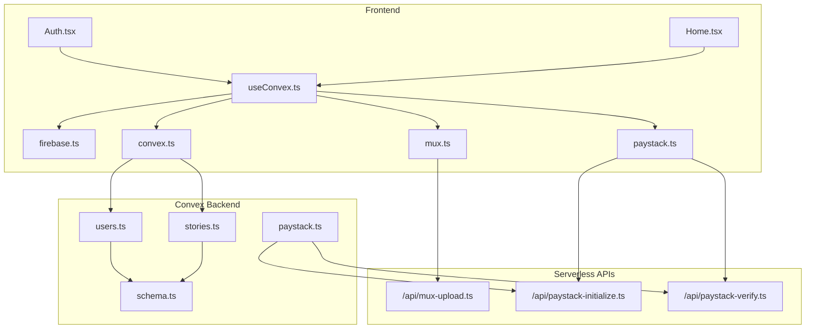
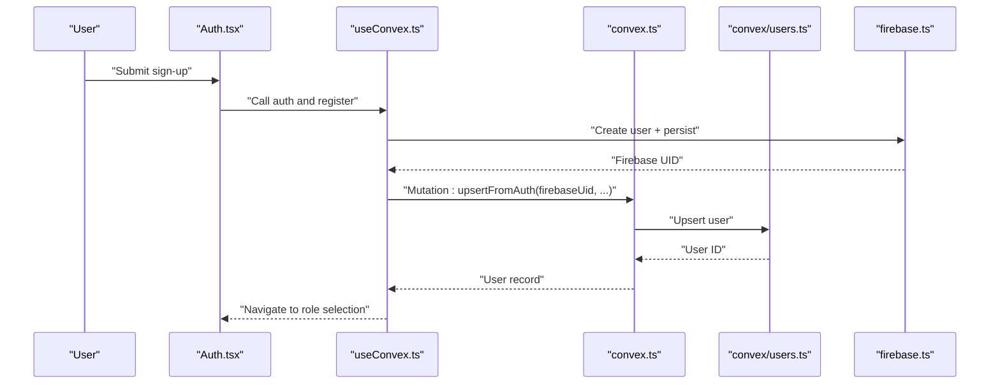
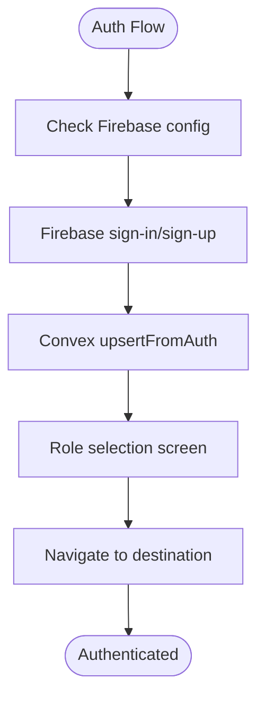
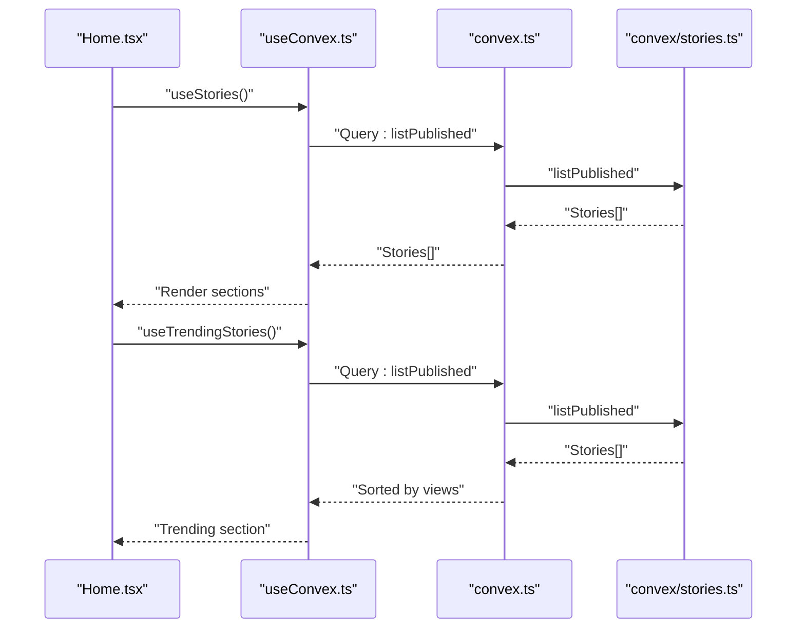
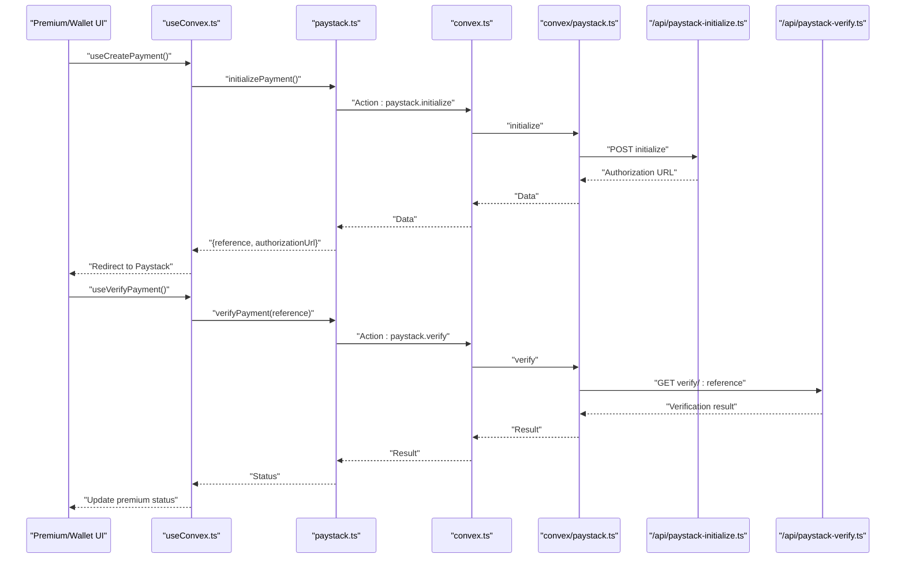
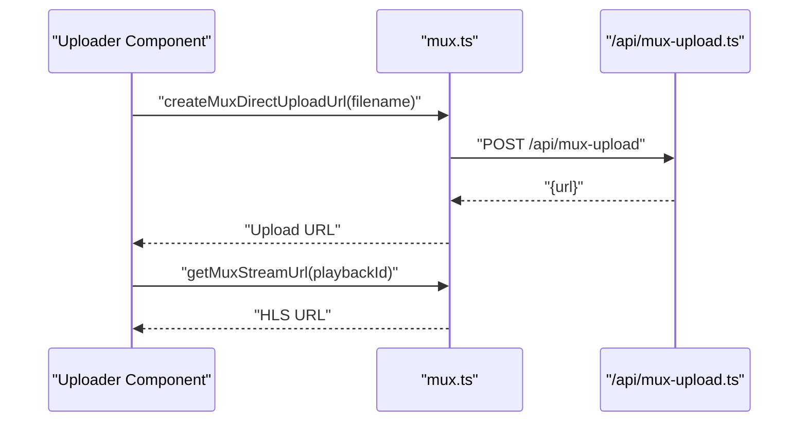
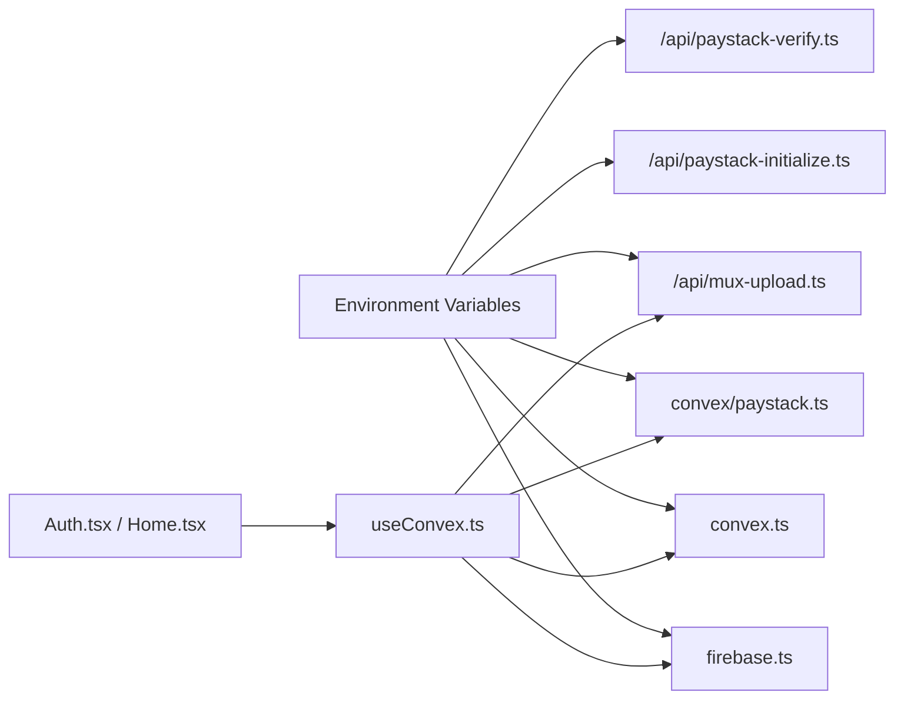

# Integration Testing

<cite>
**Referenced Files in This Document**
- [INTEGRATION_TESTING_PLAN.md](file://INTEGRATION_TESTING_PLAN.md)
- [TESTING_CHECKLIST.md](file://TESTING_CHECKLIST.md)
- [src/lib/firebase.ts](file://src/lib/firebase.ts)
- [src/lib/convex.ts](file://src/lib/convex.ts)
- [src/lib/mux.ts](file://src/lib/mux.ts)
- [src/lib/paystack.ts](file://src/lib/paystack.ts)
- [api/mux-upload.ts](file://api/mux-upload.ts)
- [api/paystack-initialize.ts](file://api/paystack-initialize.ts)
- [api/paystack-verify.ts](file://api/paystack-verify.ts)
- [convex/schema.ts](file://convex/schema.ts)
- [convex/users.ts](file://convex/users.ts)
- [convex/stories.ts](file://convex/stories.ts)
- [convex/paystack.ts](file://convex/paystack.ts)
- [src/hooks/useConvex.ts](file://src/hooks/useConvex.ts)
- [src/screens/Auth.tsx](file://src/screens/Auth.tsx)
- [src/screens/Home.tsx](file://src/screens/Home.tsx)
</cite>

## Table of Contents
1. [Introduction](#introduction)
2. [Project Structure](#project-structure)
3. [Core Components](#core-components)
4. [Architecture Overview](#architecture-overview)
5. [Detailed Component Analysis](#detailed-component-analysis)
6. [Dependency Analysis](#dependency-analysis)
7. [Performance Considerations](#performance-considerations)
8. [Troubleshooting Guide](#troubleshooting-guide)
9. [Conclusion](#conclusion)
10. [Appendices](#appendices)

## Introduction
This document defines an integration testing strategy for validating end-to-end flows across frontend components, Convex backend functions, and third-party services. It covers:
- Convex function testing and database integration
- External service connectivity (Firebase, Mux, Paystack)
- API endpoint testing and serverless function interactions
- Real-time updates and subscriptions
- Complex workflows across multiple services and data sources
- Setup, teardown, and cleanup strategies
- Error handling, timeouts, and service unavailability scenarios

## Project Structure
The integration surface spans three layers:
- Frontend React components and hooks that call Convex mutations/actions and use Firebase/Mux/Paystack libraries
- Convex schema and server-side functions implementing business logic
- Serverless API handlers for Mux and Paystack integrations

**Diagram sources**
- [src/screens/Auth.tsx:1-334](file://src/screens/Auth.tsx#L1-L334)
- [src/screens/Home.tsx:1-154](file://src/screens/Home.tsx#L1-L154)
- [src/hooks/useConvex.ts:1-213](file://src/hooks/useConvex.ts#L1-L213)
- [src/lib/firebase.ts:1-55](file://src/lib/firebase.ts#L1-L55)
- [src/lib/convex.ts:1-12](file://src/lib/convex.ts#L1-L12)
- [src/lib/mux.ts:1-66](file://src/lib/mux.ts#L1-L66)
- [src/lib/paystack.ts:1-115](file://src/lib/paystack.ts#L1-L115)
- [convex/schema.ts:1-495](file://convex/schema.ts#L1-L495)
- [convex/users.ts:1-360](file://convex/users.ts#L1-L360)
- [convex/stories.ts:1-180](file://convex/stories.ts#L1-L180)
- [convex/paystack.ts:1-71](file://convex/paystack.ts#L1-L71)
- [api/mux-upload.ts:1-45](file://api/mux-upload.ts#L1-L45)
- [api/paystack-initialize.ts:1-47](file://api/paystack-initialize.ts#L1-L47)
- [api/paystack-verify.ts:1-36](file://api/paystack-verify.ts#L1-L36)

**Section sources**
- [INTEGRATION_TESTING_PLAN.md:1-341](file://INTEGRATION_TESTING_PLAN.md#L1-L341)
- [TESTING_CHECKLIST.md:1-528](file://TESTING_CHECKLIST.md#L1-L528)

## Core Components
- Authentication integration: Firebase auth with Convex user synchronization
- Story discovery and interactions: Convex queries and mutations for stories
- Payments: Paystack initialization and verification via Convex actions and serverless handlers
- Media uploads: Mux direct upload URLs generated through a serverless handler
- Real-time updates: Subscriptions and reactive UI updates driven by Convex queries

Key integration touchpoints:
- useConvex hooks orchestrate calls to Convex mutations/actions and external libraries
- Convex schema defines data models and indexes used by queries
- Serverless handlers expose secure endpoints for sensitive operations (Mux, Paystack)

**Section sources**
- [src/hooks/useConvex.ts:1-213](file://src/hooks/useConvex.ts#L1-L213)
- [convex/schema.ts:1-495](file://convex/schema.ts#L1-L495)
- [src/lib/paystack.ts:1-115](file://src/lib/paystack.ts#L1-L115)
- [api/paystack-initialize.ts:1-47](file://api/paystack-initialize.ts#L1-L47)
- [api/paystack-verify.ts:1-36](file://api/paystack-verify.ts#L1-L36)
- [src/lib/mux.ts:1-66](file://src/lib/mux.ts#L1-L66)
- [api/mux-upload.ts:1-45](file://api/mux-upload.ts#L1-L45)

## Architecture Overview
The integration architecture connects UI components to Convex functions and external services through typed libraries and serverless handlers.

**Diagram sources**
- [src/screens/Auth.tsx:1-334](file://src/screens/Auth.tsx#L1-L334)
- [src/hooks/useConvex.ts:163-171](file://src/hooks/useConvex.ts#L163-L171)
- [src/lib/convex.ts:1-12](file://src/lib/convex.ts#L1-L12)
- [convex/users.ts:42-90](file://convex/users.ts#L42-L90)
- [src/lib/firebase.ts:1-55](file://src/lib/firebase.ts#L1-L55)

## Detailed Component Analysis

### Authentication Integration
- Validates Firebase auth flow and Convex user creation
- Ensures role selection and navigation behavior
- Tests persistence modes and guest access

**Diagram sources**
- [src/screens/Auth.tsx:1-334](file://src/screens/Auth.tsx#L1-L334)
- [src/hooks/useConvex.ts:163-171](file://src/hooks/useConvex.ts#L163-L171)
- [convex/users.ts:42-90](file://convex/users.ts#L42-L90)
- [src/lib/firebase.ts:1-55](file://src/lib/firebase.ts#L1-L55)

**Section sources**
- [INTEGRATION_TESTING_PLAN.md:7-26](file://INTEGRATION_TESTING_PLAN.md#L7-L26)
- [TESTING_CHECKLIST.md:25-101](file://TESTING_CHECKLIST.md#L25-L101)

### Story Discovery and Interactions
- Loads stories from Convex and renders sections
- Tests trending sorting, genre filtering, and continue reading logic
- Validates save and like interactions via mutations

**Diagram sources**
- [src/screens/Home.tsx:1-154](file://src/screens/Home.tsx#L1-L154)
- [src/hooks/useConvex.ts:24-38](file://src/hooks/useConvex.ts#L24-L38)
- [src/lib/convex.ts:1-12](file://src/lib/convex.ts#L1-L12)
- [convex/stories.ts:6-14](file://convex/stories.ts#L6-L14)

**Section sources**
- [INTEGRATION_TESTING_PLAN.md:29-49](file://INTEGRATION_TESTING_PLAN.md#L29-L49)
- [convex/schema.ts:95-125](file://convex/schema.ts#L95-L125)

### Payments Integration (Paystack)
- Initializes payment via Convex action and serverless handler
- Verifies payment via Convex action and serverless handler
- Tests premium upgrade flow and wallet top-ups

**Diagram sources**
- [src/hooks/useConvex.ts:65-109](file://src/hooks/useConvex.ts#L65-L109)
- [src/lib/paystack.ts:56-84](file://src/lib/paystack.ts#L56-L84)
- [src/lib/convex.ts:1-12](file://src/lib/convex.ts#L1-L12)
- [convex/paystack.ts:5-44](file://convex/paystack.ts#L5-L44)
- [api/paystack-initialize.ts:1-47](file://api/paystack-initialize.ts#L1-L47)
- [api/paystack-verify.ts:1-36](file://api/paystack-verify.ts#L1-L36)

**Section sources**
- [INTEGRATION_TESTING_PLAN.md:68-91](file://INTEGRATION_TESTING_PLAN.md#L68-L91)
- [TESTING_CHECKLIST.md:167-233](file://TESTING_CHECKLIST.md#L167-L233)

### Media Uploads (Mux)
- Generates Mux direct upload URLs via serverless handler
- Uploads media to Mux and plays back via stream URL

**Diagram sources**
- [src/lib/mux.ts:35-59](file://src/lib/mux.ts#L35-L59)
- [api/mux-upload.ts:8-44](file://api/mux-upload.ts#L8-L44)

**Section sources**
- [INTEGRATION_TESTING_PLAN.md:224-229](file://INTEGRATION_TESTING_PLAN.md#L224-L229)
- [TESTING_CHECKLIST.md:296-306](file://TESTING_CHECKLIST.md#L296-L306)

### Real-Time Updates and Subscriptions
- Reactive UI updates when Convex queries change
- Simulate subscription-driven updates by triggering state changes and asserting DOM updates

[No sources needed since this section provides general guidance]

## Dependency Analysis
- Frontend depends on environment variables for service endpoints
- Convex functions depend on environment variables for secrets (Paystack)
- Serverless handlers depend on environment variables for credentials (Mux, Paystack)
- UI components depend on hooks that encapsulate service calls

**Diagram sources**
- [src/lib/firebase.ts:1-55](file://src/lib/firebase.ts#L1-L55)
- [src/lib/convex.ts:1-12](file://src/lib/convex.ts#L1-L12)
- [convex/paystack.ts:15-18](file://convex/paystack.ts#L15-L18)
- [api/paystack-initialize.ts:3-14](file://api/paystack-initialize.ts#L3-L14)
- [api/paystack-verify.ts:3-14](file://api/paystack-verify.ts#L3-L14)
- [api/mux-upload.ts:3-6](file://api/mux-upload.ts#L3-L6)

**Section sources**
- [src/lib/convex.ts:1-12](file://src/lib/convex.ts#L1-L12)
- [src/lib/paystack.ts:24-32](file://src/lib/paystack.ts#L24-L32)
- [src/lib/mux.ts:15-23](file://src/lib/mux.ts#L15-L23)

## Performance Considerations
- Minimize network requests by batching queries and using efficient indexes
- Cache frequently accessed data in memory to reduce repeated fetches
- Use lazy loading for images and videos to improve initial render performance
- Monitor bundle size and defer non-critical features

[No sources needed since this section provides general guidance]

## Troubleshooting Guide
Common integration issues and resolutions:
- Missing environment variables cause service initialization failures
  - Validate VITE_CONVEX_URL, VITE_FIREBASE_* keys, VITE_PAYSTACK_PUBLIC_KEY, PAYSTACK_SECRET_KEY, VITE_MUX_TOKEN_ID, VITE_MUX_TOKEN_SECRET
- Authentication errors: ensure Firebase auth persistence and emulator configuration
- Payment failures: verify Paystack secret key and test card details
- Mux upload failures: check Mux token credentials and CORS origins
- Data integrity: cross-check Firebase and Convex records for consistency

**Section sources**
- [TESTING_CHECKLIST.md:3-22](file://TESTING_CHECKLIST.md#L3-L22)
- [TESTING_CHECKLIST.md:309-360](file://TESTING_CHECKLIST.md#L309-L360)
- [TESTING_CHECKLIST.md:477-516](file://TESTING_CHECKLIST.md#L477-L516)

## Conclusion
This integration testing plan establishes a repeatable framework for validating end-to-end flows across Firebase, Convex, Mux, and Paystack. By focusing on realistic user journeys, robust error handling, and service resilience, teams can confidently deploy and maintain a reliable platform.

[No sources needed since this section summarizes without analyzing specific files]

## Appendices

### Integration Testing Plan Highlights
- Phase 1: Backend hooks integration for critical screens
- Phase 2: Unit, integration, and E2E tests with Playwright
- Phase 3: Critical issues and priorities
- Phase 4: Pre-deployment checklist

**Section sources**
- [INTEGRATION_TESTING_PLAN.md:125-294](file://INTEGRATION_TESTING_PLAN.md#L125-L294)

### Testing Strategies by Component
- Authentication: end-to-end sign-up, sign-in, Google OAuth, and profile picture upload
- Stories: load, search, save, like, and continue reading
- Payments: initialize, complete, and verify payments; wallet top-ups
- Admin: login and data inspection
- Data integrity: cross-check Firebase and Convex records
- Error handling: invalid inputs, network offline simulation
- Performance: page load, bundle size
- Repeat behavior: session persistence and state after navigation

**Section sources**
- [TESTING_CHECKLIST.md:25-528](file://TESTING_CHECKLIST.md#L25-L528)