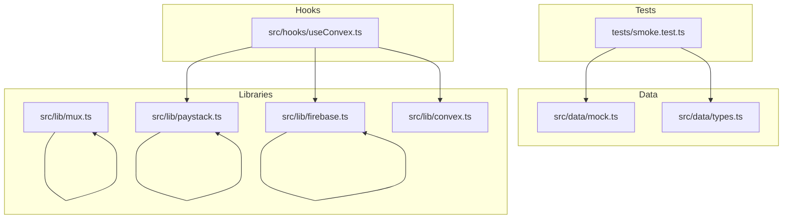
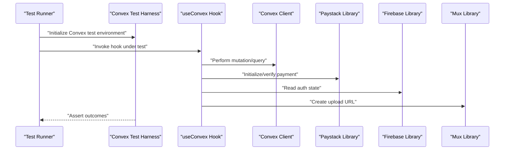
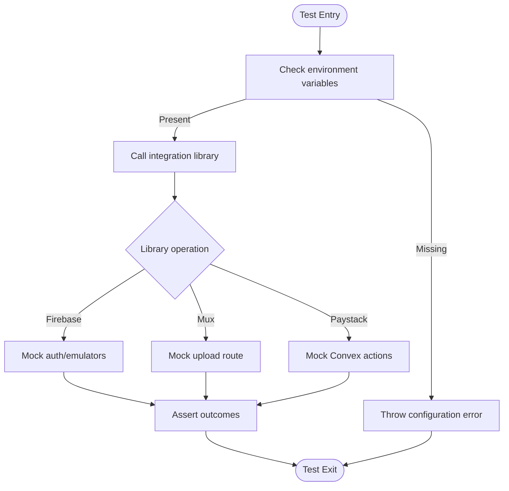
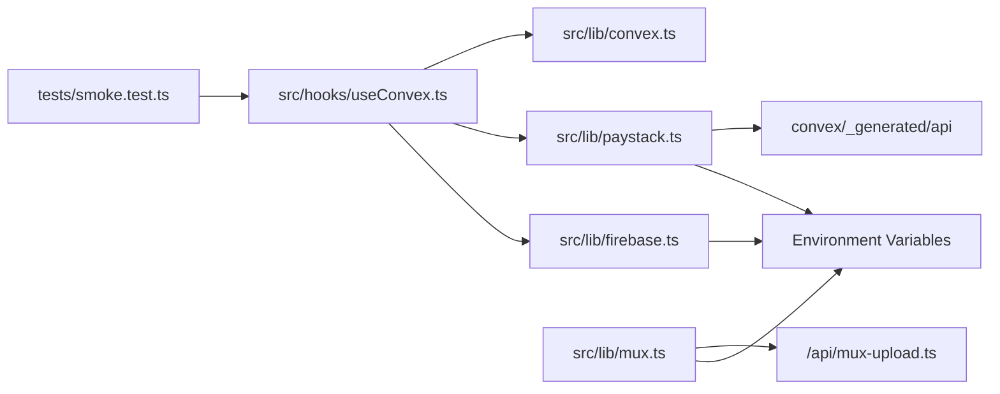

# Test Utilities and Mocks

<cite>
**Referenced Files in This Document**
- [smoke.test.ts](file://tests/smoke.test.ts)
- [TESTING_CHECKLIST.md](file://TESTING_CHECKLIST.md)
- [INTEGRATION_TESTING_PLAN.md](file://INTEGRATION_TESTING_PLAN.md)
- [mock.ts](file://src/data/mock.ts)
- [types.ts](file://src/data/types.ts)
- [firebase.ts](file://src/lib/firebase.ts)
- [mux.ts](file://src/lib/mux.ts)
- [paystack.ts](file://src/lib/paystack.ts)
- [convex.ts](file://src/lib/convex.ts)
- [useConvex.ts](file://src/hooks/useConvex.ts)
</cite>

## Table of Contents
1. [Introduction](#introduction)
2. [Project Structure](#project-structure)
3. [Core Components](#core-components)
4. [Architecture Overview](#architecture-overview)
5. [Detailed Component Analysis](#detailed-component-analysis)
6. [Dependency Analysis](#dependency-analysis)
7. [Performance Considerations](#performance-considerations)
8. [Troubleshooting Guide](#troubleshooting-guide)
9. [Conclusion](#conclusion)
10. [Appendices](#appendices)

## Introduction
This document consolidates the test utilities and mocking strategies for the Lemonade platform. It focuses on:
- Convex test setup and serverless function testing helpers
- Mock database operations and Redux-like state mocking
- External service mocks for Firebase, Mux, and Paystack
- Testing context providers and component wrapper utilities
- Reusable test utilities for common patterns
- Test data generation, fixtures, and environment configuration
- Asynchronous operation testing, error scenarios, and edge cases
- Test file organization, shared utilities, and quality practices
- Performance optimization, parallel execution, and isolation techniques

## Project Structure
The repository organizes testing artifacts primarily under the tests directory and leverages shared data and integration libraries across the frontend and Convex backend. The key areas for testing include:
- Unit/integration scaffolding and smoke tests
- Mock data and types for deterministic testing
- Integration libraries for Firebase, Mux, Paystack, and Convex
- Custom hooks that expose testing-friendly APIs

**Diagram sources**
- [smoke.test.ts:1-13](file://tests/smoke.test.ts#L1-L13)
- [mock.ts:1-436](file://src/data/mock.ts#L1-L436)
- [types.ts:1-155](file://src/data/types.ts#L1-L155)
- [firebase.ts:1-55](file://src/lib/firebase.ts#L1-L55)
- [mux.ts:1-66](file://src/lib/mux.ts#L1-L66)
- [paystack.ts:1-115](file://src/lib/paystack.ts#L1-L115)
- [convex.ts:1-12](file://src/lib/convex.ts#L1-L12)
- [useConvex.ts:1-213](file://src/hooks/useConvex.ts#L1-L213)

**Section sources**
- [smoke.test.ts:1-13](file://tests/smoke.test.ts#L1-L13)
- [INTEGRATION_TESTING_PLAN.md:125-160](file://INTEGRATION_TESTING_PLAN.md#L125-L160)

## Core Components
This section outlines the foundational testing building blocks and how they are used in practice.

- Convex test setup and serverless helpers
  - The project imports a Convex test harness to drive backend tests. See the smoke test for usage.
  - Serverless function testing can leverage the same harness to validate Convex actions and queries.

- Mock database operations and Redux-like state mocking
  - Mock data and types are centralized to simulate database records and UI state deterministically.
  - Hooks expose testing-friendly APIs that can be stubbed or overridden in tests.

- External service mocks
  - Firebase, Mux, and Paystack libraries read environment variables and provide helper functions. Tests can override these to avoid live calls.

- Testing context providers and component wrappers
  - The project’s hooks rely on a shared application context. Tests should wrap components with providers that supply this context to ensure realistic behavior.

- Reusable test utilities
  - Shared fixtures, factories, and helper functions reduce duplication and improve maintainability.

**Section sources**
- [smoke.test.ts:1-13](file://tests/smoke.test.ts#L1-L13)
- [mock.ts:1-436](file://src/data/mock.ts#L1-L436)
- [types.ts:1-155](file://src/data/types.ts#L1-L155)
- [useConvex.ts:1-213](file://src/hooks/useConvex.ts#L1-L213)

## Architecture Overview
The testing architecture integrates frontend hooks, libraries, and Convex backend functions. The diagram below illustrates how tests interact with these layers.

**Diagram sources**
- [smoke.test.ts:1-13](file://tests/smoke.test.ts#L1-L13)
- [useConvex.ts:1-213](file://src/hooks/useConvex.ts#L1-L213)
- [convex.ts:1-12](file://src/lib/convex.ts#L1-L12)
- [paystack.ts:1-115](file://src/lib/paystack.ts#L1-L115)
- [firebase.ts:1-55](file://src/lib/firebase.ts#L1-L55)
- [mux.ts:1-66](file://src/lib/mux.ts#L1-L66)

## Detailed Component Analysis

### Convex Test Utilities and Serverless Function Testing
- Convex test harness usage
  - The smoke test demonstrates importing and using the Convex test harness to validate backend assumptions.
  - Recommended pattern: initialize the harness at the top of the suite, seed minimal data, and assert schema or function behavior.

- Serverless function testing helpers
  - Use the harness to call Convex actions and queries directly from tests.
  - Validate error propagation and normalization by asserting thrown errors match expected patterns.

- Schema and data model validation
  - The smoke test reads the schema file and asserts presence of expected tables or fields, ensuring backend contracts remain intact.

**Section sources**
- [smoke.test.ts:1-13](file://tests/smoke.test.ts#L1-L13)

### Mock Database Operations and Redux-like State Mocking
- Centralized mock data and types
  - The mock module defines comprehensive data structures for creators, readers, stories, and badges.
  - Types define the canonical shape of entities, enabling consistent assertions across tests.

- Using mocks in tests
  - Seed UI state with mock data to simulate database-backed components.
  - Override hooks to return mock data instead of hitting live APIs.

- Deterministic assertions
  - Prefer deterministic fixtures and controlled inputs to avoid flaky tests.

**Section sources**
- [mock.ts:1-436](file://src/data/mock.ts#L1-L436)
- [types.ts:1-155](file://src/data/types.ts#L1-L155)

### External Service Mocks: Firebase, Mux, Paystack
- Firebase
  - The Firebase library initializes services and optionally connects to emulators in development.
  - Tests should configure environment variables and optionally connect to emulators to isolate network calls.

- Mux
  - The Mux library exposes functions to create direct upload URLs via a serverless route and to construct playback URLs.
  - Tests should mock the upload route to avoid live uploads and assert returned URLs.

- Paystack
  - The Paystack library wraps payment initialization and verification through Convex actions.
  - Tests should mock environment variables and Convex actions to simulate payment flows without real charges.

**Diagram sources**
- [firebase.ts:1-55](file://src/lib/firebase.ts#L1-L55)
- [mux.ts:1-66](file://src/lib/mux.ts#L1-L66)
- [paystack.ts:1-115](file://src/lib/paystack.ts#L1-L115)

**Section sources**
- [firebase.ts:1-55](file://src/lib/firebase.ts#L1-L55)
- [mux.ts:1-66](file://src/lib/mux.ts#L1-L66)
- [paystack.ts:1-115](file://src/lib/paystack.ts#L1-L115)

### Testing Context Providers and Component Wrapper Utilities
- Application context dependency
  - Hooks depend on a shared application context to supply user and story state.
  - Tests should wrap components with providers that supply this context to ensure realistic behavior.

- Provider composition
  - Compose providers to include Convex client, authentication state, and mock data.
  - Keep provider setups in shared utilities to avoid duplication.

- Component rendering utilities
  - Use a renderer that supports React hooks and providers.
  - Provide helper functions to render components with minimal boilerplate.

**Section sources**
- [useConvex.ts:1-213](file://src/hooks/useConvex.ts#L1-L213)

### Reusable Test Utilities for Common Patterns
- Fixture management
  - Centralize fixtures in the mock module and types module for reuse across tests.
  - Provide factory functions to generate variations of entities with controlled overrides.

- Helper functions
  - Create helpers for common assertions (e.g., checking user roles, verifying story counts).
  - Encapsulate repeated setup steps (e.g., seeding mock data, configuring environment).

- Asynchronous helpers
  - Provide async wrappers for operations that involve network calls or timers.
  - Use timeouts and retries judiciously to avoid flakiness.

**Section sources**
- [mock.ts:1-436](file://src/data/mock.ts#L1-L436)
- [types.ts:1-155](file://src/data/types.ts#L1-L155)

### Test Data Generation Strategies
- Deterministic fixtures
  - Use the mock module to generate realistic but deterministic datasets.
  - Keep IDs and timestamps predictable to simplify assertions.

- Dynamic factories
  - Build factories that accept partial inputs and fill in defaults from types.
  - Enable quick generation of varied test scenarios.

- Schema-driven generation
  - Leverage types to guide generation and ensure generated data conforms to backend contracts.

**Section sources**
- [types.ts:1-155](file://src/data/types.ts#L1-L155)
- [mock.ts:1-436](file://src/data/mock.ts#L1-L436)

### Test Environment Configuration
- Environment variables
  - Configure Vite environment variables for Firebase, Mux, and Paystack.
  - Use a dedicated test environment file to override defaults for CI or local runs.

- Emulators and sandbox
  - Enable emulator connections for Firebase services in development.
  - Isolate tests by resetting emulator state between runs.

- Convex configuration
  - Ensure the Convex URL is set for tests that interact with backend functions.
  - Use the Convex test harness to manage backend state per test.

**Section sources**
- [firebase.ts:1-55](file://src/lib/firebase.ts#L1-L55)
- [mux.ts:1-66](file://src/lib/mux.ts#L1-L66)
- [paystack.ts:1-115](file://src/lib/paystack.ts#L1-L115)
- [convex.ts:1-12](file://src/lib/convex.ts#L1-L12)

### Testing Asynchronous Operations, Errors, and Edge Cases
- Asynchronous operations
  - Use async/await patterns to wait for mutations and queries to settle.
  - Assert UI updates after asynchronous operations complete.

- Error scenarios
  - Simulate missing environment variables and invalid configurations.
  - Assert that errors are normalized and surfaced consistently.

- Edge cases
  - Test empty states, partial data, and malformed inputs.
  - Validate graceful degradation and user feedback.

**Section sources**
- [paystack.ts:1-115](file://src/lib/paystack.ts#L1-L115)
- [useConvex.ts:1-213](file://src/hooks/useConvex.ts#L1-L213)

### Structuring Test Files and Maintaining Quality
- File organization
  - Group tests by feature or layer (unit, integration, E2E).
  - Mirror the source directory structure for discoverability.

- Naming conventions
  - Use descriptive names that indicate the behavior being tested.
  - Prefix test files with the component or module name.

- Shared utilities
  - Centralize providers, fixtures, and helpers in a dedicated test utilities module.
  - Avoid duplicating setup logic across tests.

- Code quality
  - Keep tests readable and focused on a single concern.
  - Use comments to explain complex test scenarios or assumptions.

**Section sources**
- [INTEGRATION_TESTING_PLAN.md:125-160](file://INTEGRATION_TESTING_PLAN.md#L125-L160)

## Dependency Analysis
The following diagram shows how tests depend on libraries and hooks, and how libraries depend on environment configuration.

**Diagram sources**
- [smoke.test.ts:1-13](file://tests/smoke.test.ts#L1-L13)
- [useConvex.ts:1-213](file://src/hooks/useConvex.ts#L1-L213)
- [convex.ts:1-12](file://src/lib/convex.ts#L1-L12)
- [paystack.ts:1-115](file://src/lib/paystack.ts#L1-L115)
- [mux.ts:1-66](file://src/lib/mux.ts#L1-L66)
- [firebase.ts:1-55](file://src/lib/firebase.ts#L1-L55)

**Section sources**
- [smoke.test.ts:1-13](file://tests/smoke.test.ts#L1-L13)
- [useConvex.ts:1-213](file://src/hooks/useConvex.ts#L1-L213)

## Performance Considerations
- Minimize network calls
  - Mock external services and use in-memory state where possible.
- Parallel execution
  - Run independent tests in parallel to reduce total runtime.
- Snapshot and fixture reuse
  - Reuse fixtures to avoid expensive setup costs.
- Isolation
  - Reset state between tests to prevent cross-contamination.

## Troubleshooting Guide
- Missing environment variables
  - Ensure Vite environment variables are set for Firebase, Mux, and Paystack.
  - Validate that emulator connections are configured correctly in development.

- Convex configuration
  - Confirm the Convex URL is set and reachable.
  - Use the Convex test harness to seed backend state when needed.

- External service errors
  - Normalize and assert error messages to ensure consistent behavior.
  - Validate that configuration errors are surfaced early.

**Section sources**
- [TESTING_CHECKLIST.md:1-528](file://TESTING_CHECKLIST.md#L1-L528)
- [INTEGRATION_TESTING_PLAN.md:196-238](file://INTEGRATION_TESTING_PLAN.md#L196-L238)

## Conclusion
By leveraging the Convex test harness, centralized mock data, and environment-driven integration libraries, the Lemonade project can build robust and maintainable tests. The recommended patterns—centralized fixtures, provider composition, and deterministic assertions—enable scalable testing across units, integrations, and end-to-end flows while maintaining performance and reliability.

## Appendices
- Quick reference: Environment variables and test prerequisites are documented in the testing checklist and integration plan.
- Manual validation: Use the manual testing checklist to validate flows that are difficult to automate.

**Section sources**
- [TESTING_CHECKLIST.md:1-528](file://TESTING_CHECKLIST.md#L1-L528)
- [INTEGRATION_TESTING_PLAN.md:196-238](file://INTEGRATION_TESTING_PLAN.md#L196-L238)