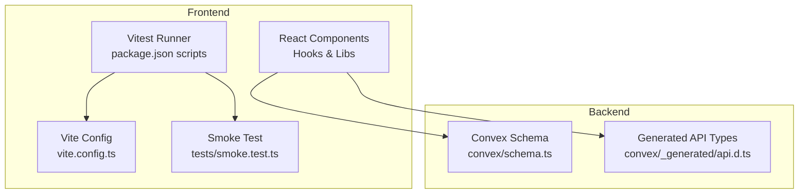
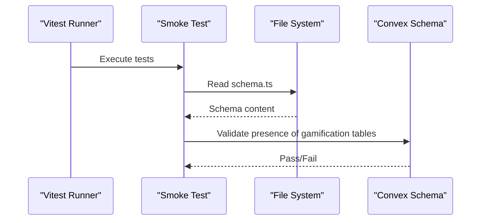
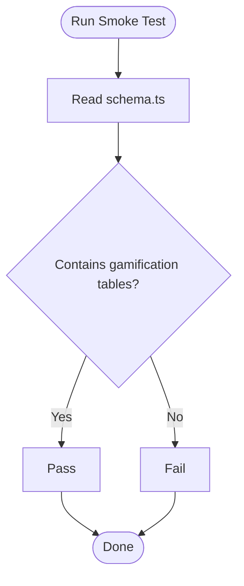
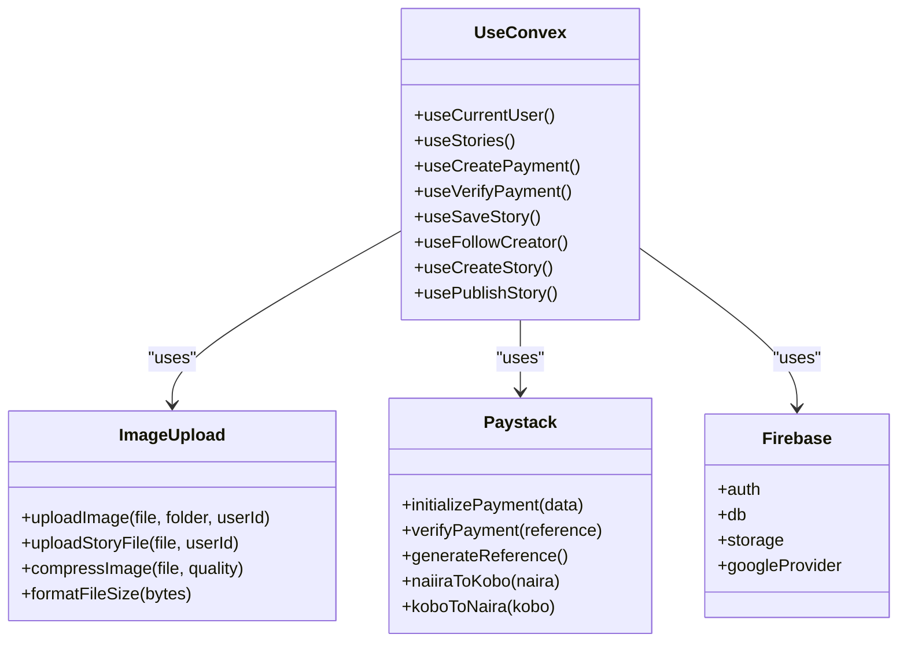
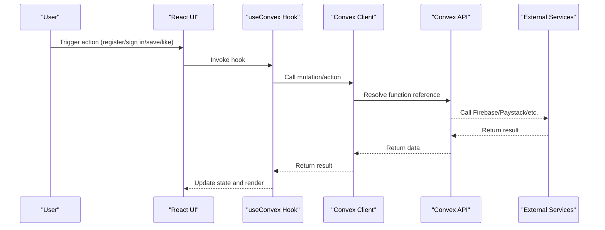
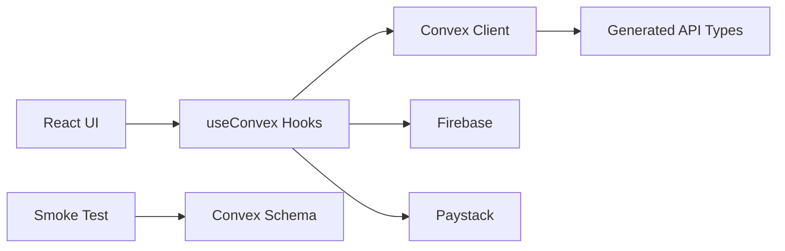

# Testing Strategy

<cite>
**Referenced Files in This Document**
- [package.json](file://package.json)
- [vite.config.ts](file://vite.config.ts)
- [tests/smoke.test.ts](file://tests/smoke.test.ts)
- [INTEGRATION_TESTING_PLAN.md](file://INTEGRATION_TESTING_PLAN.md)
- [TESTING_CHECKLIST.md](file://TESTING_CHECKLIST.md)
- [src/hooks/useConvex.ts](file://src/hooks/useConvex.ts)
- [src/lib/convex.ts](file://src/lib/convex.ts)
- [src/lib/firebase.ts](file://src/lib/firebase.ts)
- [src/lib/imageUpload.ts](file://src/lib/imageUpload.ts)
- [src/lib/paystack.ts](file://src/lib/paystack.ts)
- [convex/schema.ts](file://convex/schema.ts)
- [convex/_generated/api.d.ts](file://convex/_generated/api.d.ts)
</cite>

## Table of Contents
1. [Introduction](#introduction)
2. [Project Structure](#project-structure)
3. [Core Components](#core-components)
4. [Architecture Overview](#architecture-overview)
5. [Detailed Component Analysis](#detailed-component-analysis)
6. [Dependency Analysis](#dependency-analysis)
7. [Performance Considerations](#performance-considerations)
8. [Troubleshooting Guide](#troubleshooting-guide)
9. [Conclusion](#conclusion)
10. [Appendices](#appendices)

## Introduction
This document defines a comprehensive testing strategy for the Lemonade platform. It covers unit testing, integration testing, smoke testing, and end-to-end testing approaches. It also documents the testing framework setup, configuration, utilities, and mock implementations. The strategy includes smoke testing to validate core application functionality, integration testing plans for component interactions and external services, a testing checklist for scenarios and edge cases, best practices for React components, Convex functions, and database operations, continuous integration and automated workflows, performance and load testing considerations, debugging techniques for test failures, and test coverage requirements.

## Project Structure
The repository organizes testing artifacts and testing-related configuration as follows:
- Unit and smoke tests: tests/smoke.test.ts
- Integration testing plan and manual checklists: INTEGRATION_TESTING_PLAN.md, TESTING_CHECKLIST.md
- Frontend testing framework: Vitest configured via package.json scripts and Vite config
- Core libraries under test:
  - Convex client and hooks: src/lib/convex.ts, src/hooks/useConvex.ts
  - Firebase integration: src/lib/firebase.ts
  - Image upload utilities: src/lib/imageUpload.ts
  - Payment integration: src/lib/paystack.ts
- Backend schema and generated API: convex/schema.ts, convex/_generated/api.d.ts

**Diagram sources**
- [package.json:1-45](file://package.json#L1-L45)
- [vite.config.ts:1-37](file://vite.config.ts#L1-L37)
- [tests/smoke.test.ts:1-13](file://tests/smoke.test.ts#L1-L13)
- [convex/schema.ts:1-493](file://convex/schema.ts#L1-L493)
- [convex/_generated/api.d.ts:1-78](file://convex/_generated/api.d.ts#L1-L78)

**Section sources**
- [package.json:1-45](file://package.json#L1-L45)
- [vite.config.ts:1-37](file://vite.config.ts#L1-L37)
- [tests/smoke.test.ts:1-13](file://tests/smoke.test.ts#L1-L13)
- [INTEGRATION_TESTING_PLAN.md:1-341](file://INTEGRATION_TESTING_PLAN.md#L1-L341)
- [TESTING_CHECKLIST.md:1-528](file://TESTING_CHECKLIST.md#L1-L528)

## Core Components
This section outlines the testing components and their roles:
- Vitest runner and configuration: npm test script and Vite define global environment and aliases.
- Smoke tests: minimal checks validating schema presence of gamification tables.
- Integration testing plan: end-to-end flows across authentication, story discovery, creator dashboard, payments, and profile management.
- Manual testing checklist: environment prerequisites, authentication, data flows, payment flows, media handling, UI/UX validation, performance, and repeatable behaviors.

Key responsibilities:
- Validate environment variables and runtime configuration.
- Ensure Convex and Firebase are initialized and reachable.
- Confirm hooks integrate with backend functions and handle errors gracefully.
- Verify image upload and payment flows end-to-end.

**Section sources**
- [package.json:7](file://package.json#L7)
- [vite.config.ts:10-17](file://vite.config.ts#L10-L17)
- [tests/smoke.test.ts:1-13](file://tests/smoke.test.ts#L1-L13)
- [INTEGRATION_TESTING_PLAN.md:125-194](file://INTEGRATION_TESTING_PLAN.md#L125-L194)
- [TESTING_CHECKLIST.md:3-23](file://TESTING_CHECKLIST.md#L3-L23)

## Architecture Overview
The testing architecture integrates frontend hooks and libraries with backend Convex functions and external services (Firebase, Paystack). The smoke test inspects the backend schema to ensure gamification tables exist. Integration tests validate flows across components and services.

**Diagram sources**
- [tests/smoke.test.ts:5-11](file://tests/smoke.test.ts#L5-L11)
- [convex/schema.ts:352-403](file://convex/schema.ts#L352-L403)

**Section sources**
- [tests/smoke.test.ts:1-13](file://tests/smoke.test.ts#L1-L13)
- [convex/schema.ts:1-493](file://convex/schema.ts#L1-L493)

## Detailed Component Analysis

### Smoke Testing
Purpose:
- Rapid validation that core backend schema elements exist, ensuring gamification subsystems are present.

Approach:
- Read schema file and assert presence of expected table names.

**Diagram sources**
- [tests/smoke.test.ts:5-11](file://tests/smoke.test.ts#L5-L11)
- [convex/schema.ts:352-403](file://convex/schema.ts#L352-L403)

**Section sources**
- [tests/smoke.test.ts:1-13](file://tests/smoke.test.ts#L1-L13)
- [convex/schema.ts:352-403](file://convex/schema.ts#L352-L403)

### Unit Testing: React Hooks and Libraries
Recommended unit tests:
- useConvex hooks: validate return shapes, loading flags, and mutation invocation paths.
- imageUpload utilities: validate file type and size constraints, error normalization, and URL generation.
- paystack utilities: validate reference generation, amount conversions, and error normalization.
- firebase integration: validate initialization, persistence, and emulator connections.

**Diagram sources**
- [src/hooks/useConvex.ts:15-213](file://src/hooks/useConvex.ts#L15-L213)
- [src/lib/imageUpload.ts:31-105](file://src/lib/imageUpload.ts#L31-L105)
- [src/lib/paystack.ts:56-84](file://src/lib/paystack.ts#L56-L84)
- [src/lib/firebase.ts:24-31](file://src/lib/firebase.ts#L24-L31)

**Section sources**
- [INTEGRATION_TESTING_PLAN.md:127-146](file://INTEGRATION_TESTING_PLAN.md#L127-L146)
- [src/hooks/useConvex.ts:15-213](file://src/hooks/useConvex.ts#L15-L213)
- [src/lib/imageUpload.ts:1-235](file://src/lib/imageUpload.ts#L1-L235)
- [src/lib/paystack.ts:1-115](file://src/lib/paystack.ts#L1-L115)
- [src/lib/firebase.ts:1-55](file://src/lib/firebase.ts#L1-L55)

### Integration Testing Plan
Scope:
- Authentication flow: register, sign in, Google OAuth, role selection, and navigation.
- Story discovery: load stories, trending lists, filtering, saving, and liking.
- Creator dashboard: load stories, create drafts, publish, and view counts.
- Payments: initiate payment, redirect, verification, and premium status updates.
- Wallet: balance, transaction history, and top-ups.
- Profile: update profile, avatar upload, and settings.

**Diagram sources**
- [src/hooks/useConvex.ts:15-213](file://src/hooks/useConvex.ts#L15-L213)
- [src/lib/convex.ts:3-9](file://src/lib/convex.ts#L3-L9)
- [convex/_generated/api.d.ts:59-62](file://convex/_generated/api.d.ts#L59-L62)
- [src/lib/firebase.ts:24-31](file://src/lib/firebase.ts#L24-L31)
- [src/lib/paystack.ts:56-84](file://src/lib/paystack.ts#L56-L84)

**Section sources**
- [INTEGRATION_TESTING_PLAN.md:7-123](file://INTEGRATION_TESTING_PLAN.md#L7-L123)
- [INTEGRATION_TESTING_PLAN.md:150-194](file://INTEGRATION_TESTING_PLAN.md#L150-L194)

### End-to-End Testing (Conceptual)
While Playwright is referenced conceptually, the current repository does not include Playwright test files. The E2E suite would validate:
- Auth flow: register → navigate home → Google OAuth
- Story flow: browse → save → open detail → like
- Payment flow: premium upgrade → redirect → success → webhook verification
- Creator flow: create/publish story → cover upload
- Profile flow: update info → avatar upload

[No sources needed since this section doesn't analyze specific files]

### Testing Checklist Coverage
Manual testing checklist categories:
- Environment setup and prerequisites
- Authentication: register, sign in, Google OAuth, password reset, protected routes
- Data flows: create story, view increment, like, save, follow
- Payments: init, test card, success, webhook, premium unlocks
- Media: profile picture, story cover, video playback, compression
- UI/UX: loading states, error messages, toasts, form validation, mobile responsiveness
- Performance: Lighthouse scores, bundle size
- Repeat behaviors: session persistence, state after navigation

**Section sources**
- [TESTING_CHECKLIST.md:3-23](file://TESTING_CHECKLIST.md#L3-L23)
- [TESTING_CHECKLIST.md:25-123](file://TESTING_CHECKLIST.md#L25-L123)
- [TESTING_CHECKLIST.md:167-233](file://TESTING_CHECKLIST.md#L167-L233)
- [TESTING_CHECKLIST.md:392-420](file://TESTING_CHECKLIST.md#L392-L420)
- [TESTING_CHECKLIST.md:422-447](file://TESTING_CHECKLIST.md#L422-L447)

### Best Practices
- React components
  - Mock external dependencies (Convex, Firebase) in unit tests.
  - Test hook return values and side effects (mutations/actions).
  - Validate error boundaries and loading states.
- Convex functions
  - Use convex-test for backend tests; validate schema indices and constraints.
  - Test mutations/actions with realistic inputs and error conditions.
- Database operations
  - Validate indices and queries used by hooks.
  - Ensure data integrity and referential constraints.

**Section sources**
- [INTEGRATION_TESTING_PLAN.md:127-146](file://INTEGRATION_TESTING_PLAN.md#L127-L146)
- [convex/schema.ts:63-67](file://convex/schema.ts#L63-L67)
- [convex/schema.ts:121-125](file://convex/schema.ts#L121-L125)

### Continuous Integration and Automated Workflows
- Local automation: npm test runs Vitest.
- CI pipeline recommendations:
  - Install dependencies and run tests.
  - Build frontend and validate bundle size.
  - Run smoke tests against a local or ephemeral Convex environment.
  - Optional: run manual checklist items in CI logs for traceability.

**Section sources**
- [package.json:7](file://package.json#L7)
- [INTEGRATION_TESTING_PLAN.md:163-166](file://INTEGRATION_TESTING_PLAN.md#L163-L166)

### Performance and Load Testing
- Performance testing
  - Use Lighthouse to measure Core Web Vitals.
  - Enforce thresholds for performance, FCP, LCP, CLS.
- Load testing
  - Simulate concurrent users invoking story fetches, payments, and uploads.
  - Monitor backend latency and external service SLAs.

[No sources needed since this section provides general guidance]

## Dependency Analysis
The frontend depends on Convex for backend functions and external services for authentication and payments. The smoke test indirectly validates backend schema integrity.

**Diagram sources**
- [src/hooks/useConvex.ts:15-213](file://src/hooks/useConvex.ts#L15-L213)
- [src/lib/convex.ts:3-9](file://src/lib/convex.ts#L3-L9)
- [convex/_generated/api.d.ts:59-62](file://convex/_generated/api.d.ts#L59-L62)
- [src/lib/firebase.ts:24-31](file://src/lib/firebase.ts#L24-L31)
- [src/lib/paystack.ts:56-84](file://src/lib/paystack.ts#L56-L84)
- [tests/smoke.test.ts:5-11](file://tests/smoke.test.ts#L5-L11)
- [convex/schema.ts:352-403](file://convex/schema.ts#L352-L403)

**Section sources**
- [src/hooks/useConvex.ts:15-213](file://src/hooks/useConvex.ts#L15-L213)
- [src/lib/convex.ts:3-9](file://src/lib/convex.ts#L3-L9)
- [convex/_generated/api.d.ts:59-62](file://convex/_generated/api.d.ts#L59-L62)
- [src/lib/firebase.ts:24-31](file://src/lib/firebase.ts#L24-L31)
- [src/lib/paystack.ts:56-84](file://src/lib/paystack.ts#L56-L84)
- [tests/smoke.test.ts:5-11](file://tests/smoke.test.ts#L5-L11)
- [convex/schema.ts:352-403](file://convex/schema.ts#L352-L403)

## Performance Considerations
- Enforce bundle size limits and monitor growth.
- Optimize image compression and lazy loading.
- Minimize external requests and cache where appropriate.
- Use throttling and offline simulation in manual tests to surface performance regressions.

[No sources needed since this section provides general guidance]

## Troubleshooting Guide
Common issues and resolutions:
- Missing environment variables
  - Convex URL and Firebase keys must be set; otherwise services are disabled or fail.
- Payment configuration
  - Paystack public key must be present; otherwise payment initialization fails.
- Firebase emulator connectivity
  - Ensure emulator flags are set and services connect in development.
- Image upload errors
  - Validate file type, size, and storage permissions; normalize errors for user feedback.
- Hook integration gaps
  - Verify function references in generated API types and that hooks call the correct Convex functions.

**Section sources**
- [src/lib/convex.ts:5-7](file://src/lib/convex.ts#L5-L7)
- [src/lib/firebase.ts:34-52](file://src/lib/firebase.ts#L34-L52)
- [src/lib/paystack.ts:24-32](file://src/lib/paystack.ts#L24-L32)
- [src/lib/imageUpload.ts:37-43](file://src/lib/imageUpload.ts#L37-L43)
- [convex/_generated/api.d.ts:59-62](file://convex/_generated/api.d.ts#L59-L62)

## Conclusion
This testing strategy establishes a layered approach: smoke tests for backend readiness, unit tests for hooks and utilities, integration tests for end-to-end flows, and manual checklists for comprehensive validation. By following the outlined best practices, leveraging the provided utilities, and integrating CI automation, the team can maintain high-quality standards while iterating rapidly.

[No sources needed since this section summarizes without analyzing specific files]

## Appendices

### Appendix A: Smoke Test Implementation Notes
- Reads schema file and asserts presence of gamification tables.
- Validates that the backend schema includes expected collections for rewards and engagement.

**Section sources**
- [tests/smoke.test.ts:5-11](file://tests/smoke.test.ts#L5-L11)
- [convex/schema.ts:352-403](file://convex/schema.ts#L352-L403)

### Appendix B: Integration Testing Plan Highlights
- Authentication, story discovery, creator dashboard, payments, wallet, and profile flows.
- Manual checklist for environment setup, data integrity, error handling, and performance.

**Section sources**
- [INTEGRATION_TESTING_PLAN.md:7-123](file://INTEGRATION_TESTING_PLAN.md#L7-L123)
- [INTEGRATION_TESTING_PLAN.md:196-238](file://INTEGRATION_TESTING_PLAN.md#L196-L238)
- [INTEGRATION_TESTING_PLAN.md:240-269](file://INTEGRATION_TESTING_PLAN.md#L240-L269)

### Appendix C: Testing Utilities and Mocks
- Convex client initialization and environment gating.
- Firebase initialization and emulator connectivity.
- Image upload helpers with compression and error normalization.
- Paystack helpers for payment initialization and verification.

**Section sources**
- [src/lib/convex.ts:3-9](file://src/lib/convex.ts#L3-L9)
- [src/lib/firebase.ts:12-31](file://src/lib/firebase.ts#L12-L31)
- [src/lib/imageUpload.ts:31-105](file://src/lib/imageUpload.ts#L31-L105)
- [src/lib/paystack.ts:56-84](file://src/lib/paystack.ts#L56-L84)