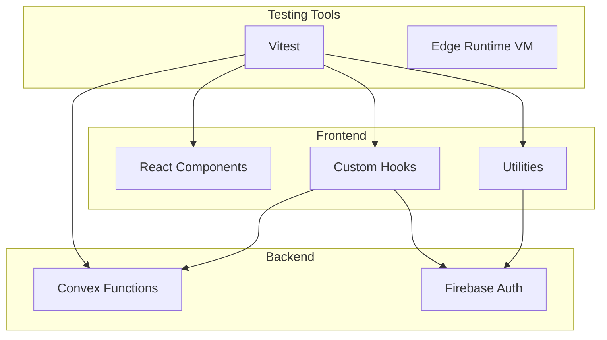
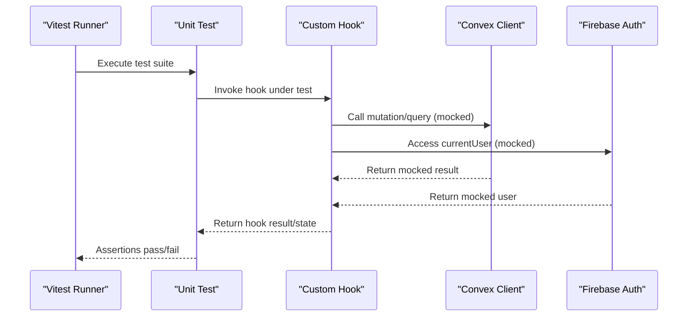
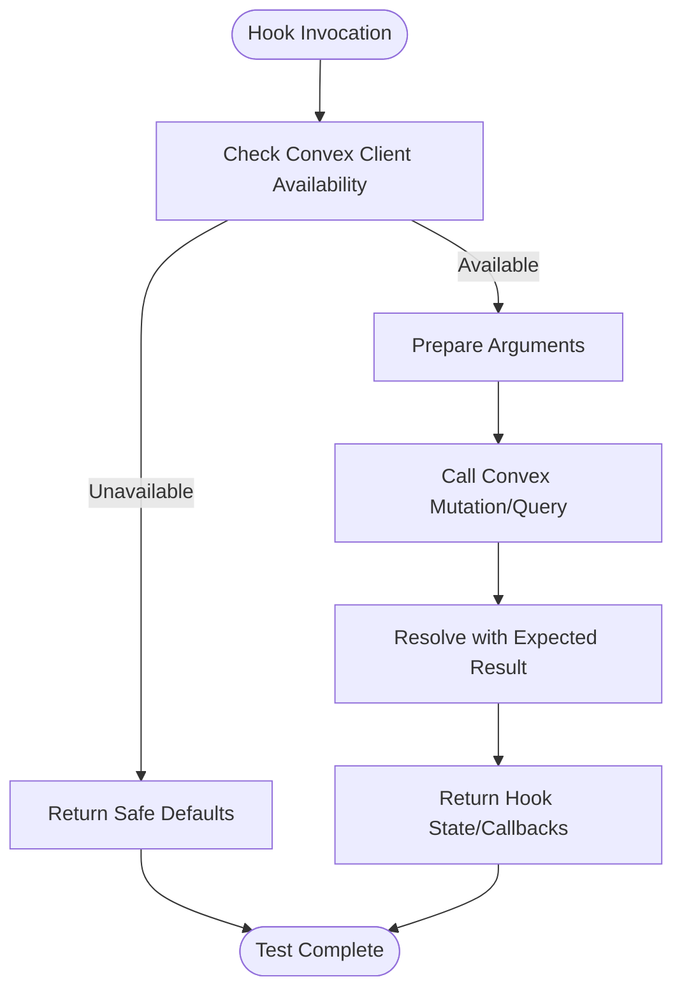
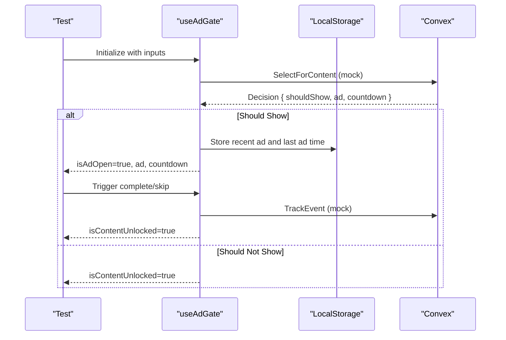
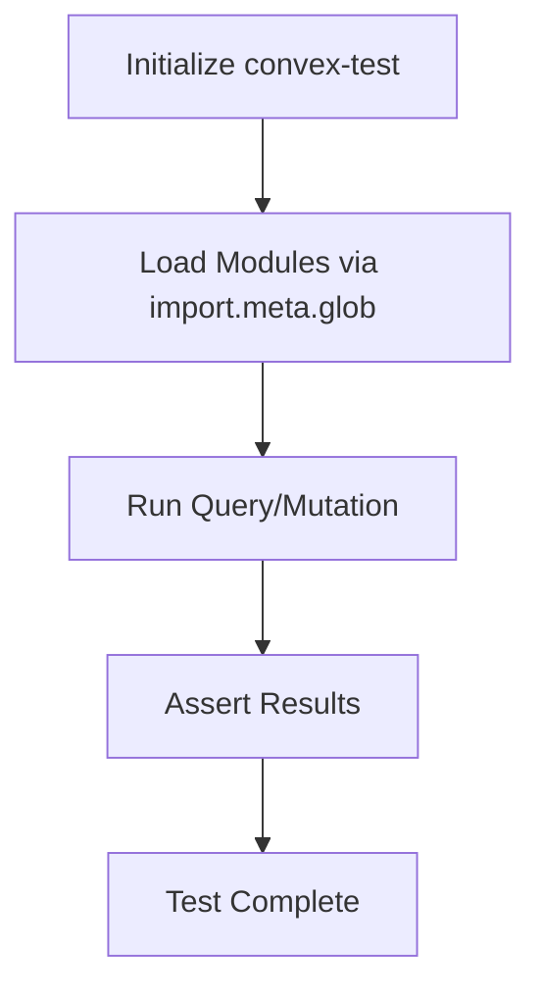
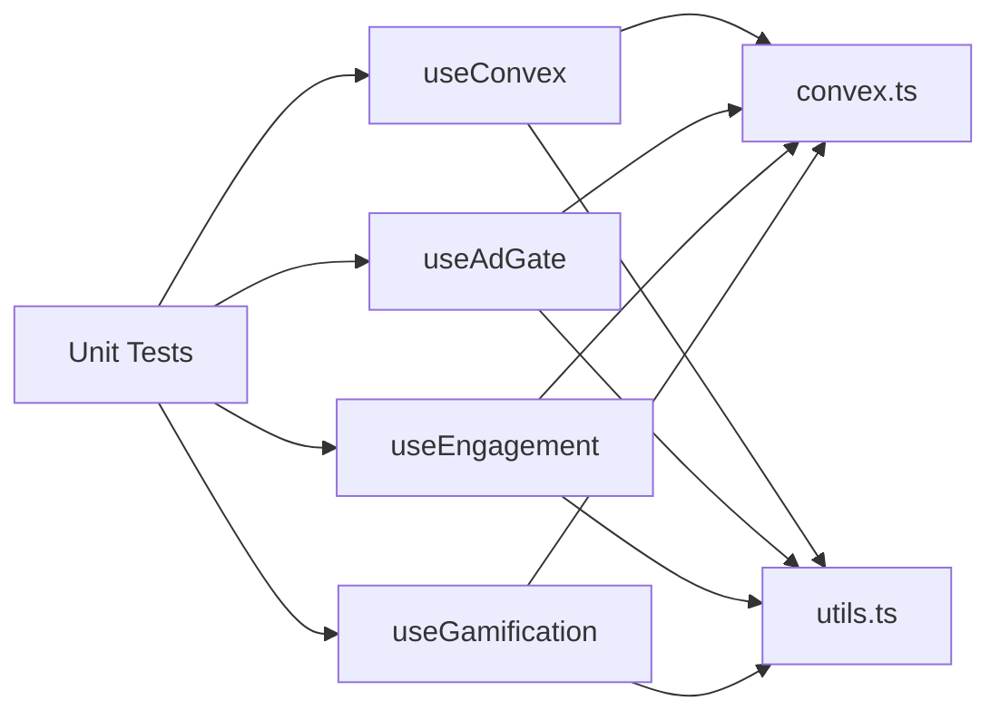

# Unit Testing

<cite>
**Referenced Files in This Document**
- [package.json](file://package.json)
- [vite.config.ts](file://vite.config.ts)
- [tsconfig.json](file://tsconfig.json)
- [tests/smoke.test.ts](file://tests/smoke.test.ts)
- [src/hooks/useConvex.ts](file://src/hooks/useConvex.ts)
- [src/hooks/useAdGate.ts](file://src/hooks/useAdGate.ts)
- [src/hooks/useEngagement.ts](file://src/hooks/useEngagement.ts)
- [src/hooks/useGamification.ts](file://src/hooks/useGamification.ts)
- [src/lib/convex.ts](file://src/lib/convex.ts)
- [src/lib/utils.ts](file://src/lib/utils.ts)
- [convex/_generated/ai/guidelines.md](file://convex/_generated/ai/guidelines.md)
</cite>

## Table of Contents
1. [Introduction](#introduction)
2. [Project Structure](#project-structure)
3. [Core Components](#core-components)
4. [Architecture Overview](#architecture-overview)
5. [Detailed Component Analysis](#detailed-component-analysis)
6. [Dependency Analysis](#dependency-analysis)
7. [Performance Considerations](#performance-considerations)
8. [Troubleshooting Guide](#troubleshooting-guide)
9. [Conclusion](#conclusion)
10. [Appendices](#appendices)

## Introduction
This document provides comprehensive unit testing guidance for the Lemonade project. It covers:
- Vitest setup and configuration for React components and utility functions
- Strategies for testing React hooks, custom hooks, and utility functions
- Mocking strategies for Convex functions, external APIs, and database operations
- Patterns for rendering, props, state, async operations, error handling, and edge cases
- Test isolation techniques and best practices for TypeScript and Convex serverless functions
- Naming conventions, assertion patterns, and test organization

## Project Structure
The project uses Vitest for unit testing and Vite for building. Convex is integrated for backend functions, and Firebase is used for authentication. Hooks orchestrate Convex queries/mutations and integrate with UI components.

**Diagram sources**
- [package.json:7](file://package.json#L7)
- [vite.config.ts:1-37](file://vite.config.ts#L1-L37)
- [src/lib/convex.ts:1-12](file://src/lib/convex.ts#L1-L12)
- [src/hooks/useConvex.ts:1-213](file://src/hooks/useConvex.ts#L1-L213)

**Section sources**
- [package.json:1-45](file://package.json#L1-L45)
- [vite.config.ts:1-37](file://vite.config.ts#L1-L37)
- [tsconfig.json:1-27](file://tsconfig.json#L1-L27)

## Core Components
- Vitest configuration and scripts are defined in the project’s package configuration.
- Convex client initialization resides in a dedicated library file and is conditionally enabled based on environment configuration.
- Utility functions provide pure transformations suitable for straightforward unit tests.
- Custom hooks encapsulate Convex interactions and side effects, requiring careful mocking and isolation in tests.

Key testing entry points:
- React and utility tests can be run via the test script.
- Convex function tests should leverage the recommended testing approach documented in the project’s guidelines.

**Section sources**
- [package.json:6-12](file://package.json#L6-L12)
- [src/lib/convex.ts:1-12](file://src/lib/convex.ts#L1-L12)
- [src/lib/utils.ts:1-7](file://src/lib/utils.ts#L1-L7)
- [convex/_generated/ai/guidelines.md:311-335](file://convex/_generated/ai/guidelines.md#L311-L335)

## Architecture Overview
The testing architecture centers around Vitest with optional Edge Runtime VM for Convex function tests. Hooks depend on the Convex client and Firebase auth, which must be mocked in unit tests to ensure isolation and determinism.

**Diagram sources**
- [src/hooks/useConvex.ts:1-213](file://src/hooks/useConvex.ts#L1-L213)
- [src/lib/convex.ts:1-12](file://src/lib/convex.ts#L1-L12)
- [src/hooks/useAdGate.ts:1-174](file://src/hooks/useAdGate.ts#L1-L174)
- [src/hooks/useEngagement.ts:1-63](file://src/hooks/useEngagement.ts#L1-L63)
- [src/hooks/useGamification.ts:1-48](file://src/hooks/useGamification.ts#L1-L48)

## Detailed Component Analysis

### Vitest Setup and Configuration
- Scripts: The test script invokes Vitest.
- Environment: Convex function tests should use the Edge Runtime VM environment as recommended.
- Aliasing and defines: Vite aliases and global defines can influence test runtime behavior and should be considered when mocking.

Recommendations:
- Keep environment variables isolated per test using beforeEach/afterEach.
- Prefer module mocks over global environment overrides for deterministic tests.

**Section sources**
- [package.json:6-12](file://package.json#L6-L12)
- [vite.config.ts:10-12](file://vite.config.ts#L10-L12)
- [convex/_generated/ai/guidelines.md:311-313](file://convex/_generated/ai/guidelines.md#L311-L313)

### Utility Functions Testing (Example: cn)
- Pure function: The utility function performs deterministic transformations.
- Testing approach: Provide various inputs and assert merged class names. No mocking required.

Best practices:
- Cover typical combinations and edge cases (empty inputs, duplicates).
- Keep tests small and focused.

**Section sources**
- [src/lib/utils.ts:1-7](file://src/lib/utils.ts#L1-L7)

### Custom Hooks Testing

#### useConvex Hook Family
Purpose:
- Encapsulates Convex mutations and queries for stories, users, payments, and creator applications.
- Integrates with Firebase for user context.

Testing approach:
- Mock the Convex client and Firebase auth to isolate the hook logic.
- Verify returned callbacks and derived state for different inputs.
- Validate error conditions and early returns when client/auth are unavailable.

**Diagram sources**
- [src/hooks/useConvex.ts:1-213](file://src/hooks/useConvex.ts#L1-L213)
- [src/lib/convex.ts:1-12](file://src/lib/convex.ts#L1-L12)

**Section sources**
- [src/hooks/useConvex.ts:1-213](file://src/hooks/useConvex.ts#L1-L213)

#### useAdGate Hook
Purpose:
- Decides whether to show an ad based on Convex decisions and local storage signals.
- Manages ad modal state, countdown, and tracking events.

Testing approach:
- Mock Convex mutation for ad selection and tracking.
- Mock localStorage for recent ads and last ad timestamps.
- Simulate effect lifecycles to test decision loading, ad opening, unlocking, and skipping.

**Diagram sources**
- [src/hooks/useAdGate.ts:1-174](file://src/hooks/useAdGate.ts#L1-L174)

**Section sources**
- [src/hooks/useAdGate.ts:1-174](file://src/hooks/useAdGate.ts#L1-L174)

#### useEngagement Hook
Purpose:
- Periodically records engagement metrics via Convex while the tab is visible.
- Sends a final event on visibility change or cleanup.

Testing approach:
- Mock Convex mutation and Firebase auth.
- Control time via fake timers to assert periodic sends and finalization on cleanup.

**Section sources**
- [src/hooks/useEngagement.ts:1-63](file://src/hooks/useEngagement.ts#L1-L63)

#### useGamification Hook
Purpose:
- Loads gamification data (inventory, streak, currencies) and exposes actions (check eligibility, spin, buy streak protection).

Testing approach:
- Mock Convex queries and mutations.
- Assert loading state transitions and returned values.
- Validate error handling paths and authentication checks.

**Section sources**
- [src/hooks/useGamification.ts:1-48](file://src/hooks/useGamification.ts#L1-L48)

### Convex Function Testing
Recommended approach:
- Use convex-test with Vitest and Edge Runtime VM.
- Provide module map via import.meta.glob to load function files.
- Configure Vitest environment accordingly.

**Diagram sources**
- [convex/_generated/ai/guidelines.md:311-335](file://convex/_generated/ai/guidelines.md#L311-L335)

**Section sources**
- [convex/_generated/ai/guidelines.md:311-335](file://convex/_generated/ai/guidelines.md#L311-L335)

### React Component Testing
Approach:
- Render components in isolation using a testing renderer compatible with Vitest.
- Mock hooks and external dependencies (Convex, Firebase) via providers or module mocks.
- Assert rendering, prop handling, and state updates.

Patterns:
- Snapshot tests for static renders.
- Event-driven tests for interactive components.
- Async tests for hooks that fetch data or trigger network requests.

[No sources needed since this section provides general guidance]

### Mocking Strategies
- Convex client: Replace the client instance with a mock that resolves to controlled values.
- Firebase auth: Mock currentUser and related methods to simulate authenticated/unauthenticated states.
- Local storage: Stub getItem/setItem for hooks relying on persisted state.
- Environment variables: Use beforeEach to set/import.meta.env values for hooks that depend on them.

**Section sources**
- [src/lib/convex.ts:1-12](file://src/lib/convex.ts#L1-L12)
- [src/hooks/useAdGate.ts:17-32](file://src/hooks/useAdGate.ts#L17-L32)

### Async Operations, Error Handling, and Edge Cases
- Async: Use fake timers for periodic tasks and promises for Convex calls.
- Error handling: Verify fallback states and logged errors without crashing tests.
- Edge cases: Empty inputs, missing auth, disabled Convex, invalid ids, and unexpected network failures.

**Section sources**
- [src/hooks/useEngagement.ts:15-41](file://src/hooks/useEngagement.ts#L15-L41)
- [src/hooks/useGamification.ts:22-26](file://src/hooks/useGamification.ts#L22-L26)
- [src/hooks/useAdGate.ts:121-126](file://src/hooks/useAdGate.ts#L121-L126)

### Test Isolation Techniques
- beforeEach/afterEach: Reset mocks, timers, and global state between tests.
- Module mocks: Use Vitest’s mock substitution to replace external dependencies per test file.
- Test-specific environment: Override environment variables only for the current test.

**Section sources**
- [tests/smoke.test.ts:1-13](file://tests/smoke.test.ts#L1-L13)

### Best Practices for TypeScript and Convex
- Type-safe mocks: Ensure mock return types match expected Convex signatures.
- Strict config: Leverage existing TypeScript configuration for type checking in tests.
- Convex tests: Follow the documented pattern for module discovery and environment setup.

**Section sources**
- [tsconfig.json:1-27](file://tsconfig.json#L1-L27)
- [convex/_generated/ai/guidelines.md:311-335](file://convex/_generated/ai/guidelines.md#L311-L335)

### Naming Conventions, Assertion Patterns, and Organization
- Naming: Descriptive test names that reflect behavior and pre/post conditions.
- Assertions: Prefer equality and structural assertions; avoid brittle string comparisons.
- Organization: Group related tests by feature or component; keep shared setup in setup files.

[No sources needed since this section provides general guidance]

## Dependency Analysis
The following diagram shows how tests interact with hooks, utilities, and backend services.

**Diagram sources**
- [src/hooks/useConvex.ts:1-213](file://src/hooks/useConvex.ts#L1-L213)
- [src/hooks/useAdGate.ts:1-174](file://src/hooks/useAdGate.ts#L1-L174)
- [src/hooks/useEngagement.ts:1-63](file://src/hooks/useEngagement.ts#L1-L63)
- [src/hooks/useGamification.ts:1-48](file://src/hooks/useGamification.ts#L1-L48)
- [src/lib/convex.ts:1-12](file://src/lib/convex.ts#L1-L12)
- [src/lib/utils.ts:1-7](file://src/lib/utils.ts#L1-L7)

**Section sources**
- [src/hooks/useConvex.ts:1-213](file://src/hooks/useConvex.ts#L1-L213)
- [src/hooks/useAdGate.ts:1-174](file://src/hooks/useAdGate.ts#L1-L174)
- [src/hooks/useEngagement.ts:1-63](file://src/hooks/useEngagement.ts#L1-L63)
- [src/hooks/useGamification.ts:1-48](file://src/hooks/useGamification.ts#L1-L48)
- [src/lib/convex.ts:1-12](file://src/lib/convex.ts#L1-L12)
- [src/lib/utils.ts:1-7](file://src/lib/utils.ts#L1-L7)

## Performance Considerations
- Avoid real network calls in unit tests; mock all external dependencies.
- Use fake timers to control time-sensitive logic deterministically.
- Minimize heavy setup in beforeEach; reuse shared mocks across tests.

[No sources needed since this section provides general guidance]

## Troubleshooting Guide
Common issues and resolutions:
- Missing Convex URL: Tests may fail if the client is disabled. Ensure environment variables are set or mocks are configured.
- Authentication errors: Ensure Firebase auth is mocked to return appropriate user state.
- Asynchronous timing: Use fake timers and explicit waits for async operations.
- Module resolution: For Convex tests, ensure modules are loaded via import.meta.glob as documented.

**Section sources**
- [src/lib/convex.ts:5-7](file://src/lib/convex.ts#L5-L7)
- [convex/_generated/ai/guidelines.md:315-316](file://convex/_generated/ai/guidelines.md#L315-L316)

## Conclusion
By leveraging Vitest with targeted mocks, isolating dependencies, and following the documented patterns for Convex function testing, the project can maintain reliable and maintainable unit tests. Focus on deterministic behavior, clear assertions, and robust edge-case coverage to ensure confidence in the codebase.

[No sources needed since this section summarizes without analyzing specific files]

## Appendices
- Example smoke test demonstrates reading schema and asserting presence of tables, illustrating basic test structure and file system usage in tests.

**Section sources**
- [tests/smoke.test.ts:1-13](file://tests/smoke.test.ts#L1-L13)