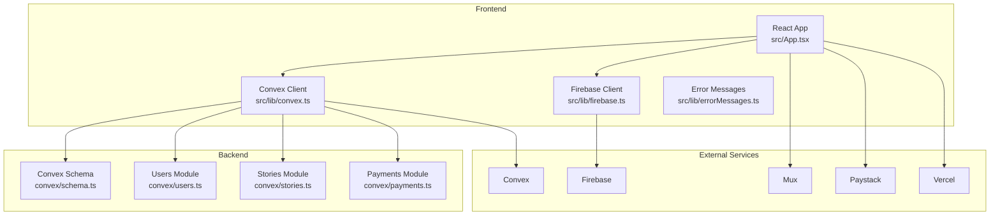
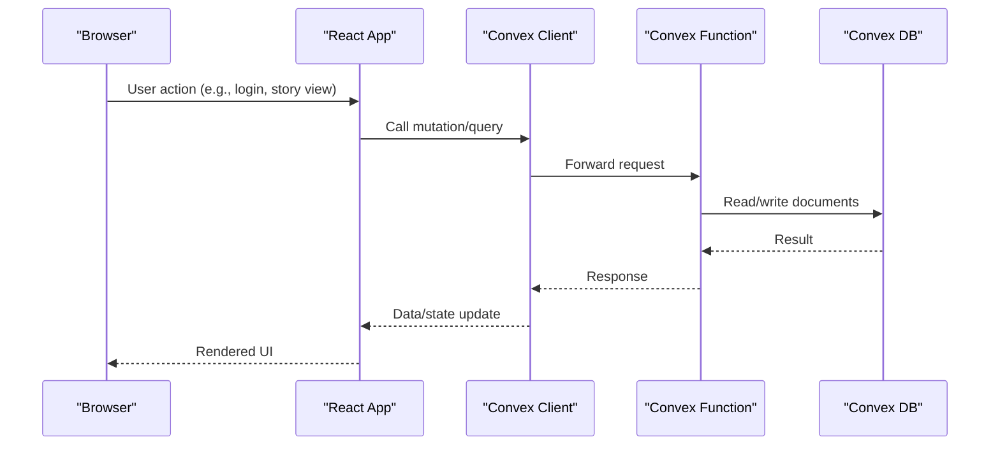
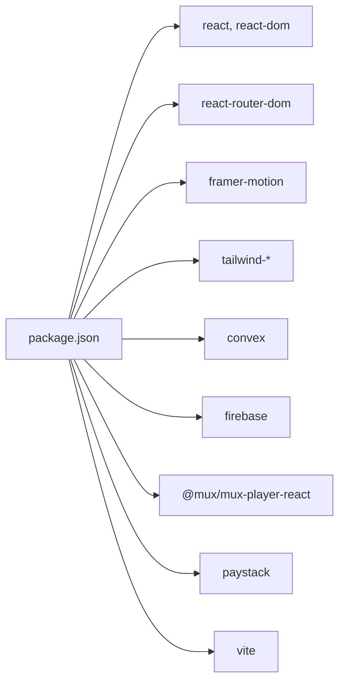

# Troubleshooting and FAQ

<cite>
**Referenced Files in This Document**
- [README.md](file://README.md)
- [DEVELOPMENT_SETUP.md](file://DEVELOPMENT_SETUP.md)
- [PRODUCTION_DEPLOYMENT.md](file://PRODUCTION_DEPLOYMENT.md)
- [TECH_STACK_SETUP.md](file://TECH_STACK_SETUP.md)
- [package.json](file://package.json)
- [src/lib/errorMessages.ts](file://src/lib/errorMessages.ts)
- [src/lib/convex.ts](file://src/lib/convex.ts)
- [src/hooks/useConvex.ts](file://src/hooks/useConvex.ts)
- [src/lib/firebase.ts](file://src/lib/firebase.ts)
- [src/App.tsx](file://src/App.tsx)
- [convex/schema.ts](file://convex/schema.ts)
- [convex/users.ts](file://convex/users.ts)
- [convex/stories.ts](file://convex/stories.ts)
- [convex/payments.ts](file://convex/payments.ts)
</cite>

## Table of Contents
1. [Introduction](#introduction)
2. [Project Structure](#project-structure)
3. [Core Components](#core-components)
4. [Architecture Overview](#architecture-overview)
5. [Detailed Component Analysis](#detailed-component-analysis)
6. [Dependency Analysis](#dependency-analysis)
7. [Performance Considerations](#performance-considerations)
8. [Troubleshooting Guide](#troubleshooting-guide)
9. [FAQ](#faq)
10. [Conclusion](#conclusion)
11. [Appendices](#appendices)

## Introduction
This document provides comprehensive troubleshooting and FAQ guidance for the Lemonade platform. It focuses on:
- Common setup and environment configuration issues
- Debugging frontend React components, backend Convex functions, and database connectivity
- Performance troubleshooting (slow loads, API delays, memory usage)
- Error message interpretation and resolutions
- Browser compatibility and mobile responsiveness
- Production deployment and monitoring
- Escalation procedures and support resources

## Project Structure
The application follows a modern full-stack architecture:
- Frontend: React + TypeScript with Vite
- Backend: Convex serverless functions and schema
- Integrations: Firebase (Auth, Firestore, Storage), Mux (video), Paystack (payments), Vercel (hosting)
- Development and deployment workflows are documented for local and production environments

**Diagram sources**
- [src/App.tsx:1-375](file://src/App.tsx#L1-L375)
- [src/lib/convex.ts:1-12](file://src/lib/convex.ts#L1-L12)
- [src/lib/firebase.ts:1-55](file://src/lib/firebase.ts#L1-L55)
- [convex/schema.ts:1-493](file://convex/schema.ts#L1-L493)
- [convex/users.ts:1-360](file://convex/users.ts#L1-L360)
- [convex/stories.ts:1-180](file://convex/stories.ts#L1-L180)
- [convex/payments.ts:1-291](file://convex/payments.ts#L1-L291)

**Section sources**
- [README.md:1-21](file://README.md#L1-L21)
- [DEVELOPMENT_SETUP.md:3-34](file://DEVELOPMENT_SETUP.md#L3-L34)
- [TECH_STACK_SETUP.md:1-244](file://TECH_STACK_SETUP.md#L1-L244)

## Core Components
- Convex client initialization and environment guard
- Firebase client initialization with emulator support
- Error message mapping for Firebase Auth
- Frontend routing and layout
- Backend schema and modules for users, stories, and payments

Key implementation references:
- Convex client guard and warning: [src/lib/convex.ts:3-9](file://src/lib/convex.ts#L3-L9)
- Firebase emulator connections: [src/lib/firebase.ts:33-52](file://src/lib/firebase.ts#L33-L52)
- Firebase Auth error messages: [src/lib/errorMessages.ts:7-52](file://src/lib/errorMessages.ts#L7-L52)
- Frontend routes: [src/App.tsx:85-363](file://src/App.tsx#L85-L363)

**Section sources**
- [src/lib/convex.ts:1-12](file://src/lib/convex.ts#L1-L12)
- [src/lib/firebase.ts:1-55](file://src/lib/firebase.ts#L1-L55)
- [src/lib/errorMessages.ts:1-94](file://src/lib/errorMessages.ts#L1-L94)
- [src/App.tsx:1-375](file://src/App.tsx#L1-L375)

## Architecture Overview
The system integrates multiple cloud services and local development tools. The frontend communicates with Convex functions, which operate on the Convex backend. Firebase handles authentication, storage, and optionally Firestore. Mux supports video upload and playback. Paystack manages payments. Vercel hosts the frontend and serverless functions.

**Diagram sources**
- [src/lib/convex.ts:1-12](file://src/lib/convex.ts#L1-L12)
- [src/hooks/useConvex.ts:163-177](file://src/hooks/useConvex.ts#L163-L177)
- [convex/schema.ts:1-493](file://convex/schema.ts#L1-L493)

## Detailed Component Analysis

### Frontend Debugging: React Components and Hooks
Common issues:
- Missing environment variables causing disabled integrations
- Incorrect route guards or navigation
- Firebase emulator misconfiguration

Recommended debugging steps:
- Verify environment variables in the browser console and meta.env
- Check Convex connection and dashboard logs
- Inspect network requests for /convex/* and /v1/auth/*
- Validate emulator connections for auth, firestore, and storage

References:
- Environment checks and debugging: [DEVELOPMENT_SETUP.md:151-188](file://DEVELOPMENT_SETUP.md#L151-L188)
- Convex client guard: [src/lib/convex.ts:3-9](file://src/lib/convex.ts#L3-L9)
- Firebase emulator connections: [src/lib/firebase.ts:33-52](file://src/lib/firebase.ts#L33-L52)
- Frontend routes: [src/App.tsx:85-363](file://src/App.tsx#L85-L363)

**Section sources**
- [DEVELOPMENT_SETUP.md:151-188](file://DEVELOPMENT_SETUP.md#L151-L188)
- [src/lib/convex.ts:1-12](file://src/lib/convex.ts#L1-L12)
- [src/lib/firebase.ts:1-55](file://src/lib/firebase.ts#L1-L55)
- [src/App.tsx:1-375](file://src/App.tsx#L1-L375)

### Backend Debugging: Convex Functions and Schema
Common issues:
- Missing Convex URL leading to disabled client
- Index usage and query correctness
- Mutation argument validation and error propagation

Recommended debugging steps:
- Confirm VITE_CONVEX_URL is set and reachable
- Use Convex Dashboard to inspect tables and logs
- Validate queries against defined indices
- Add logging and structured error messages in mutations

References:
- Convex client guard: [src/lib/convex.ts:3-9](file://src/lib/convex.ts#L3-L9)
- Convex schema indices: [convex/schema.ts:63-67](file://convex/schema.ts#L63-L67), [convex/schema.ts:91-93](file://convex/schema.ts#L91-L93), [convex/schema.ts:121-125](file://convex/schema.ts#L121-L125)
- Users module validations: [convex/users.ts:9-13](file://convex/users.ts#L9-L13), [convex/users.ts:210-235](file://convex/users.ts#L210-L235)
- Stories module validations: [convex/stories.ts:69-71](file://convex/stories.ts#L69-L71), [convex/stories.ts:170-175](file://convex/stories.ts#L170-L175)
- Payments module validations: [convex/payments.ts:123-130](file://convex/payments.ts#L123-L130), [convex/payments.ts:186-188](file://convex/payments.ts#L186-L188)

**Section sources**
- [src/lib/convex.ts:1-12](file://src/lib/convex.ts#L1-L12)
- [convex/schema.ts:1-493](file://convex/schema.ts#L1-L493)
- [convex/users.ts:1-360](file://convex/users.ts#L1-L360)
- [convex/stories.ts:1-180](file://convex/stories.ts#L1-L180)
- [convex/payments.ts:1-291](file://convex/payments.ts#L1-L291)

### Database Connectivity and Schema Integrity
Common issues:
- Missing indices impacting query performance
- Incorrect field normalization and validation
- Transaction and notification creation errors

Recommended debugging steps:
- Ensure all required indices exist per schema
- Normalize usernames and validate inputs before writes
- Verify transaction references uniqueness to prevent duplicates

References:
- Schema indices: [convex/schema.ts:63-67](file://convex/schema.ts#L63-L67), [convex/schema.ts:91-93](file://convex/schema.ts#L91-L93), [convex/schema.ts:121-125](file://convex/schema.ts#L121-L125)
- Username normalization and validation: [convex/users.ts:7](file://convex/users.ts#L7-L13), [convex/users.ts:210-235](file://convex/users.ts#L210-L235)
- Transaction reference uniqueness: [convex/payments.ts:132-140](file://convex/payments.ts#L132-L140)

**Section sources**
- [convex/schema.ts:1-493](file://convex/schema.ts#L1-L493)
- [convex/users.ts:1-360](file://convex/users.ts#L1-L360)
- [convex/payments.ts:1-291](file://convex/payments.ts#L1-L291)

### Error Message Interpretation and Resolution
Common Firebase Auth errors and guidance:
- Email already registered, invalid email, weak password, missing password, invalid credentials, user not found, wrong password
- Network request failed, popup closed by user, cancelled popup request, popup blocked
- API key not valid prefix mapped to a specific configuration error

Resolution steps:
- Validate form inputs and enforce minimum requirements
- Ensure popups are enabled and only one sign-in window is open
- Confirm Firebase configuration is correct and environment variables are set

References:
- Error code extraction and mapping: [src/lib/errorMessages.ts:65-93](file://src/lib/errorMessages.ts#L65-L93)
- Firebase Auth messages: [src/lib/errorMessages.ts:7-52](file://src/lib/errorMessages.ts#L7-L52)
- Prefix-based mapping: [src/lib/errorMessages.ts:54-63](file://src/lib/errorMessages.ts#L54-L63)

**Section sources**
- [src/lib/errorMessages.ts:1-94](file://src/lib/errorMessages.ts#L1-L94)

### Browser Compatibility and Mobile Responsiveness
Guidance:
- Use Tailwind utilities and responsive breakpoints
- Test across major browsers and devices
- Validate touch interactions and viewport settings

References:
- Tailwind usage in components: [src/lib/utils.ts:1-7](file://src/lib/utils.ts#L1-L7)
- Package dependencies including Tailwind: [package.json:14-31](file://package.json#L14-L31)

**Section sources**
- [src/lib/utils.ts:1-7](file://src/lib/utils.ts#L1-L7)
- [package.json:1-45](file://package.json#L1-L45)

## Dependency Analysis
Runtime dependencies and scripts:
- React, React DOM, React Router, Framer Motion, Tailwind ecosystem
- Convex, Firebase, Mux, Paystack integrations
- Vite for dev/build, Vitest for unit tests

**Diagram sources**
- [package.json:14-31](file://package.json#L14-L31)

**Section sources**
- [package.json:1-45](file://package.json#L1-L45)

## Performance Considerations
- Bundle size and build verification
- API call tracking and optimization
- Memory usage monitoring and leak detection
- Network request inspection for latency

Recommendations:
- Run build and inspect bundle size; use visualization tools
- Track Convex API calls and reduce unnecessary fetches
- Use Chrome DevTools Memory tab to detect leaks
- Monitor network tab for slow endpoints and retries

References:
- Build and bundle checks: [DEVELOPMENT_SETUP.md:116-120](file://DEVELOPMENT_SETUP.md#L116-L120)
- API call tracking: [DEVELOPMENT_SETUP.md:274-279](file://DEVELOPMENT_SETUP.md#L274-L279)
- Memory usage: [DEVELOPMENT_SETUP.md:281-286](file://DEVELOPMENT_SETUP.md#L281-L286)
- Network inspection: [DEVELOPMENT_SETUP.md:181-188](file://DEVELOPMENT_SETUP.md#L181-L188)

**Section sources**
- [DEVELOPMENT_SETUP.md:116-120](file://DEVELOPMENT_SETUP.md#L116-L120)
- [DEVELOPMENT_SETUP.md:274-279](file://DEVELOPMENT_SETUP.md#L274-L279)
- [DEVELOPMENT_SETUP.md:281-286](file://DEVELOPMENT_SETUP.md#L281-L286)
- [DEVELOPMENT_SETUP.md:181-188](file://DEVELOPMENT_SETUP.md#L181-L188)

## Troubleshooting Guide

### Common Setup Problems and Solutions
- Missing VITE_CONVEX_URL
  - Ensure the environment variable is set for local or production
  - For local development, use the Convex dev server URL
  - Reference: [DEVELOPMENT_SETUP.md:215-223](file://DEVELOPMENT_SETUP.md#L215-L223)

- Cannot find module 'convex/react'
  - Install Convex and start the Convex dev server
  - Reference: [DEVELOPMENT_SETUP.md:225-230](file://DEVELOPMENT_SETUP.md#L225-L230)

- Firebase initialization failed
  - Verify all Firebase environment variables are set and not placeholders
  - Reference: [DEVELOPMENT_SETUP.md:232-239](file://DEVELOPMENT_SETUP.md#L232-L239)

- Paystack payment not working
  - Use test keys for development and test card details
  - Reference: [DEVELOPMENT_SETUP.md:241-249](file://DEVELOPMENT_SETUP.md#L241-L249)

- Profile picture upload fails
  - Check Firebase Storage rules, CORS configuration, file size limits, and supported formats
  - Reference: [DEVELOPMENT_SETUP.md:251-258](file://DEVELOPMENT_SETUP.md#L251-L258)

### Debugging Approaches
- Frontend console and environment checks
  - Inspect current user, Convex connection, and environment variables
  - Reference: [DEVELOPMENT_SETUP.md:153-165](file://DEVELOPMENT_SETUP.md#L153-L165)

- Convex Dashboard
  - Verify tables, indices, and API call logs
  - Reference: [DEVELOPMENT_SETUP.md:167-171](file://DEVELOPMENT_SETUP.md#L167-L171)

- Firebase Console
  - Check Authentication, Storage, and Firestore
  - Reference: [DEVELOPMENT_SETUP.md:173-179](file://DEVELOPMENT_SETUP.md#L173-L179)

- Network requests
  - Observe /convex/*, /v1/auth/*, and storage.googleapis.com traffic
  - Reference: [DEVELOPMENT_SETUP.md:181-188](file://DEVELOPMENT_SETUP.md#L181-L188)

### Database Connectivity Issues
- Convex URL not set
  - The client warns and disables until configured
  - Reference: [src/lib/convex.ts:5-7](file://src/lib/convex.ts#L5-L7)

- Schema and indices
  - Ensure required indices exist for queries
  - Reference: [convex/schema.ts:63-67](file://convex/schema.ts#L63-L67), [convex/schema.ts:91-93](file://convex/schema.ts#L91-L93), [convex/schema.ts:121-125](file://convex/schema.ts#L121-L125)

- Validation errors
  - Username constraints, story existence, and payment amounts
  - References: [convex/users.ts:9-13](file://convex/users.ts#L9-L13), [convex/stories.ts:69-71](file://convex/stories.ts#L69-L71), [convex/payments.ts:123-130](file://convex/payments.ts#L123-L130)

### Performance Troubleshooting
- Slow page loads
  - Analyze bundle size and remove unused dependencies
  - Reference: [DEVELOPMENT_SETUP.md:264-272](file://DEVELOPMENT_SETUP.md#L264-L272)

- API response delays
  - Track Convex API calls and optimize queries
  - Reference: [DEVELOPMENT_SETUP.md:274-279](file://DEVELOPMENT_SETUP.md#L274-L279)

- Memory usage optimization
  - Take heap snapshots and identify leaks
  - Reference: [DEVELOPMENT_SETUP.md:281-286](file://DEVELOPMENT_SETUP.md#L281-L286)

### Production Deployment Issues and Monitoring
- Environment variables
  - Ensure all production keys and URLs are configured
  - Reference: [PRODUCTION_DEPLOYMENT.md:9-34](file://PRODUCTION_DEPLOYMENT.md#L9-L34)

- Smoke tests
  - Validate auth, profile, story flows, payments, uploads, and webhooks
  - Reference: [PRODUCTION_DEPLOYMENT.md:78-87](file://PRODUCTION_DEPLOYMENT.md#L78-L87)

- Paystack webhook testing
  - Use ngrok for local testing and verify signature verification
  - Reference: [PRODUCTION_DEPLOYMENT.md:91-97](file://PRODUCTION_DEPLOYMENT.md#L91-L97)

- Monitoring and alerts
  - Set up error tracking, monitor logs, and configure uptime checks
  - Reference: [PRODUCTION_DEPLOYMENT.md:108-112](file://PRODUCTION_DEPLOYMENT.md#L108-L112)

**Section sources**
- [DEVELOPMENT_SETUP.md:151-188](file://DEVELOPMENT_SETUP.md#L151-L188)
- [DEVELOPMENT_SETUP.md:213-286](file://DEVELOPMENT_SETUP.md#L213-L286)
- [src/lib/convex.ts:1-12](file://src/lib/convex.ts#L1-L12)
- [convex/schema.ts:1-493](file://convex/schema.ts#L1-L493)
- [convex/users.ts:1-360](file://convex/users.ts#L1-L360)
- [convex/stories.ts:1-180](file://convex/stories.ts#L1-L180)
- [convex/payments.ts:1-291](file://convex/payments.ts#L1-L291)
- [PRODUCTION_DEPLOYMENT.md:78-112](file://PRODUCTION_DEPLOYMENT.md#L78-L112)

## FAQ

Q1: How do I fix “VITE_CONVEX_URL is missing”?
- Set the environment variable in your local or CI environment.
- For local dev, use the Convex dev server URL.
- Reference: [DEVELOPMENT_SETUP.md:215-223](file://DEVELOPMENT_SETUP.md#L215-L223)

Q2: Why is Firebase initialization failing?
- Ensure all Firebase environment variables are set and not placeholder values.
- Reference: [DEVELOPMENT_SETUP.md:232-239](file://DEVELOPMENT_SETUP.md#L232-L239)

Q3: How do I test Paystack payments locally?
- Use test keys and test card details for sandbox testing.
- Reference: [DEVELOPMENT_SETUP.md:241-249](file://DEVELOPMENT_SETUP.md#L241-L249)

Q4: Profile picture uploads fail—what should I check?
- Verify Storage rules, CORS, file size (<5MB), and supported formats.
- Reference: [DEVELOPMENT_SETUP.md:251-258](file://DEVELOPMENT_SETUP.md#L251-L258)

Q5: How do I debug slow page loads?
- Analyze bundle size and remove unused dependencies.
- Reference: [DEVELOPMENT_SETUP.md:264-272](file://DEVELOPMENT_SETUP.md#L264-L272)

Q6: How do I monitor API response delays?
- Track Convex API calls and optimize queries.
- Reference: [DEVELOPMENT_SETUP.md:274-279](file://DEVELOPMENT_SETUP.md#L274-L279)

Q7: How do I handle memory leaks?
- Use Chrome DevTools Memory tab to take heap snapshots and identify leaks.
- Reference: [DEVELOPMENT_SETUP.md:281-286](file://DEVELOPMENT_SETUP.md#L281-L286)

Q8: How do I verify production deployments?
- Run smoke tests covering auth, profile, story flows, payments, uploads, and webhooks.
- Reference: [PRODUCTION_DEPLOYMENT.md:78-87](file://PRODUCTION_DEPLOYMENT.md#L78-L87)

Q9: How do I test Paystack webhooks in production?
- Use ngrok to expose local endpoints and verify signature verification.
- Reference: [PRODUCTION_DEPLOYMENT.md:91-97](file://PRODUCTION_DEPLOYMENT.md#L91-L97)

Q10: What should I monitor post-deployment?
- Enable error tracking, add uptime checks, and monitor logs for exceptions and webhook failures.
- Reference: [PRODUCTION_DEPLOYMENT.md:108-112](file://PRODUCTION_DEPLOYMENT.md#L108-L112)

**Section sources**
- [DEVELOPMENT_SETUP.md:213-286](file://DEVELOPMENT_SETUP.md#L213-L286)
- [PRODUCTION_DEPLOYMENT.md:78-112](file://PRODUCTION_DEPLOYMENT.md#L78-L112)

## Conclusion
This guide consolidates setup, debugging, performance, and production practices for the Lemonade platform. By following the outlined steps and leveraging the provided references, teams can quickly diagnose and resolve common issues while maintaining a robust deployment pipeline.

## Appendices

### Escalation Procedures and Support Resources
- Self-service: Check error messages, add debugging logs, search GitHub issues, read official documentation
- Community: Ask on Discord, Reddit, or Stack Overflow
- References: [DEVELOPMENT_SETUP.md:364-371](file://DEVELOPMENT_SETUP.md#L364-L371)

**Section sources**
- [DEVELOPMENT_SETUP.md:364-371](file://DEVELOPMENT_SETUP.md#L364-L371)