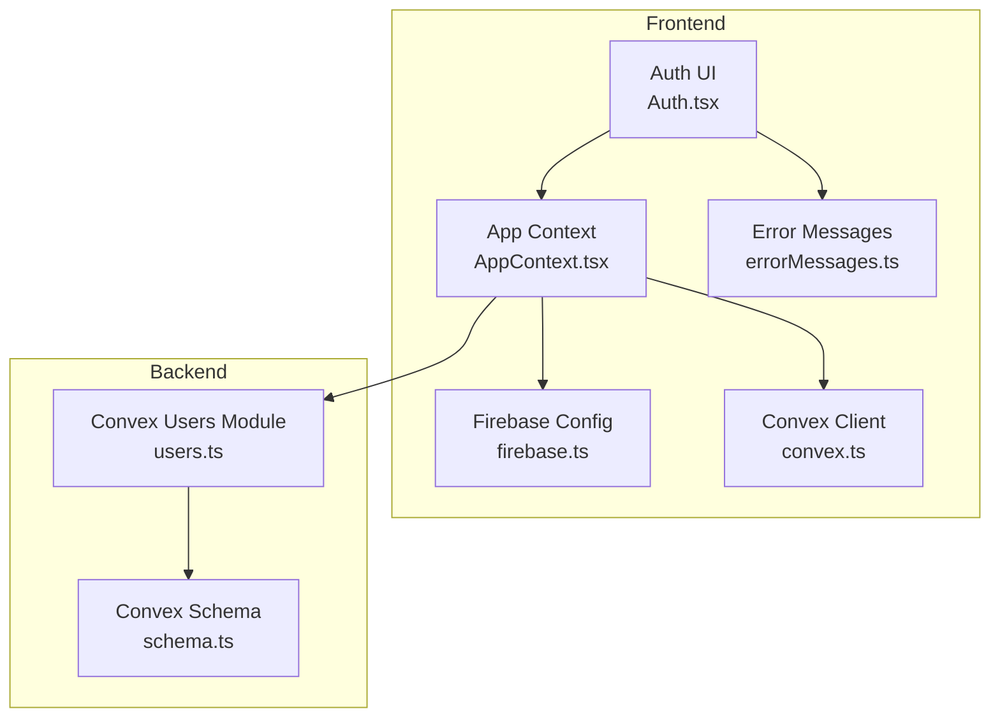
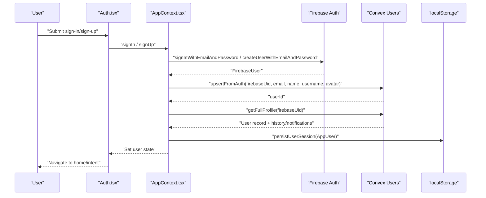
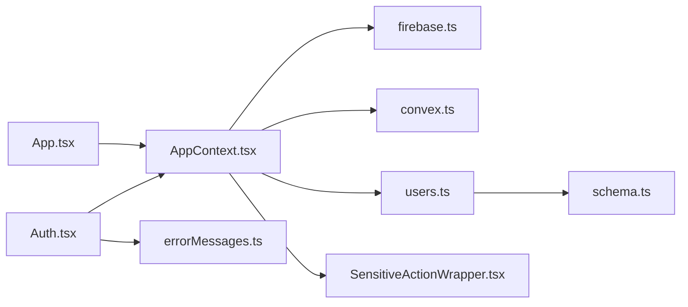

# Authentication Flow

<cite>
**Referenced Files in This Document**
- [firebase.ts](file://src/lib/firebase.ts)
- [AppContext.tsx](file://src/contexts/AppContext.tsx)
- [Auth.tsx](file://src/screens/Auth.tsx)
- [users.ts](file://convex/users.ts)
- [schema.ts](file://convex/schema.ts)
- [convex.ts](file://src/lib/convex.ts)
- [errorMessages.ts](file://src/lib/errorMessages.ts)
- [useConvex.ts](file://src/hooks/useConvex.ts)
- [App.tsx](file://src/App.tsx)
- [SensitiveActionWrapper.tsx](file://src/components/SensitiveActionWrapper.tsx)
</cite>

## Table of Contents
1. [Introduction](#introduction)
2. [Project Structure](#project-structure)
3. [Core Components](#core-components)
4. [Architecture Overview](#architecture-overview)
5. [Detailed Component Analysis](#detailed-component-analysis)
6. [Dependency Analysis](#dependency-analysis)
7. [Performance Considerations](#performance-considerations)
8. [Troubleshooting Guide](#troubleshooting-guide)
9. [Conclusion](#conclusion)

## Introduction
This document explains the complete authentication flow for Lemonade, covering Firebase Authentication integration and Convex user synchronization. It details the end-to-end lifecycle from user sign-up to login, including email/password authentication, session management, and token handling. It also documents how Firebase authentication events trigger Convex mutations to create or update user profiles, the upsertFromAuth mutation with username normalization and validation, and the authentication state management in AppContext. Error handling strategies, security considerations, and practical troubleshooting steps are included.

## Project Structure
Authentication spans three primary areas:
- Firebase client initialization and persistence
- Frontend authentication UI and state management
- Convex backend mutations and schema for user records

**Diagram sources**
- [Auth.tsx:12-334](file://src/screens/Auth.tsx#L12-L334)
- [AppContext.tsx:1-1452](file://src/contexts/AppContext.tsx#L1-L1452)
- [firebase.ts:1-55](file://src/lib/firebase.ts#L1-L55)
- [convex.ts:1-12](file://src/lib/convex.ts#L1-L12)
- [users.ts:1-360](file://convex/users.ts#L1-L360)
- [schema.ts:1-493](file://convex/schema.ts#L1-L493)
- [errorMessages.ts:1-94](file://src/lib/errorMessages.ts#L1-L94)

**Section sources**
- [Auth.tsx:12-334](file://src/screens/Auth.tsx#L12-L334)
- [AppContext.tsx:1-1452](file://src/contexts/AppContext.tsx#L1-L1452)
- [firebase.ts:1-55](file://src/lib/firebase.ts#L1-L55)
- [convex.ts:1-12](file://src/lib/convex.ts#L1-L12)
- [users.ts:1-360](file://convex/users.ts#L1-L360)
- [schema.ts:1-493](file://convex/schema.ts#L1-L493)
- [errorMessages.ts:1-94](file://src/lib/errorMessages.ts#L1-L94)

## Core Components
- Firebase Authentication client initialized with browser local persistence and optional emulator connections for development.
- AppContext orchestrating authentication state, persistence, and user synchronization with Convex.
- Auth screen handling user interactions, persistence selection, and error presentation.
- Convex users module providing mutations and queries for user creation/updating and profile retrieval.
- Convex schema defining the users table and indexes used for lookups.

Key responsibilities:
- Firebase: sign-in/sign-up, Google OAuth, persistence, auth state listener.
- AppContext: synchronize Firebase user with Convex, manage persisted session, derive AppUser model.
- Convex: enforce username normalization/validation, upsert user records, and provide profile queries.

**Section sources**
- [firebase.ts:1-55](file://src/lib/firebase.ts#L1-L55)
- [AppContext.tsx:1-1452](file://src/contexts/AppContext.tsx#L1-L1452)
- [Auth.tsx:12-334](file://src/screens/Auth.tsx#L12-L334)
- [users.ts:1-360](file://convex/users.ts#L1-L360)
- [schema.ts:1-493](file://convex/schema.ts#L1-L493)

## Architecture Overview
The authentication flow integrates Firebase and Convex as follows:
- User signs in via email/password or Google in the Auth screen.
- AppContext sets persistence and calls Firebase APIs.
- On successful Firebase auth, AppContext invokes Convex upsertFromAuth to create/update the user record.
- AppContext queries getFullProfile to hydrate the complete user object and persists it to localStorage.
- Subsequent page reloads restore the session from localStorage unless explicitly logged out.

**Diagram sources**
- [Auth.tsx:68-102](file://src/screens/Auth.tsx#L68-L102)
- [AppContext.tsx:865-898](file://src/contexts/AppContext.tsx#L865-L898)
- [AppContext.tsx:612-634](file://src/contexts/AppContext.tsx#L612-L634)
- [users.ts:42-90](file://convex/users.ts#L42-L90)
- [users.ts:149-181](file://convex/users.ts#L149-L181)

## Detailed Component Analysis

### Firebase Authentication Initialization and Persistence
- Initializes Firebase app and services, sets browser local persistence, and connects to emulators in development when enabled.
- Exposes auth, db, and storage instances for use across the app.

Security considerations:
- Local persistence stores tokens in the browser for convenience; consider session persistence for sensitive flows.
- Emulator connections are gated behind a development flag and environment variable.

**Section sources**
- [firebase.ts:1-55](file://src/lib/firebase.ts#L1-L55)

### AppContext Authentication State Management
Responsibilities:
- Listens to Firebase auth state changes and synchronizes with Convex.
- Persists authenticated sessions to localStorage keyed by a dedicated session identifier.
- Derives AppUser from Firebase and Convex data, merging wallet transactions and preferences.
- Provides actions for sign-in, sign-up, Google sign-in, password reset, guest continuation, and logout.

Session persistence:
- Reads saved session on startup and restores user state if present and not explicitly logged out.
- Clears explicit logout marker when a new session is established.

Fallback behavior:
- If Convex is unavailable, still creates an AppUser from Firebase and persists it.
- If Convex sync fails, falls back to a minimal AppUser derived from Firebase.

**Section sources**
- [AppContext.tsx:279-316](file://src/contexts/AppContext.tsx#L279-L316)
- [AppContext.tsx:612-634](file://src/contexts/AppContext.tsx#L612-L634)
- [AppContext.tsx:636-694](file://src/contexts/AppContext.tsx#L636-L694)
- [AppContext.tsx:865-898](file://src/contexts/AppContext.tsx#L865-L898)

### Auth Screen: User Interactions and Navigation
Responsibilities:
- Handles sign-in, sign-up, Google OAuth, and password reset flows.
- Sets persistence based on user preference (remember me).
- Presents localized error messages using getAuthErrorMessage.
- Navigates users to appropriate destinations after successful auth (home, studio, creator application).

Intent handling:
- Supports redirect and intent parameters to route users appropriately after authentication.

**Section sources**
- [Auth.tsx:12-334](file://src/screens/Auth.tsx#L12-L334)
- [errorMessages.ts:1-94](file://src/lib/errorMessages.ts#L1-L94)

### Convex Users Module: Upsert and Profile Queries
Key mutations and queries:
- upsertFromAuth: Creates or updates a user record using Firebase UID, email, name, normalized username, and avatar. Enforces username validation and uniqueness.
- getFullProfile: Retrieves user plus reading history, notifications, and wallet transactions.
- updateProfile: Updates user profile fields with validation and username change constraints.

Username normalization and validation:
- Normalizes usernames to lowercase, trims whitespace, removes leading @ symbols, and enforces length and character rules.
- Prevents username changes more than once every 90 days and ensures uniqueness.

Conflict resolution:
- On upsert, merges existing data with incoming fields, prioritizing existing values where applicable.
- Throws descriptive errors for invalid usernames and conflicts.

**Section sources**
- [users.ts:42-90](file://convex/users.ts#L42-L90)
- [users.ts:149-181](file://convex/users.ts#L149-L181)
- [users.ts:183-243](file://convex/users.ts#L183-L243)
- [schema.ts:24-67](file://convex/schema.ts#L24-L67)

### Convex Schema: Users Table and Indexes
Defines the users table with indexed fields for efficient lookups:
- by_firebaseUid, by_email, by_username, by_role
Enables fast retrieval during authentication and profile operations.

**Section sources**
- [schema.ts:24-67](file://convex/schema.ts#L24-L67)

### Error Handling and Messaging
- getAuthErrorMessage maps Firebase error codes to user-friendly messages with optional codes.
- Auth screen displays localized messages and notices for user feedback.
- Network errors and invalid credentials are surfaced consistently.

**Section sources**
- [errorMessages.ts:1-94](file://src/lib/errorMessages.ts#L1-L94)
- [Auth.tsx:68-102](file://src/screens/Auth.tsx#L68-L102)

### Security Considerations
- Firebase Authentication manages tokens and sessions; persistence is configurable.
- Convex user records are stored in the database with indexes for secure lookups.
- Username normalization and validation prevent inconsistent or invalid identifiers.
- Sensitive actions are guarded by intercepting unauthenticated users and routing them to the Auth screen.

**Section sources**
- [firebase.ts:25-29](file://src/lib/firebase.ts#L25-L29)
- [users.ts:7-13](file://convex/users.ts#L7-L13)
- [users.ts:210-235](file://convex/users.ts#L210-L235)
- [SensitiveActionWrapper.tsx:13-37](file://src/components/SensitiveActionWrapper.tsx#L13-L37)

### Session Management Across Reloads
- AppContext reads a saved session from localStorage on mount and restores user state if available.
- Explicit logout clears the saved session and marks the logout event.
- Auth-ready flag ensures UI renders only after persistence and hydration are complete.

**Section sources**
- [AppContext.tsx:279-316](file://src/contexts/AppContext.tsx#L279-L316)
- [AppContext.tsx:654-680](file://src/contexts/AppContext.tsx#L654-L680)

### Token Handling and Secure Storage Practices
- Browser local persistence is used by default; session persistence can be selected for sensitive flows.
- Emulator connections are disabled in production environments.
- Sensitive action wrappers ensure users authenticate before performing protected actions.

**Section sources**
- [Auth.tsx:60-66](file://src/screens/Auth.tsx#L60-L66)
- [firebase.ts:34-52](file://src/lib/firebase.ts#L34-L52)
- [SensitiveActionWrapper.tsx:13-37](file://src/components/SensitiveActionWrapper.tsx#L13-L37)

## Dependency Analysis
The authentication flow depends on coordinated interactions among frontend and backend modules.

**Diagram sources**
- [Auth.tsx:12-334](file://src/screens/Auth.tsx#L12-L334)
- [AppContext.tsx:1-1452](file://src/contexts/AppContext.tsx#L1-1452)
- [firebase.ts:1-55](file://src/lib/firebase.ts#L1-L55)
- [convex.ts:1-12](file://src/lib/convex.ts#L1-L12)
- [users.ts:1-360](file://convex/users.ts#L1-L360)
- [schema.ts:1-493](file://convex/schema.ts#L1-L493)
- [errorMessages.ts:1-94](file://src/lib/errorMessages.ts#L1-L94)
- [SensitiveActionWrapper.tsx:1-37](file://src/components/SensitiveActionWrapper.tsx#L1-L37)
- [App.tsx:1-375](file://src/App.tsx#L1-L375)

**Section sources**
- [Auth.tsx:12-334](file://src/screens/Auth.tsx#L12-L334)
- [AppContext.tsx:1-1452](file://src/contexts/AppContext.tsx#L1-L1452)
- [firebase.ts:1-55](file://src/lib/firebase.ts#L1-L55)
- [convex.ts:1-12](file://src/lib/convex.ts#L1-L12)
- [users.ts:1-360](file://convex/users.ts#L1-L360)
- [schema.ts:1-493](file://convex/schema.ts#L1-L493)
- [errorMessages.ts:1-94](file://src/lib/errorMessages.ts#L1-L94)
- [SensitiveActionWrapper.tsx:1-37](file://src/components/SensitiveActionWrapper.tsx#L1-L37)
- [App.tsx:1-375](file://src/App.tsx#L1-L375)

## Performance Considerations
- Minimize redundant Convex calls by batching queries and using memoization where appropriate.
- Use indexes efficiently (by_firebaseUid, by_username) to reduce lookup latency.
- Avoid blocking UI rendering while waiting for auth state; render placeholders and hydrate after authReady.

## Troubleshooting Guide
Common issues and resolutions:
- Invalid email or weak password: mapped to user-friendly messages; ensure form validation passes before submission.
- Network failures: display retry prompts; verify environment variables and connectivity.
- Duplicate username: enforced by Convex; prompt users to choose another username.
- Session restoration problems: clear localStorage markers and retry; ensure explicit logout is not interfering.

**Section sources**
- [errorMessages.ts:1-94](file://src/lib/errorMessages.ts#L1-L94)
- [users.ts:68-89](file://convex/users.ts#L68-L89)
- [AppContext.tsx:279-316](file://src/contexts/AppContext.tsx#L279-L316)

## Conclusion
The Lemonade authentication system integrates Firebase Authentication with Convex to provide a robust, user-friendly sign-up and login experience. AppContext centralizes session management and user synchronization, while Convex enforces data integrity through username normalization, validation, and conflict resolution. The system balances usability with security by offering configurable persistence, clear error messaging, and safeguards for sensitive actions.