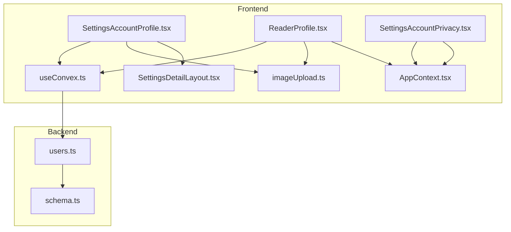
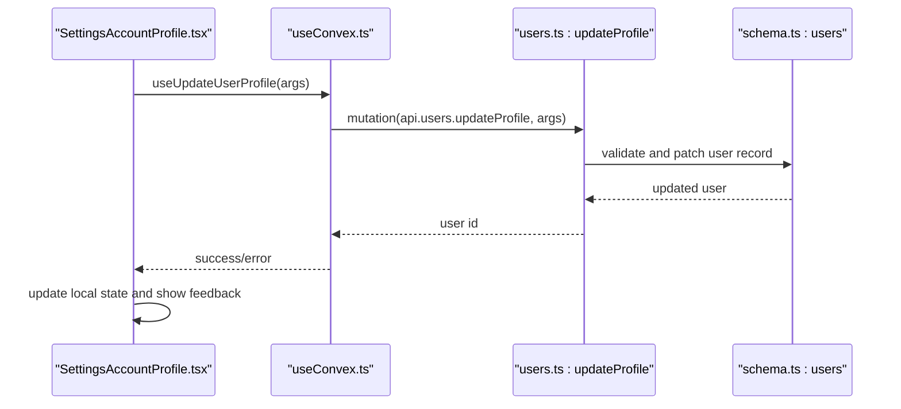
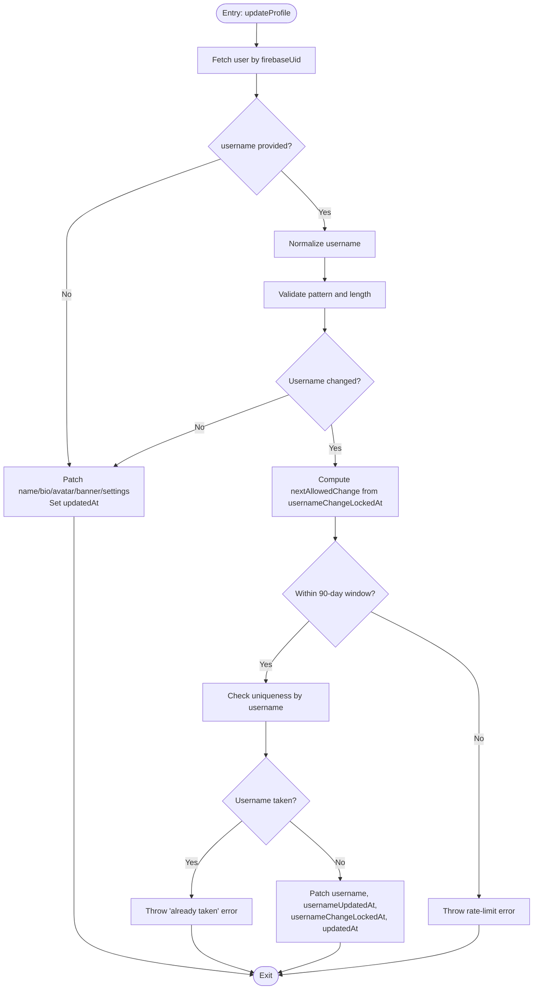
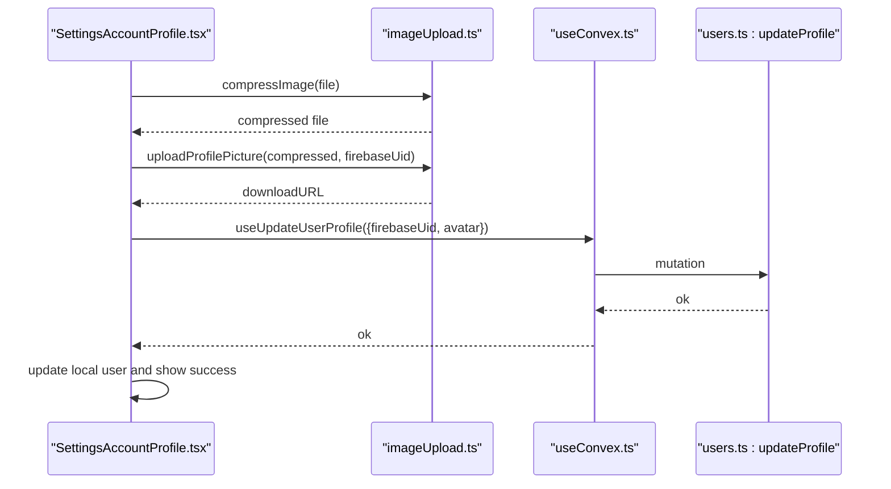
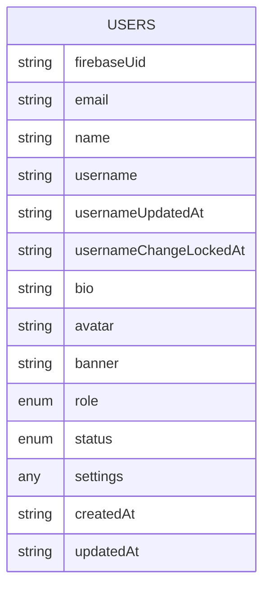
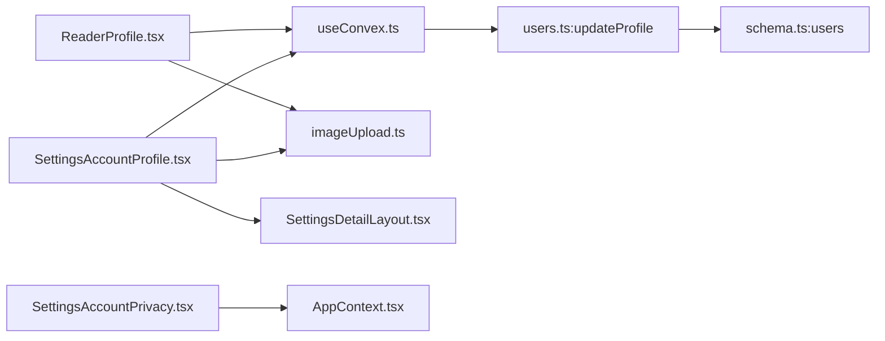

# Profile Management

<cite>
**Referenced Files in This Document**
- [users.ts](file://convex/users.ts)
- [schema.ts](file://convex/schema.ts)
- [SettingsAccountProfile.tsx](file://src/screens/settings/SettingsAccountProfile.tsx)
- [SettingsAccountPrivacy.tsx](file://src/screens/settings/SettingsAccountPrivacy.tsx)
- [useConvex.ts](file://src/hooks/useConvex.ts)
- [imageUpload.ts](file://src/lib/imageUpload.ts)
- [ReaderProfile.tsx](file://src/screens/ReaderProfile.tsx)
- [SettingsDetailLayout.tsx](file://src/components/SettingsDetailLayout.tsx)
- [AppContext.tsx](file://src/contexts/AppContext.tsx)
</cite>

## Table of Contents
1. [Introduction](#introduction)
2. [Project Structure](#project-structure)
3. [Core Components](#core-components)
4. [Architecture Overview](#architecture-overview)
5. [Detailed Component Analysis](#detailed-component-analysis)
6. [Dependency Analysis](#dependency-analysis)
7. [Performance Considerations](#performance-considerations)
8. [Troubleshooting Guide](#troubleshooting-guide)
9. [Conclusion](#conclusion)

## Introduction
This document describes the profile management system for readers, covering profile creation, editing, and maintenance. It focuses on the updateProfile mutation, profile settings, visibility controls, data structure, validation rules, and the integration between frontend forms and backend validation. It also documents security features such as username uniqueness, change frequency limits, and abuse prevention.

## Project Structure
Profile management spans three layers:
- Backend Convex module defines the user schema and mutations for profile updates.
- Frontend screens and hooks orchestrate user actions and integrate with Convex.
- Shared utilities handle image compression and upload.

**Diagram sources**
- [SettingsAccountProfile.tsx:1-271](file://src/screens/settings/SettingsAccountProfile.tsx#L1-L271)
- [ReaderProfile.tsx:1-544](file://src/screens/ReaderProfile.tsx#L1-L544)
- [SettingsAccountPrivacy.tsx:1-75](file://src/screens/settings/SettingsAccountPrivacy.tsx#L1-L75)
- [useConvex.ts:167-171](file://src/hooks/useConvex.ts#L167-L171)
- [imageUpload.ts:112-141](file://src/lib/imageUpload.ts#L112-L141)
- [SettingsDetailLayout.tsx:1-67](file://src/components/SettingsDetailLayout.tsx#L1-L67)
- [users.ts:183-243](file://convex/users.ts#L183-L243)
- [schema.ts:24-62](file://convex/schema.ts#L24-L62)

**Section sources**
- [SettingsAccountProfile.tsx:1-271](file://src/screens/settings/SettingsAccountProfile.tsx#L1-L271)
- [ReaderProfile.tsx:1-544](file://src/screens/ReaderProfile.tsx#L1-L544)
- [SettingsAccountPrivacy.tsx:1-75](file://src/screens/settings/SettingsAccountPrivacy.tsx#L1-L75)
- [useConvex.ts:167-171](file://src/hooks/useConvex.ts#L167-L171)
- [imageUpload.ts:112-141](file://src/lib/imageUpload.ts#L112-L141)
- [SettingsDetailLayout.tsx:1-67](file://src/components/SettingsDetailLayout.tsx#L1-L67)
- [users.ts:183-243](file://convex/users.ts#L183-L243)
- [schema.ts:24-62](file://convex/schema.ts#L24-L62)

## Core Components
- Backend mutation updateProfile: Validates and applies profile updates, enforces username rules, and updates timestamps.
- Frontend settings screen SettingsAccountProfile: Collects user input, handles avatar upload, and invokes the updateProfile mutation.
- Frontend privacy settings screen SettingsAccountPrivacy: Manages privacy preferences stored under user.settings.
- Hooks and utilities: useUpdateUserProfile encapsulates the mutation call; imageUpload provides compression and upload helpers.
- Schema: Defines the user data model, including optional and required fields.

**Section sources**
- [users.ts:183-243](file://convex/users.ts#L183-L243)
- [SettingsAccountProfile.tsx:1-271](file://src/screens/settings/SettingsAccountProfile.tsx#L1-L271)
- [SettingsAccountPrivacy.tsx:1-75](file://src/screens/settings/SettingsAccountPrivacy.tsx#L1-L75)
- [useConvex.ts:167-171](file://src/hooks/useConvex.ts#L167-L171)
- [imageUpload.ts:112-141](file://src/lib/imageUpload.ts#L112-L141)
- [schema.ts:24-62](file://convex/schema.ts#L24-L62)

## Architecture Overview
The profile update flow integrates frontend UI, mutation invocation, and backend validation.

**Diagram sources**
- [SettingsAccountProfile.tsx:90-129](file://src/screens/settings/SettingsAccountProfile.tsx#L90-L129)
- [useConvex.ts:167-171](file://src/hooks/useConvex.ts#L167-L171)
- [users.ts:183-243](file://convex/users.ts#L183-L243)
- [schema.ts:24-62](file://convex/schema.ts#L24-L62)

## Detailed Component Analysis

### Backend: updateProfile Mutation
- Purpose: Apply selective profile updates (name, username, bio, avatar, banner, settings) while enforcing validation and rate-limiting.
- Validation and normalization:
  - Trims name and bio.
  - Normalizes username (lowercase, strip leading @).
  - Enforces username pattern and length.
- Username change policy:
  - Once every 90 days enforced via usernameChangeLockedAt and computed nextAllowedChange.
  - Prevents reuse by other users.
- Timestamp updates:
  - Updates usernameUpdatedAt and usernameChangeLockedAt when username changes.
  - Always updates updatedAt.
- Optional fields:
  - Avatar, banner, settings are optional; only provided keys are patched.

**Diagram sources**
- [users.ts:183-243](file://convex/users.ts#L183-L243)
- [users.ts:9-13](file://convex/users.ts#L9-L13)
- [users.ts:5-6](file://convex/users.ts#L5-L6)

**Section sources**
- [users.ts:183-243](file://convex/users.ts#L183-L243)
- [users.ts:9-13](file://convex/users.ts#L9-L13)
- [users.ts:5-6](file://convex/users.ts#L5-L6)

### Frontend: SettingsAccountProfile
- Responsibilities:
  - Render profile fields: name, username, bio, avatar.
  - Handle avatar upload: compress image, upload to storage, update profile with returned URL.
  - Save profile: normalize username, enforce 90-day change lock, call useUpdateUserProfile, update local state.
  - Show success/error messaging and loading states.
- Username change lock:
  - Computes next allowed change from usernameChangeLockedAt and disables input accordingly.

**Diagram sources**
- [SettingsAccountProfile.tsx:42-88](file://src/screens/settings/SettingsAccountProfile.tsx#L42-L88)
- [imageUpload.ts:112-117](file://src/lib/imageUpload.ts#L112-L117)
- [useConvex.ts:167-171](file://src/hooks/useConvex.ts#L167-L171)
- [users.ts:183-243](file://convex/users.ts#L183-L243)

**Section sources**
- [SettingsAccountProfile.tsx:1-271](file://src/screens/settings/SettingsAccountProfile.tsx#L1-L271)
- [imageUpload.ts:112-117](file://src/lib/imageUpload.ts#L112-L117)
- [useConvex.ts:167-171](file://src/hooks/useConvex.ts#L167-L171)
- [users.ts:183-243](file://convex/users.ts#L183-L243)

### Frontend: ReaderProfile Banner Upload
- Allows logged-in users to upload a banner image.
- Uses compressImage and uploadBannerImage, then calls updateProfile and updates local state.

**Section sources**
- [ReaderProfile.tsx:42-66](file://src/screens/ReaderProfile.tsx#L42-L66)
- [imageUpload.ts:136-141](file://src/lib/imageUpload.ts#L136-L141)
- [users.ts:183-243](file://convex/users.ts#L183-L243)

### Frontend: Privacy Settings
- Provides toggles for privacy preferences (public profile, reading activity, support badges, direct messages).
- Persists to user.settings.privacy via AppContext updateSettings.

**Section sources**
- [SettingsAccountPrivacy.tsx:1-75](file://src/screens/settings/SettingsAccountPrivacy.tsx#L1-L75)
- [AppContext.tsx:193](file://src/contexts/AppContext.tsx#L193)

### Data Model and Validation Rules
- User schema fields:
  - Required: name, username, role, status, timestamps.
  - Optional: email, bio, avatar, banner, usernameUpdatedAt, usernameChangeLockedAt, settings.
- Validation rules:
  - Username pattern: lowercase letters, digits, underscore; length 3–24.
  - Username change interval: once every 90 days.
  - Uniqueness: username must be unique per user.

**Diagram sources**
- [schema.ts:24-62](file://convex/schema.ts#L24-L62)

**Section sources**
- [schema.ts:24-62](file://convex/schema.ts#L24-L62)
- [users.ts:9-13](file://convex/users.ts#L9-L13)
- [users.ts:5-6](file://convex/users.ts#L5-L6)

### Profile Completion and Onboarding
- The repository does not define a dedicated profile completion workflow or onboarding checklist. Profile fields are optional except for required identifiers. No backend or frontend logic enforces mandatory fields for completion.

**Section sources**
- [schema.ts:24-62](file://convex/schema.ts#L24-L62)
- [SettingsAccountProfile.tsx:22-40](file://src/screens/settings/SettingsAccountProfile.tsx#L22-L40)

### Profile Visibility Controls
- Privacy settings managed in SettingsAccountPrivacy:
  - publicProfile: allow others to find/view reader profile.
  - showReadingActivity: display current reading on profile.
  - showSupportBadges: display badges from supporting creators.
  - allowDirectMessages: permit other users to message.
- These settings are persisted under user.settings.privacy and can be updated via updateSettings.

**Section sources**
- [SettingsAccountPrivacy.tsx:1-75](file://src/screens/settings/SettingsAccountPrivacy.tsx#L1-L75)
- [AppContext.tsx:193](file://src/contexts/AppContext.tsx#L193)

### Security Features
- Username uniqueness and validation:
  - Backend validates pattern and uniqueness; throws errors for duplicates or invalid formats.
- Change frequency limit:
  - Enforced via usernameChangeLockedAt and a 90-day interval.
- Abuse prevention:
  - Username change is gated by time window and uniqueness checks.
  - Image upload utilities enforce file type and size constraints.

**Section sources**
- [users.ts:210-235](file://convex/users.ts#L210-L235)
- [users.ts:9-13](file://convex/users.ts#L9-L13)
- [imageUpload.ts:31-66](file://src/lib/imageUpload.ts#L31-L66)

### Integration Between Frontend Forms and Backend Validation
- SettingsAccountProfile orchestrates:
  - Avatar upload and URL injection into updateProfile.
  - Username normalization and change lock enforcement.
  - Call to useUpdateUserProfile which targets api.users.updateProfile.
- ReaderProfile adds banner upload using the same pattern.
- Both flows update local state via AppContext to reflect backend changes.

**Section sources**
- [SettingsAccountProfile.tsx:90-129](file://src/screens/settings/SettingsAccountProfile.tsx#L90-L129)
- [ReaderProfile.tsx:42-66](file://src/screens/ReaderProfile.tsx#L42-L66)
- [useConvex.ts:167-171](file://src/hooks/useConvex.ts#L167-L171)
- [users.ts:183-243](file://convex/users.ts#L183-L243)

## Dependency Analysis
- Frontend depends on:
  - useConvex.ts for mutation wrappers.
  - imageUpload.ts for compression and upload.
  - AppContext.tsx for local state updates.
- Backend depends on:
  - schema.ts for typed user records.
  - Convex runtime for database queries and patches.

**Diagram sources**
- [SettingsAccountProfile.tsx:1-271](file://src/screens/settings/SettingsAccountProfile.tsx#L1-L271)
- [ReaderProfile.tsx:1-544](file://src/screens/ReaderProfile.tsx#L1-L544)
- [SettingsAccountPrivacy.tsx:1-75](file://src/screens/settings/SettingsAccountPrivacy.tsx#L1-L75)
- [useConvex.ts:167-171](file://src/hooks/useConvex.ts#L167-L171)
- [imageUpload.ts:112-141](file://src/lib/imageUpload.ts#L112-L141)
- [SettingsDetailLayout.tsx:1-67](file://src/components/SettingsDetailLayout.tsx#L1-L67)
- [users.ts:183-243](file://convex/users.ts#L183-L243)
- [schema.ts:24-62](file://convex/schema.ts#L24-L62)
- [AppContext.tsx:193](file://src/contexts/AppContext.tsx#L193)

**Section sources**
- [useConvex.ts:167-171](file://src/hooks/useConvex.ts#L167-L171)
- [users.ts:183-243](file://convex/users.ts#L183-L243)
- [schema.ts:24-62](file://convex/schema.ts#L24-L62)
- [imageUpload.ts:112-141](file://src/lib/imageUpload.ts#L112-L141)
- [SettingsDetailLayout.tsx:1-67](file://src/components/SettingsDetailLayout.tsx#L1-L67)
- [AppContext.tsx:193](file://src/contexts/AppContext.tsx#L193)

## Performance Considerations
- Image compression reduces payload size and improves upload throughput.
- Batched reads for full profile are not part of updateProfile; consider caching and optimistic UI updates for frequent settings changes.
- Username uniqueness check uses indexed lookup by username; ensure appropriate indexing in production.

## Troubleshooting Guide
- Username change fails with rate-limit error:
  - Cause: Attempted within 90-day window.
  - Resolution: Wait until nextAllowedChange; verify usernameChangeLockedAt.
- Username already taken:
  - Cause: Another user owns the requested username.
  - Resolution: Choose a different username.
- Invalid username format:
  - Cause: Violates pattern or length rules.
  - Resolution: Use 3–24 characters, lowercase letters, digits, underscore only.
- Avatar upload fails:
  - Cause: Network error, unauthorized, or invalid file type/size.
  - Resolution: Retry with supported image type and under 5MB; ensure signed-in state.

**Section sources**
- [users.ts:210-235](file://convex/users.ts#L210-L235)
- [users.ts:9-13](file://convex/users.ts#L9-L13)
- [imageUpload.ts:14-23](file://src/lib/imageUpload.ts#L14-L23)
- [imageUpload.ts:31-66](file://src/lib/imageUpload.ts#L31-L66)

## Conclusion
The profile management system combines robust backend validation with a clean frontend UX. The updateProfile mutation enforces username rules and change intervals, while the frontend screens provide intuitive controls for avatar and banner uploads, along with privacy settings. Optional fields and flexible settings enable customization without compromising security or data integrity.