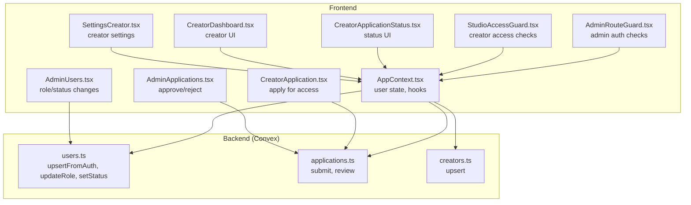
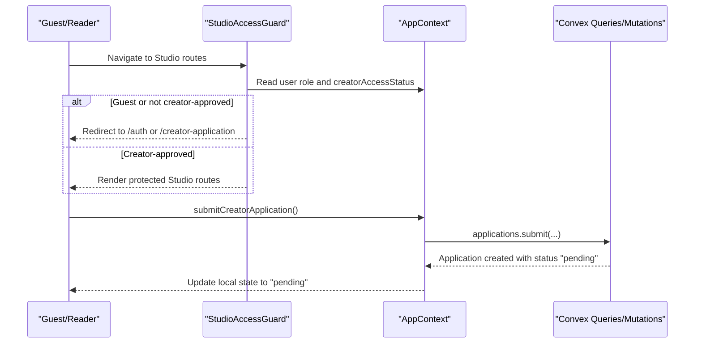
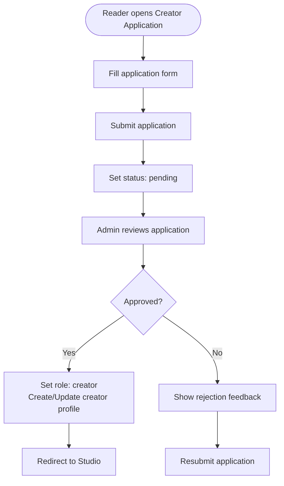
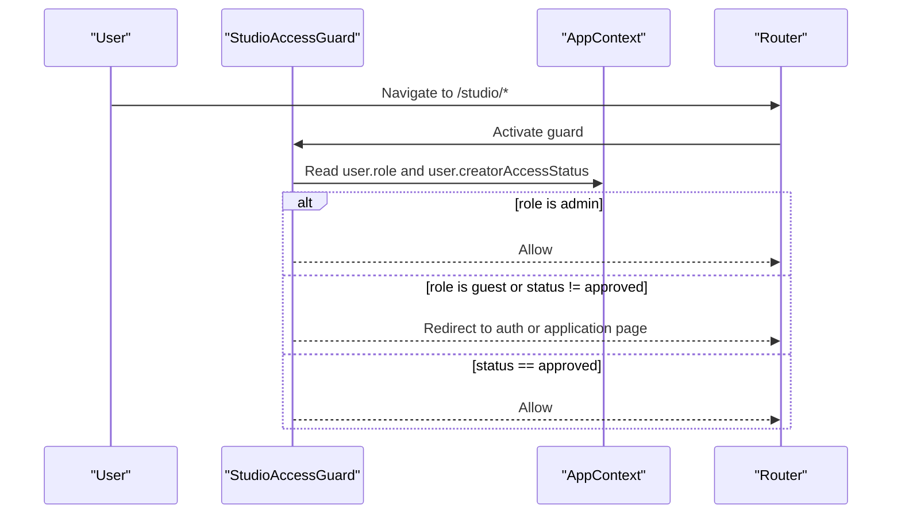
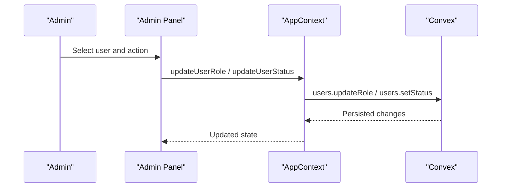
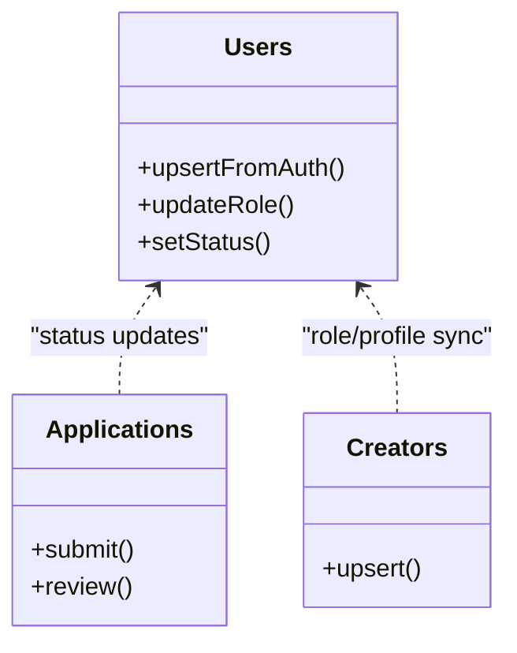
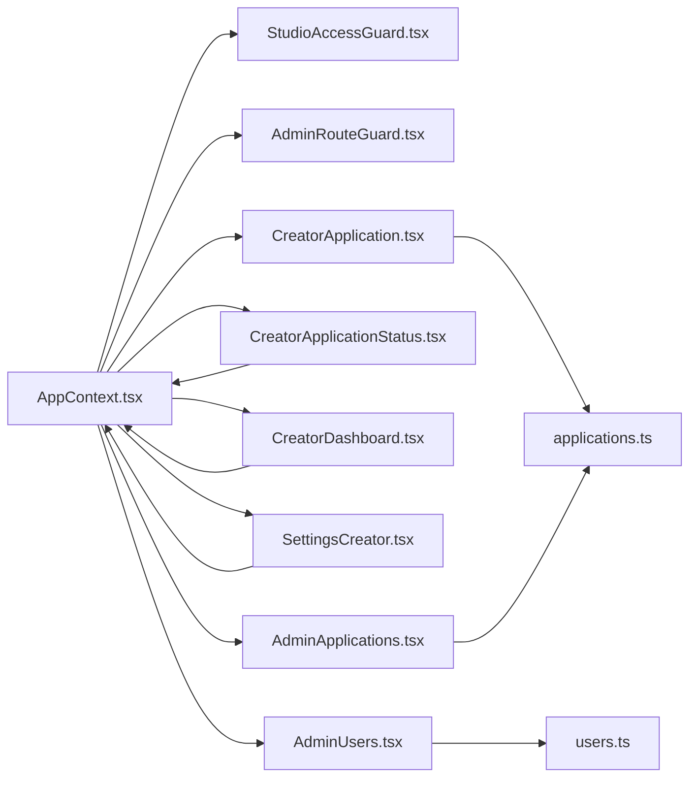

# Role-Based Access Control

<cite>
**Referenced Files in This Document**
- [types.ts](file://src/data/types.ts)
- [users.ts](file://convex/users.ts)
- [applications.ts](file://convex/applications.ts)
- [creators.ts](file://convex/creators.ts)
- [AppContext.tsx](file://src/contexts/AppContext.tsx)
- [AdminRouteGuard.tsx](file://src/components/admin/AdminRouteGuard.tsx)
- [StudioAccessGuard.tsx](file://src/components/StudioAccessGuard.tsx)
- [CreatorApplication.tsx](file://src/screens/CreatorApplication.tsx)
- [CreatorApplicationStatus.tsx](file://src/screens/CreatorApplicationStatus.tsx)
- [CreatorDashboard.tsx](file://src/screens/CreatorDashboard.tsx)
- [SettingsCreator.tsx](file://src/screens/settings/SettingsCreator.tsx)
- [AdminApplications.tsx](file://src/screens/admin/AdminApplications.tsx)
- [AdminCreators.tsx](file://src/screens/admin/AdminCreators.tsx)
- [AdminUsers.tsx](file://src/screens/admin/AdminUsers.tsx)
- [AdminLogin.tsx](file://src/screens/admin/AdminLogin.tsx)
- [AdminOverview.tsx](file://src/screens/admin/AdminOverview.tsx)
- [AdminActivity.tsx](file://src/screens/admin/AdminActivity.tsx)
</cite>

## Table of Contents
1. [Introduction](#introduction)
2. [Project Structure](#project-structure)
3. [Core Components](#core-components)
4. [Architecture Overview](#architecture-overview)
5. [Detailed Component Analysis](#detailed-component-analysis)
6. [Dependency Analysis](#dependency-analysis)
7. [Performance Considerations](#performance-considerations)
8. [Troubleshooting Guide](#troubleshooting-guide)
9. [Conclusion](#conclusion)

## Introduction
This document explains the role-based access control (RBAC) model implemented in the Lemonade platform. It defines the four user roles (guest, reader, creator, admin), outlines capabilities and limitations per role, documents the creator application workflow, and details how access control is enforced on both the frontend (route guards and conditional rendering) and backend (Convex mutations and queries). It also covers administrative controls for role changes and account suspension, and highlights role-based UI adaptations for readers versus creators.

## Project Structure
The RBAC implementation spans three layers:
- Backend (Convex):
  - User lifecycle and roles: [users.ts](file://convex/users.ts)
  - Creator application workflow: [applications.ts](file://convex/applications.ts)
  - Creator profiles: [creators.ts](file://convex/creators.ts)
- Frontend context and guards:
  - Global app state and role-aware hooks: [AppContext.tsx](file://src/contexts/AppContext.tsx)
  - Admin route guard: [AdminRouteGuard.tsx](file://src/components/admin/AdminRouteGuard.tsx)
  - Studio access guard: [StudioAccessGuard.tsx](file://src/components/StudioAccessGuard.tsx)
- Screens and UI adaptations:
  - Creator application form and status: [CreatorApplication.tsx](file://src/screens/CreatorApplication.tsx), [CreatorApplicationStatus.tsx](file://src/screens/CreatorApplicationStatus.tsx)
  - Creator dashboard: [CreatorDashboard.tsx](file://src/screens/CreatorDashboard.tsx)
  - Creator settings: [SettingsCreator.tsx](file://src/screens/settings/SettingsCreator.tsx)
  - Admin panels: [AdminApplications.tsx](file://src/screens/admin/AdminApplications.tsx), [AdminCreators.tsx](file://src/screens/admin/AdminCreators.tsx), [AdminUsers.tsx](file://src/screens/admin/AdminUsers.tsx), [AdminLogin.tsx](file://src/screens/admin/AdminLogin.tsx), [AdminOverview.tsx](file://src/screens/admin/AdminOverview.tsx), [AdminActivity.tsx](file://src/screens/admin/AdminActivity.tsx)

**Diagram sources**
- [users.ts:15-127](file://convex/users.ts#L15-L127)
- [applications.ts:70-223](file://convex/applications.ts#L70-L223)
- [creators.ts:24-66](file://convex/creators.ts#L24-L66)
- [AppContext.tsx:101-137](file://src/contexts/AppContext.tsx#L101-L137)
- [AdminRouteGuard.tsx:10-23](file://src/components/admin/AdminRouteGuard.tsx#L10-L23)
- [StudioAccessGuard.tsx:9-35](file://src/components/StudioAccessGuard.tsx#L9-L35)
- [CreatorApplication.tsx:12-102](file://src/screens/CreatorApplication.tsx#L12-L102)
- [CreatorApplicationStatus.tsx:8-103](file://src/screens/CreatorApplicationStatus.tsx#L8-L103)
- [CreatorDashboard.tsx:12-48](file://src/screens/CreatorDashboard.tsx#L12-L48)
- [SettingsCreator.tsx:13-153](file://src/screens/settings/SettingsCreator.tsx#L13-L153)
- [AdminApplications.tsx:89-128](file://src/screens/admin/AdminApplications.tsx#L89-L128)
- [AdminUsers.tsx:24-42](file://src/screens/admin/AdminUsers.tsx#L24-L42)

**Section sources**
- [users.ts:15-127](file://convex/users.ts#L15-L127)
- [applications.ts:70-223](file://convex/applications.ts#L70-L223)
- [creators.ts:24-66](file://convex/creators.ts#L24-L66)
- [AppContext.tsx:101-137](file://src/contexts/AppContext.tsx#L101-L137)
- [AdminRouteGuard.tsx:10-23](file://src/components/admin/AdminRouteGuard.tsx#L10-L23)
- [StudioAccessGuard.tsx:9-35](file://src/components/StudioAccessGuard.tsx#L9-L35)
- [CreatorApplication.tsx:12-102](file://src/screens/CreatorApplication.tsx#L12-L102)
- [CreatorApplicationStatus.tsx:8-103](file://src/screens/CreatorApplicationStatus.tsx#L8-L103)
- [CreatorDashboard.tsx:12-48](file://src/screens/CreatorDashboard.tsx#L12-L48)
- [SettingsCreator.tsx:13-153](file://src/screens/settings/SettingsCreator.tsx#L13-L153)
- [AdminApplications.tsx:89-128](file://src/screens/admin/AdminApplications.tsx#L89-L128)
- [AdminUsers.tsx:24-42](file://src/screens/admin/AdminUsers.tsx#L24-L42)

## Core Components
- Roles and statuses:
  - User roles: guest, reader, creator, admin
  - Creator access status: none, pending, needs_info, approved, rejected
  - User status: active, suspended
- Backend mutations and queries:
  - User creation and role/status updates: [users.ts:42-127](file://convex/users.ts#L42-L127)
  - Creator application submission and review: [applications.ts:70-223](file://convex/applications.ts#L70-L223)
  - Creator profile creation/updating: [creators.ts:24-66](file://convex/creators.ts#L24-L66)
- Frontend state and guards:
  - App user model and hooks: [AppContext.tsx:101-137](file://src/contexts/AppContext.tsx#L101-L137)
  - Admin route guard: [AdminRouteGuard.tsx:10-23](file://src/components/admin/AdminRouteGuard.tsx#L10-L23)
  - Studio access guard: [StudioAccessGuard.tsx:9-35](file://src/components/StudioAccessGuard.tsx#L9-L35)

**Section sources**
- [types.ts:6-13](file://src/data/types.ts#L6-L13)
- [users.ts:42-127](file://convex/users.ts#L42-L127)
- [applications.ts:70-223](file://convex/applications.ts#L70-L223)
- [creators.ts:24-66](file://convex/creators.ts#L24-L66)
- [AppContext.tsx:101-137](file://src/contexts/AppContext.tsx#L101-L137)
- [AdminRouteGuard.tsx:10-23](file://src/components/admin/AdminRouteGuard.tsx#L10-L23)
- [StudioAccessGuard.tsx:9-35](file://src/components/StudioAccessGuard.tsx#L9-L35)

## Architecture Overview
The RBAC architecture enforces access at two levels:
- Frontend enforcement via route guards and conditional rendering based on user role and creator access status.
- Backend enforcement via Convex mutations and queries that validate and apply role changes and access decisions.

**Diagram sources**
- [StudioAccessGuard.tsx:9-35](file://src/components/StudioAccessGuard.tsx#L9-L35)
- [AppContext.tsx:196-198](file://src/contexts/AppContext.tsx#L196-L198)
- [applications.ts:70-118](file://convex/applications.ts#L70-L118)

**Section sources**
- [StudioAccessGuard.tsx:9-35](file://src/components/StudioAccessGuard.tsx#L9-L35)
- [AppContext.tsx:196-198](file://src/contexts/AppContext.tsx#L196-L198)
- [applications.ts:70-118](file://convex/applications.ts#L70-L118)

## Detailed Component Analysis

### Role Definitions and Capabilities
- Guest
  - Authentication state: not authenticated, not a reader
  - Capabilities: minimal; redirected to auth when accessing protected routes
  - Limitations: cannot access creator studio or submit applications
- Reader
  - Authentication state: authenticated as reader
  - Capabilities: browse content, read stories, manage reading preferences, purchase wallet credits, follow creators
  - Limitations: cannot publish or manage stories; requires creator access to enter Studio
- Creator
  - Authentication state: authenticated as creator
  - Capabilities: publish/edit stories, manage monetization, view analytics, receive support, manage portfolio
  - Limitations: access gated behind approved creator application
- Admin
  - Authentication state: admin session with role (super_admin, moderator, etc.)
  - Capabilities: manage users, creators, applications, content, and platform settings; change roles and suspend accounts

**Section sources**
- [AppContext.tsx:231-277](file://src/contexts/AppContext.tsx#L231-L277)
- [types.ts:6-13](file://src/data/types.ts#L6-L13)
- [AdminRouteGuard.tsx:10-23](file://src/components/admin/AdminRouteGuard.tsx#L10-L23)

### Creator Access Workflow
- Application submission:
  - Reader navigates to the creator application form and submits required details.
  - Backend sets user’s creatorAccessStatus to pending and creates an application record.
- Review and approval:
  - Admin reviews the application and either approves or rejects.
  - On approval, user role is set to creator and a creator profile is created/updated.
- Status UI:
  - Dedicated screen shows current status and next steps.

**Diagram sources**
- [CreatorApplication.tsx:81-102](file://src/screens/CreatorApplication.tsx#L81-L102)
- [applications.ts:70-118](file://convex/applications.ts#L70-L118)
- [applications.ts:120-223](file://convex/applications.ts#L120-L223)
- [creators.ts:24-66](file://convex/creators.ts#L24-L66)
- [CreatorApplicationStatus.tsx:18-103](file://src/screens/CreatorApplicationStatus.tsx#L18-L103)

**Section sources**
- [CreatorApplication.tsx:12-102](file://src/screens/CreatorApplication.tsx#L12-L102)
- [CreatorApplicationStatus.tsx:8-103](file://src/screens/CreatorApplicationStatus.tsx#L8-L103)
- [applications.ts:70-118](file://convex/applications.ts#L70-L118)
- [applications.ts:120-223](file://convex/applications.ts#L120-L223)
- [creators.ts:24-66](file://convex/creators.ts#L24-L66)

### Access Control Implementation (Frontend)
- Route guards:
  - AdminRouteGuard enforces admin authentication and optional super_admin requirement.
  - StudioAccessGuard enforces guest redirection, admin bypass, and creator access status checks.
- Conditional rendering:
  - Creator settings and dashboard are rendered only for verified creators.
  - Reader UI adapts to non-creator state (e.g., “Apply for Creator Access” prompt).

**Diagram sources**
- [StudioAccessGuard.tsx:9-35](file://src/components/StudioAccessGuard.tsx#L9-L35)
- [AppContext.tsx:101-137](file://src/contexts/AppContext.tsx#L101-L137)

**Section sources**
- [AdminRouteGuard.tsx:10-23](file://src/components/admin/AdminRouteGuard.tsx#L10-L23)
- [StudioAccessGuard.tsx:9-35](file://src/components/StudioAccessGuard.tsx#L9-L35)
- [SettingsCreator.tsx:155-176](file://src/screens/settings/SettingsCreator.tsx#L155-L176)
- [CreatorDashboard.tsx:12-48](file://src/screens/CreatorDashboard.tsx#L12-L48)

### Administrative Controls
- Role changes:
  - Admin panel allows changing user roles (e.g., reader ↔ creator).
- Account suspension:
  - Admin panel supports suspending or unsuspending users.
- Application review:
  - Admin panel lists pending applications and supports approve/reject actions with optional feedback.

**Diagram sources**
- [AdminUsers.tsx:177-196](file://src/screens/admin/AdminUsers.tsx#L177-L196)
- [AdminApplications.tsx:89-128](file://src/screens/admin/AdminApplications.tsx#L89-L128)
- [users.ts:92-127](file://convex/users.ts#L92-L127)

**Section sources**
- [AdminUsers.tsx:24-42](file://src/screens/admin/AdminUsers.tsx#L24-L42)
- [AdminUsers.tsx:177-196](file://src/screens/admin/AdminUsers.tsx#L177-L196)
- [AdminApplications.tsx:89-128](file://src/screens/admin/AdminApplications.tsx#L89-L128)
- [users.ts:92-127](file://convex/users.ts#L92-L127)

### Backend Enforcement
- User creation and defaults:
  - New users initialized as readers with default roles and statuses.
- Role and status updates:
  - Admin-only mutations enforce role transitions and account suspension.
- Creator application lifecycle:
  - Submission sets pending status; review updates status and optionally promotes to creator.

**Diagram sources**
- [users.ts:42-127](file://convex/users.ts#L42-L127)
- [applications.ts:70-223](file://convex/applications.ts#L70-L223)
- [creators.ts:24-66](file://convex/creators.ts#L24-L66)

**Section sources**
- [users.ts:42-127](file://convex/users.ts#L42-L127)
- [applications.ts:70-223](file://convex/applications.ts#L70-L223)
- [creators.ts:24-66](file://convex/creators.ts#L24-L66)

### Role-Based UI Adaptations
- Readers:
  - Non-creator UI with prompts to apply for creator access.
  - Limited navigation to Studio routes.
- Creators:
  - Full Creator Dashboard, portfolio management, monetization tools.
  - Creator settings for profile, support link, and payout details.

**Section sources**
- [SettingsCreator.tsx:155-176](file://src/screens/settings/SettingsCreator.tsx#L155-L176)
- [CreatorDashboard.tsx:12-48](file://src/screens/CreatorDashboard.tsx#L12-L48)
- [CreatorApplication.tsx:73-79](file://src/screens/CreatorApplication.tsx#L73-L79)

## Dependency Analysis
- Frontend depends on AppContext for user state and exposes hooks for role-aware UI.
- Guards depend on AppContext to enforce access policies.
- Admin panels depend on AppContext and Convex to mutate roles and statuses.
- Creator application flow depends on AppContext hooks and Convex mutations.

**Diagram sources**
- [AppContext.tsx:101-137](file://src/contexts/AppContext.tsx#L101-L137)
- [StudioAccessGuard.tsx:9-35](file://src/components/StudioAccessGuard.tsx#L9-L35)
- [AdminRouteGuard.tsx:10-23](file://src/components/admin/AdminRouteGuard.tsx#L10-L23)
- [CreatorApplication.tsx:12-102](file://src/screens/CreatorApplication.tsx#L12-L102)
- [CreatorApplicationStatus.tsx:8-103](file://src/screens/CreatorApplicationStatus.tsx#L8-L103)
- [CreatorDashboard.tsx:12-48](file://src/screens/CreatorDashboard.tsx#L12-L48)
- [SettingsCreator.tsx:13-153](file://src/screens/settings/SettingsCreator.tsx#L13-L153)
- [AdminApplications.tsx:89-128](file://src/screens/admin/AdminApplications.tsx#L89-L128)
- [AdminUsers.tsx:24-42](file://src/screens/admin/AdminUsers.tsx#L24-L42)
- [applications.ts:70-223](file://convex/applications.ts#L70-L223)
- [users.ts:92-127](file://convex/users.ts#L92-L127)

**Section sources**
- [AppContext.tsx:101-137](file://src/contexts/AppContext.tsx#L101-L137)
- [StudioAccessGuard.tsx:9-35](file://src/components/StudioAccessGuard.tsx#L9-L35)
- [AdminRouteGuard.tsx:10-23](file://src/components/admin/AdminRouteGuard.tsx#L10-L23)
- [CreatorApplication.tsx:12-102](file://src/screens/CreatorApplication.tsx#L12-L102)
- [CreatorApplicationStatus.tsx:8-103](file://src/screens/CreatorApplicationStatus.tsx#L8-L103)
- [CreatorDashboard.tsx:12-48](file://src/screens/CreatorDashboard.tsx#L12-L48)
- [SettingsCreator.tsx:13-153](file://src/screens/settings/SettingsCreator.tsx#L13-L153)
- [AdminApplications.tsx:89-128](file://src/screens/admin/AdminApplications.tsx#L89-L128)
- [AdminUsers.tsx:24-42](file://src/screens/admin/AdminUsers.tsx#L24-L42)
- [applications.ts:70-223](file://convex/applications.ts#L70-L223)
- [users.ts:92-127](file://convex/users.ts#L92-L127)

## Performance Considerations
- Minimize repeated Convex queries by caching user state in AppContext and using memoization for derived data.
- Batch admin operations (e.g., bulk role/status updates) to reduce network overhead.
- Lazy-load admin panels and creator dashboards to avoid unnecessary computations for non-admin/non-creator users.

## Troubleshooting Guide
- Guest users stuck in redirect loops:
  - Verify authentication persistence and that guest fallback is applied when no saved session exists.
- Creator application not transitioning to pending:
  - Confirm submit hook is invoked and Convex mutation completes; check user state updates.
- Admin cannot access admin routes:
  - Ensure admin session is persisted and guard receives proper admin role.
- Role changes not reflected:
  - Confirm updateRole mutation succeeds and AppContext state updates accordingly.

**Section sources**
- [AppContext.tsx:696-708](file://src/contexts/AppContext.tsx#L696-L708)
- [AdminRouteGuard.tsx:10-23](file://src/components/admin/AdminRouteGuard.tsx#L10-L23)
- [users.ts:92-127](file://convex/users.ts#L92-L127)

## Conclusion
The Lemonade RBAC model combines frontend route guards and conditional UI with robust backend enforcement via Convex mutations. Roles (guest, reader, creator, admin) and creator access status (none, pending, approved, rejected) govern access to Studio and administrative features. The creator application workflow integrates seamlessly with admin review and approval, while administrative controls enable safe role and status management. Together, these mechanisms provide a secure, transparent, and user-friendly access control system.