# User Lifecycle Management

<cite>
**Referenced Files in This Document**
- [users.ts](file://convex/users.ts)
- [schema.ts](file://convex/schema.ts)
- [Onboarding.tsx](file://src/screens/Onboarding.tsx)
- [Auth.tsx](file://src/screens/Auth.tsx)
- [SettingsAccountProfile.tsx](file://src/screens/settings/SettingsAccountProfile.tsx)
- [Notifications.tsx](file://src/screens/Notifications.tsx)
- [AdminUsers.tsx](file://src/screens/admin/AdminUsers.tsx)
- [AdminUserDetail.tsx](file://src/screens/admin/details/AdminUserDetail.tsx)
- [useConvex.ts](file://src/hooks/useConvex.ts)
- [firebase.ts](file://src/lib/firebase.ts)
- [Privacy.tsx](file://src/screens/legal/Privacy.tsx)
- [SettingsAccountPrivacy.tsx](file://src/screens/settings/SettingsAccountPrivacy.tsx)
- [SettingsAccountPassword.tsx](file://src/screens/settings/SettingsAccountPassword.tsx)
- [ContactSupport.tsx](file://src/screens/help/ContactSupport.tsx)
</cite>

## Table of Contents
1. [Introduction](#introduction)
2. [Project Structure](#project-structure)
3. [Core Components](#core-components)
4. [Architecture Overview](#architecture-overview)
5. [Detailed Component Analysis](#detailed-component-analysis)
6. [Dependency Analysis](#dependency-analysis)
7. [Performance Considerations](#performance-considerations)
8. [Troubleshooting Guide](#troubleshooting-guide)
9. [Conclusion](#conclusion)
10. [Appendices](#appendices)

## Introduction
This document describes the end-to-end user lifecycle for Lemonade, from registration and onboarding to ongoing engagement, suspension, and eventual deactivation. It covers:
- Registration and initial setup
- Profile completion and welcome workflows
- User account states and triggers
- Suspension and deactivation flows
- Notifications and communication channels
- Support and security features
- Administrative oversight and reporting
- Data protection and privacy controls

## Project Structure
The user lifecycle spans frontend screens, Convex backend functions, and Firebase authentication. Key areas:
- Authentication and routing: Onboarding, Auth, and guest flows
- User data model and mutations: Convex users module and schema
- User settings and privacy: Profile, privacy, and password screens
- Notifications and admin oversight: Notification center and admin dashboards
- Support and legal: Contact support and privacy policy

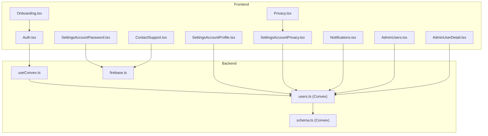

**Diagram sources**
- [Onboarding.tsx:1-110](file://src/screens/Onboarding.tsx#L1-L110)
- [Auth.tsx:1-334](file://src/screens/Auth.tsx#L1-L334)
- [SettingsAccountProfile.tsx:1-271](file://src/screens/settings/SettingsAccountProfile.tsx#L1-L271)
- [SettingsAccountPrivacy.tsx:1-104](file://src/screens/settings/SettingsAccountPrivacy.tsx#L1-L104)
- [SettingsAccountPassword.tsx:1-115](file://src/screens/settings/SettingsAccountPassword.tsx#L1-L115)
- [Notifications.tsx:1-68](file://src/screens/Notifications.tsx#L1-L68)
- [AdminUsers.tsx:1-266](file://src/screens/admin/AdminUsers.tsx#L1-L266)
- [AdminUserDetail.tsx:1-234](file://src/screens/admin/details/AdminUserDetail.tsx#L1-L234)
- [ContactSupport.tsx:1-130](file://src/screens/help/ContactSupport.tsx#L1-L130)
- [Privacy.tsx:1-52](file://src/screens/legal/Privacy.tsx#L1-L52)
- [users.ts:1-360](file://convex/users.ts#L1-L360)
- [schema.ts:1-495](file://convex/schema.ts#L1-L495)
- [useConvex.ts:1-213](file://src/hooks/useConvex.ts#L1-L213)
- [firebase.ts:1-55](file://src/lib/firebase.ts#L1-L55)

**Section sources**
- [Onboarding.tsx:1-110](file://src/screens/Onboarding.tsx#L1-L110)
- [Auth.tsx:1-334](file://src/screens/Auth.tsx#L1-L334)
- [users.ts:1-360](file://convex/users.ts#L1-L360)
- [schema.ts:1-495](file://convex/schema.ts#L1-L495)
- [useConvex.ts:1-213](file://src/hooks/useConvex.ts#L1-L213)
- [firebase.ts:1-55](file://src/lib/firebase.ts#L1-L55)

## Core Components
- Authentication and identity
  - Firebase Auth integration for email/password and Google sign-in
  - Persistence selection (session/local) and guest continuation
- User data model
  - Roles: guest, reader, creator, admin
  - Premium tiers: free, trial, premium, expired
  - Status: active, suspended
  - Wallet and unlock tracking
- Lifecycle mutations
  - Upsert from auth, profile updates, role/status changes, chapter unlocks
- Notifications
  - Typed notifications stored per user
- Admin oversight
  - User listing, filtering, status toggling, role changes

**Section sources**
- [firebase.ts:1-55](file://src/lib/firebase.ts#L1-L55)
- [Auth.tsx:1-334](file://src/screens/Auth.tsx#L1-L334)
- [users.ts:1-360](file://convex/users.ts#L1-L360)
- [schema.ts:1-495](file://convex/schema.ts#L1-L495)
- [Notifications.tsx:1-68](file://src/screens/Notifications.tsx#L1-L68)
- [AdminUsers.tsx:1-266](file://src/screens/admin/AdminUsers.tsx#L1-L266)

## Architecture Overview
The lifecycle is driven by user actions in the UI, persisted through Firebase Auth, and synchronized with Convex-backed user records. Admins can observe and act on user states.

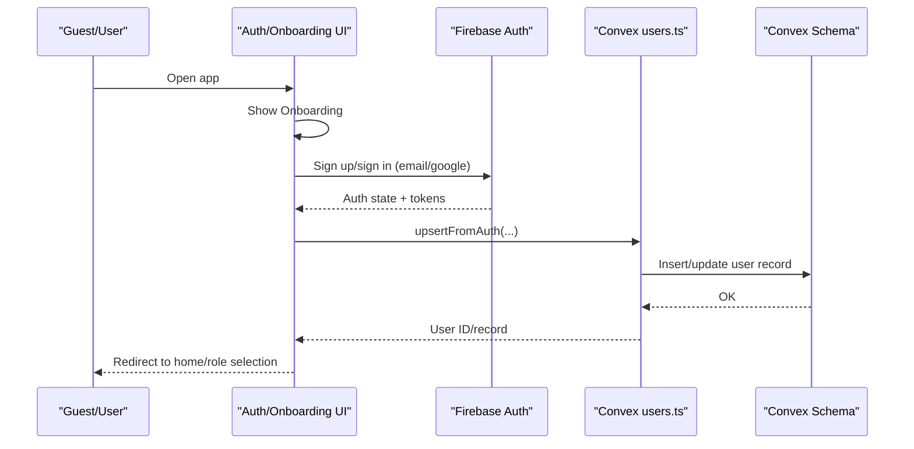

**Diagram sources**
- [Onboarding.tsx:1-110](file://src/screens/Onboarding.tsx#L1-L110)
- [Auth.tsx:1-334](file://src/screens/Auth.tsx#L1-L334)
- [firebase.ts:1-55](file://src/lib/firebase.ts#L1-L55)
- [users.ts:42-90](file://convex/users.ts#L42-L90)
- [schema.ts:24-67](file://convex/schema.ts#L24-L67)

## Detailed Component Analysis

### Registration and Onboarding
- Onboarding screen presents a guided carousel and transitions to Auth.
- Auth supports email/password and Google sign-in, with “keep me signed in” persistence.
- After successful auth, users choose a role (reader or creator) and are redirected accordingly.

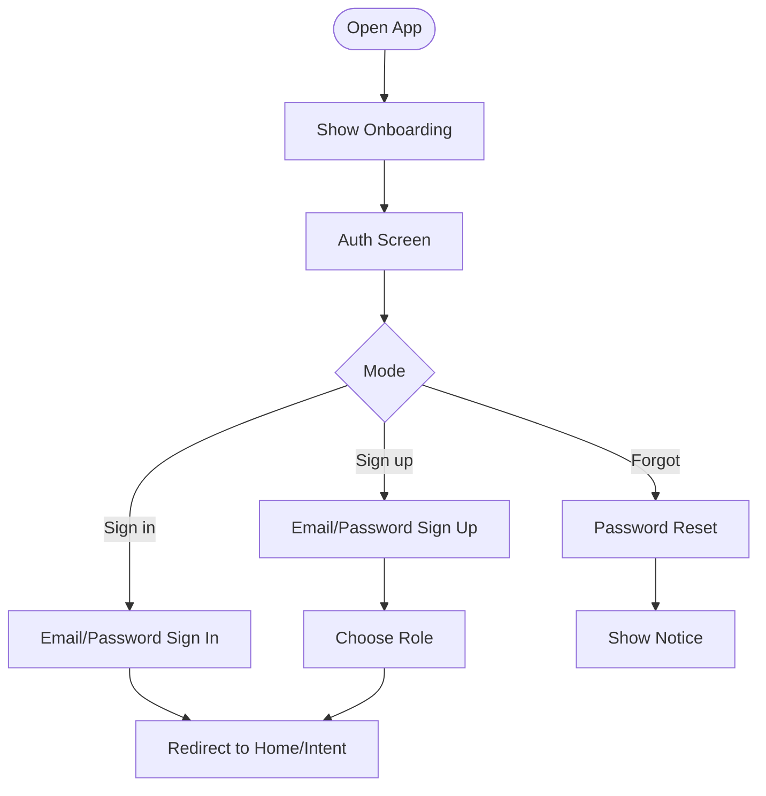

**Diagram sources**
- [Onboarding.tsx:22-110](file://src/screens/Onboarding.tsx#L22-L110)
- [Auth.tsx:12-134](file://src/screens/Auth.tsx#L12-L134)

**Section sources**
- [Onboarding.tsx:1-110](file://src/screens/Onboarding.tsx#L1-L110)
- [Auth.tsx:1-334](file://src/screens/Auth.tsx#L1-L334)

### Initial User Setup and Welcome
- First-time users are inserted with default role, access status, and premium tier.
- Default state is active; wallet starts at zero; lists for saved stories, followed creators, and unlocked chapters are initialized.

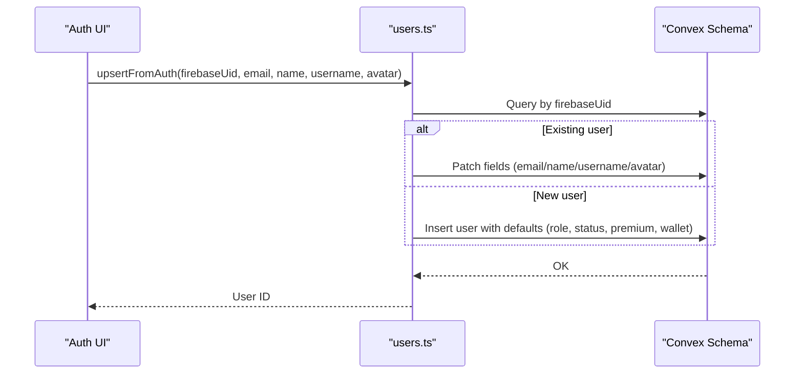

**Diagram sources**
- [users.ts:42-90](file://convex/users.ts#L42-L90)
- [schema.ts:24-67](file://convex/schema.ts#L24-L67)

**Section sources**
- [users.ts:42-90](file://convex/users.ts#L42-L90)
- [schema.ts:24-67](file://convex/schema.ts#L24-L67)

### Profile Completion and Welcome Workflows
- Users can update name, username, bio, avatar, and settings.
- Username change is rate-limited (once every 90 days) and validated.
- Avatar uploads are optimized and stored via Firebase Storage; URL is persisted in user record.

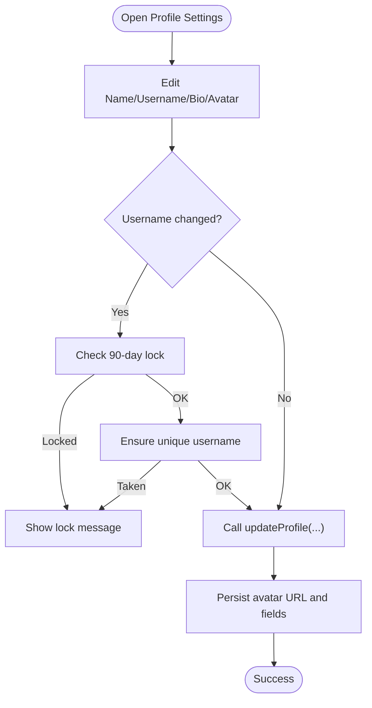

**Diagram sources**
- [SettingsAccountProfile.tsx:90-129](file://src/screens/settings/SettingsAccountProfile.tsx#L90-L129)
- [users.ts:183-243](file://convex/users.ts#L183-L243)

**Section sources**
- [SettingsAccountProfile.tsx:1-271](file://src/screens/settings/SettingsAccountProfile.tsx#L1-L271)
- [users.ts:183-243](file://convex/users.ts#L183-L243)

### User Account States and Triggers
- Roles: guest, reader, creator, admin
- Premium: free, trial, premium, expired
- Status: active, suspended
- State changes:
  - Role/status changes are performed via mutations
  - Admins can suspend/unsuspend users from the dashboard

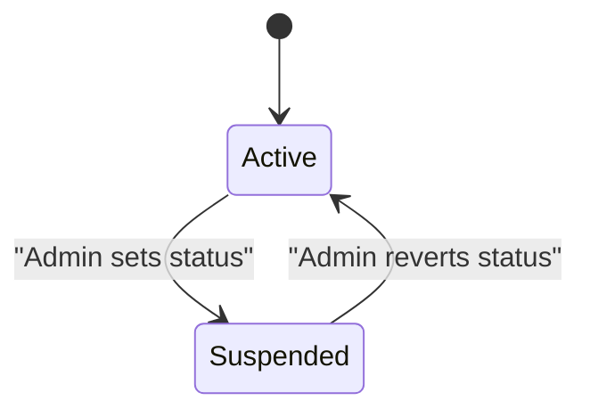

**Diagram sources**
- [schema.ts:36-61](file://convex/schema.ts#L36-L61)
- [users.ts:113-127](file://convex/users.ts#L113-L127)
- [AdminUsers.tsx:155-171](file://src/screens/admin/AdminUsers.tsx#L155-L171)

**Section sources**
- [schema.ts:1-495](file://convex/schema.ts#L1-L495)
- [users.ts:113-127](file://convex/users.ts#L113-L127)
- [AdminUsers.tsx:1-266](file://src/screens/admin/AdminUsers.tsx#L1-L266)

### Account Deactivation and Suspension
- Suspension toggled by admins; user loses access to restricted features.
- Deactivation is not explicitly modeled in the provided files; if needed, introduce a deactivation mutation and a cleanup job to anonymize or delete data per policy.

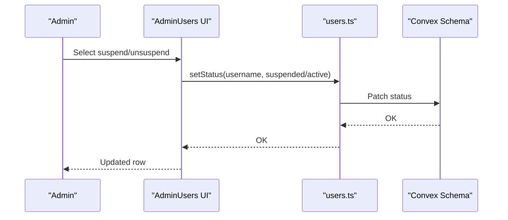

**Diagram sources**
- [AdminUsers.tsx:155-171](file://src/screens/admin/AdminUsers.tsx#L155-L171)
- [users.ts:113-127](file://convex/users.ts#L113-L127)
- [schema.ts:60](file://convex/schema.ts#L60)

**Section sources**
- [AdminUsers.tsx:1-266](file://src/screens/admin/AdminUsers.tsx#L1-L266)
- [users.ts:113-127](file://convex/users.ts#L113-L127)

### Notifications and Communication
- Users receive typed notifications (follow, save, unlock, premium, support, update, wallet).
- Notifications are stored per user and marked read/unread.
- Admins can view user activity and trigger targeted notices.

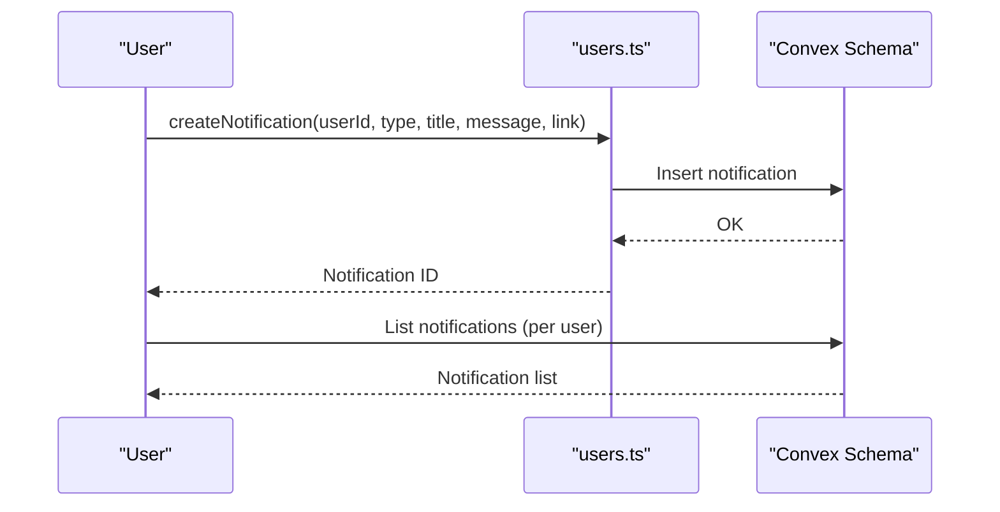

**Diagram sources**
- [users.ts:245-268](file://convex/users.ts#L245-L268)
- [schema.ts:234-250](file://convex/schema.ts#L234-L250)
- [Notifications.tsx:6-68](file://src/screens/Notifications.tsx#L6-L68)

**Section sources**
- [users.ts:245-268](file://convex/users.ts#L245-L268)
- [schema.ts:234-250](file://convex/schema.ts#L234-L250)
- [Notifications.tsx:1-68](file://src/screens/Notifications.tsx#L1-L68)

### Support and Security Features
- Password reset initiated from Auth.
- Privacy settings allow users to control visibility and DMs.
- Legal pages outline data collection and security practices.

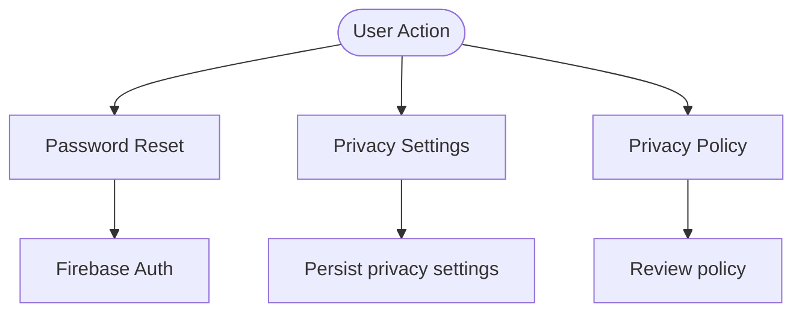

**Diagram sources**
- [Auth.tsx:82-84](file://src/screens/Auth.tsx#L82-L84)
- [SettingsAccountPrivacy.tsx:22-31](file://src/screens/settings/SettingsAccountPrivacy.tsx#L22-L31)
- [Privacy.tsx:23-47](file://src/screens/legal/Privacy.tsx#L23-L47)

**Section sources**
- [Auth.tsx:1-334](file://src/screens/Auth.tsx#L1-L334)
- [SettingsAccountPrivacy.tsx:1-104](file://src/screens/settings/SettingsAccountPrivacy.tsx#L1-L104)
- [Privacy.tsx:1-52](file://src/screens/legal/Privacy.tsx#L1-L52)

### Administrative Oversight and Analytics Hooks
- Admins can filter users by role, premium status, and suspension state.
- Admin detail view surfaces quick actions and recent activity placeholders.
- Integration points for analytics and audit logs are present in the schema.

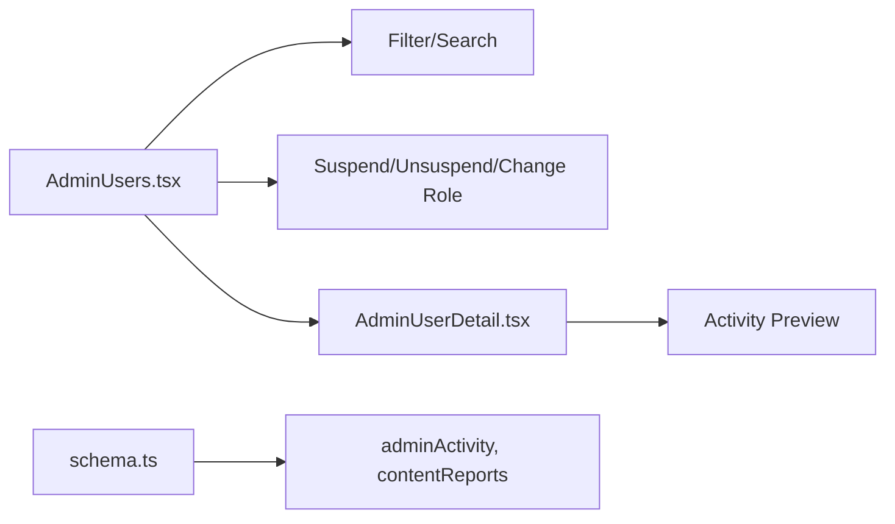

**Diagram sources**
- [AdminUsers.tsx:29-42](file://src/screens/admin/AdminUsers.tsx#L29-L42)
- [AdminUsers.tsx:155-171](file://src/screens/admin/AdminUsers.tsx#L155-L171)
- [AdminUserDetail.tsx:178-193](file://src/screens/admin/details/AdminUserDetail.tsx#L178-L193)
- [schema.ts:176-181](file://convex/schema.ts#L176-L181)

**Section sources**
- [AdminUsers.tsx:1-266](file://src/screens/admin/AdminUsers.tsx#L1-L266)
- [AdminUserDetail.tsx:1-234](file://src/screens/admin/details/AdminUserDetail.tsx#L1-L234)
- [schema.ts:176-181](file://convex/schema.ts#L176-L181)

## Dependency Analysis
- Frontend depends on Convex APIs for user operations and on Firebase for auth.
- Convex schema defines the canonical user model and indices.
- Admin screens depend on user listing and mutation APIs.

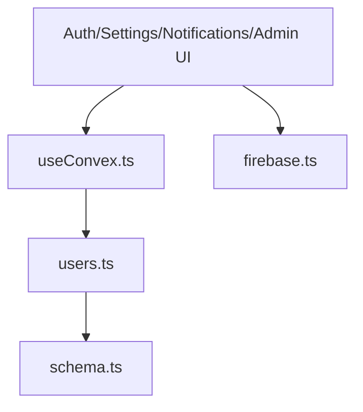

**Diagram sources**
- [useConvex.ts:1-213](file://src/hooks/useConvex.ts#L1-L213)
- [users.ts:1-360](file://convex/users.ts#L1-L360)
- [schema.ts:1-495](file://convex/schema.ts#L1-L495)
- [firebase.ts:1-55](file://src/lib/firebase.ts#L1-L55)

**Section sources**
- [useConvex.ts:1-213](file://src/hooks/useConvex.ts#L1-L213)
- [users.ts:1-360](file://convex/users.ts#L1-L360)
- [schema.ts:1-495](file://convex/schema.ts#L1-L495)
- [firebase.ts:1-55](file://src/lib/firebase.ts#L1-L55)

## Performance Considerations
- Use database indices for frequent lookups (by_firebaseUid, by_username, by_role).
- Batch reads/writes for profile updates and notifications.
- Optimize avatar uploads and cache images on CDN.
- Limit notification pagination and implement server-side filtering.

## Troubleshooting Guide
- Authentication failures
  - Verify Firebase config and emulator connections in development.
  - Check persistence settings and network connectivity.
- Profile update errors
  - Username uniqueness and rate-limit checks are enforced server-side.
  - Avatar upload errors often relate to storage permissions or file size.
- Notification issues
  - Ensure user ID is passed correctly and notifications are indexed by user.
- Admin actions
  - Confirm sufficient permissions and that status/role mutations are called with correct arguments.

**Section sources**
- [firebase.ts:33-52](file://src/lib/firebase.ts#L33-L52)
- [users.ts:210-235](file://convex/users.ts#L210-L235)
- [Notifications.tsx:6-68](file://src/screens/Notifications.tsx#L6-L68)
- [AdminUsers.tsx:155-171](file://src/screens/admin/AdminUsers.tsx#L155-L171)

## Conclusion
Lemonade’s user lifecycle is centered on a robust authentication foundation, a flexible user model, and clear admin controls. The system supports onboarding, profile management, notifications, and moderation while providing privacy and security controls. Extending deactivation and deletion would involve adding explicit lifecycle mutations and data retention jobs aligned with privacy policy.

## Appendices

### User Data Protection and Privacy Controls
- Privacy policy outlines information collected, usage, sharing, security, and user choices.
- Users can control profile visibility, reading activity, support badges, and direct messages.
- Security note emphasizes encryption and adherence to policy.

**Section sources**
- [Privacy.tsx:23-47](file://src/screens/legal/Privacy.tsx#L23-L47)
- [SettingsAccountPrivacy.tsx:44-90](file://src/screens/settings/SettingsAccountPrivacy.tsx#L44-L90)
- [SettingsAccountPrivacy.tsx:92-100](file://src/screens/settings/SettingsAccountPrivacy.tsx#L92-L100)

### Support Workflows
- Contact support form collects name, email, subject, and message.
- Submission triggers a success state with a friendly acknowledgment.

**Section sources**
- [ContactSupport.tsx:11-18](file://src/screens/help/ContactSupport.tsx#L11-L18)
- [ContactSupport.tsx:38-105](file://src/screens/help/ContactSupport.tsx#L38-L105)