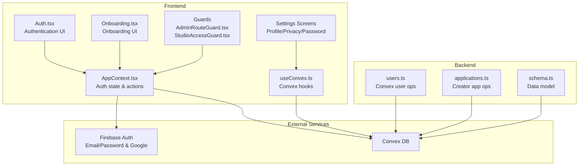
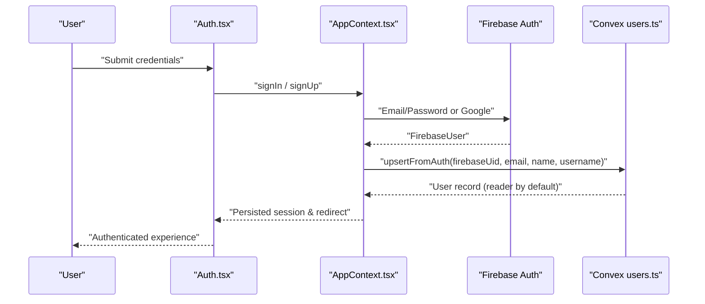
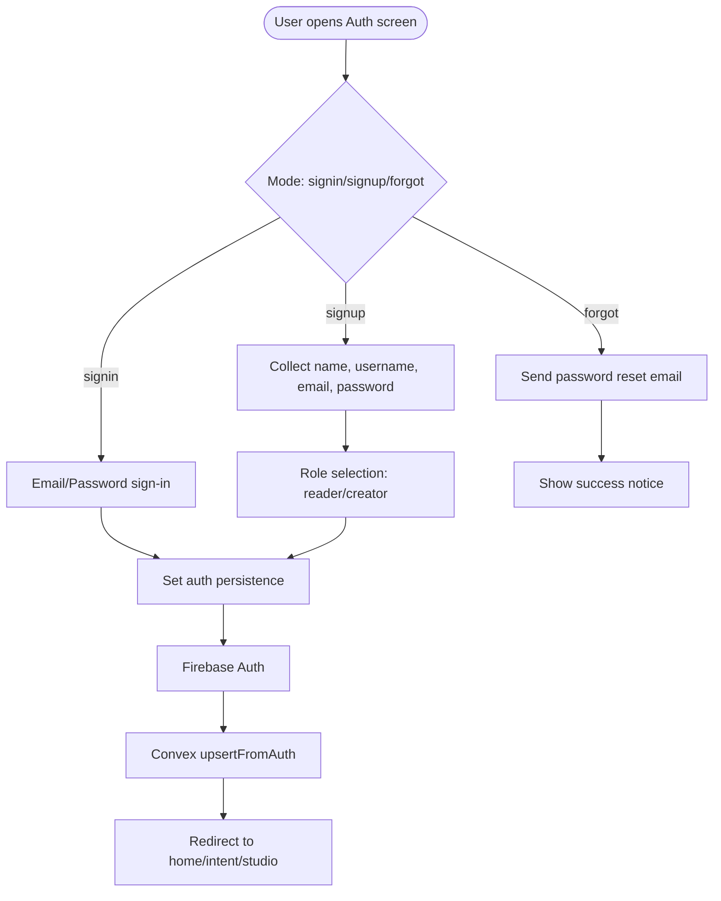
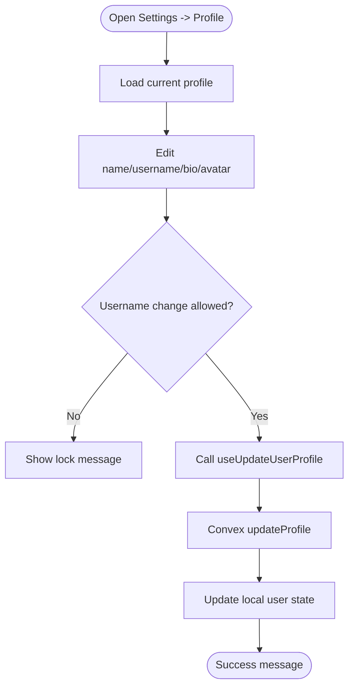
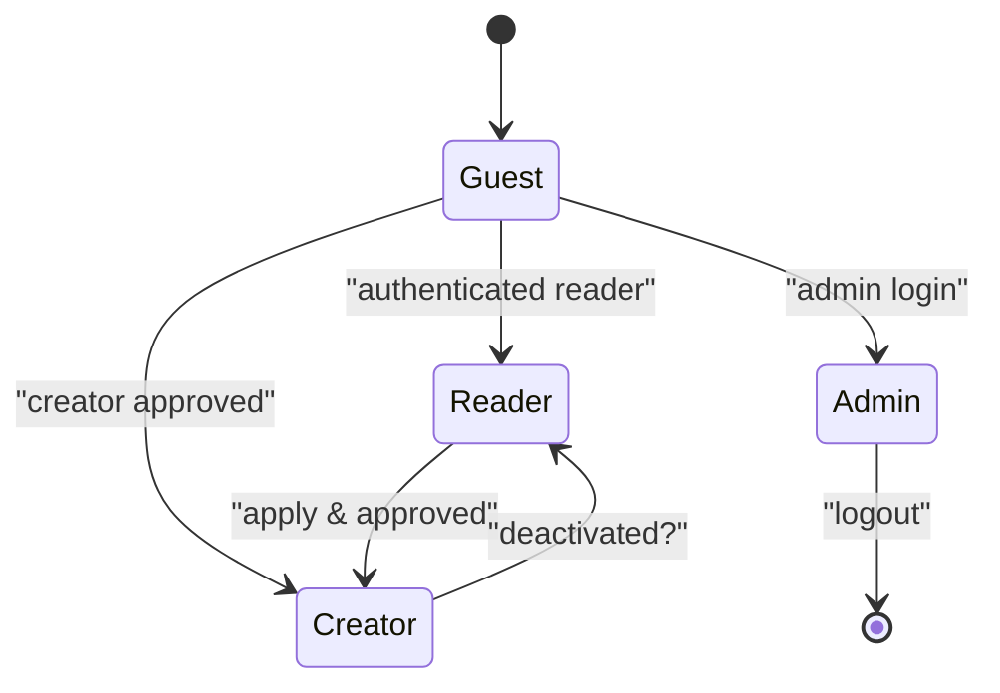
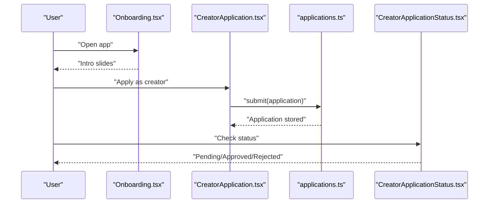
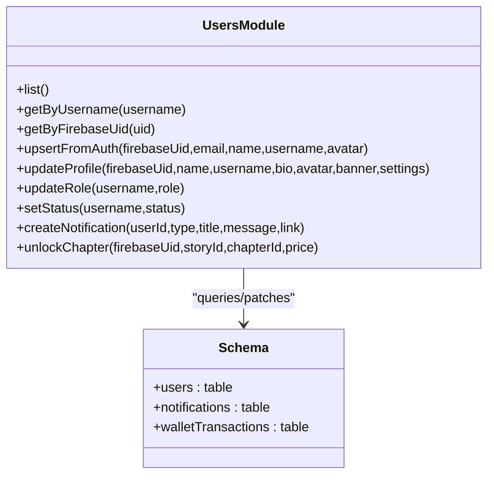
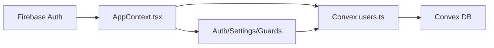

# User Management System

<cite>
**Referenced Files in This Document**
- [firebase.ts](file://src/lib/firebase.ts)
- [users.ts](file://convex/users.ts)
- [schema.ts](file://convex/schema.ts)
- [Auth.tsx](file://src/screens/Auth.tsx)
- [useConvex.ts](file://src/hooks/useConvex.ts)
- [SettingsAccountProfile.tsx](file://src/screens/settings/SettingsAccountProfile.tsx)
- [SettingsAccountPrivacy.tsx](file://src/screens/settings/SettingsAccountPrivacy.tsx)
- [SettingsAccountPassword.tsx](file://src/screens/settings/SettingsAccountPassword.tsx)
- [AdminRouteGuard.tsx](file://src/components/admin/AdminRouteGuard.tsx)
- [StudioAccessGuard.tsx](file://src/components/StudioAccessGuard.tsx)
- [CreatorApplication.tsx](file://src/screens/CreatorApplication.tsx)
- [CreatorApplicationStatus.tsx](file://src/screens/CreatorApplicationStatus.tsx)
- [Onboarding.tsx](file://src/screens/Onboarding.tsx)
- [AppContext.tsx](file://src/contexts/AppContext.tsx)
- [applications.ts](file://convex/applications.ts)
</cite>

## Table of Contents
1. [Introduction](#introduction)
2. [Project Structure](#project-structure)
3. [Core Components](#core-components)
4. [Architecture Overview](#architecture-overview)
5. [Detailed Component Analysis](#detailed-component-analysis)
6. [Dependency Analysis](#dependency-analysis)
7. [Performance Considerations](#performance-considerations)
8. [Troubleshooting Guide](#troubleshooting-guide)
9. [Conclusion](#conclusion)

## Introduction
This document describes the user management system for the Lemonade platform, focusing on authentication, profile management, role-based access control (RBAC), and the integration between Firebase Authentication and Convex database operations. It explains user registration and login flows (email/password and Google), session management, onboarding, profile settings, privacy controls, and the creator application process. It also covers RBAC distinctions among readers, creators, and administrators, along with lifecycle considerations such as account deactivation and data handling.

## Project Structure
The user management system spans three primary areas:
- Frontend authentication and UI: Firebase integration, authentication screens, settings, guards, and onboarding
- Backend user logic: Convex queries and mutations for user CRUD, profile updates, notifications, and wallet operations
- Data model: Convex schema defining user roles, creator access statuses, and related entities

**Diagram sources**
- [Auth.tsx:12-334](file://src/screens/Auth.tsx#L12-L334)
- [Onboarding.tsx:22-110](file://src/screens/Onboarding.tsx#L22-L110)
- [SettingsAccountProfile.tsx:8-271](file://src/screens/settings/SettingsAccountProfile.tsx#L8-L271)
- [SettingsAccountPrivacy.tsx:6-104](file://src/screens/settings/SettingsAccountPrivacy.tsx#L6-L104)
- [SettingsAccountPassword.tsx:5-115](file://src/screens/settings/SettingsAccountPassword.tsx#L5-L115)
- [AdminRouteGuard.tsx:10-24](file://src/components/admin/AdminRouteGuard.tsx#L10-L24)
- [StudioAccessGuard.tsx:9-36](file://src/components/StudioAccessGuard.tsx#L9-L36)
- [AppContext.tsx:509-708](file://src/contexts/AppContext.tsx#L509-L708)
- [useConvex.ts:163-213](file://src/hooks/useConvex.ts#L163-L213)
- [users.ts:42-90](file://convex/users.ts#L42-L90)
- [applications.ts:70-118](file://convex/applications.ts#L70-L118)
- [schema.ts:24-67](file://convex/schema.ts#L24-L67)

**Section sources**
- [firebase.ts:1-55](file://src/lib/firebase.ts#L1-L55)
- [users.ts:1-360](file://convex/users.ts#L1-L360)
- [schema.ts:1-493](file://convex/schema.ts#L1-L493)
- [Auth.tsx:12-334](file://src/screens/Auth.tsx#L12-L334)
- [AppContext.tsx:509-708](file://src/contexts/AppContext.tsx#L509-L708)
- [useConvex.ts:163-213](file://src/hooks/useConvex.ts#L163-L213)

## Core Components
- Firebase Authentication: Email/password and Google sign-in, persistence, and emulator connections
- Convex User Module: Upsert from auth, profile updates, role/status management, notifications, wallet operations
- Frontend Auth Context: Centralized auth state, user syncing, guest mode, and persisted sessions
- Guards: Admin and studio access guards enforcing roles and application status
- Settings: Profile info, privacy controls, and password change UI
- Creator Application: Multi-step application flow and status tracking

**Section sources**
- [firebase.ts:1-55](file://src/lib/firebase.ts#L1-L55)
- [users.ts:42-90](file://convex/users.ts#L42-L90)
- [AppContext.tsx:509-708](file://src/contexts/AppContext.tsx#L509-L708)
- [AdminRouteGuard.tsx:10-24](file://src/components/admin/AdminRouteGuard.tsx#L10-L24)
- [StudioAccessGuard.tsx:9-36](file://src/components/StudioAccessGuard.tsx#L9-L36)
- [SettingsAccountProfile.tsx:8-271](file://src/screens/settings/SettingsAccountProfile.tsx#L8-L271)
- [CreatorApplication.tsx:12-412](file://src/screens/CreatorApplication.tsx#L12-L412)

## Architecture Overview
The system integrates Firebase Authentication with Convex for user data. On successful Firebase sign-in/sign-up, the app synchronizes the user into Convex, ensuring a unified profile and privileges. Frontend screens and hooks orchestrate authentication flows, while Convex enforces data integrity and business rules.

**Diagram sources**
- [Auth.tsx:68-102](file://src/screens/Auth.tsx#L68-L102)
- [AppContext.tsx:612-634](file://src/contexts/AppContext.tsx#L612-L634)
- [users.ts:42-90](file://convex/users.ts#L42-L90)

**Section sources**
- [Auth.tsx:68-102](file://src/screens/Auth.tsx#L68-L102)
- [AppContext.tsx:612-634](file://src/contexts/AppContext.tsx#L612-L634)
- [users.ts:42-90](file://convex/users.ts#L42-L90)

## Detailed Component Analysis

### Authentication and Session Management
- Firebase initialization and persistence: Local/session persistence selection and emulator connections
- Auth UI: Email/password and Google sign-in, password reset, guest mode, and role selection post-sign-up
- Auth context: Syncs Firebase user to Convex, persists sessions, and exposes actions for sign-in/sign-out/reset

**Diagram sources**
- [Auth.tsx:12-134](file://src/screens/Auth.tsx#L12-L134)
- [firebase.ts:24-31](file://src/lib/firebase.ts#L24-L31)
- [AppContext.tsx:612-634](file://src/contexts/AppContext.tsx#L612-L634)
- [users.ts:42-90](file://convex/users.ts#L42-L90)

**Section sources**
- [firebase.ts:1-55](file://src/lib/firebase.ts#L1-L55)
- [Auth.tsx:68-134](file://src/screens/Auth.tsx#L68-L134)
- [AppContext.tsx:612-634](file://src/contexts/AppContext.tsx#L612-L634)

### Profile Management
- Profile info: Name, username, bio, avatar, and banner updates with validation and username lock windows
- Privacy settings: Public profile visibility, reading activity, support badges, and direct messages
- Password change: UI scaffolding with requirements and mock update flow
- Image upload: Optimized compression and Firebase Storage integration for avatars

**Diagram sources**
- [SettingsAccountProfile.tsx:8-129](file://src/screens/settings/SettingsAccountProfile.tsx#L8-L129)
- [useConvex.ts:167-171](file://src/hooks/useConvex.ts#L167-L171)
- [users.ts:183-243](file://convex/users.ts#L183-L243)

**Section sources**
- [SettingsAccountProfile.tsx:8-271](file://src/screens/settings/SettingsAccountProfile.tsx#L8-L271)
- [SettingsAccountPrivacy.tsx:6-104](file://src/screens/settings/SettingsAccountPrivacy.tsx#L6-L104)
- [SettingsAccountPassword.tsx:5-115](file://src/screens/settings/SettingsAccountPassword.tsx#L5-L115)
- [useConvex.ts:167-171](file://src/hooks/useConvex.ts#L167-L171)
- [users.ts:183-243](file://convex/users.ts#L183-L243)

### Role-Based Access Control (RBAC)
- Roles: guest, reader, creator, admin
- Creator access: none → pending → needs_info → approved → rejected
- Guards:
  - AdminRouteGuard: protects admin routes and optionally restricts to super_admin
  - StudioAccessGuard: enforces guest redirection, admin bypass, and creator application status checks

**Diagram sources**
- [schema.ts:4-9](file://convex/schema.ts#L4-L9)
- [schema.ts:11-17](file://convex/schema.ts#L11-L17)
- [AdminRouteGuard.tsx:10-24](file://src/components/admin/AdminRouteGuard.tsx#L10-L24)
- [StudioAccessGuard.tsx:9-36](file://src/components/StudioAccessGuard.tsx#L9-L36)

**Section sources**
- [schema.ts:4-9](file://convex/schema.ts#L4-L9)
- [schema.ts:11-17](file://convex/schema.ts#L11-L17)
- [AdminRouteGuard.tsx:10-24](file://src/components/admin/AdminRouteGuard.tsx#L10-L24)
- [StudioAccessGuard.tsx:9-36](file://src/components/StudioAccessGuard.tsx#L9-L36)

### Creator Application and Onboarding
- Onboarding: Carousel-driven introduction with guest option
- Application: Multi-step form collecting personal info, online presence, and story intent; submits to Convex
- Status tracking: Pending, approved, rejected states with feedback and resubmission

**Diagram sources**
- [Onboarding.tsx:22-110](file://src/screens/Onboarding.tsx#L22-L110)
- [CreatorApplication.tsx:81-102](file://src/screens/CreatorApplication.tsx#L81-L102)
- [applications.ts:70-118](file://convex/applications.ts#L70-L118)
- [CreatorApplicationStatus.tsx:18-103](file://src/screens/CreatorApplicationStatus.tsx#L18-L103)

**Section sources**
- [Onboarding.tsx:22-110](file://src/screens/Onboarding.tsx#L22-L110)
- [CreatorApplication.tsx:12-412](file://src/screens/CreatorApplication.tsx#L12-L412)
- [applications.ts:70-118](file://convex/applications.ts#L70-L118)
- [CreatorApplicationStatus.tsx:8-116](file://src/screens/CreatorApplicationStatus.tsx#L8-L116)

### Convex User Operations
- Upsert from auth: Creates or updates user records with defaults and indexes
- Profile updates: Validates username changes, enforces 90-day lock, and updates settings
- Notifications and wallet: Creation and chapter unlocking with transaction logging
- Role and status management: Updates role and suspension status

**Diagram sources**
- [users.ts:15-90](file://convex/users.ts#L15-L90)
- [users.ts:183-243](file://convex/users.ts#L183-L243)
- [users.ts:92-127](file://convex/users.ts#L92-L127)
- [users.ts:245-268](file://convex/users.ts#L245-L268)
- [users.ts:269-310](file://convex/users.ts#L269-L310)
- [schema.ts:24-67](file://convex/schema.ts#L24-L67)

**Section sources**
- [users.ts:15-90](file://convex/users.ts#L15-L90)
- [users.ts:183-243](file://convex/users.ts#L183-L243)
- [users.ts:245-268](file://convex/users.ts#L245-L268)
- [users.ts:269-310](file://convex/users.ts#L269-L310)
- [schema.ts:24-67](file://convex/schema.ts#L24-L67)

## Dependency Analysis
- Frontend depends on Firebase for identity and Convex for user data
- AppContext orchestrates auth state and bridges Firebase and Convex
- Settings screens depend on useConvex hooks to call Convex mutations
- Guards enforce RBAC based on user state and Convex-provided roles/access

**Diagram sources**
- [AppContext.tsx:612-634](file://src/contexts/AppContext.tsx#L612-L634)
- [users.ts:42-90](file://convex/users.ts#L42-L90)
- [useConvex.ts:167-171](file://src/hooks/useConvex.ts#L167-L171)

**Section sources**
- [AppContext.tsx:612-634](file://src/contexts/AppContext.tsx#L612-L634)
- [useConvex.ts:167-171](file://src/hooks/useConvex.ts#L167-L171)
- [users.ts:42-90](file://convex/users.ts#L42-L90)

## Performance Considerations
- Batched reads/writes: Convex operations are optimized through indexes (e.g., by_firebaseUid, by_username)
- Debounced UI updates: Local state updates before Convex calls reduce perceived latency
- Emulator usage: Development-time emulator connections avoid network overhead during testing
- Image optimization: Client-side compression reduces payload sizes for avatar uploads

[No sources needed since this section provides general guidance]

## Troubleshooting Guide
- Authentication errors: Use error mapping utilities to present user-friendly messages for sign-in/sign-up failures
- Persistence issues: Verify browser support and local storage availability for session persistence
- Username change lock: Inform users when username changes are temporarily locked
- Guest mode: Ensure guest redirects to appropriate onboarding or application flows
- Admin access: Confirm admin session state and role before rendering admin routes

**Section sources**
- [Auth.tsx:94-98](file://src/screens/Auth.tsx#L94-L98)
- [firebase.ts:24-28](file://src/lib/firebase.ts#L24-L28)
- [SettingsAccountProfile.tsx:99-102](file://src/screens/settings/SettingsAccountProfile.tsx#L99-L102)
- [AdminRouteGuard.tsx:14-20](file://src/components/admin/AdminRouteGuard.tsx#L14-L20)

## Conclusion
The Lemonade user management system combines Firebase Authentication with Convex for robust identity and data handling. It supports seamless onboarding, flexible profile management, granular privacy controls, and a clear RBAC model spanning readers, creators, and administrators. The creator application process is integrated end-to-end, and guards ensure appropriate access at every stage. Together, these components deliver a secure, scalable foundation for user lifecycle management.