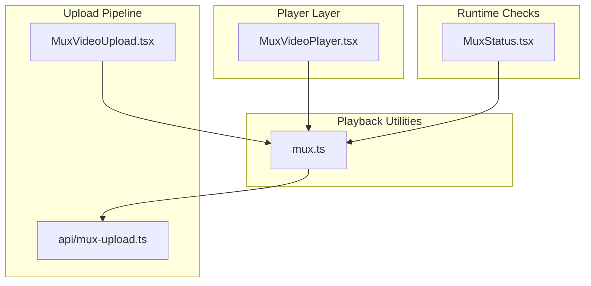
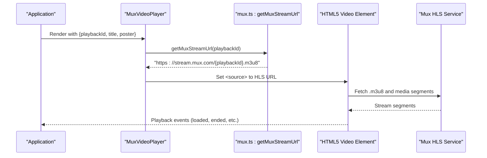
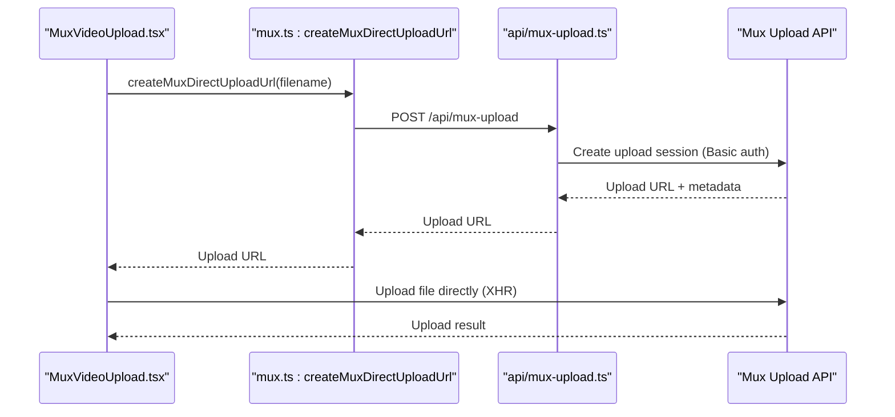
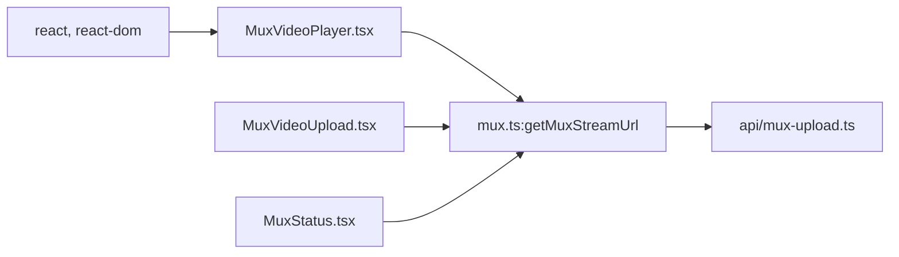

# Video Player Implementation

<cite>
**Referenced Files in This Document**
- [MuxVideoPlayer.tsx](file://src/components/MuxVideoPlayer.tsx)
- [mux.ts](file://src/lib/mux.ts)
- [mux-upload.ts](file://api/mux-upload.ts)
- [MuxStatus.tsx](file://src/components/MuxStatus.tsx)
- [MuxVideoUpload.tsx](file://src/components/MuxVideoUpload.tsx)
- [AdPrerollModal.tsx](file://src/components/ads/AdPrerollModal.tsx)
- [package.json](file://package.json)
</cite>

## Table of Contents
1. [Introduction](#introduction)
2. [Project Structure](#project-structure)
3. [Core Components](#core-components)
4. [Architecture Overview](#architecture-overview)
5. [Detailed Component Analysis](#detailed-component-analysis)
6. [Dependency Analysis](#dependency-analysis)
7. [Performance Considerations](#performance-considerations)
8. [Troubleshooting Guide](#troubleshooting-guide)
9. [Conclusion](#conclusion)

## Introduction
This document explains the video player implementation built around Mux’s HLS streaming service. It covers the MuxVideoPlayer React component, the MuxPlaybackConfig interface, stream URL generation via getMuxStreamUrl, HLS streaming protocol usage, customization options, integration patterns, state management, accessibility, and troubleshooting strategies. It also documents the upload pipeline and runtime status checks for Mux configuration.

## Project Structure
The video player implementation spans three primary areas:
- Player component: renders an HTML5 video element with HLS source
- Playback utilities: generate stream URLs and manage upload flows
- Upload pipeline: secure creation of direct upload URLs and client-side uploads

**Diagram sources**
- [MuxVideoPlayer.tsx:1-39](file://src/components/MuxVideoPlayer.tsx#L1-L39)
- [mux.ts:1-66](file://src/lib/mux.ts#L1-L66)
- [mux-upload.ts:1-44](file://api/mux-upload.ts#L1-L44)
- [MuxVideoUpload.tsx:1-126](file://src/components/MuxVideoUpload.tsx#L1-L126)
- [MuxStatus.tsx:1-63](file://src/components/MuxStatus.tsx#L1-L63)

**Section sources**
- [MuxVideoPlayer.tsx:1-39](file://src/components/MuxVideoPlayer.tsx#L1-L39)
- [mux.ts:1-66](file://src/lib/mux.ts#L1-L66)
- [mux-upload.ts:1-44](file://api/mux-upload.ts#L1-L44)
- [MuxVideoUpload.tsx:1-126](file://src/components/MuxVideoUpload.tsx#L1-L126)
- [MuxStatus.tsx:1-63](file://src/components/MuxStatus.tsx#L1-L63)

## Core Components
- MuxVideoPlayer: Renders an HTML5 video with HLS (.m3u8) source generated from a playbackId
- MuxPlaybackConfig: Defines playback configuration shape including playbackId and optional start time
- getMuxStreamUrl: Builds the HLS endpoint URL for playback
- MuxVideoUpload: Client-side upload flow using Mux Direct Upload with progress feedback
- MuxStatus: Runtime verification of Mux configuration presence and validity

Key responsibilities:
- Player rendering and HLS source binding
- Stream URL construction and validation
- Upload URL acquisition and direct upload execution
- Environment variable validation and status reporting

**Section sources**
- [MuxVideoPlayer.tsx:8-36](file://src/components/MuxVideoPlayer.tsx#L8-L36)
- [mux.ts:10-30](file://src/lib/mux.ts#L10-L30)
- [mux.ts:35-59](file://src/lib/mux.ts#L35-L59)
- [MuxVideoUpload.tsx:7-69](file://src/components/MuxVideoUpload.tsx#L7-L69)
- [MuxStatus.tsx:9-44](file://src/components/MuxStatus.tsx#L9-L44)

## Architecture Overview
The HLS playback architecture follows a straightforward flow:
- Application passes a playbackId to MuxVideoPlayer
- getMuxStreamUrl constructs the HLS URL
- The browser loads the .m3u8 playlist and plays segments
- Optional poster image and title attributes enhance UX
- Upload pipeline uses a serverless proxy to request Mux upload URLs

**Diagram sources**
- [MuxVideoPlayer.tsx:14-35](file://src/components/MuxVideoPlayer.tsx#L14-L35)
- [mux.ts:28-30](file://src/lib/mux.ts#L28-L30)

**Section sources**
- [MuxVideoPlayer.tsx:14-35](file://src/components/MuxVideoPlayer.tsx#L14-L35)
- [mux.ts:28-30](file://src/lib/mux.ts#L28-L30)

## Detailed Component Analysis

### MuxVideoPlayer Component
Purpose:
- Render a responsive HTML5 video player with HLS playback
- Accept playbackId, title, and poster props
- Generate HLS URL using getMuxStreamUrl

Behavior:
- Uses a wrapper div with rounded corners and dark background
- video element includes controls, poster, title, and responsive sizing
- source element binds HLS URL with proper MIME type

Customization options:
- autoplay: not enabled by default
- controls: enabled by default
- poster: optional image URL
- responsive sizing: full-width and full-height classes
- title: accessible label for the video

Accessibility and UX:
- title prop provides accessible labeling
- poster prop improves perceived load time and UX
- controls enable user interaction

Integration notes:
- Props align with MuxPlaybackConfig playbackId and optional metadata
- No internal state required; pure functional component

**Section sources**
- [MuxVideoPlayer.tsx:8-36](file://src/components/MuxVideoPlayer.tsx#L8-L36)

### MuxPlaybackConfig Interface
Defines the minimal configuration for playback:
- playbackId: required identifier for the asset
- startTime: optional numeric start offset

Usage:
- Passed to MuxVideoPlayer as props
- Used by higher-level components to configure playback

**Section sources**
- [mux.ts:10-13](file://src/lib/mux.ts#L10-L13)

### getMuxStreamUrl Function
Responsibility:
- Construct the HLS endpoint URL from a playbackId

Implementation:
- Returns a URL pointing to Mux’s stream domain with .m3u8 extension

Considerations:
- Ensure playbackId is valid and corresponds to a public asset
- The URL is consumed directly by the browser’s media engine

**Section sources**
- [mux.ts:28-30](file://src/lib/mux.ts#L28-L30)

### HLS Streaming Protocol Implementation
Observations:
- The player sets the source type to the HLS MIME type
- The browser handles playlist parsing and segment loading
- No client-side HLS library is included; relies on native support

Implications:
- Requires a compatible browser or platform with HLS support
- Network conditions affect buffering and quality switching

**Section sources**
- [MuxVideoPlayer.tsx:31-31](file://src/components/MuxVideoPlayer.tsx#L31-L31)

### Player Customization Options
Current capabilities:
- Controls: enabled
- Poster: supported via prop
- Title: supported via prop
- Responsive sizing: full width/height container classes
- Autoplay: not enabled in the current implementation

Recommendations:
- Autoplay: enable with caution; consider user experience and device policies
- Quality selection: not exposed; rely on Mux adaptive bitrate streaming
- Captions: not implemented; add track elements if needed
- Keyboard navigation: not customized; rely on browser defaults

**Section sources**
- [MuxVideoPlayer.tsx:25-32](file://src/components/MuxVideoPlayer.tsx#L25-L32)

### Integration with React and State Management
Integration pattern:
- MuxVideoPlayer is a presentational component receiving playbackId via props
- No internal state; controlled by parent components
- Ideal for composition with higher-level state (e.g., story chapters, user preferences)

State management suggestions:
- Track playbackId dynamically based on current content
- Manage poster and title from content metadata
- Handle play/pause externally if needed

**Section sources**
- [MuxVideoPlayer.tsx:14-18](file://src/components/MuxVideoPlayer.tsx#L14-L18)

### Video Quality Selection and Adaptive Bitrate Streaming
Observations:
- No explicit quality selector UI is present
- The HLS stream is generated server-side by Mux
- Adaptive bitrate is handled transparently by Mux and the browser

Recommendations:
- Ensure Mux asset is encoded with multiple bitrates
- Monitor playback performance and adjust encoding settings if needed
- Consider exposing quality controls if user preference is required

**Section sources**
- [mux.ts:28-30](file://src/lib/mux.ts#L28-L30)

### Accessibility Features, Keyboard Navigation, and Screen Reader Support
Current state:
- Title prop provides accessible labeling
- Controls are visible and operable
- No ARIA attributes or keyboard-specific handlers are defined

Recommendations:
- Add aria-label or aria-labelledby for complex layouts
- Consider keyboard shortcuts for common actions
- Ensure focus management for embedded controls
- Provide captions or subtitles if applicable

**Section sources**
- [MuxVideoPlayer.tsx:28-32](file://src/components/MuxVideoPlayer.tsx#L28-L32)

### Upload Pipeline and Direct Upload Flow
Overview:
- Client requests a signed upload URL from the backend
- Client uploads the file directly to Mux using XMLHttpRequest
- Progress events are captured and displayed

Key steps:
- createMuxDirectUploadUrl calls the backend endpoint
- Backend validates environment variables and creates a Mux upload
- Client sends the file to the returned upload URL
- Progress and completion are surfaced to the UI

**Diagram sources**
- [MuxVideoUpload.tsx:34-63](file://src/components/MuxVideoUpload.tsx#L34-L63)
- [mux.ts:35-59](file://src/lib/mux.ts#L35-L59)
- [mux-upload.ts:8-44](file://api/mux-upload.ts#L8-L44)

**Section sources**
- [MuxVideoUpload.tsx:23-69](file://src/components/MuxVideoUpload.tsx#L23-L69)
- [mux.ts:35-59](file://src/lib/mux.ts#L35-L59)
- [mux-upload.ts:8-44](file://api/mux-upload.ts#L8-L44)

### Runtime Mux Configuration Validation
Purpose:
- Verify that the Mux public token is configured
- Provide user-friendly status messages and guidance

Behavior:
- Reads VITE_MUX_TOKEN_ID from environment
- Reports configured vs. missing status
- Displays setup hints for environment variables

**Section sources**
- [MuxStatus.tsx:9-44](file://src/components/MuxStatus.tsx#L9-L44)

## Dependency Analysis
External dependencies relevant to video:
- react and react-dom: component rendering and lifecycle
- lucide-react: icons used in related UI (not core video player)
- framer-motion: animations used elsewhere (not core video player)

Internal dependencies:
- mux.ts exports getMuxStreamUrl and createMuxDirectUploadUrl
- MuxVideoPlayer consumes getMuxStreamUrl
- MuxVideoUpload consumes createMuxDirectUploadUrl
- MuxStatus reads VITE_MUX_TOKEN_ID for runtime checks

**Diagram sources**
- [package.json:26-28](file://package.json#L26-L28)
- [MuxVideoPlayer.tsx:1-1](file://src/components/MuxVideoPlayer.tsx#L1-L1)
- [mux.ts:1-66](file://src/lib/mux.ts#L1-L66)
- [mux-upload.ts:1-44](file://api/mux-upload.ts#L1-L44)
- [MuxVideoUpload.tsx:1-1](file://src/components/MuxVideoUpload.tsx#L1-L1)
- [MuxStatus.tsx:1-1](file://src/components/MuxStatus.tsx#L1-L1)

**Section sources**
- [package.json:14-30](file://package.json#L14-L30)
- [mux.ts:61-65](file://src/lib/mux.ts#L61-L65)

## Performance Considerations
- HLS bandwidth adaptation: rely on Mux-encoded variants for seamless quality switching
- Poster usage: reduces perceived latency while the playlist loads
- Direct upload: minimizes server bandwidth by streaming directly to Mux
- Progressive feedback: upload progress helps users estimate time-to-completion
- Native playback: avoids heavy client-side decoding libraries

[No sources needed since this section provides general guidance]

## Troubleshooting Guide

Common playback issues:
- CORS errors
  - Ensure the asset’s playback policy is public
  - Verify the origin is permitted by the upload configuration
- Unsupported formats
  - Confirm the asset was encoded with HLS-compatible codecs
  - Re-encode and re-upload if playback fails
- Network problems
  - Check connectivity and firewall restrictions
  - Verify the playbackId is correct and the asset exists

Upload issues:
- Missing credentials
  - Confirm VITE_MUX_TOKEN_ID and MUX_TOKEN_SECRET are set
  - Review server logs for 5xx responses indicating misconfiguration
- Upload failures
  - Inspect XHR error callbacks and network tab
  - Validate file size limits and MIME types

Runtime checks:
- Use MuxStatus to confirm token presence and configuration
- Review environment variable setup and backend proxy behavior

**Section sources**
- [MuxStatus.tsx:13-23](file://src/components/MuxStatus.tsx#L13-L23)
- [mux-upload.ts:14-17](file://api/mux-upload.ts#L14-L17)
- [mux-upload.ts:36-41](file://api/mux-upload.ts#L36-L41)
- [MuxVideoUpload.tsx:57-58](file://src/components/MuxVideoUpload.tsx#L57-L58)

## Conclusion
The video player implementation centers on a clean, minimal React component that leverages Mux’s HLS streaming infrastructure. It provides essential customization points (controls, poster, title) and integrates seamlessly with the upload pipeline. By relying on native HLS support and server-side adaptive bitrate, the solution balances simplicity with robust playback. For production, ensure proper environment configuration, monitor playback metrics, and consider accessibility enhancements for inclusive experiences.