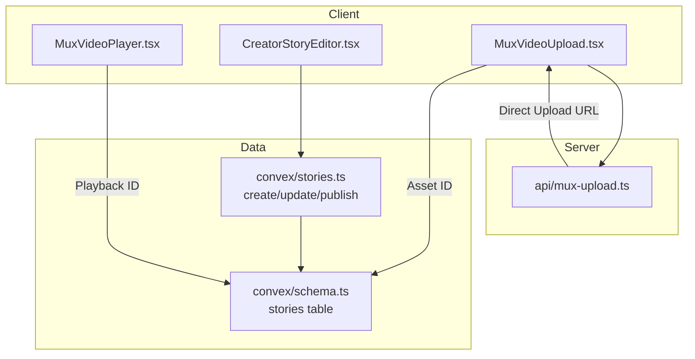
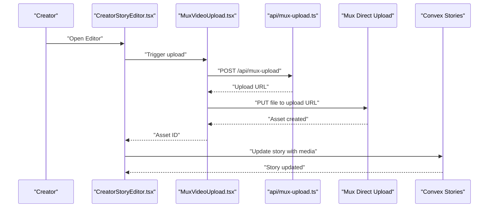
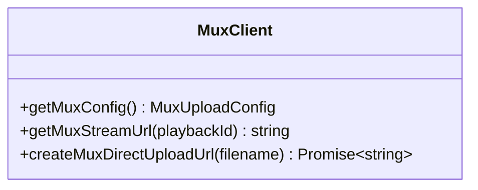
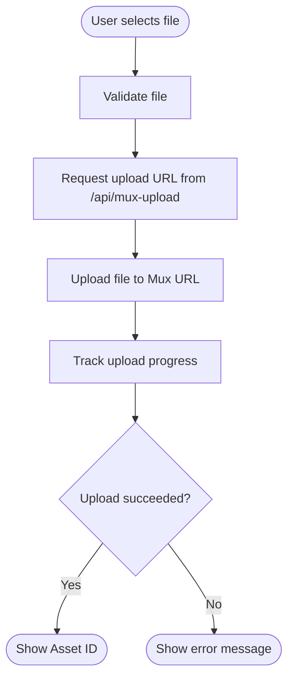
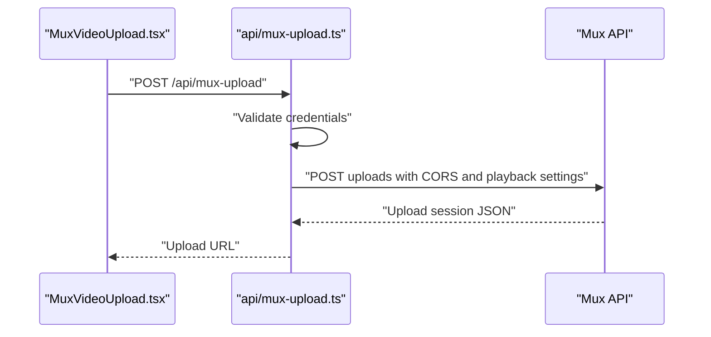
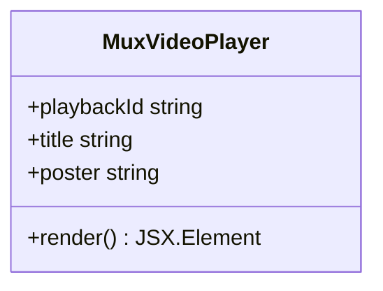
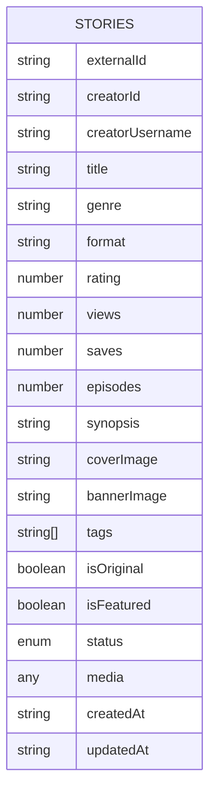
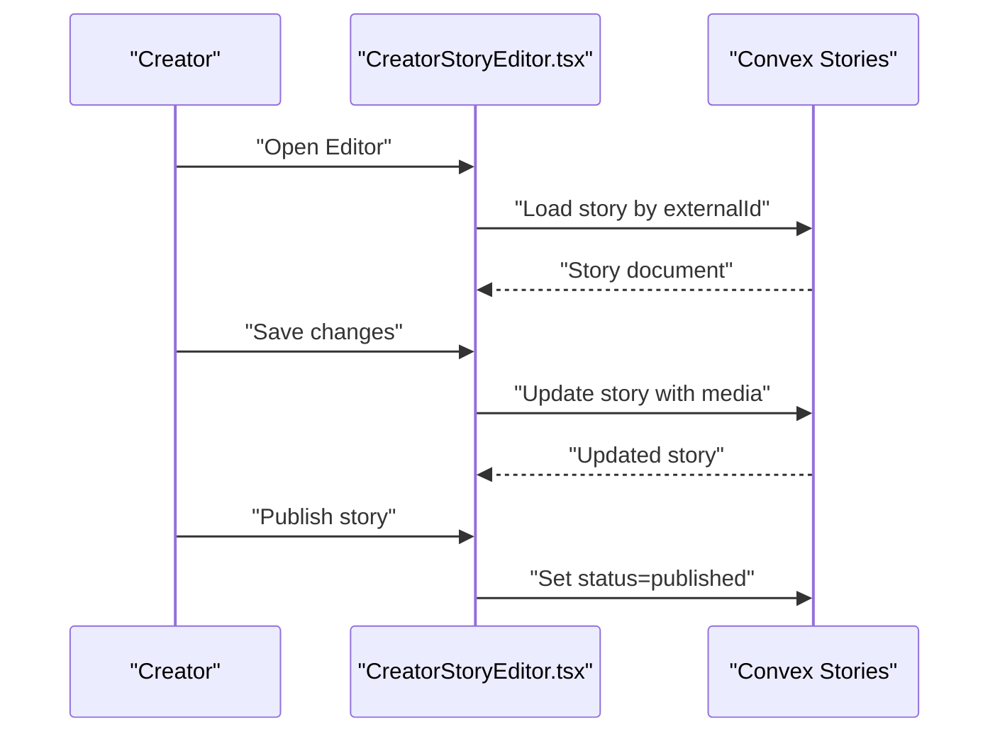
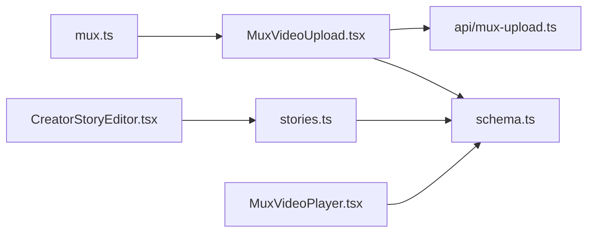

# Video Processing Pipeline

<cite>
**Referenced Files in This Document**
- [mux.ts](file://src/lib/mux.ts)
- [MuxVideoUpload.tsx](file://src/components/MuxVideoUpload.tsx)
- [MuxVideoPlayer.tsx](file://src/components/MuxVideoPlayer.tsx)
- [mux-upload.ts](file://api/mux-upload.ts)
- [MuxStatus.tsx](file://src/components/MuxStatus.tsx)
- [integrations.ts](file://src/lib/integrations.ts)
- [stories.ts](file://convex/stories.ts)
- [schema.ts](file://convex/schema.ts)
- [CreatorStoryEditor.tsx](file://src/screens/CreatorStoryEditor.tsx)
- [StoryDetail.tsx](file://src/screens/StoryDetail.tsx)
</cite>

## Table of Contents
1. [Introduction](#introduction)
2. [Project Structure](#project-structure)
3. [Core Components](#core-components)
4. [Architecture Overview](#architecture-overview)
5. [Detailed Component Analysis](#detailed-component-analysis)
6. [Dependency Analysis](#dependency-analysis)
7. [Performance Considerations](#performance-considerations)
8. [Security and Access Control](#security-and-access-control)
9. [Monitoring and Logging](#monitoring-and-logging)
10. [Troubleshooting Guide](#troubleshooting-guide)
11. [Conclusion](#conclusion)

## Introduction
This document explains the video processing pipeline integrated with Mux for uploading, transcoding, and streaming video content. It covers the end-to-end workflow from upload initiation to playback readiness, how video assets are represented and managed within the application’s story content model, and how CreatorStoryEditor supports managing story media alongside video. It also documents quality management, format conversion, storage optimization, security measures, and monitoring/logging approaches.

## Project Structure
The video pipeline spans client-side components, a Next.js API route, and Convex database schema and mutations. The key areas are:
- Client-side Mux integration and UI components for upload and playback
- Serverless API route that creates Mux Direct Upload URLs
- Convex schema and story mutations for content lifecycle management
- Editor screen for creators to manage story media and publish updates

**Diagram sources**
- [mux.ts:35-59](file://src/lib/mux.ts#L35-L59)
- [mux-upload.ts:1-45](file://api/mux-upload.ts#L1-L45)
- [MuxVideoUpload.tsx:23-69](file://src/components/MuxVideoUpload.tsx#L23-L69)
- [MuxVideoPlayer.tsx:14-35](file://src/components/MuxVideoPlayer.tsx#L14-L35)
- [stories.ts:46-104](file://convex/stories.ts#L46-L104)
- [schema.ts:95-126](file://convex/schema.ts#L95-L126)
- [CreatorStoryEditor.tsx:213-259](file://src/screens/CreatorStoryEditor.tsx#L213-L259)

**Section sources**
- [mux.ts:1-66](file://src/lib/mux.ts#L1-L66)
- [mux-upload.ts:1-45](file://api/mux-upload.ts#L1-L45)
- [MuxVideoUpload.tsx:1-127](file://src/components/MuxVideoUpload.tsx#L1-L127)
- [MuxVideoPlayer.tsx:1-39](file://src/components/MuxVideoPlayer.tsx#L1-L39)
- [stories.ts:1-180](file://convex/stories.ts#L1-L180)
- [schema.ts:95-126](file://convex/schema.ts#L95-L126)
- [CreatorStoryEditor.tsx:1-635](file://src/screens/CreatorStoryEditor.tsx#L1-L635)

## Core Components
- Mux client library: Provides configuration retrieval, stream URL construction, and creation of Mux Direct Upload URLs.
- Mux upload component: Manages file selection, progress reporting, and direct upload to Mux via a pre-signed URL.
- Mux player component: Renders playback using Mux’s HLS stream URL.
- API route: Creates Mux Direct Upload sessions with appropriate CORS and asset settings.
- Story schema and mutations: Define story content, media metadata, and lifecycle transitions (draft/published).
- CreatorStoryEditor: Allows creators to attach media to stories and publish updates.
- Mux status indicator: Confirms client-side token configuration and server-side credential checks.

**Section sources**
- [mux.ts:15-65](file://src/lib/mux.ts#L15-L65)
- [MuxVideoUpload.tsx:7-127](file://src/components/MuxVideoUpload.tsx#L7-L127)
- [MuxVideoPlayer.tsx:8-39](file://src/components/MuxVideoPlayer.tsx#L8-L39)
- [mux-upload.ts:8-44](file://api/mux-upload.ts#L8-L44)
- [stories.ts:46-180](file://convex/stories.ts#L46-L180)
- [schema.ts:95-126](file://convex/schema.ts#L95-L126)
- [CreatorStoryEditor.tsx:213-318](file://src/screens/CreatorStoryEditor.tsx#L213-L318)
- [MuxStatus.tsx:9-61](file://src/components/MuxStatus.tsx#L9-L61)

## Architecture Overview
The pipeline uses Mux’s Direct Upload to stream video directly from the browser to Mux, minimizing server bandwidth. The server generates a short-lived upload URL with configured CORS and playback policy. After upload, the asset becomes available for transcoding and playback. The application stores story metadata and media references in Convex, linking uploaded assets to story content.

**Diagram sources**
- [MuxVideoUpload.tsx:23-69](file://src/components/MuxVideoUpload.tsx#L23-L69)
- [mux-upload.ts:8-44](file://api/mux-upload.ts#L8-L44)
- [CreatorStoryEditor.tsx:213-259](file://src/screens/CreatorStoryEditor.tsx#L213-L259)
- [stories.ts:106-144](file://convex/stories.ts#L106-L144)

## Detailed Component Analysis

### Mux Client Library
- Purpose: Centralizes Mux configuration and URL helpers.
- Key responsibilities:
  - Retrieve public token configuration
  - Construct Mux stream URLs
  - Create Mux Direct Upload URLs via the API route

**Diagram sources**
- [mux.ts:15-65](file://src/lib/mux.ts#L15-L65)

**Section sources**
- [mux.ts:15-65](file://src/lib/mux.ts#L15-L65)

### Mux Upload Component
- Purpose: Handles file selection, progress tracking, and direct upload to Mux.
- Workflow highlights:
  - Validates file selection
  - Requests upload URL from the API route
  - Streams file to Mux using XMLHttpRequest
  - Reports progress and errors

**Diagram sources**
- [MuxVideoUpload.tsx:23-69](file://src/components/MuxVideoUpload.tsx#L23-L69)
- [mux-upload.ts:8-44](file://api/mux-upload.ts#L8-L44)

**Section sources**
- [MuxVideoUpload.tsx:14-69](file://src/components/MuxVideoUpload.tsx#L14-L69)

### Mux API Route
- Purpose: Generates Mux Direct Upload URLs with secure credentials and CORS configuration.
- Key behaviors:
  - Reads server-side Mux credentials
  - Enforces method and credential checks
  - Creates upload sessions with public playback policy

**Diagram sources**
- [mux-upload.ts:8-44](file://api/mux-upload.ts#L8-L44)

**Section sources**
- [mux-upload.ts:3-44](file://api/mux-upload.ts#L3-L44)

### Mux Player Component
- Purpose: Renders video playback using Mux’s HLS stream URL constructed from a playback ID.
- Behavior:
  - Accepts playback ID and optional poster
  - Uses HTML5 video with HLS source

**Diagram sources**
- [MuxVideoPlayer.tsx:8-35](file://src/components/MuxVideoPlayer.tsx#L8-L35)

**Section sources**
- [MuxVideoPlayer.tsx:14-35](file://src/components/MuxVideoPlayer.tsx#L14-L35)

### Story Schema and Lifecycle
- Purpose: Defines story content and media metadata, and manages lifecycle states.
- Highlights:
  - Story table includes media field for chapter text, attachments, chapters, monetization, and credits
  - Mutations support create, update, increment views, and publish transitions

**Diagram sources**
- [schema.ts:95-126](file://convex/schema.ts#L95-L126)

**Section sources**
- [schema.ts:95-126](file://convex/schema.ts#L95-L126)
- [stories.ts:46-180](file://convex/stories.ts#L46-L180)

### CreatorStoryEditor Integration
- Purpose: Enables creators to manage story visuals, chapters, and attachments, including video assets.
- Key behaviors:
  - Loads story metadata and media
  - Supports saving changes and publishing
  - Normalizes chapter structure and attaches media to story payload

**Diagram sources**
- [CreatorStoryEditor.tsx:81-133](file://src/screens/CreatorStoryEditor.tsx#L81-L133)
- [CreatorStoryEditor.tsx:213-259](file://src/screens/CreatorStoryEditor.tsx#L213-L259)
- [stories.ts:163-179](file://convex/stories.ts#L163-L179)

**Section sources**
- [CreatorStoryEditor.tsx:81-133](file://src/screens/CreatorStoryEditor.tsx#L81-L133)
- [CreatorStoryEditor.tsx:213-318](file://src/screens/CreatorStoryEditor.tsx#L213-L318)
- [stories.ts:163-179](file://convex/stories.ts#L163-L179)

### Mux Status Indicator
- Purpose: Confirms client-side token configuration and indicates server-side credential checks.
- Behavior:
  - Checks VITE_MUX_TOKEN_ID presence
  - Displays configuration status and guidance

**Section sources**
- [MuxStatus.tsx:9-61](file://src/components/MuxStatus.tsx#L9-L61)

## Dependency Analysis
- Client depends on Mux client library for configuration and upload URL creation.
- Upload component depends on the API route for upload URL provisioning.
- Editor depends on Convex mutations to persist story media and lifecycle updates.
- Player depends on playback IDs stored in story media metadata.

**Diagram sources**
- [mux.ts:35-65](file://src/lib/mux.ts#L35-L65)
- [MuxVideoUpload.tsx:34-63](file://src/components/MuxVideoUpload.tsx#L34-L63)
- [mux-upload.ts:8-44](file://api/mux-upload.ts#L8-L44)
- [CreatorStoryEditor.tsx:213-259](file://src/screens/CreatorStoryEditor.tsx#L213-L259)
- [stories.ts:106-144](file://convex/stories.ts#L106-L144)
- [schema.ts:95-126](file://convex/schema.ts#L95-L126)
- [MuxVideoPlayer.tsx:19-31](file://src/components/MuxVideoPlayer.tsx#L19-L31)

**Section sources**
- [mux.ts:15-65](file://src/lib/mux.ts#L15-L65)
- [MuxVideoUpload.tsx:23-69](file://src/components/MuxVideoUpload.tsx#L23-L69)
- [mux-upload.ts:8-44](file://api/mux-upload.ts#L8-L44)
- [CreatorStoryEditor.tsx:213-259](file://src/screens/CreatorStoryEditor.tsx#L213-L259)
- [stories.ts:106-144](file://convex/stories.ts#L106-L144)
- [schema.ts:95-126](file://convex/schema.ts#L95-L126)
- [MuxVideoPlayer.tsx:14-35](file://src/components/MuxVideoPlayer.tsx#L14-L35)

## Performance Considerations
- Direct upload minimizes server bandwidth by streaming directly to Mux.
- Progressive upload progress helps users estimate completion time.
- Playback uses HLS for adaptive streaming; ensure appropriate rendition sets are configured in Mux.
- Store thumbnails and posters separately to reduce initial load times; leverage Mux’s automatic thumbnail generation where applicable.
- Batch media updates in the editor to reduce write operations.

## Security and Access Control
- Upload URL generation is handled server-side to keep Mux secrets confidential.
- Playback policy is set to public in the current implementation; adjust as needed for private content.
- CORS is configured per-origin to restrict upload domains.
- Client-side token ID is validated; server-side secret remains on the server.

Recommendations:
- For private content, set playback policy to private and use signed URLs or tokenized playback.
- Enforce creator ownership checks in the editor before allowing edits or publishes.
- Restrict upload file types and sizes at the client and server.

**Section sources**
- [mux-upload.ts:14-34](file://api/mux-upload.ts#L14-L34)
- [MuxStatus.tsx:13-23](file://src/components/MuxStatus.tsx#L13-L23)

## Monitoring and Logging
- Client-side integration status: Use the Mux status component to surface configuration health.
- Server-side API route: Log upload session creation and errors for observability.
- Editor actions: Track save and publish operations via Convex mutation logs.
- Playback analytics: Integrate Mux playback analytics to monitor views, completion, and performance metrics.

[No sources needed since this section provides general guidance]

## Troubleshooting Guide
Common issues and resolutions:
- Missing Mux token ID: The status component will indicate configuration problems; ensure environment variables are set.
- Upload failures: Verify API route responds with a valid upload URL and check network/XHR errors.
- Playback not starting: Confirm playback ID is present and the asset is transcoded; verify HLS URL format.
- Editor save/publish errors: Check Convex mutation responses and story status transitions.

**Section sources**
- [MuxStatus.tsx:13-23](file://src/components/MuxStatus.tsx#L13-L23)
- [MuxVideoUpload.tsx:57-68](file://src/components/MuxVideoUpload.tsx#L57-L68)
- [mux-upload.ts:37-43](file://api/mux-upload.ts#L37-L43)
- [CreatorStoryEditor.tsx:253-258](file://src/screens/CreatorStoryEditor.tsx#L253-L258)

## Conclusion
The video processing pipeline leverages Mux’s Direct Upload and HLS playback to deliver efficient, scalable video workflows. Client components integrate with a serverless API route to securely provision upload URLs, while Convex manages story content and lifecycle. The CreatorStoryEditor enables creators to attach and publish media-rich stories. For production, consider private playback policies, signed URLs, and robust monitoring to ensure security and performance.