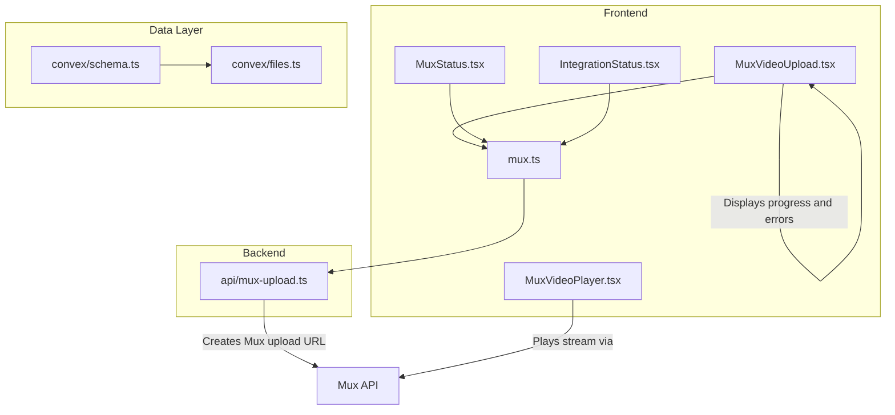
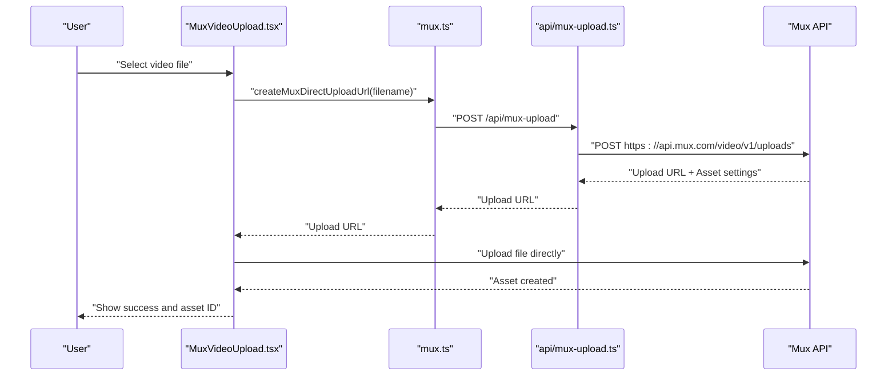
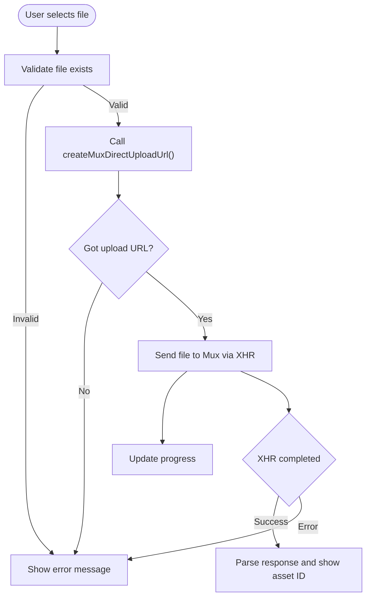
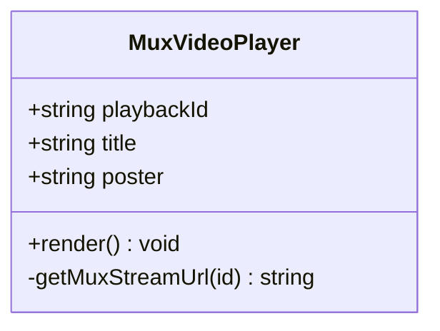
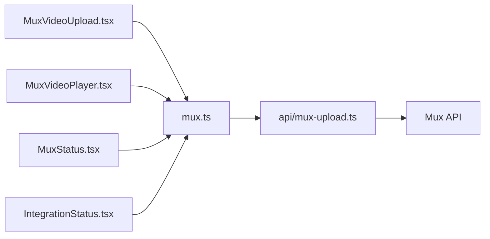

# Video Streaming Integration

<cite>
**Referenced Files in This Document**
- [MuxVideoUpload.tsx](file://src/components/MuxVideoUpload.tsx)
- [MuxVideoPlayer.tsx](file://src/components/MuxVideoPlayer.tsx)
- [mux.ts](file://src/lib/mux.ts)
- [mux-upload.ts](file://api/mux-upload.ts)
- [MuxStatus.tsx](file://src/components/MuxStatus.tsx)
- [IntegrationStatus.tsx](file://src/components/IntegrationStatus.tsx)
- [integrations.ts](file://src/lib/integrations.ts)
- [schema.ts](file://convex/schema.ts)
- [files.ts](file://convex/files.ts)
</cite>

## Table of Contents
1. [Introduction](#introduction)
2. [Project Structure](#project-structure)
3. [Core Components](#core-components)
4. [Architecture Overview](#architecture-overview)
5. [Detailed Component Analysis](#detailed-component-analysis)
6. [Dependency Analysis](#dependency-analysis)
7. [Performance Considerations](#performance-considerations)
8. [Troubleshooting Guide](#troubleshooting-guide)
9. [Conclusion](#conclusion)

## Introduction
This document explains the video streaming integration built with Mux in the project. It covers the end-to-end workflow from video upload to playback, including direct-to-cloud uploads, progress tracking, error handling, and the integration between frontend components and backend Mux API endpoints. It also documents playback configuration, quality management, adaptive streaming considerations, security measures, and operational troubleshooting.

## Project Structure
The video streaming feature spans three layers:
- Frontend components for upload and playback
- Frontend library module for Mux configuration and API calls
- Backend API route for secure Mux upload URL creation

**Diagram sources**
- [MuxVideoUpload.tsx:1-127](file://src/components/MuxVideoUpload.tsx#L1-L127)
- [MuxVideoPlayer.tsx:1-39](file://src/components/MuxVideoPlayer.tsx#L1-L39)
- [mux.ts:1-66](file://src/lib/mux.ts#L1-L66)
- [mux-upload.ts:1-45](file://api/mux-upload.ts#L1-L45)
- [MuxStatus.tsx:1-64](file://src/components/MuxStatus.tsx#L1-L64)
- [IntegrationStatus.tsx:1-93](file://src/components/IntegrationStatus.tsx#L1-L93)
- [schema.ts:1-493](file://convex/schema.ts#L1-L493)
- [files.ts:1-21](file://convex/files.ts#L1-L21)

**Section sources**
- [MuxVideoUpload.tsx:1-127](file://src/components/MuxVideoUpload.tsx#L1-L127)
- [MuxVideoPlayer.tsx:1-39](file://src/components/MuxVideoPlayer.tsx#L1-L39)
- [mux.ts:1-66](file://src/lib/mux.ts#L1-L66)
- [mux-upload.ts:1-45](file://api/mux-upload.ts#L1-L45)
- [MuxStatus.tsx:1-64](file://src/components/MuxStatus.tsx#L1-L64)
- [IntegrationStatus.tsx:1-93](file://src/components/IntegrationStatus.tsx#L1-L93)
- [schema.ts:1-493](file://convex/schema.ts#L1-L493)
- [files.ts:1-21](file://convex/files.ts#L1-L21)

## Core Components
- MuxVideoUpload: A React component that lets users select a video file, tracks upload progress, and handles errors during direct-to-cloud uploads via Mux.
- MuxVideoPlayer: A React component that renders an HTML5 video element playing a Mux-managed stream using the HLS endpoint.
- mux.ts: A library module that encapsulates Mux configuration retrieval, stream URL construction, and creation of pre-signed upload URLs via the backend.
- api/mux-upload.ts: A serverless API route that securely requests a direct upload URL from Mux using server-side credentials.
- MuxStatus: A component that validates frontend Mux token configuration.
- IntegrationStatus: A component that checks overall integration health including Mux.

Key responsibilities:
- Upload workflow: Select file -> Request upload URL -> Upload file -> Receive asset identifier
- Playback workflow: Render player with playback ID -> Play HLS stream
- Security: Server-side credentials are used to create upload URLs; client-side only uses public tokens for playback

**Section sources**
- [MuxVideoUpload.tsx:1-127](file://src/components/MuxVideoUpload.tsx#L1-L127)
- [MuxVideoPlayer.tsx:1-39](file://src/components/MuxVideoPlayer.tsx#L1-L39)
- [mux.ts:1-66](file://src/lib/mux.ts#L1-L66)
- [mux-upload.ts:1-45](file://api/mux-upload.ts#L1-L45)
- [MuxStatus.tsx:1-64](file://src/components/MuxStatus.tsx#L1-L64)
- [IntegrationStatus.tsx:1-93](file://src/components/IntegrationStatus.tsx#L1-L93)

## Architecture Overview
The system uses Mux’s direct upload capability with a backend proxy to protect credentials. The frontend requests an upload URL from the backend, then uploads directly to Mux. Playback uses the Mux stream endpoint.

**Diagram sources**
- [MuxVideoUpload.tsx:23-69](file://src/components/MuxVideoUpload.tsx#L23-L69)
- [mux.ts:35-59](file://src/lib/mux.ts#L35-L59)
- [mux-upload.ts:8-44](file://api/mux-upload.ts#L8-L44)

## Detailed Component Analysis

### MuxVideoUpload Component
Responsibilities:
- Accepts a single video file selection
- Requests a pre-signed upload URL from the backend
- Performs a direct upload to Mux using XMLHttpRequest
- Tracks upload progress and surfaces errors
- Displays success state with asset identifier

Implementation highlights:
- Progress tracking via XMLHttpRequest events
- Error handling for network failures and non-200 responses
- Conditional UI states for disabled actions and progress visualization

**Diagram sources**
- [MuxVideoUpload.tsx:14-69](file://src/components/MuxVideoUpload.tsx#L14-L69)
- [mux.ts:35-59](file://src/lib/mux.ts#L35-L59)

**Section sources**
- [MuxVideoUpload.tsx:1-127](file://src/components/MuxVideoUpload.tsx#L1-L127)
- [mux.ts:35-59](file://src/lib/mux.ts#L35-L59)

### MuxVideoPlayer Component
Responsibilities:
- Renders an HTML5 video player
- Uses the Mux HLS stream URL derived from a playback ID
- Supports optional poster image and title attributes

Playback URL construction:
- Stream URL follows the pattern: stream.mux.com/{playbackId}.m3u8

Customization options:
- playbackId: Required stream identifier
- title: Optional accessibility/title attribute
- poster: Optional thumbnail/poster image URL

**Diagram sources**
- [MuxVideoPlayer.tsx:8-36](file://src/components/MuxVideoPlayer.tsx#L8-L36)

**Section sources**
- [MuxVideoPlayer.tsx:1-39](file://src/components/MuxVideoPlayer.tsx#L1-L39)

### Mux Library Module (mux.ts)
Responsibilities:
- Validates presence of the public token ID for playback
- Constructs stream URLs for HLS playback
- Creates pre-signed upload URLs by calling the backend route

Security posture:
- Playback token validation occurs on the client
- Upload URL creation is proxied through the backend to keep secrets private

**Section sources**
- [mux.ts:15-30](file://src/lib/mux.ts#L15-L30)
- [mux.ts:28-30](file://src/lib/mux.ts#L28-L30)
- [mux.ts:35-59](file://src/lib/mux.ts#L35-L59)

### Backend Mux Upload Route (api/mux-upload.ts)
Responsibilities:
- Validates HTTP method
- Reads server-side Mux credentials from environment variables
- Proxies a request to Mux’s upload creation endpoint
- Returns the upload URL and asset settings to the client

Security posture:
- Credentials are read from server-side environment variables
- Sets CORS origin based on incoming request origin
- Enforces public playback policy for newly created assets

**Section sources**
- [mux-upload.ts:8-44](file://api/mux-upload.ts#L8-L44)

### Status Components
- MuxStatus: Checks frontend token configuration and reports status
- IntegrationStatus: Verifies overall integration health including Mux

These components aid in diagnosing configuration issues before attempting uploads or playback.

**Section sources**
- [MuxStatus.tsx:9-61](file://src/components/MuxStatus.tsx#L9-L61)
- [IntegrationStatus.tsx:8-90](file://src/components/IntegrationStatus.tsx#L8-L90)
- [integrations.ts:23-81](file://src/lib/integrations.ts#L23-L81)

### Data Model and Storage
While the schema includes general-purpose storage and media fields, the current integration focuses on Mux-managed assets. The Convex storage helpers are available for future use-cases requiring direct Cloud storage URLs.

- Media fields exist in content entities for storing arbitrary media metadata
- Convex storage mutations provide upload URL generation and signed URL retrieval

**Section sources**
- [schema.ts:95-125](file://convex/schema.ts#L95-L125)
- [files.ts:4-20](file://convex/files.ts#L4-L20)

## Dependency Analysis
The upload and playback flows depend on the following relationships:

**Diagram sources**
- [MuxVideoUpload.tsx:34-37](file://src/components/MuxVideoUpload.tsx#L34-L37)
- [mux.ts:39-54](file://src/lib/mux.ts#L39-L54)
- [mux-upload.ts:22-34](file://api/mux-upload.ts#L22-L34)
- [MuxVideoPlayer.tsx:19-21](file://src/components/MuxVideoPlayer.tsx#L19-L21)
- [MuxStatus.tsx:14-22](file://src/components/MuxStatus.tsx#L14-L22)
- [IntegrationStatus.tsx:17-17](file://src/components/IntegrationStatus.tsx#L17-L17)

**Section sources**
- [MuxVideoUpload.tsx:1-127](file://src/components/MuxVideoUpload.tsx#L1-L127)
- [mux.ts:1-66](file://src/lib/mux.ts#L1-L66)
- [mux-upload.ts:1-45](file://api/mux-upload.ts#L1-L45)
- [MuxVideoPlayer.tsx:1-39](file://src/components/MuxVideoPlayer.tsx#L1-L39)
- [MuxStatus.tsx:1-64](file://src/components/MuxStatus.tsx#L1-L64)
- [IntegrationStatus.tsx:1-93](file://src/components/IntegrationStatus.tsx#L1-L93)

## Performance Considerations
- Adaptive streaming: Mux automatically adapts bitrate based on network conditions; configure asset settings upstream for optimal quality tiers.
- HLS delivery: The player consumes an HLS playlist; ensure the playback ID corresponds to a properly processed asset.
- Network efficiency: Direct-to-cloud uploads reduce server bandwidth; monitor upload progress and handle retries gracefully.
- Caching and thumbnails: Pre-generate poster images and leverage CDN caching for stream manifests.
- Monitoring: Track upload latency, failure rates, and playback startup times; surface errors to users with actionable messages.

[No sources needed since this section provides general guidance]

## Troubleshooting Guide
Common issues and resolutions:
- Missing frontend token ID:
  - Symptom: Status indicates Mux not configured
  - Resolution: Set the public token ID environment variable and reload
- Backend credential misconfiguration:
  - Symptom: Upload URL creation fails with internal server error
  - Resolution: Verify server-side Mux credentials are present and valid
- Upload failures:
  - Symptom: Network error or non-200 response during upload
  - Resolution: Check network connectivity, retry upload, and inspect browser console
- Playback not starting:
  - Symptom: Player loads but does not play
  - Resolution: Confirm playback ID is correct and asset is ready; verify HLS URL resolution

Diagnostic tools:
- MuxStatus: Validates frontend token configuration
- IntegrationStatus: Verifies overall integration health
- Browser DevTools: Inspect network requests/responses for upload and stream endpoints

**Section sources**
- [MuxStatus.tsx:9-61](file://src/components/MuxStatus.tsx#L9-L61)
- [IntegrationStatus.tsx:8-90](file://src/components/IntegrationStatus.tsx#L8-L90)
- [mux-upload.ts:14-17](file://api/mux-upload.ts#L14-L17)
- [mux.ts:55-58](file://src/lib/mux.ts#L55-L58)

## Conclusion
The integration leverages Mux’s direct upload and HLS streaming capabilities with a secure backend proxy for credential protection. The frontend components provide a straightforward upload experience with progress feedback and a simple player for HLS playback. By following the configuration steps, monitoring integration health, and applying the recommended performance practices, teams can deliver reliable video experiences.

[No sources needed since this section summarizes without analyzing specific files]