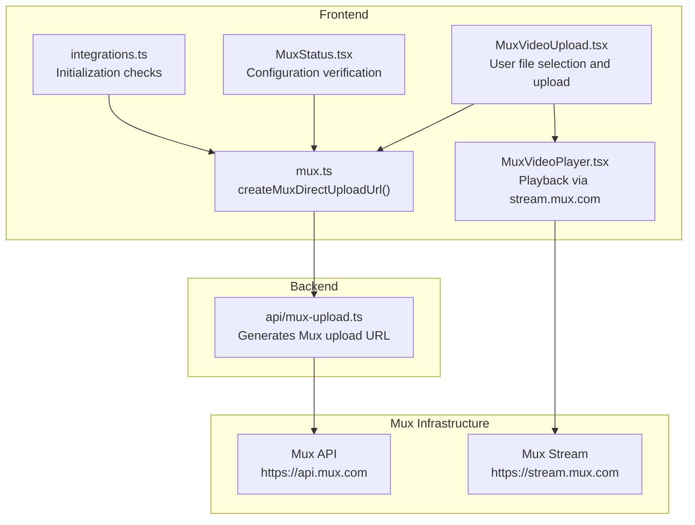
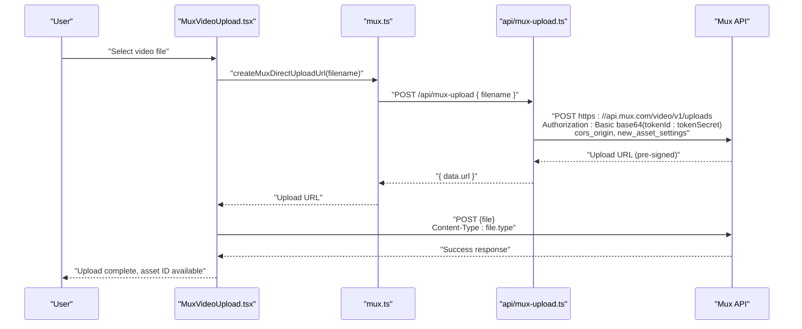
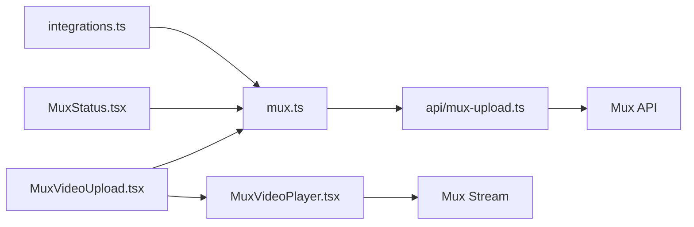

# Video Upload Workflow

<cite>
**Referenced Files in This Document**
- [MuxVideoUpload.tsx](file://src/components/MuxVideoUpload.tsx)
- [mux.ts](file://src/lib/mux.ts)
- [mux-upload.ts](file://api/mux-upload.ts)
- [MuxVideoPlayer.tsx](file://src/components/MuxVideoPlayer.tsx)
- [MuxStatus.tsx](file://src/components/MuxStatus.tsx)
- [integrations.ts](file://src/lib/integrations.ts)
- [vite.config.ts](file://vite.config.ts)
- [UploadFlow.tsx](file://src/screens/UploadFlow.tsx)
</cite>

## Table of Contents
1. [Introduction](#introduction)
2. [Project Structure](#project-structure)
3. [Core Components](#core-components)
4. [Architecture Overview](#architecture-overview)
5. [Detailed Component Analysis](#detailed-component-analysis)
6. [Dependency Analysis](#dependency-analysis)
7. [Performance Considerations](#performance-considerations)
8. [Troubleshooting Guide](#troubleshooting-guide)
9. [Conclusion](#conclusion)

## Introduction
This document explains the complete video upload workflow from the frontend to cloud storage using Mux Direct Upload. It covers the MuxUploadConfig interface, configuration requirements (including VITE_MUX_TOKEN_ID), the createMuxDirectUploadUrl function, the /api/mux-upload endpoint, upload URL generation, token-based authentication, progress tracking, error handling, and integration points. It also documents supported formats, size limits, and troubleshooting strategies for common upload failures and network issues.

## Project Structure
The video upload workflow spans three primary areas:
- Frontend component that handles user selection and uploads
- Client-side library that orchestrates Mux Direct Upload requests
- Backend API route that generates Mux upload URLs using server-side credentials

**Diagram sources**
- [MuxVideoUpload.tsx:1-127](file://src/components/MuxVideoUpload.tsx#L1-L127)
- [mux.ts:1-66](file://src/lib/mux.ts#L1-L66)
- [mux-upload.ts:1-45](file://api/mux-upload.ts#L1-L45)
- [MuxVideoPlayer.tsx:1-39](file://src/components/MuxVideoPlayer.tsx#L1-L39)
- [MuxStatus.tsx:1-63](file://src/components/MuxStatus.tsx#L1-L63)
- [integrations.ts:1-91](file://src/lib/integrations.ts#L1-L91)

**Section sources**
- [MuxVideoUpload.tsx:1-127](file://src/components/MuxVideoUpload.tsx#L1-L127)
- [mux.ts:1-66](file://src/lib/mux.ts#L1-L66)
- [mux-upload.ts:1-45](file://api/mux-upload.ts#L1-L45)
- [MuxVideoPlayer.tsx:1-39](file://src/components/MuxVideoPlayer.tsx#L1-L39)
- [MuxStatus.tsx:1-63](file://src/components/MuxStatus.tsx#L1-L63)
- [integrations.ts:1-91](file://src/lib/integrations.ts#L1-L91)

## Core Components
- MuxVideoUpload: Frontend component that accepts a single video file, tracks progress, and performs the upload via XMLHttpRequest to the Mux Direct Upload URL.
- Mux library: Provides configuration retrieval and the createMuxDirectUploadUrl function that calls the backend API to obtain the pre-signed upload URL.
- Backend API: Validates method, reads server-side credentials, constructs Basic auth, and posts to Mux’s upload endpoint to receive a pre-signed URL.
- Playback component: Renders a video player using Mux’s HLS stream URL derived from a playback ID.

Key responsibilities:
- Validate file selection and size
- Track upload progress
- Surface errors and manage UI state
- Generate and use Mux Direct Upload URLs
- Play uploaded videos via Mux stream

**Section sources**
- [MuxVideoUpload.tsx:1-127](file://src/components/MuxVideoUpload.tsx#L1-L127)
- [mux.ts:1-66](file://src/lib/mux.ts#L1-L66)
- [mux-upload.ts:1-45](file://api/mux-upload.ts#L1-L45)
- [MuxVideoPlayer.tsx:1-39](file://src/components/MuxVideoPlayer.tsx#L1-L39)

## Architecture Overview
The upload flow uses Mux Direct Upload to minimize server bandwidth by streaming directly to Mux. The frontend requests a pre-signed upload URL from the backend, then uploads the file directly to Mux.

**Diagram sources**
- [MuxVideoUpload.tsx:23-69](file://src/components/MuxVideoUpload.tsx#L23-L69)
- [mux.ts:35-59](file://src/lib/mux.ts#L35-L59)
- [mux-upload.ts:8-44](file://api/mux-upload.ts#L8-L44)

## Detailed Component Analysis

### MuxUploadConfig and Configuration Requirements
- MuxUploadConfig defines the public token identifier used by the frontend to construct playback URLs and to trigger upload URL generation.
- Frontend configuration is validated at runtime via getMuxConfig and environment checks.
- Backend reads server-side credentials from environment variables and uses them to authenticate with Mux.

Configuration keys:
- VITE_MUX_TOKEN_ID: Public token ID used by the frontend
- MUX_TOKEN_ID and MUX_TOKEN_SECRET: Server-side credentials used by the backend API

Security considerations:
- The frontend only receives a pre-signed upload URL; server-side secrets remain on the backend.
- The backend validates presence of both token ID and secret before contacting Mux.

**Section sources**
- [mux.ts:6-23](file://src/lib/mux.ts#L6-L23)
- [mux.ts:15-23](file://src/lib/mux.ts#L15-L23)
- [mux-upload.ts:3-6](file://api/mux-upload.ts#L3-L6)
- [MuxStatus.tsx:14-22](file://src/components/MuxStatus.tsx#L14-L22)
- [integrations.ts:62-69](file://src/lib/integrations.ts#L62-L69)

### createMuxDirectUploadUrl Implementation
- Validates frontend configuration via getMuxConfig.
- Calls the backend endpoint /api/mux-upload with the filename.
- Parses the response to extract the pre-signed upload URL.
- Returns the URL for direct upload by the browser.

Behavior:
- Throws on non-OK responses with a descriptive message.
- Logs errors for observability.

**Section sources**
- [mux.ts:35-59](file://src/lib/mux.ts#L35-L59)

### Backend API: /api/mux-upload
Responsibilities:
- Accepts only POST requests.
- Reads server-side credentials from environment variables (supports both server and Vite variants).
- Constructs Basic Authorization header using the token ID and secret.
- Posts to Mux’s upload endpoint with:
  - cors_origin from the incoming request origin
  - new_asset_settings with public playback policy
- Returns the Mux-generated upload URL on success; otherwise returns an error payload.

Security:
- Credentials are kept server-side.
- Origin is passed to Mux to enforce CORS constraints.

**Section sources**
- [mux-upload.ts:8-44](file://api/mux-upload.ts#L8-L44)

### Frontend Upload Flow in MuxVideoUpload
- Validates that a file is selected.
- Calls createMuxDirectUploadUrl to obtain the pre-signed URL.
- Uses XMLHttpRequest to upload the file directly to Mux:
  - Progress events update the UI percentage.
  - Load event parses the response and sets the asset ID.
  - Error event surfaces network failures.
- Disables controls while uploading and resets state on completion.

Progress tracking:
- Uses xhr.upload.onprogress to compute percentage.
- Displays a progress bar and percentage label.

Error handling:
- Catches exceptions thrown by the library and displays messages.
- Distinguishes network errors from HTTP errors.

**Section sources**
- [MuxVideoUpload.tsx:23-69](file://src/components/MuxVideoUpload.tsx#L23-L69)

### Playback Integration
- Playback uses stream.mux.com HLS URLs constructed from a playback ID.
- The frontend library exposes a helper to build the stream URL.

**Section sources**
- [MuxVideoPlayer.tsx:14-35](file://src/components/MuxVideoPlayer.tsx#L14-L35)
- [mux.ts:28-30](file://src/lib/mux.ts#L28-L30)

### Environment and Initialization Checks
- Vite config defines global environment exposure for build-time usage.
- Integration initializer attempts to validate Mux configuration and reports status.
- Dedicated status component checks VITE_MUX_TOKEN_ID availability and provides guidance.

**Section sources**
- [vite.config.ts:10-12](file://vite.config.ts#L10-L12)
- [integrations.ts:23-81](file://src/lib/integrations.ts#L23-L81)
- [MuxStatus.tsx:9-61](file://src/components/MuxStatus.tsx#L9-L61)

## Dependency Analysis
High-level dependencies:
- MuxVideoUpload depends on the mux library for URL generation.
- mux library depends on environment configuration and calls the backend API.
- Backend API depends on Mux infrastructure and environment variables.
- Playback component depends on the mux library for stream URL construction.

**Diagram sources**
- [MuxVideoUpload.tsx:1-127](file://src/components/MuxVideoUpload.tsx#L1-L127)
- [mux.ts:1-66](file://src/lib/mux.ts#L1-L66)
- [mux-upload.ts:1-45](file://api/mux-upload.ts#L1-L45)
- [MuxVideoPlayer.tsx:1-39](file://src/components/MuxVideoPlayer.tsx#L1-L39)
- [MuxStatus.tsx:1-63](file://src/components/MuxStatus.tsx#L1-L63)
- [integrations.ts:1-91](file://src/lib/integrations.ts#L1-L91)

**Section sources**
- [MuxVideoUpload.tsx:1-127](file://src/components/MuxVideoUpload.tsx#L1-L127)
- [mux.ts:1-66](file://src/lib/mux.ts#L1-L66)
- [mux-upload.ts:1-45](file://api/mux-upload.ts#L1-L45)
- [MuxVideoPlayer.tsx:1-39](file://src/components/MuxVideoPlayer.tsx#L1-L39)
- [MuxStatus.tsx:1-63](file://src/components/MuxStatus.tsx#L1-L63)
- [integrations.ts:1-91](file://src/lib/integrations.ts#L1-L91)

## Performance Considerations
- Direct-to-Mux uploads reduce server bandwidth and latency.
- Progress tracking is handled client-side via XMLHttpRequest events.
- Consider chunked uploads for very large files if needed; current implementation streams the entire file in a single request.
- Keep UI responsive by avoiding heavy synchronous operations during upload.

[No sources needed since this section provides general guidance]

## Troubleshooting Guide

Common issues and resolutions:
- Missing VITE_MUX_TOKEN_ID
  - Symptom: Frontend throws configuration error or status component indicates missing token.
  - Resolution: Set VITE_MUX_TOKEN_ID in the frontend environment and ensure it is present at runtime.
  - Related checks: getMuxConfig, MuxStatus component, integration initializer.

- Missing MUX_TOKEN_ID or MUX_TOKEN_SECRET
  - Symptom: Backend returns credential configuration error.
  - Resolution: Set both MUX_TOKEN_ID and MUX_TOKEN_SECRET on the server.
  - Backend behavior: Validates credentials before contacting Mux.

- Network errors during upload
  - Symptom: XMLHttpRequest error event triggers.
  - Resolution: Retry upload; verify network connectivity and firewall rules; ensure CORS origin is permitted.

- Non-200 response from Mux
  - Symptom: Load event reports failure status.
  - Resolution: Inspect backend logs and Mux response; confirm upload URL validity and file type compatibility.

- File size or format issues
  - Guidance: While the upload component accepts any video/*, ensure the file format is supported by Mux. Large files may require improved network conditions or chunked upload strategies.

- Origin mismatch
  - Symptom: Mux rejects upload due to CORS.
  - Resolution: Confirm that the origin passed to Mux matches the deployment domain.

**Section sources**
- [mux.ts:15-23](file://src/lib/mux.ts#L15-L23)
- [MuxStatus.tsx:14-22](file://src/components/MuxStatus.tsx#L14-L22)
- [integrations.ts:62-69](file://src/lib/integrations.ts#L62-L69)
- [mux-upload.ts:14-17](file://api/mux-upload.ts#L14-L17)
- [mux-upload.ts:36-41](file://api/mux-upload.ts#L36-L41)
- [MuxVideoUpload.tsx:47-59](file://src/components/MuxVideoUpload.tsx#L47-L59)

## Conclusion
The video upload workflow leverages Mux Direct Upload to deliver efficient, secure uploads with robust progress tracking and error handling. The frontend obtains a pre-signed URL from the backend, which authenticates with Mux using server-side credentials. Playback is handled seamlessly via Mux’s HLS stream. Proper configuration of tokens and environment variables, along with careful error handling and progress reporting, ensures a reliable user experience.